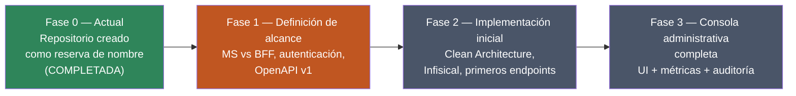

# ms_admin — Planificación

| Campo | Valor |
|---|---|
| Repositorio | `MSPI_NVA_CO_MR_BACK/ms_admin` |
| Sistema | MSPI (Modelo de Seguridad y Privacidad de la Información — ISO/IEC 27001) |
| Fecha del documento | 2026-08-18 |
| Alcance | Fase de planificación del microservicio/BFF `ms_admin` dentro de la arquitectura de microservicios MSPI |
| Estado del repositorio | **Placeholder / reserva de nombre — sin código de aplicación** (verificado por inspección directa del árbol de archivos) |

---

## 1. Advertencia metodológica

Este documento se aparta del formato habitual de los demás microservicios del ecosistema MSPI (`ms_iam`, `ms_org`, etc.) por una razón objetiva: **`ms_admin` no contiene código fuente, build de Gradle, Dockerfile ni pipeline de CI/CD**. El repositorio, en la fecha de este documento, consta únicamente de:

```
ms_admin/
├── .gitignore
├── README.md
└── docs/
    ├── ROADMAP.md
    └── openapi.yaml   (stub — paths: {})
```

Así lo declara explícitamente el propio `README.md` del repositorio: *"Repositorio **placeholder** del ecosistema MSPI. Aún no contiene código de aplicación"*. Todo lo que sigue en este y en los demás documentos (02 a 07) se basa exclusivamente en:

1. El contenido real de `README.md`, `docs/ROADMAP.md` y `docs/openapi.yaml` de `ms_admin`.
2. La documentación de contexto del monorepo `MSPI_NVA_CO_MR_BACK` (`docs/`, `docker-config/docs/`) en las partes que mencionan explícitamente a `ms_admin` o a la "consola administrativa".
3. La convención arquitectónica **ya implementada** en los microservicios hermanos (`ms_iam`, `ms_org`), citada únicamente como referencia de lo que el propio ROADMAP de `ms_admin` declara que seguirá ("Estructura Clean Architecture (alineada con `ms_iam` / `ms_org`)").

Ninguna clase, endpoint, tabla o variable de entorno de `ms_admin` es inventada: donde no hay evidencia, este documento lo declara explícitamente como **no implementado / no decidido**.

## 2. Contexto del sistema MSPI

MSPI es un sistema de gestión de seguridad de la información (alineado a ISO/IEC 27001) construido como un conjunto de microservicios Java/Spring independientes, agrupados en el repositorio contenedor `MSPI_NVA_CO_MR_BACK`. Cada microservicio vive en su propia carpeta (`ms_iam`, `ms_org`, `ms_catalog`, `ms_evidence`, `ms_assessment`, `ms_audit`, `ms_admin`, …) y `docker-config/` centraliza la orquestación local con Docker Compose, incluyendo Keycloak como Identity Provider.

Dentro de ese ecosistema, `ms_admin` es actualmente un **repositorio reservado**: existe como carpeta y como nombre en el monorepo, y como referencia en el árbol de dependencias de otros documentos (por ejemplo, se le menciona en el diagrama de "servicios del ecosistema" de `ms_iam`), pero **no está desplegado, no aparece en `docker-config/docker/docker-compose.apps.yml` y no expone ningún endpoint HTTP**. Se confirmó por búsqueda en todo `docker-config/` que no existe ninguna referencia a `ms_admin` ni `ms-admin` en la configuración de orquestación.

Las capacidades administrativas del MVP actual del sistema **no dependen de `ms_admin`**; están cubiertas por:

- **`ms_iam`** — gestión de usuarios, autenticación, roles, auditoría centralizada (`iam.audit_log`), 2FA/TOTP.
- **`ms_org`** — gestión de organizaciones.
- Los frontends/BFF existentes del proyecto, que consumen `ms_iam` y `ms_org` directamente.

## 3. Rol previsto de `ms_admin` (según MER y ROADMAP)

El propio README describe el rol previsto, condicionado ("podría agrupar") y pendiente de decisión formal:

- APIs o BFF orientados a la **consola de administración del sistema** — operaciones transversales no expuestas a usuarios finales de organización.
- Agregación de datos para paneles internos (métricas, configuración global, soporte).
- Orquestación de flujos administrativos hoy distribuidos entre `ms_iam`, `ms_org` y otros servicios de dominio.

Es importante precisar que una revisión de la documentación transversal del proyecto (`docs/proyecto/DB-MER.txt`, `docs/proyecto/Historias_Usuario_MSPI_v2.md`, `docs/proyecto/PLAN_TRABAJO_MSPI_v2.md`) **no arroja ninguna mención al microservicio `ms_admin`** como entidad de datos, historia de usuario o hito de plan de trabajo. Las apariciones de la palabra "ADMIN" en `DB-MER.txt` corresponden a la clasificación `control_type = ADMIN | TECH` de los dominios ISO 27001 del instrumento de evaluación (hojas "Administrativas"/"Técnicas" del Excel MSPI), **no** al microservicio `ms_admin`. Esto refuerza que el alcance funcional de `ms_admin` aún no ha sido formalizado en el MER ni en historias de usuario del proyecto.

## 4. Objetivos de la fase de planificación

Dado que no existe implementación, los "objetivos" documentables en esta fecha son los objetivos de **planificación/decisión** explícitamente listados en `docs/ROADMAP.md`, no objetivos de producto ya alcanzados:

1. Acordar el alcance MVP vs. post-MVP de `ms_admin` con el equipo de arquitectura (pendiente, `README.md` §"Próximos pasos" punto 1).
2. Decidir el modelo de implementación: **microservicio independiente con persistencia propia** vs. **BFF sin persistencia propia** que agregue llamadas a `ms_iam`, `ms_org` y `ms_assessment` (pendiente, ROADMAP Fase 1, primer ítem).
3. Inventariar las operaciones administrativas que deberían centralizarse (panel admin, reportes, configuración global).
4. Definir el mecanismo de autenticación previsto: JWT del rol `AdminSistema` emitido por Keycloak / `ms_iam` (mencionado como definición pendiente en ROADMAP Fase 1).
5. Publicar una versión real de `docs/openapi.yaml` (v1) con al menos un endpoint de salud o de agregación, reemplazando el stub actual (`paths: {}`).

## 5. Requerimientos iniciales (derivados del ROADMAP)

| ID | Requerimiento | Estado | Fuente |
|---|---|---|---|
| RI-1 | Decidir arquitectura de despliegue (MS independiente vs. BFF) | Pendiente | `ROADMAP.md`, Fase 1 |
| RI-2 | Inventariar operaciones a centralizar (panel admin, reportes, configuración) | Pendiente | `ROADMAP.md`, Fase 1 |
| RI-3 | Autenticación basada en JWT de rol `AdminSistema` vía Keycloak/`ms_iam` | Pendiente de definición formal | `ROADMAP.md`, Fase 1 |
| RI-4 | Publicar contrato OpenAPI v1 antes de escribir el primer endpoint | Pendiente | `README.md` §"Próximos pasos", `ROADMAP.md` Fase 1 |
| RI-5 | Adoptar Clean/Hexagonal Architecture alineada con `ms_iam`/`ms_org` | Pendiente (planeado, no iniciado) | `ROADMAP.md`, Fase 2 |
| RI-6 | Integración con gestor de secretos Infisical y su cadena de despliegue | Pendiente | `ROADMAP.md`, Fase 2 |
| RI-7 | Primeros endpoints de agregación/proxy hacia microservicios de dominio | Pendiente | `ROADMAP.md`, Fase 2 |
| RI-8 | UI administrativa consumiendo `ms_admin` (si aplica) | Pendiente, condicionado | `ROADMAP.md`, Fase 3 |
| RI-9 | Métricas y auditoría de lectura, con posible integración a un futuro `ms_audit` | Pendiente, condicionado a que `ms_audit` exista | `ROADMAP.md`, Fase 3 |

No existe ningún requerimiento **implementado**; todos están en estado "pendiente" según las casillas sin marcar (`- [ ]`) del propio `ROADMAP.md`.

## 6. Stack tecnológico

**No hay stack tecnológico confirmado en código para `ms_admin`**, porque no existe `build.gradle`, `main.gradle`, `settings.gradle` ni ningún artefacto de build en el repositorio.

El único stack citado en la documentación de `ms_admin` es una intención, no una decisión cerrada: el `README.md` plantea explícitamente como pregunta abierta *"¿`ms_admin` será un BFF (Node/Spring) o un MS con persistencia propia?"*. Es decir, ni siquiera el lenguaje/runtime está decidido con certeza (aunque la convivencia con `ms_iam`/`ms_org` en Java/Spring y la ubicación del repo en `MSPI_NVA_CO_MR_BACK` sugieren continuidad con Java/Spring, esto no está confirmado por ningún archivo de configuración).

Como referencia de lo que el ROADMAP declara que se **adoptaría si se implementa como microservicio Java** (alineado a los hermanos del monorepo), y dejando explícito que es una intención documental, no una evidencia de código:

| Aspecto | Intención declarada | Fuente |
|---|---|---|
| Arquitectura | Clean/Hexagonal Architecture alineada con `ms_iam`/`ms_org` | `ROADMAP.md`, Fase 2 |
| Gestión de secretos | Infisical | `ROADMAP.md`, Fase 2 |
| Identidad/Auth | JWT emitido por Keycloak, validado igual que en `ms_iam`/`ms_org` | `ROADMAP.md`, Fase 1; `README.md` diagrama 4 |
| Contrato de API | OpenAPI 3.1.0 (mismo formato que el stub actual) | `docs/openapi.yaml` |
| Modelo de despliegue | Sin decidir: microservicio propio vs. BFF | `README.md` §"Próximos pasos" |

## 7. Recursos y planificación por fases

El único plan de trabajo existente es el de `docs/ROADMAP.md`, organizado en 4 fases, todas sin ejecutar salvo la Fase 0 (creación del repositorio):



No hay evidencia en el repositorio de asignación de recursos (equipo, cronograma con fechas, story points). El único artefacto de gestión es la lista de checkboxes de `ROADMAP.md`, reproducida íntegramente:

- **Fase 0 (actual, MVP)** — completada: repositorio creado como reserva de nombre; funcionalidad administrativa cubierta por `ms_iam`, `ms_org` y frontends existentes.
- **Fase 1 (definición de alcance)** — sin iniciar: decidir modelo MS/BFF, inventariar operaciones, definir autenticación, publicar OpenAPI v1.
- **Fase 2 (implementación inicial)** — sin iniciar: estructura Clean Architecture, integración Infisical, primeros endpoints de agregación/proxy.
- **Fase 3 (consola administrativa completa)** — sin iniciar: UI administrativa (si aplica), métricas y auditoría de lectura (posible integración con un futuro `ms_audit`).

## 8. Dependencias declaradas

| Servicio | Relación declarada | Estado |
|---|---|---|
| `ms_iam` | Identidad, roles, usuarios — fuente de JWT y catálogo de roles | Implementado y en producción (fuera de `ms_admin`) |
| `ms_org` | Organizaciones | Implementado y en producción (fuera de `ms_admin`) |
| `ms_assessment` | Evaluaciones (mencionado en diagramas del README como fuente de datos agregados) | Existe como servicio del ecosistema; su consumo desde `ms_admin` es solo de diseño |
| `ms_audit` | Consulta centralizada de bitácora | **No existe todavía como servicio**; hoy la auditoría vive en `ms_iam` (`iam.audit_log`) |

## 9. Gobernanza del alcance

El propio `ROADMAP.md` fija una regla de gobernanza explícita: *"Cualquier cambio de alcance debe reflejarse en el MER del proyecto y en los contratos OpenAPI de los MS afectados antes de implementar código en este repositorio."* Esto confirma que, a la fecha de este documento, **no debe iniciarse desarrollo de código en `ms_admin` sin que antes exista una actualización formal del MER y de los contratos OpenAPI relacionados**.
