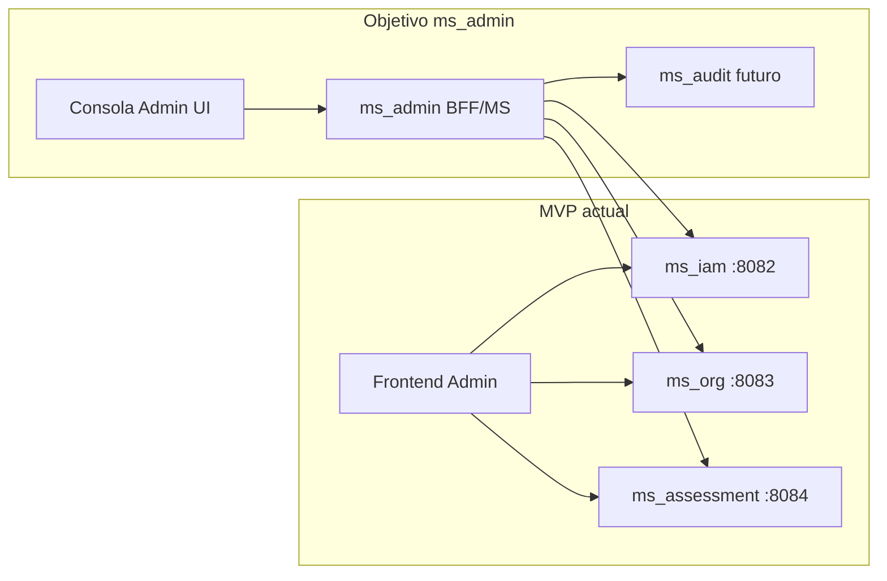
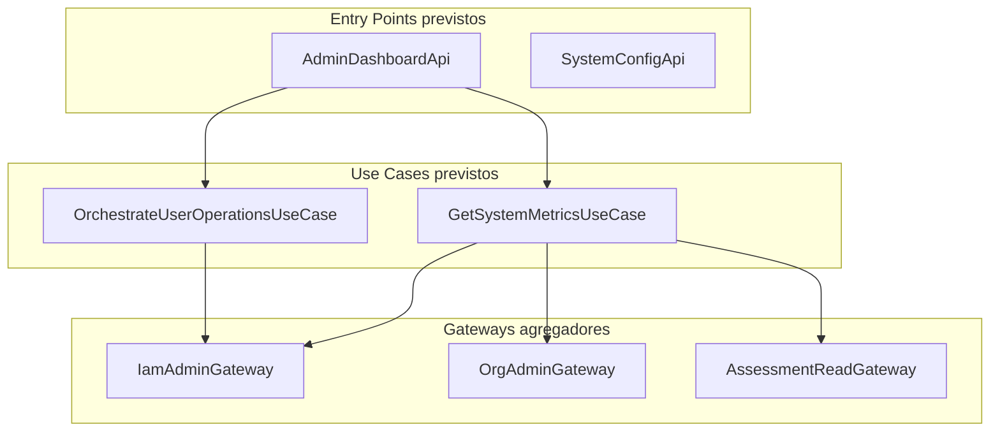
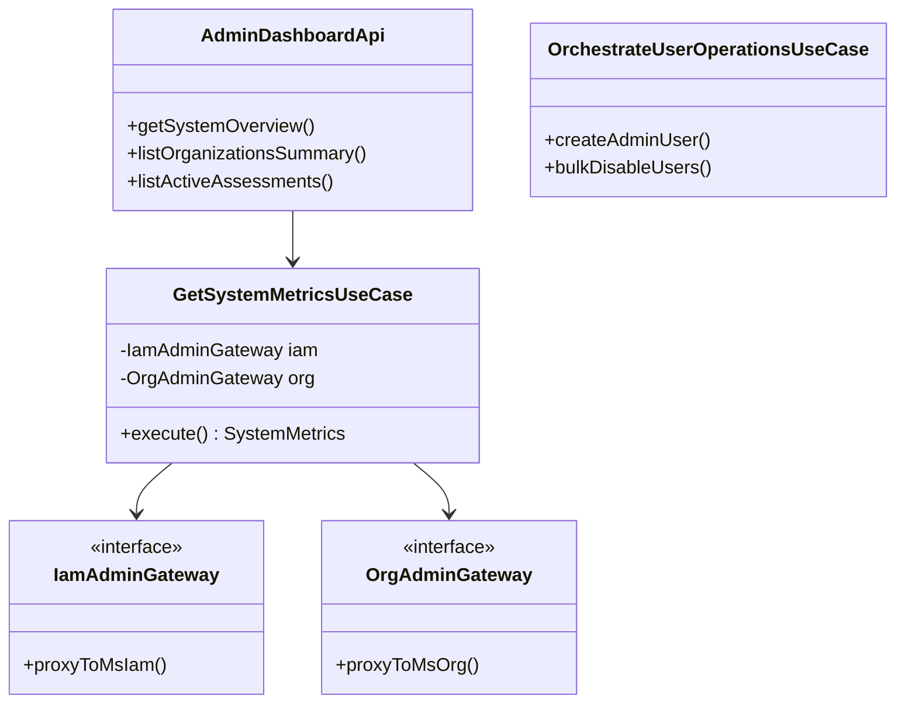
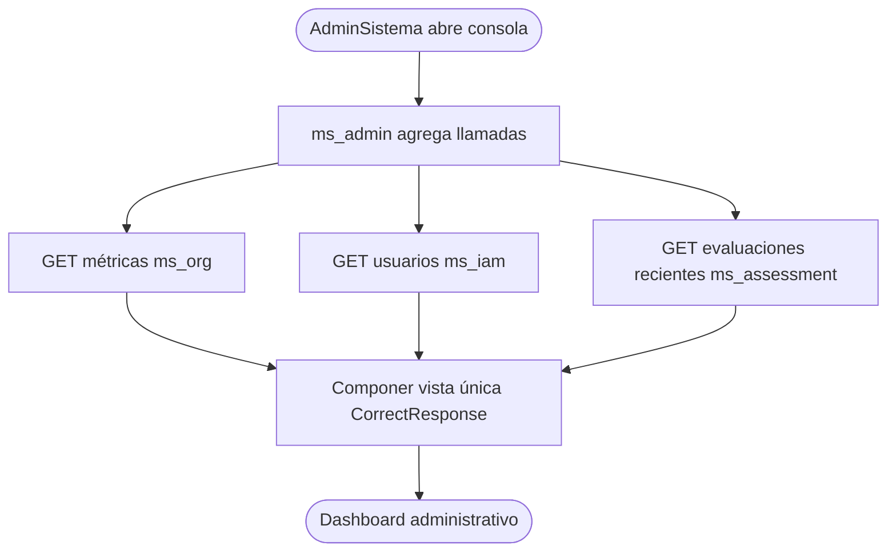

# ms_admin — Diseño

| Campo | Valor |
|---|---|
| Repositorio | `MSPI_NVA_CO_MR_BACK/ms_admin` |
| Fecha del documento | 2026-08-18 |
| Alcance | Arquitectura, estructura de paquetes, modelo de datos y diseño de API de `ms_admin` |
| Estado del repositorio | Placeholder — **no existe estructura de paquetes real que documentar** |

---

## 1. Estado real de la estructura del repositorio

A diferencia de `ms_iam` y `ms_org`, `ms_admin` **no es un build multi-módulo de Gradle**. No existe `settings.gradle`, `build.gradle`, `main.gradle` ni ningún módulo (`domain/model`, `domain/usecase`, `infrastructure/*`, `applications/app-service`). El árbol completo y real del repositorio es:

```
ms_admin/
├── .gitignore
├── README.md
└── docs/
    ├── ROADMAP.md
    └── openapi.yaml
```

Por lo tanto, este documento de diseño presenta dos cosas claramente separadas:

1. **Lo real** (§2): el contenido efectivo del repositorio.
2. **Lo previsto** (§3 en adelante): los diagramas de arquitectura objetivo que ya están redactados en el `README.md` del propio repositorio (no son una invención de este documento; se reproducen porque son la única evidencia de diseño existente, y se marcan como objetivo/no implementado en cada sección).

## 2. Diseño real: contrato OpenAPI actual

El único artefacto "de diseño" con forma de especificación técnica real es `docs/openapi.yaml`, y es un stub deliberado:

```yaml
openapi: 3.1.0
info:
  title: ms_admin — Consola administrativa (MSPI)
  version: 0.0.0
  description: |
    **API no implementada.**
servers: []
paths: {}
components:
  schemas:
    NotImplemented:
      type: object
      properties:
        status:
          type: string
          example: NOT_IMPLEMENTED
```

Puntos de diseño reales que sí pueden confirmarse de este archivo:

- Versión de especificación **OpenAPI 3.1.0** (misma versión que usan los MS ya implementados del ecosistema, por convención del proyecto).
- `version: 0.0.0` — versionado semántico en cero, consistente con "no lanzado".
- `servers: []` — no hay ningún entorno (dev/staging/prod) publicado.
- `paths: {}` — cero endpoints.
- Un único schema de referencia, `NotImplemented`, con un ejemplo de respuesta de error (`components.examples.PlaceholderNotImplemented`) que anticipa el **formato de envolvente de error** que usaría el servicio si se implementara: un objeto con `meta` (`traceId`, `timestamp`) y `error` (arreglo de `{code, message}`), con `code: NOT_IMPLEMENTED`. Este formato es coherente con el patrón `CorrectResponse`/`ErrorResponse`/`Meta` que ya usa `ms_iam` en producción, aunque en `ms_admin` es solo un ejemplo ilustrativo dentro del stub, no un esquema implementado.

## 3. Arquitectura objetivo (según README.md — no implementada)

> Los diagramas de esta sección son una **transcripción literal** de los publicados en `README.md` del repositorio `ms_admin`. El propio README los introduce con la advertencia: *"Los siguientes diagramas describen la arquitectura objetivo planificada. El código aún no existe; sirven como referencia de diseño."* Se incluyen aquí por ser la única fuente de diseño disponible, no como diseño confirmado por código.

### 3.1 Contexto — MVP actual vs. objetivo de `ms_admin`



Este diagrama confirma un dato de diseño real y verificable en otra parte del ecosistema: en el MVP actual, el frontend administrativo llama **directamente** a `ms_iam` (puerto 8082), `ms_org` (puerto 8083) y `ms_assessment` (puerto 8084), sin ningún BFF intermedio. `ms_admin`, de implementarse, se insertaría como capa de agregación entre el frontend y esos tres servicios, más un futuro `ms_audit` que hoy no existe.

### 3.2 Arquitectura objetivo (hexagonal)



Este diagrama plantea, como intención, el mismo estilo arquitectónico **hexagonal / puertos y adaptadores** que ya está implementado y verificado en `ms_iam` (capas `domain/model`, `domain/usecase`, `infrastructure/driven-adapters`, `infrastructure/entry-points`). En `ms_admin` los "gateways" previstos serían adaptadores salientes hacia otros microservicios HTTP (no hacia una base de datos propia), lo que sugiere un diseño más cercano a un **BFF agregador** que a un microservicio con persistencia propia — coherente con la pregunta abierta del propio README ("¿BFF o MS con persistencia propia?").

### 3.3 Diagrama de clases — diseño previsto



Ninguna de estas clases existe como archivo `.java` en el repositorio; son nombres de diseño propuestos en el README, sin firma completa, sin tipos de retorno definidos (p. ej. `SystemMetrics` no está modelado en ningún esquema) y sin manejo de errores especificado.

### 3.4 Flujo de proceso — consulta de panel administrativo



Este flujo propone un patrón de **agregación en paralelo** (tres llamadas GET salientes compuestas en una única respuesta), reutilizando el formato de envolvente `CorrectResponse` ya implementado en `ms_iam`. No hay definición de timeouts, manejo de fallos parciales (qué ocurre si una de las tres llamadas falla) ni caché, por lo que estos aspectos quedan como decisiones de diseño pendientes.

## 4. Modelo de datos

**No existe modelo de datos propio de `ms_admin`.** No hay ningún archivo de migración, esquema JPA, ni tabla definida. La búsqueda en `docs/proyecto/DB-MER.txt` del monorepo (el MER general del proyecto) no arroja ninguna tabla ni esquema asociado a `ms_admin`; las únicas coincidencias de la cadena "ADMIN" en ese archivo corresponden a la clasificación `control_type = ADMIN | TECH` de los dominios del instrumento ISO 27001 (hojas "Administrativas"/"Técnicas" del Excel MSPI), un concepto de dominio de negocio no relacionado con el microservicio `ms_admin`.

Si `ms_admin` se implementa como BFF agregador puro (una de las dos opciones que el propio README deja abiertas), es plausible que no requiera esquema de base de datos propio, ya que solo compondría datos obtenidos de `ms_iam`, `ms_org` y `ms_assessment` en tiempo de solicitud. Esto es una inferencia de diseño razonable a partir del diagrama de flujo (§3.4), no una decisión confirmada.

## 5. Diseño de API

No hay diseño de API más allá del stub descrito en §2. No se han definido:

- Rutas (`paths`) concretas.
- Esquemas de request/response para `AdminDashboardApi` ni `SystemConfigApi`.
- Códigos de estado HTTP esperados.
- Esquema de seguridad (`securitySchemes`) — aunque `ROADMAP.md` anticipa JWT de Keycloak, el archivo `openapi.yaml` no declara ningún `components.securitySchemes`.

## 6. Decisiones técnicas confirmadas en código

Ninguna. Todas las decisiones técnicas de `ms_admin` están, a la fecha, en estado de propuesta dentro de documentación (README/ROADMAP), sin una sola línea de código, configuración de build o infraestructura que las confirme.

## 7. Decisiones técnicas pendientes (explícitas en la documentación)

| Decisión | Opciones planteadas | Fuente |
|---|---|---|
| Modelo de despliegue | Microservicio independiente con persistencia propia **vs.** BFF sin persistencia propia | `README.md` §"Próximos pasos" punto 2 |
| Lenguaje/runtime | Node **vs.** Spring (Java) | `README.md` §"Próximos pasos" punto 2 (cita textual: "Node/Spring") |
| Alcance funcional | Inventario de operaciones a centralizar aún no definido | `ROADMAP.md` Fase 1 |
| Autenticación | JWT `AdminSistema` desde Keycloak/`ms_iam` (propuesto, no confirmado en configuración) | `ROADMAP.md` Fase 1 |
