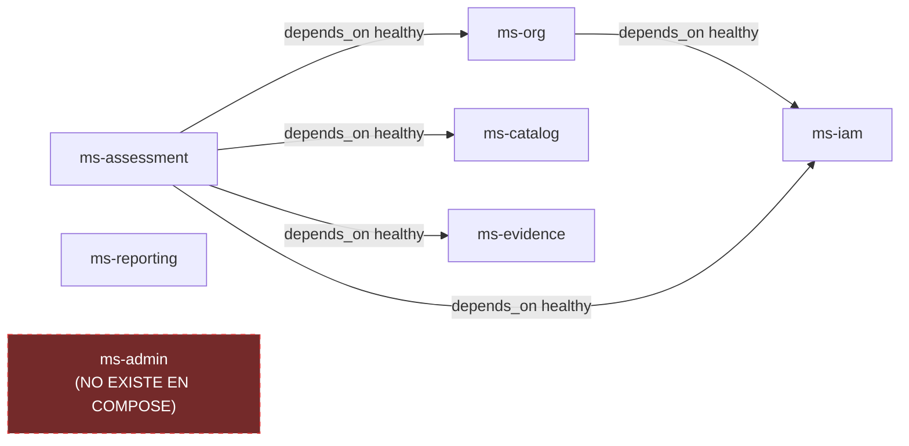

# ms_admin — Implementación y Despliegue

| Campo | Valor |
|---|---|
| Repositorio | `MSPI_NVA_CO_MR_BACK/ms_admin` |
| Fecha del documento | 2026-08-18 |
| Alcance | Build, contenedor, variables de entorno y CI/CD real de `ms_admin` |
| Estado del repositorio | **No desplegable — no existe artefacto de build, imagen ni pipeline** |

---

## 1. Declaración explícita

`ms_admin` no tiene ningún mecanismo de build, empaquetado ni despliegue. Verificaciones realizadas sobre el repositorio y sobre la configuración de orquestación del monorepo:

- No existe `deployment/Dockerfile` ni ningún otro `Dockerfile` en el repositorio.
- No existe `bitbucket-pipelines.yml` en `ms_admin`.
- No existe ningún archivo `.env` ni `application.yaml`/`application.properties` con variables de entorno.
- **`ms_admin` no aparece en `docker-config/docker/docker-compose.apps.yml`.** Se inspeccionó el archivo completo y sus servicios declarados son únicamente: `ms-iam`, `ms-org`, `ms-catalog`, `ms-evidence`, `ms-assessment` y `ms-reporting`. No hay entrada `ms-admin`.
- No hay ninguna imagen Docker publicada bajo el namespace `mspi/ms-admin` (los demás servicios usan el patrón `mspi/<servicio>:dev`, p. ej. `mspi/ms-iam:dev`).

El propio `README.md` de `ms_admin` lo resume en su tabla de estado: *"Despliegue: No aplica"*.

## 2. Build

No hay comando de build aplicable. No existe `gradlew`, `build.gradle` ni `package.json`; por lo tanto no hay tareas como `./gradlew build`, `./gradlew bootJar` ni `npm run build` que ejecutar sobre este repositorio.

## 3. Contenedor (Docker)

No hay `Dockerfile`. Como referencia de lo que usan los microservicios Java/Spring ya implementados en el mismo monorepo (`ms_iam`), y dejando explícito que **no aplica a `ms_admin` hasta que se implemente**, el patrón del ecosistema es:

- Imagen de build: `eclipse-temurin:21-jdk-alpine`.
- Imagen de runtime: `eclipse-temurin:21-jre-alpine`.
- Publicación bajo el namespace `mspi/<servicio>:dev` mediante el script `docker-config/docker/build-ms-images.ps1`.

Si `ms_admin` se implementara como BFF en otro stack (Node, según la opción abierta en el README), este patrón de imagen no aplicaría directamente y debería definirse uno nuevo.

## 4. Variables de entorno

No hay variables de entorno declaradas para `ms_admin` en ningún archivo del repositorio ni en `docker-config/docker/env-mspi-docker.env.example`, que es el archivo de ejemplo de variables de entorno compartidas del monorepo y que no contiene ninguna entrada relacionada con `ms_admin` o `ms-admin`.

## 5. Orquestación local (Docker Compose)

`docker-config/docker/docker-compose.apps.yml` es el compose real que orquesta los microservicios de dominio del sistema MSPI en entorno local/desarrollo. Sus servicios reales, con dependencias de arranque (`depends_on: condition: service_healthy`), son:

`ms_admin` se representa en el diagrama únicamente para dejar explícito, por contraste, que **no forma parte de la orquestación real** del entorno local del proyecto. No hay puerto asignado, no hay red Docker asociada, no hay volumen ni healthcheck definido para él.

## 6. CI/CD

No existe `bitbucket-pipelines.yml` en `ms_admin`, por lo que no hay pipeline de integración continua ni de despliegue continuo configurado para este repositorio. No se puede documentar ninguna etapa de build, test, análisis estático o despliegue automatizado porque ninguna de ellas existe.

## 7. Qué se necesitaría para desplegar `ms_admin`

Siguiendo la Fase 2 del `ROADMAP.md` ("Implementación inicial" — incluye "Integración con Infisical y despliegue"), los pasos pendientes para que `ms_admin` sea desplegable son, en orden lógico:

1. Definir y confirmar el stack de implementación (Java/Spring o Node), resolviendo la pregunta abierta del `README.md`.
2. Crear el build del proyecto (Gradle multi-módulo si sigue el patrón `ms_iam`/`ms_org`, o el equivalente en el stack elegido).
3. Escribir un `Dockerfile` siguiendo el patrón de imagen del resto del ecosistema (`eclipse-temurin:21-jdk-alpine` / `-jre-alpine`), si se opta por Java.
4. Agregar el servicio `ms-admin` a `docker-config/docker/docker-compose.apps.yml`, con sus variables de entorno, healthcheck y dependencias (`ms-iam`, `ms-org`, y potencialmente `ms-assessment`).
5. Integrar la gestión de secretos con Infisical.
6. Crear un `bitbucket-pipelines.yml` para el repositorio, replicando las etapas de build/test/despliegue ya usadas por los microservicios hermanos.

Ninguno de estos pasos se ha ejecutado a la fecha de este documento.
