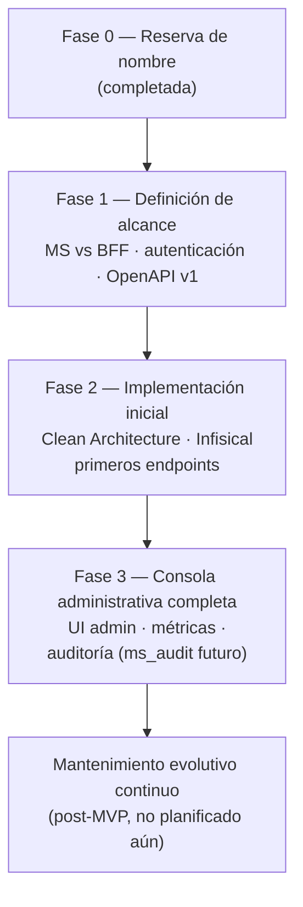

# ms_admin — Mantenimiento

| Campo | Valor |
|---|---|
| Repositorio | `MSPI_NVA_CO_MR_BACK/ms_admin` |
| Fecha del documento | 2026-08-18 |
| Alcance | Mantenimiento correctivo, preventivo y evolutivo de `ms_admin`; gestión de versiones; monitoreo; mejoras futuras |
| Estado del repositorio | **Sin sistema en producción — el mantenimiento aplica al repositorio y su documentación, no a un servicio en ejecución** |

---

## 1. Naturaleza del mantenimiento en el estado actual

Dado que `ms_admin` no tiene código desplegado (ver `01`–`06`), no existe un sistema en ejecución sobre el cual practicar mantenimiento correctivo o preventivo en el sentido tradicional (parches de bugs, monitoreo de incidentes, actualización de dependencias vulnerables). El "mantenimiento" aplicable hoy es de tipo **documental y de gobernanza de alcance**, tal como lo define el propio `docs/ROADMAP.md` del repositorio.

## 2. Mantenimiento correctivo

No aplica. No hay defectos que corregir porque no hay funcionalidad implementada. No hay incidentes, tickets de bug ni hotfixes registrados en el repositorio.

## 3. Mantenimiento preventivo

En el estado actual, el único mantenimiento preventivo relevante es **documental**: mantener `README.md`, `docs/ROADMAP.md` y `docs/openapi.yaml` sincronizados con las decisiones reales del equipo de arquitectura, para evitar que el repositorio quede con documentación desactualizada respecto al MER u otros microservicios del ecosistema. La regla de gobernanza explícita del `ROADMAP.md` — *"Cualquier cambio de alcance debe reflejarse en el MER del proyecto y en los contratos OpenAPI de los MS afectados antes de implementar código en este repositorio"* — funciona, en la práctica, como una medida preventiva contra decisiones de arquitectura no documentadas.

Cuando exista una implementación real, el mantenimiento preventivo esperable (por analogía con `ms_iam`, ya en producción, y sin que esto sea una afirmación sobre `ms_admin`) incluiría: actualización de versiones de Spring Boot/Gradle, renovación de dependencias con vulnerabilidades conocidas, y revisión periódica de la configuración de Infisical/secretos.

## 4. Mantenimiento evolutivo

El mantenimiento evolutivo de `ms_admin` está, en efecto, planificado como las Fases 1 a 3 de `docs/ROADMAP.md`:

Cada fase del ROADMAP es, en sí misma, una unidad de evolución del producto: pasar de "repositorio reservado" a "alcance decidido", de ahí a "primeros endpoints", y finalmente a "consola administrativa completa" con posible integración a un `ms_audit` que hoy no existe en el ecosistema.

## 5. Gestión de versiones

- El contrato de API (`docs/openapi.yaml`) está en `version: 0.0.0`, consistente con "no lanzado". No hay historial de versiones de API que documentar.
- No hay tags ni releases de código, porque no hay código.
- La convención de versionado que se adoptaría (SemVer para el contrato OpenAPI, versión de imagen `mspi/ms-admin:<tag>` para el contenedor) se infiere por analogía con el resto del ecosistema (`mspi/ms-iam:dev` como patrón observado en `docker-compose.apps.yml`), no está confirmada para `ms_admin`.

## 6. Monitoreo y logs

No aplica. No hay servicio en ejecución, por lo que no hay logs que recolectar ni métricas que exponer. No hay configuración de Micrometer, Prometheus, ni ningún endpoint `/actuator` en este repositorio (a diferencia de `ms_iam`, que sí expone `/actuator/health` e `/actuator/info` como parte de sus requerimientos iniciales).

Cuando `ms_admin` se implemente, el propio ecosistema ya fija un patrón de referencia: los servicios en `docker-compose.apps.yml` declaran `depends_on: condition: service_healthy`, lo que implica que un futuro `ms-admin` necesitaría, como mínimo, un endpoint de salud compatible con ese mecanismo si otros servicios llegaran a depender de él.

## 7. Mejoras futuras (según ROADMAP.md)

Listadas en orden de la hoja de ruta oficial del repositorio, todas pendientes de ejecución:

1. **Decisión de arquitectura** — microservicio independiente vs. BFF sin persistencia propia.
2. **Inventario de operaciones administrativas** a centralizar (panel admin, reportes, configuración global).
3. **Definición de autenticación** — JWT del rol `AdminSistema` emitido por Keycloak/`ms_iam`.
4. **Publicación de `docs/openapi.yaml` v1** con al menos un endpoint de salud o agregación.
5. **Estructura Clean Architecture** alineada con `ms_iam`/`ms_org`.
6. **Integración con Infisical** y su cadena de despliegue.
7. **Primeros endpoints de agregación o proxy** hacia microservicios de dominio (`ms_iam`, `ms_org`, `ms_assessment`).
8. **UI administrativa** (si aplica) consumiendo `ms_admin`.
9. **Métricas y auditoría de lectura**, con posible integración a un futuro `ms_audit` — hoy la auditoría del sistema vive únicamente en `ms_iam` (`iam.audit_log`).

## 8. Riesgos de mantenimiento identificados

- **Deuda de alcance no resuelta**: mientras la Fase 1 no se complete, cualquier trabajo de implementación corre el riesgo de construirse sobre supuestos no validados (por ejemplo, implementar como MS con base de datos propia si finalmente se decide que será un BFF sin persistencia).
- **Dependencia de un servicio inexistente (`ms_audit`)**: parte del alcance de la Fase 3 depende de un microservicio que, a la fecha, no está ni siquiera reservado como carpeta en el monorepo ni referenciado en `docker-compose.apps.yml`.
- **Desalineación documental**: si el equipo decide el alcance de `ms_admin` sin actualizar `docs/proyecto/DB-MER.txt` ni `docs/proyecto/Historias_Usuario_MSPI_v2.md` del monorepo general (donde hoy no hay ninguna mención a `ms_admin`), se rompería la trazabilidad exigida por la propia gobernanza del `ROADMAP.md`.
