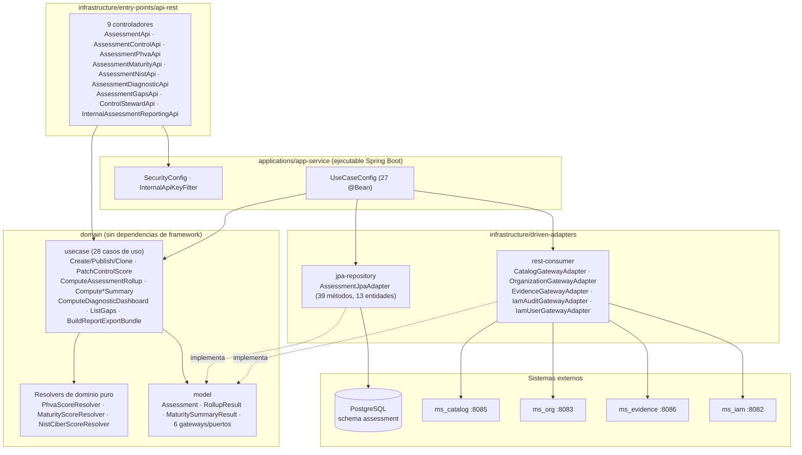
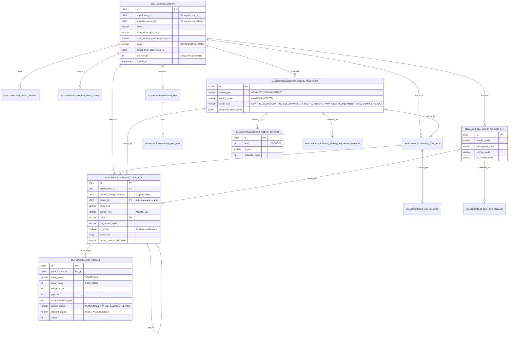

# ms_assessment — Diseño

| Campo | Valor |
|---|---|
| Repositorio | `MSPI_NVA_CO_MR_BACK/ms_assessment` |
| Fecha del documento | 2026-08-19 |
| Alcance | Arquitectura, estructura de paquetes, modelo de datos y diseño de API del microservicio `ms_assessment`, tal como está implementado en el código |

---

## 1. Estilo arquitectónico

`ms_assessment` implementa **arquitectura hexagonal (puertos y adaptadores)**, materializada como un **build multi-módulo de Gradle**: cada capa es un subproyecto con su propio `build.gradle` y sus propias dependencias, lo que impone físicamente la regla de dependencia (el dominio no tiene en su classpath ningún artefacto de Spring/JPA/HTTP).

**Regla de dependencia observada** (verificada en cada `build.gradle`):

```
applications/app-service   ──depends on──>  jpa-repository, rest-consumer, api-rest, common, model, usecase
infrastructure/entry-points/api-rest ──> usecase, model, common
infrastructure/driven-adapters/jpa-repository ──> model, common
infrastructure/driven-adapters/rest-consumer  ──> model, common
domain/usecase              ──depends on──>  model, common
domain/model                 (build.gradle vacío — sin dependencias declaradas)
infrastructure/helpers/common ──depends on──> model
```

A diferencia de `ms_iam` (que separa un módulo `:service` para orquestación compleja y añade `:brevo-sender`), `ms_assessment` **no tiene módulo de servicio adicional**: los 28 casos de uso en `:usecase` orquestan directamente los 6 gateways (puertos) declarados en `:model/gateway`, sin una capa intermedia de "servicio de aplicación". Esto es coherente con el hecho de que casi toda la lógica de negocio de este microservicio es de **lectura/cálculo** (rollup, resúmenes, diagnóstico), no de coordinación de sistemas externos complejos como en `ms_iam` (Keycloak + BD + correo).

## 2. Estructura real de paquetes (árbol de módulos y clases)

```
ms_assessment/
├── domain/
│   ├── model/                              (:model — co.com.mspi.model)
│   │   ├── assessment/    41 clases: Assessment, AssessmentArea, ControlNodeSnapshot,
│   │   │                  ControlResponse, RollupNode/RollupResult, PhvaItemSnapshot/Response,
│   │   │                  MaturityRequirementSnapshot/Threshold/Response, MaturityMatrixRow/Cell,
│   │   │                  MaturityBlockingRequirement, NistCiberItemSnapshot/Response,
│   │   │                  NistFunctionSummary, DomainEffectivenessResult, DiagnosticDashboardResult,
│   │   │                  SelfPerceptionComparison, GapItem/GapListResult, ReportExportBundle,
│   │   │                  comandos Patch*Command/CreateAssessmentCommand
│   │   ├── external/      17 clases: DTOs de dominio que representan lo que se consume de
│   │   │                  ms_catalog/ms_org/ms_evidence (ControlCatalogNodeInfo, ControlRuleInfo,
│   │   │                  ScaleLevelInfo, ScaleBandInfo, MaturityRequirementCatalogInfo,
│   │   │                  NistCiberItemCatalogInfo, AreaPresetInfo, OrganizationInfo, ...)
│   │   └── gateway/        6 interfaces de puerto (ver §3)
│   └── usecase/                            (:usecase — co.com.mspi.usecase.assessment)
│       └── 28 casos de uso + 3 "resolvers" de dominio puro:
│           CreateAssessmentUseCase, GetAssessmentUseCase, UpdateAssessmentUseCase,
│           AssignEntityOrderTypeUseCase, PublishAssessmentUseCase, CloneAssessmentUseCase,
│           GetAssessmentAreasUseCase, ReplaceAssessmentAreaTopicsUseCase,
│           ListAssessmentControlsUseCase, GetControlDetailUseCase, PatchControlScoreUseCase,
│           GetControlStewardsUseCase, PatchControlStewardUseCase, ComputeAssessmentRollupUseCase,
│           ListPhvaItemsUseCase, PatchPhvaItemScoreUseCase, ComputePhvaAdvanceUseCase,
│           ListMaturityRequirementsUseCase, PatchMaturityRequirementScoreUseCase,
│           ComputeMaturitySummaryUseCase, ListNistCiberItemsUseCase, PatchNistCiberItemScoreUseCase,
│           ComputeNistSummaryUseCase, ComputeDomainEffectivenessUseCase,
│           ComputeDiagnosticDashboardUseCase, ListGapsUseCase, BuildReportExportBundleUseCase
│           + PhvaScoreResolver, MaturityScoreResolver, NistCiberScoreResolver (clases de
│           servicio de dominio con métodos estáticos, sin estado, invocadas por varios use cases)
├── infrastructure/
│   ├── helpers/common/                     (:common — co.com.mspi.common)
│   │   ├── dto/        CorrectResponse, ErrorResponse, ErrorDetail, Meta
│   │   ├── exception/   DomainException, BusinessRulesOnFieldsException, ResourceNotFoundException,
│   │   │                IamServiceException, UserAlreadyExistsException
│   │   ├── mapper/      ApiResponseMapper
│   │   └── CommonErrorConstants
│   ├── driven-adapters/
│   │   ├── jpa-repository/                 (:jpa-repository — co.com.mspi.jpa)
│   │   │   ├── adapter/    AssessmentJpaAdapter (única implementación — 39 métodos del puerto
│   │   │   │              AssessmentPersistenceGateway en una sola clase)
│   │   │   ├── entity/     13 entidades @Entity (una por tabla del esquema `assessment`)
│   │   │   ├── repository/ 13 interfaces Spring Data JPA
│   │   │   └── config/     DBSecret, JpaConfig
│   │   └── rest-consumer/                  (:rest-consumer — co.com.mspi.consumer)
│   │       ├── adapter/    CatalogGatewayAdapter, EvidenceGatewayAdapter, IamAuditGatewayAdapter,
│   │       │              IamUserGatewayAdapter, OrganizationGatewayAdapter
│   │       ├── config/     RestConsumerConfig (4 beans RestClient nombrados)
│   │       └── support/    ApiDataExtractor (helper de deserialización del envoltorio
│   │                       CorrectResponse de los microservicios remotos)
│   └── entry-points/
│       └── api-rest/                       (:api-rest — co.com.mspi.api)
│           └── assessment/
│               ├── 9 controladores @RestController: AssessmentApi, AssessmentAreasApi,
│               │   AssessmentControlApi, AssessmentPhvaApi, AssessmentMaturityApi,
│               │   AssessmentNistApi, AssessmentDiagnosticApi, AssessmentGapsApi, ControlStewardApi
│               ├── dto/     33 clases de request/response
│               ├── mapper/  9 mappers estáticos DTO↔dominio
│               ├── CurrentUserResolver, JwtSupport (resolución de identidad desde el JWT)
│           ├── config/     CorsConfig, TraceIdFilter
│           ├── exception/  GlobalExceptionHandler
│           └── internal/   InternalAssessmentReportingApi (bundle + gaps, `X-Internal-Api-Key`)
└── applications/
    └── app-service/                        (:app-service — co.com.mspi)
        ├── config/  AdapterProperties, CorsProperties, DBCredential/DBCredentialConfig,
        │            InfisicalConfig, InternalApiKeyFilter/InternalApiProperties, JacksonConfig,
        │            JwtResourceServerProperties, RestClientConfig, SecurityConfig, UseCaseConfig
        └── MainApplication
```

A diferencia de `ms_iam` (94 clases de entrada/salida repartidas en 9 módulos con capa `:service`), en `ms_assessment` el mayor volumen de código vive en `domain/model` (58 clases, dominio muy rico en tipos de valor para los resultados de cálculo) y en `domain/usecase` (31 clases), reflejando que el núcleo del microservicio es el **motor de cálculo on-read**, no la orquestación de un flujo transaccional complejo.

## 3. Puertos (interfaces de dominio, `domain/model/.../gateway`)

| Puerto | Responsabilidad | Adaptador que lo implementa | Módulo |
|---|---|---|---|
| `AssessmentPersistenceGateway` | Persistencia completa del esquema `assessment` (39 métodos: assessment, áreas, control_response, PHVA, madurez, NIST) | `AssessmentJpaAdapter` | `:jpa-repository` |
| `CatalogGateway` | Plantilla activa, árboles de controles/PHVA/madurez/NIST, presets de áreas, dominios ISO, escala/bandas, reglas de control | `CatalogGatewayAdapter` | `:rest-consumer` |
| `OrganizationGateway` | Validación de organización (`GET /organizations/{id}`) | `OrganizationGatewayAdapter` | `:rest-consumer` |
| `EvidenceGateway` | Init/clone de levantamiento documental, archivos de evidencia, contexto de auto-percepción | `EvidenceGatewayAdapter` | `:rest-consumer` |
| `IamAuditGateway` | Registro best-effort de eventos de auditoría en `ms_iam` | `IamAuditGatewayAdapter` | `:rest-consumer` |
| `IamUserGateway` | Resolución del `userId` interno a partir del `sub` del JWT | `IamUserGatewayAdapter` | `:rest-consumer` |

El ensamblaje puerto↔adaptador↔caso de uso ocurre exclusivamente en `applications/app-service/.../config/UseCaseConfig.java`, que declara **27 `@Bean`** (uno por caso de uso), inyectando explícitamente los gateways y, en varios casos, otros casos de uso ya construidos (p. ej. `ComputeDiagnosticDashboardUseCase` depende de otros cuatro casos de uso `Compute*`, y `BuildReportExportBundleUseCase` depende de siete). Esto forma una **composición en cadena** de casos de uso dentro del propio `:usecase`, no solo de gateways — patrón distinto al de `ms_iam`, donde los casos de uso son mayormente *pass-through* a un único `:service`.

Notable: `AssessmentPersistenceGateway` es un **puerto "gordo"** (39 métodos) implementado por una **única clase** (`AssessmentJpaAdapter`), en contraste con `ms_iam`, que reparte la persistencia en 5 adaptadores distintos (`UserJpaAdapter`, `TotpAdapter`, `AuditEventAdapter`, etc.). Esto concentra toda la lógica de mapeo entidad↔dominio y las consultas jerárquicas (snapshot de árbol de controles, clonación) en un solo archivo.

## 4. Diagrama de componentes



## 5. Modelo de datos

Esquema `assessment` en PostgreSQL (`applications/app-service/src/main/resources/schema.sql`, 287 líneas, `CREATE SCHEMA IF NOT EXISTS assessment` + 13 tablas con `CREATE TABLE IF NOT EXISTS`). Como en `ms_iam`, **el microservicio no ejecuta DDL en producción** (`spring.sql.init.mode: never`, `hibernate.ddl-auto: none`; ver `application.yaml`), por lo que el esquema debe aplicarse externamente contra la base compartida `MSPI`. Complementariamente, `maturity_data.sql` (328 líneas, en la raíz del repositorio) es un script de **datos semilla** que puebla el esquema `catalog` (no `assessment`) con requisitos de madurez y umbrales de ejemplo (R1–R21 aprox.), usado para pruebas manuales/QA del módulo de madurez contra un catálogo real — no forma parte del arranque del microservicio.

### 5.1 Diagrama entidad-relación



### 5.2 Notas de diseño del modelo de datos

- **Patrón "snapshot + respuesta"** repetido en los cuatro subdominios evaluables (controles, PHVA, madurez, NIST): una tabla `assessment_*` congela la copia del catálogo vigente al crear la evaluación (`source_catalog_*_id` referencia el origen, pero **no** hay FK física hacia el esquema `catalog` — es una referencia lógica cross-esquema/cross-microservicio), y una tabla `*_response` separada guarda exclusivamente lo capturado por el usuario (`score_status`, `score_value`, textos). Esta separación permite que el snapshot sea inmutable mientras la respuesta se actualiza libremente, y que ambas tengan su propio `version`/optimistic lock independiente por fila.
- **`assessment_control_node` es un árbol auto-referenciado** (`parent_id` → `id` de la misma tabla, `ON DELETE CASCADE`), lo que permite representar dominios ISO → cláusulas → controles → sub-controles con profundidad variable; `is_scored` marca las hojas realmente calificables (nodos de agrupación no admiten `control_response`).
- **Todas las tablas `*_response`** (`control_response`, `phva_item_response`, `assessment_maturity_requirement_response`, `nist_ciber_item_response`) comparten el mismo patrón de restricciones: `CHECK` sobre `score_status IN ('SCORED','NA')` y un `CHECK` compuesto que fuerza `score_value IS NULL` cuando es `NA`, o `score_value BETWEEN 0 AND 100` cuando es `SCORED`. Es una regla de integridad **duplicada** entre base de datos (defensa en profundidad) y capa de dominio (`PatchControlScoreUseCase`, etc., que validan además contra la escala publicada por `ms_catalog`, más estricta que el simple rango 0–100).
- **`assessment_maturity_requirement`** es la tabla más compleja del esquema: combina cuatro estrategias de origen de valor (`source_type`) y cinco reglas de herencia (`inherit_rule`), con columnas de referencia condicionales según el tipo (`source_assessment_control_node_id`, `source_assessment_phva_item_id`, `composite_phva_codes` JSONB para la regla `INHERIT_PHVA_COMPOSITE_AVG`). `assessment_maturity_threshold` es una tabla hija 1:5 (un umbral por nivel CMMI 1–5), con `is_na` para marcar niveles donde el requisito no aplica.
- **`row_version` en `assessment`** implementa el control de concurrencia optimista de `PublishAssessmentUseCase` (RI-2/RNF-05 en `01-Planificacion.md`) a nivel de aplicación (no usa `@Version` de JPA con excepción automática; la comparación es explícita en el caso de uso, devolviendo `BusinessRulesOnFieldsException` → HTTP 409 vía `GlobalExceptionHandler`, que no tiene un manejador específico para conflicto de versión y por tanto lo mapea igual que cualquier regla de negocio — ver `05-Pruebas.md`/`07-Mantenimiento.md`).
- **Índices**: 21 índices explícitos, mayoritariamente compuestos por `assessment_id` + una columna de filtro/orden frecuente (`position`, `iso_code`, `component`, `function_code`, `source_type`), reflejando que casi todo acceso de lectura es "todo lo de una evaluación, en su orden natural" — patrón coherente con el cálculo on-read que recorre el árbol completo en cada rollup.
- **`maturity_data.sql`** no forma parte del ciclo de vida de `ms_assessment`: es un script de siembra de datos de **catálogo** (`catalog.maturity_requirement_catalog`, `catalog.maturity_threshold`, `catalog.template_version.maturity_crit_thresholds`) usado para poblar un entorno de prueba con el que `ms_assessment` genera snapshots reales; documenta indirectamente la forma exacta de las estructuras JSON/relacionales que `CatalogGateway` espera recibir de `ms_catalog` (p. ej. `maturity_crit_thresholds` como JSONB `{"nivel": {"sufficientMax": n, "intermediateMax": n}}`, consumido por `ComputeMaturitySummaryUseCase` para clasificar SUFICIENTE/INTERMEDIO/CRÍTICO).

## 6. Diseño de la API (REST)

Contrato formal en `docs/openapi.yaml` (OpenAPI 3.1.0 en el header aunque `info.description` del README lo referencia como 3.0.3; el archivo real declara `openapi: 3.1.0`), 2574 líneas, `info.version: 1.0.0`, agrupado en **10 tags**: `assessment-lifecycle` (M1), `assessment-areas` (M2), `assessment-controls` (M3/M4), `assessment-stewardship`, `assessment-phva` (M5), `assessment-maturity` (M6), `assessment-nist` (M7), `assessment-diagnostic` / `assessment-gaps` (M8), y el grupo interno de reporting (M9).

Convenciones de diseño observadas, consistentes con las del resto del ecosistema MSPI (mismo patrón que `ms_iam`):

- **Envoltorio uniforme de respuesta**: éxito → `CorrectResponse{meta:{traceId,timestamp}, data}`; error → `ErrorResponse{meta, error:[{code,message}]}`, construidos por `ApiResponseMapper` (`:common`). Las operaciones `PATCH` de calificación/steward devuelven `data: null` (efecto puramente de escritura, sin cuerpo de retorno).
- **Un `RestController` por subdominio funcional**, no por tabla: `AssessmentApi` (`/assessments`), `AssessmentAreasApi` (`/assessments/{id}/areas`), `AssessmentControlApi` (`/assessments/{id}/controls`, incluye rollup), `ControlStewardApi` (`/assessments/{id}/controls/stewardship`), `AssessmentPhvaApi`, `AssessmentMaturityApi`, `AssessmentNistApi`, `AssessmentDiagnosticApi`, `AssessmentGapsApi`, y `InternalAssessmentReportingApi` bajo `/internal/assessments`.
- **Recursos jerárquicos anidados bajo `/assessments/{assessmentId}`**: todo el modelo de rutas cuelga del identificador de evaluación (excepto la creación), reflejando que la evaluación es el agregado raíz de todo el dominio.
- **DTO de entrada validado con Bean Validation** (`@Valid`) y mapeo explícito DTO↔dominio en 9 clases `*Mapper` — el controlador nunca recibe/retorna objetos de `domain/model` directamente.
- **Manejo de errores centralizado** en `GlobalExceptionHandler` (`@RestControllerAdvice`), con solo **6 manejadores específicos** (`ResourceNotFoundException`→404, `BusinessRulesOnFieldsException`→400, `UserAlreadyExistsException`→409, `IamServiceException`→502, `MethodArgumentNotValidException`→400, `DomainException`→500) y **sin manejador genérico `Exception.class`** — a diferencia de `ms_iam`, que sí define una red de seguridad final. `UserAlreadyExistsException` e `IamServiceException` son excepciones heredadas del módulo `:common` compartido con `ms_iam`, pero no se detectó ningún caso de uso de `ms_assessment` que las lance: son manejadores presentes por reutilización del módulo `common`, no por necesidad funcional propia (ver ausencias en `07-Mantenimiento.md`).
- **Doble esquema de seguridad**: `bearerAuth` (JWT) para `/assessments/**`, e `internalApiKey` (`X-Internal-Api-Key`) para `/internal/**`, con el mismo patrón de filtro Servlet manual (`InternalApiKeyFilter`, insertado antes de `BearerTokenAuthenticationFilter`) que en `ms_iam`.
- **Control de concurrencia optimista expuesto explícitamente en el contrato**: `RowVersionRequest` como cuerpo de `POST /assessments/{id}/publish`, y `rowVersion` como campo de `UpdateAssessmentRequest`; el cliente debe leer el `rowVersion` vigente (vía `GET`) antes de mutar.
- **Filtros por query param en todos los listados** (`controlType`, `component`, `sourceType`/`level`/`status`, `functionCode`, `threshold`/`isoDomainCode`/`stewardRoleCode`), nunca por *path*, y siempre opcionales.
- **Identificadores como UUID** en *path* (`assessmentId`, `assessmentControlNodeId`, `phvaItemId`, `requirementId`, `itemId`, `areaId`).

## 7. Decisiones técnicas confirmadas en el código

| Decisión | Evidencia | Implicación |
|---|---|---|
| **Spring MVC (servlet, bloqueante)**, no WebFlux | `spring-boot-starter-webmvc` en `api-rest`, `rest-consumer` y `app-service`; `HttpServletRequest`/`OncePerRequestFilter` en `InternalApiKeyFilter`/`TraceIdFilter` | Todo el flujo es síncrono; los cálculos on-read se ejecutan en el hilo de la petición HTTP |
| **JPA/Hibernate sobre R2DBC** | `spring-boot-starter-data-jpa`, 13 `@Entity` con `jakarta.persistence` | Persistencia bloqueante, coherente con MVC |
| **RestClient de Spring para consumo saliente** (no `RestTemplate`/`WebClient`) | `RestConsumerConfig` (4 `@Bean RestClient` nombrados: `msOrgRestClient`, `msCatalogRestClient`, `msEvidenceRestClient`, `msIamRestClient`) | Sustituye el patrón `RestTemplate` observado en `ms_iam`; API moderna de Spring 6/Boot 4 |
| **Reenvío del JWT del usuario a `ms_org`/`ms_catalog`/`ms_iam`** vía interceptor (`jwtBearerForwardingInterceptor`) | `RestConsumerConfig.jwtBearerForwardingInterceptor()` — lee `SecurityContextHolder` y copia el `Jwt` como `Authorization: Bearer` saliente | El usuario autenticado "propaga" su identidad a las llamadas salientes hacia `ms_org`/`ms_catalog`, mientras que `ms_evidence` se llama solo con `X-Internal-Api-Key` (sin JWT forwarding) |
| **`X-Internal-Api-Key` añadida por configuración condicional** (`if (apiKey != null && !apiKey.isBlank())`) | `RestConsumerConfig` | Si `INTERNAL_API_KEY` no está configurada, las llamadas a `ms_catalog`/`ms_evidence`/`ms_iam` internas simplemente no llevan el header (fallarán del lado del servicio remoto, no localmente) |
| **JWT validado contra Keycloak vía JWK Set o issuer**, sin sesión | `NimbusJwtDecoder` en `SecurityConfig`, idéntico patrón a `ms_iam` (soporta `JWT_JWK_SET_URI` separado del `issuer` para el caso Docker) | El servicio no emite tokens propios |
| **Roles del realm mapeados a `ROLE_<nombre>` + `ROLE_USER` por defecto** | `SecurityConfig.jwtAuthenticationConverter()` | Todo usuario autenticado recibe automáticamente `ROLE_USER`, además de sus roles de realm; no se observó `@PreAuthorize` por rol específico en los controladores (autorización gruesa, solo autenticación) |
| **Multi-módulo Gradle como enforcement arquitectónico** | `settings.gradle` (7 subproyectos) | El dominio no puede depender de infraestructura por construcción del build |
| **Sin módulo `:service` intermedio** | `settings.gradle`, ausencia de directorio `infrastructure/driven-adapters/service` | Los casos de uso llaman directamente a los gateways; la orquestación multi-gateway vive en el propio caso de uso (p. ej. `CreateAssessmentUseCase` usa 4 gateways directamente) |
| **Resolvers de dominio sin estado y con métodos estáticos** (`PhvaScoreResolver`, `MaturityScoreResolver`, `NistCiberScoreResolver`) | Firmas `static` verificadas en los tests (`MaturityScoreResolver.compareStatus(...)`, `NistCiberScoreResolver.averageScores(...)`) | Facilita pruebas unitarias puras sin mocks de gateway para la lógica aritmética/de comparación central del dominio |
| **Gestión de secretos por Infisical en producción** | `InfisicalConfig` (mismo patrón `BeanFactoryPostProcessor` que `ms_iam`) | Sin credenciales hardcodeadas para producción |
| **Sin manejador genérico de excepciones (`Exception.class`)** en `GlobalExceptionHandler` | Solo 6 `@ExceptionHandler` específicos, comparado con los 10+1 de `ms_iam` | Una excepción no contemplada (p. ej. `NullPointerException` en un cálculo) se propaga como error 500 por defecto de Spring Boot, sin el envoltorio `ErrorResponse` uniforme — inconsistencia de contrato a vigilar (ver `07-Mantenimiento.md`) |
