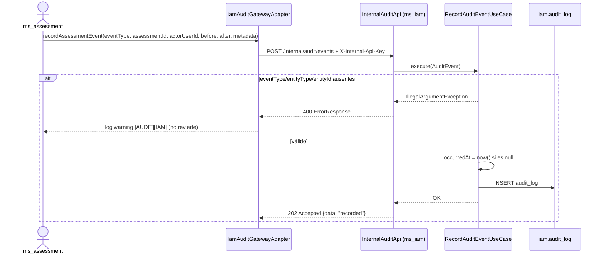
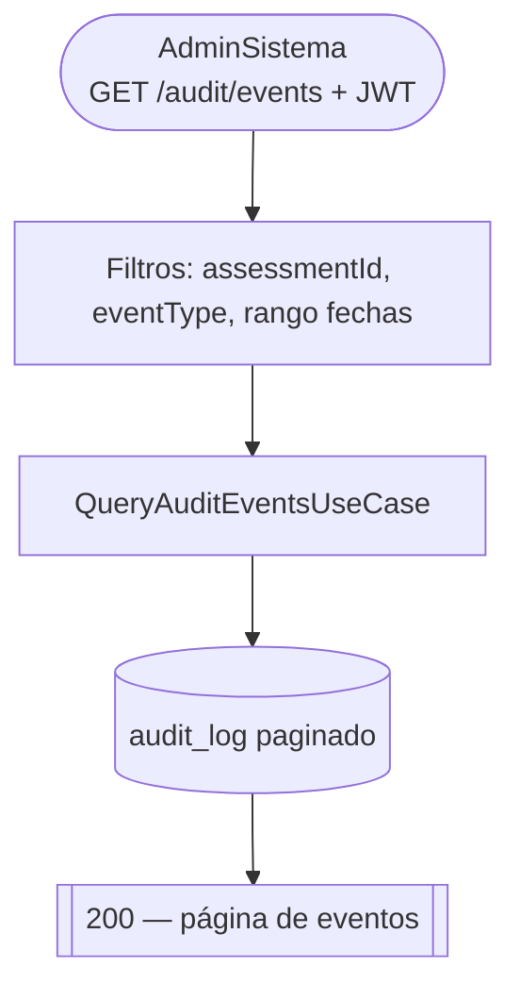

# ms_audit — Análisis

| Campo | Valor |
|---|---|
| Repositorio | `MSPI_NVA_CO_MR_BACK/ms_audit` |
| Fecha del documento | 2026-08-18 |
| Alcance | Análisis de requerimientos funcionales y no funcionales, reglas de negocio, actores y casos de uso — de la funcionalidad de auditoría del sistema MSPI, actualmente implementada en `ms_iam` y planificada para `ms_audit` |

---

## 1. Advertencia metodológica

`ms_audit` no tiene código propio (ver `01-Planificacion.md`, sección 1). Este documento analiza:

- Los **requerimientos funcionales ya implementados** en `ms_iam` para el subdominio de auditoría (fuente de verdad real, verificable en código Java).
- Los **requerimientos funcionales planificados pero no implementados**, extraídos de los diagramas y tablas del `README.md` de `ms_audit` y de `docs/MIGRATION-NOTES.md`.

Cada requerimiento se etiqueta como **[Implementado en ms_iam]** o **[Planificado — no implementado]** para evitar ambigüedad sobre qué existe realmente hoy en el sistema.

## 2. Actores

| Actor | Tipo | Descripción |
|---|---|---|
| `ms_assessment` | Sistema (microservicio productor) | Envía eventos de auditoría de negocio (publicación de evaluaciones, cambios de tipo de entidad) mediante `IamAuditGatewayAdapter` |
| `ms_iam` (self) | Sistema | Genera sus propios eventos de auditoría de autenticación (`AUTH_LOGIN_SUCCESS`, `AUTH_LOGIN_FAILED`, `AUTH_LOGIN_INACTIVE`) internamente, sin pasar por HTTP |
| `AdminSistema` | Actor humano | Rol con permiso previsto para consultar la bitácora (`GET /audit/events`, planificado; sin endpoint de consulta implementado hoy en ningún microservicio) |
| Otros productores futuros (`ms_org`, etc.) | Sistema (planificado) | Mencionados en el diagrama de arquitectura objetivo del README de `ms_audit` como productores potenciales; sin integración de código existente |
| `ms_admin` / Frontend de soporte | Sistema / actor humano (planificado) | Consumidores futuros de la API de consulta/exportación |

## 3. Requerimientos funcionales

### 3.1 Ingesta de eventos de auditoría — [Implementado en ms_iam]

- **RF-01**: El sistema debe exponer un endpoint interno `POST /internal/audit/events` que reciba eventos de auditoría con los campos obligatorios `eventType`, `entityType`, `entityId` (verificado en `RecordAuditEventUseCase.execute()`, que lanza `IllegalArgumentException` si alguno falta o está en blanco).
- **RF-02**: El endpoint debe autenticarse mediante un header `X-Internal-Api-Key`, comparado contra una clave compartida configurada en `ms_iam` (`app.internal-api-key`). Si la clave no está configurada en `ms_iam`, el endpoint responde `503` (documentado en `MIGRATION-NOTES.md`, sección 2).
- **RF-03**: Si el evento no trae `occurredAt`, el sistema debe asignar la marca de tiempo actual automáticamente (`Instant.now()` en `RecordAuditEventUseCase`).
- **RF-04**: El evento debe persistirse con los campos opcionales `assessmentId`, `actorUserId`, `ip`, `userAgent`, `beforeJson`, `afterJson`, `metadataJson` (tipos JSONB para los tres últimos, ver `AuditLogEntity`).
- **RF-05**: Una respuesta exitosa debe devolver `202 Accepted` con cuerpo `{ "meta": {...}, "data": "recorded" }` (verificado en `InternalAuditApi.record()`, usando `ApiResponseMapper.success()`).

### 3.2 Registro de eventos propios de autenticación — [Implementado en ms_iam]

- **RF-06**: `ms_iam` debe registrar automáticamente en la misma tabla `iam.audit_log` sus propios eventos de login: `AUTH_LOGIN_SUCCESS`, `AUTH_LOGIN_FAILED`, `AUTH_LOGIN_INACTIVE` (evidenciado por el adaptador `AuthAuditAdapter` y la clase `AuditResult` en `ms_iam/domain/model`, y por el comentario del `schema-iam-mvp.sql`: *"Eventos auth: AUTH_LOGIN_SUCCESS | AUTH_LOGIN_FAILED | AUTH_LOGIN_INACTIVE"*).

### 3.3 Registro de eventos de negocio desde ms_assessment — [Implementado en ms_iam + ms_assessment]

- **RF-07**: `ms_assessment` debe registrar el evento `ASSESSMENT_PUBLISHED` cuando se ejecuta `PublishAssessmentUseCase`, incluyendo `metadataJson` con tipo de entidad y versión de plantilla (verificado en `IamAuditGatewayAdapter` y documentado en `MIGRATION-NOTES.md`, sección 4).
- **RF-08**: `ms_assessment` debe registrar el evento `ENTITY_ORDER_TYPE_CHANGED` cuando se ejecuta `AssignEntityOrderTypeUseCase`, incluyendo `beforeJson`/`afterJson` con los códigos de tipo de entidad anterior y nuevo.
- **RF-09**: El registro de auditoría debe ser **best-effort**: si la llamada HTTP a `ms_iam` falla (red, API key inválida, timeout), la excepción se captura y solo se registra un `warning` en el log (`[AUDIT][IAM]`); la transacción de negocio en `ms_assessment` **no se revierte** (verificado en el bloque `try/catch` de `IamAuditGatewayAdapter.recordAssessmentEvent()`).

> **Nota de análisis**: el MER (`DB-MER.txt`, línea 289-295) documenta además los eventos `ASSESSMENT_CREATED`, `ASSESSMENT_CLONED`, `STEWARD_PROPAGATED` e `INVENTORY_DELIVERY_UPDATED` como parte del catálogo previsto de `event_type`, pero **solo `ASSESSMENT_PUBLISHED` y `ENTITY_ORDER_TYPE_CHANGED` tienen productor de código verificado** en `ms_assessment` al momento de este análisis. Los demás son requerimientos de diseño de datos aún no materializados en un caso de uso.

### 3.4 Consulta de bitácora — [Planificado — no implementado]

- **RF-10 (planificado)**: El sistema debe exponer `GET /audit/events` con filtros por `assessmentId`, `eventType` y rango de fechas, protegido con JWT y restringido al rol `AdminSistema`, devolviendo una página de eventos (`PagedAuditLog` según el diagrama de clases objetivo del README).
- **RF-11 (planificado)**: Ningún microservicio del sistema, incluido `ms_iam`, expone actualmente un endpoint de consulta sobre `iam.audit_log`; los datos son de solo escritura desde la perspectiva de la API pública.

### 3.5 Exportación — [Planificado — no implementado]

- **RF-12 (planificado)**: El sistema debe exponer `GET /audit/export` para extraer la bitácora en un formato no especificado (el diagrama de arquitectura objetivo del README lo declara como caso de uso `ExportAuditLogUseCase` con retorno `Stream`, sin detallar formato de salida, paginación ni límites).

### 3.6 Migración de datos — [Planificado — no implementado]

- **RF-13 (planificado)**: Cuando se implemente `ms_audit`, debe existir un mecanismo de *backfill* desde `iam.audit_log` hacia el esquema destino `audit`, condicionado a si el esquema de datos difiere (paso 3 de `MIGRATION-NOTES.md`).
- **RF-14 (planificado)**: Los productores existentes deben poder migrar de `MS_IAM_URL` a `MS_AUDIT_URL` mediante un simple cambio de configuración, sin cambios de contrato (paso 4 de `MIGRATION-NOTES.md`).

## 4. Requerimientos no funcionales

| ID | Requerimiento | Estado |
|---|---|---|
| RNF-01 | El registro de auditoría no debe bloquear ni revertir la operación de negocio que lo origina (tolerancia a fallos *best-effort*) | Implementado en `ms_iam`/`ms_assessment` |
| RNF-02 | El acceso al endpoint de ingesta debe protegerse con una clave compartida fuera de banda (no JWT de usuario), por ser tráfico servicio-a-servicio | Implementado (`X-Internal-Api-Key`) |
| RNF-03 | Los eventos deben ser indexables por actor, entidad, tipo de evento y fecha para soportar consultas de auditoría eficientes | Implementado a nivel de índices SQL (`idx_audit_log_assessment_occurred`, `idx_audit_log_actor_occurred`, `idx_audit_log_event_occurred`, `idx_audit_log_entity`) aunque sin API de consulta que los explote todavía |
| RNF-04 | Los datos previos y posteriores a un cambio (`before_json`/`after_json`) deben poder almacenarse sin un esquema rígido, para soportar distintos tipos de entidad auditada | Implementado vía columnas `JSONB` |
| RNF-05 (planificado) | Separación de responsabilidades: la carga de escritura/lectura de auditoría no debe competir por recursos con la autenticación de usuarios | No implementado — es la motivación de negocio detrás de crear `ms_audit`, explícita en el objetivo 1 de `01-Planificacion.md` |
| RNF-06 (planificado) | Retención de datos históricos de auditoría con política definida (tiempo de vida, purgado o archivado) | No implementado; no hay ninguna política de retención documentada con valores concretos en ningún archivo del repositorio |
| RNF-07 (planificado) | Continuidad operativa durante la migración (dual-write o *feature flag*) sin pérdida de eventos | No implementado; solo descrito como paso a seguir |

## 5. Reglas de negocio

| ID | Regla | Fuente |
|---|---|---|
| RN-01 | `eventType`, `entityType` y `entityId` son obligatorios en todo evento de auditoría; su ausencia o vacío es un error de validación (`IllegalArgumentException`, mapeado a `400` por el manejador de excepciones de `ms_iam`) | `RecordAuditEventUseCase.execute()` |
| RN-02 | Si `occurredAt` no se envía, el sistema debe asignar la hora del servidor en el momento de la ingesta, no la hora del evento original | `RecordAuditEventUseCase.execute()` |
| RN-03 | Un fallo al registrar auditoría **nunca** debe impedir ni revertir la operación de negocio que lo originó | `IamAuditGatewayAdapter` (try/catch silencioso con warning) |
| RN-04 | El `entityType` enviado por `ms_assessment` es siempre `"ASSESSMENT"` (constante `ENTITY_TYPE` en `IamAuditGatewayAdapter`); no hay soporte de código verificado para otros tipos de entidad desde ese productor | `IamAuditGatewayAdapter.ENTITY_TYPE` |
| RN-05 | La clave interna (`INTERNAL_API_KEY`) debe coincidir exactamente entre el productor (`ms_assessment`, propiedad `adapter.ms-iam.internal-api-key`) y el consumidor (`ms_iam`, propiedad `app.internal-api-key`); si falta en `ms_iam`, el servicio responde `503` en vez de `401`, lo que distingue "no configurado" de "clave incorrecta" (`401`) | `MIGRATION-NOTES.md`, sección 2 |
| RN-06 (planificada) | Hasta que `ms_audit` complete los 5 pasos de migración documentados, ninguna integración nueva debe apuntar a `ms_audit` | `MIGRATION-NOTES.md`, sección 7, cierre |

## 6. Casos de uso

### CU-01 — Registrar evento de auditoría de negocio (implementado)

**Precondición**: `ms_assessment` completó una operación de negocio auditable (publicación de evaluación, cambio de tipo de entidad).
**Postcondición de éxito**: fila insertada en `iam.audit_log`.
**Postcondición de fallo**: la operación de negocio en `ms_assessment` **se mantiene**; solo queda un warning en el log, sin fila de auditoría — riesgo documentado en `MIGRATION-NOTES.md` sección 5.

### CU-02 — Registrar evento de autenticación (implementado, interno)

Actor: el propio `ms_iam`, al procesar un intento de login (éxito, fallo o usuario inactivo). No hay llamada HTTP externa; el evento se persiste directamente vía el adaptador de auditoría interno (`AuthAuditAdapter`) desde el flujo de login.

### CU-03 — Consultar bitácora de auditoría filtrada (planificado, no implementado)

**Estado real**: ningún microservicio del sistema implementa este caso de uso. Es un diseño objetivo documentado únicamente en el README de `ms_audit`, sección "Diagramas y modelado", diagrama 6.

### CU-04 — Exportar bitácora (planificado, no implementado)

Descrito solo a nivel de nombre de caso de uso (`ExportAuditLogUseCase`) en el diagrama de clases objetivo del README; sin contrato HTTP, formato de salida ni criterios de aceptación definidos.

## 7. Matriz de trazabilidad (resumen)

| Requerimiento | Caso de uso | Estado |
|---|---|---|
| RF-01 a RF-05 | CU-01 | Implementado (en `ms_iam`) |
| RF-06 | CU-02 | Implementado (en `ms_iam`) |
| RF-07 a RF-09 | CU-01 | Implementado (en `ms_assessment` + `ms_iam`) |
| RF-10, RF-11 | CU-03 | Planificado, sin implementar |
| RF-12 | CU-04 | Planificado, sin implementar |
| RF-13, RF-14 | — (migración, no caso de uso funcional) | Planificado, sin implementar |
