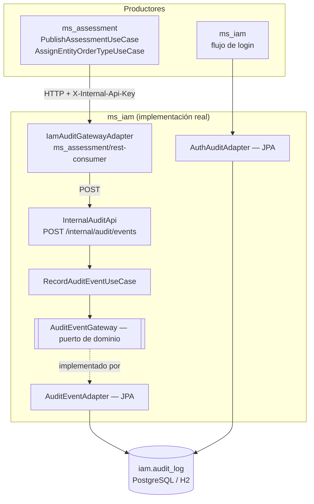
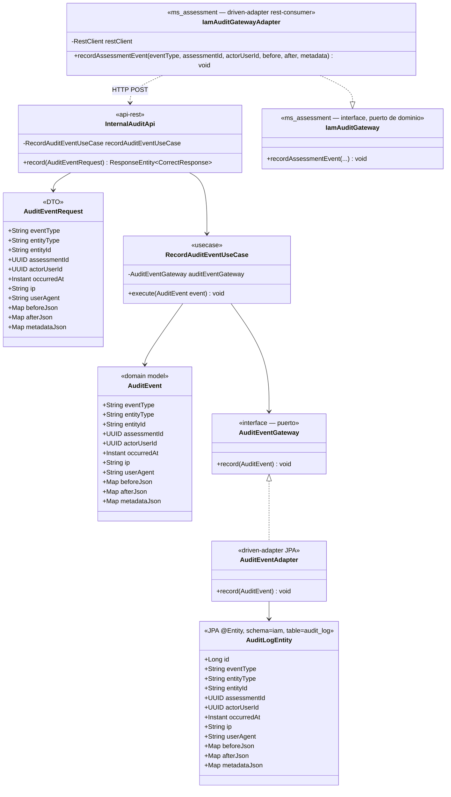
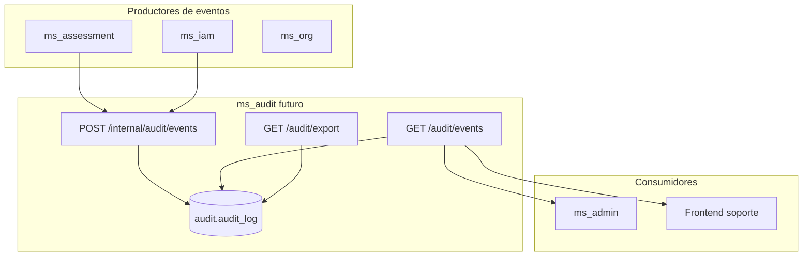
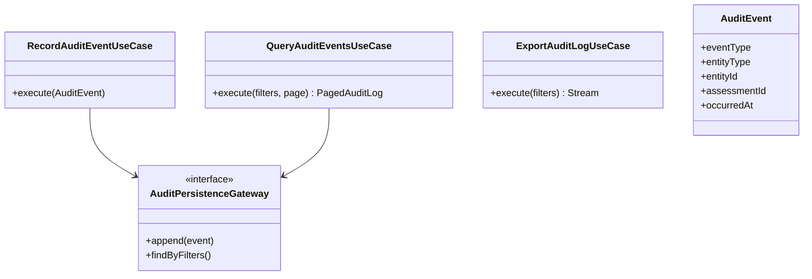

# ms_audit — Diseño

| Campo | Valor |
|---|---|
| Repositorio | `MSPI_NVA_CO_MR_BACK/ms_audit` |
| Fecha del documento | 2026-08-18 |
| Alcance | Arquitectura real del repositorio `ms_audit` (documental, no ejecutable), arquitectura actual de la funcionalidad de auditoría en `ms_iam`, y arquitectura objetivo planificada para `ms_audit` |

---

## 1. Arquitectura real de `ms_audit` (lo que existe hoy)

`ms_audit` **no tiene arquitectura de software** propia: no hay capas, módulos, ni patrón hexagonal/Clean Architecture que documentar porque no hay código. Su "arquitectura" real es puramente **documental**:

```
ms_audit/
├── README.md               → documento de estado + diagramas Mermaid de arquitectura actual/objetivo
├── .gitignore               → plantilla genérica sin personalizar (idéntica a otros repos del monorepo)
└── docs/
    ├── MIGRATION-NOTES.md   → guía de integración para equipos que consumen la auditoría del MVP
    └── openapi.yaml         → contrato OpenAPI de referencia, 100% marcado deprecated, que reenvía por externalDocs al contrato real de ms_iam
```

Esto contrasta con el resto del monorepo, donde cada microservicio (`ms_iam`, `ms_org`, `ms_catalog`, `ms_evidence`, `ms_assessment`, `ms_admin`) sigue una estructura Gradle multi-módulo con arquitectura hexagonal (`domain/model`, `domain/usecase`, `infrastructure/driven-adapters/*`, `infrastructure/entry-points/api-rest`, `applications/app-service`). `ms_audit` no reproduce ninguna de esas capas todavía.

## 2. Arquitectura real de la auditoría en el MVP (implementada en `ms_iam`)

Puesto que la responsabilidad funcional de auditoría **sí** está implementada — solo que en otro repositorio —, este documento describe su diseño real, por ser la base sobre la que se construirá `ms_audit`.

### 2.1 Diagrama de componentes — flujo de ingesta actual



### 2.2 Diagrama de clases — implementación real verificada en código



### 2.3 Modelo de datos real — `iam.audit_log`

```sql
CREATE TABLE IF NOT EXISTS iam.audit_log (
    id BIGSERIAL PRIMARY KEY,
    event_type VARCHAR(80) NOT NULL,
    entity_type VARCHAR(80) NOT NULL,
    entity_id VARCHAR(120) NOT NULL,
    assessment_id UUID,
    actor_user_id UUID REFERENCES iam."user"(id),
    occurred_at TIMESTAMPTZ NOT NULL DEFAULT CURRENT_TIMESTAMP,
    ip VARCHAR(64),
    user_agent VARCHAR(400),
    before_json JSONB,
    after_json JSONB,
    metadata_json JSONB
);

CREATE INDEX IF NOT EXISTS idx_audit_log_assessment_occurred ON iam.audit_log (assessment_id, occurred_at);
CREATE INDEX IF NOT EXISTS idx_audit_log_actor_occurred ON iam.audit_log (actor_user_id, occurred_at);
CREATE INDEX IF NOT EXISTS idx_audit_log_event_occurred ON iam.audit_log (event_type, occurred_at);
CREATE INDEX IF NOT EXISTS idx_audit_log_entity ON iam.audit_log (entity_type, entity_id);
```

Fuente: `ms_iam/applications/app-service/src/main/resources/schema-iam-mvp.sql`. Nótese que la tabla vive en el **esquema `iam`**, no en un esquema `audit` — la separación de esquema por microservicio (convención del resto del sistema) todavía no se aplicó a la auditoría porque el microservicio dueño de ese esquema (`ms_audit`) no existe.

`actor_user_id` tiene una **foreign key real** hacia `iam."user"(id)`, lo cual es una dependencia estructural adicional a resolver si la tabla se migra a un esquema/base de datos distinto: la migración no puede ser un simple `COPY`, requiere decidir si se preserva la integridad referencial cross-schema/cross-servicio o se relaja a un identificador sin FK.

## 3. Arquitectura objetivo — `ms_audit` (planificada, documentada en README)



Diseño objetivo de clases (README, diagrama 5):



Diferencias clave frente al diseño real actual de `ms_iam`:

| Aspecto | Actual (ms_iam) | Objetivo (ms_audit) |
|---|---|---|
| Esquema de BD | `iam.audit_log` | `audit.audit_log` (esquema propio, por convención del resto del sistema) |
| Casos de uso expuestos | Solo ingesta (`RecordAuditEventUseCase`) | Ingesta + consulta (`QueryAuditEventsUseCase`) + exportación (`ExportAuditLogUseCase`) |
| Puerto de persistencia | `AuditEventGateway` (solo `record()`) | `AuditPersistenceGateway` (`append()` + `findByFilters()`) — nombre y forma distintos, sugiere que no sería una simple copia del código existente |
| Acoplamiento con identidad | Fuertemente acoplado a `ms_iam` (mismo proceso, misma tabla que `iam.user` vía FK) | Desacoplado — dominio propio, sin FK directa a tablas de otro esquema (implícito, no confirmado explícitamente en la documentación) |

## 4. Diseño de API

### 4.1 API real hoy (implementada en ms_iam, referenciada por ms_audit)

El archivo `ms_audit/docs/openapi.yaml` **no define una API propia**: contiene un único path (`POST /internal/audit/events`) marcado `deprecated: true`, cuya descripción dice textualmente *"No expuesto por ms_audit"* y remite via `externalDocs` a `../ms_iam/docs/openapi.yaml`. Es, en efecto, un contrato de solo referencia/documentación cruzada, no un contrato a implementar en `ms_audit` tal cual está escrito.

Esquema `AuditEventRequest` copiado en `ms_audit/docs/openapi.yaml` (idéntico en forma al de `ms_iam`):

| Campo | Tipo | Obligatorio |
|---|---|---|
| `eventType` | string | Sí |
| `entityType` | string | Sí |
| `entityId` | string | Sí |
| `assessmentId` | string (uuid) | No |
| `actorUserId` | string (uuid) | No |
| `occurredAt` | string (date-time) | No |
| `ip` | string | No |
| `userAgent` | string | No |
| `beforeJson` | object | No |
| `afterJson` | object | No |
| `metadataJson` | object | No |

Seguridad: `internalApiKey` (`apiKey` en header `X-Internal-Api-Key`), igual que en `ms_iam`.

### 4.2 API objetivo (planificada, sin OpenAPI formalizado)

El README describe (sin un `openapi.yaml` objetivo todavía) tres endpoints previstos:

| Endpoint | Método | Estado de diseño |
|---|---|---|
| `/internal/audit/events` | `POST` | Contrato heredado de `ms_iam`, reutilizable tal cual |
| `/audit/events` | `GET` | Solo nombrado en diagramas; sin parámetros de query, códigos de respuesta ni esquema de paginación formalizados |
| `/audit/export` | `GET` | Solo nombrado en diagrama de arquitectura objetivo; sin formato de exportación (CSV/JSON/NDJSON), límites ni parámetros definidos |

## 5. Decisiones técnicas y de diseño

### 5.1 Centralización temporal en ms_iam (decisión ya tomada)

La decisión de **no** crear `ms_audit` para el MVP y en su lugar centralizar la auditoría en `ms_iam` está documentada como decisión explícita, no como omisión: el README dice *"En el MVP la auditoría está centralizada en ms_iam"* y el MER anota *"Auditoría central (ms_iam o servicio dedicado futuro)"*. Es una decisión de **alcance de MVP**, orientada a reducir el número de servicios a desplegar y coordinar en la primera entrega, aceptando el acoplamiento temporal entre auditoría e identidad como costo conocido.

### 5.2 Patrón best-effort en el productor (decisión ya tomada)

`IamAuditGatewayAdapter` decide explícitamente **no propagar errores** de auditoría hacia la capa de negocio de `ms_assessment`. Es una decisión de diseño consciente (documentada en `MIGRATION-NOTES.md`, sección 5) que prioriza la disponibilidad del flujo principal de negocio sobre la completitud garantizada de la bitácora, con el trade-off explícito de que pueden existir operaciones de negocio sin traza de auditoría asociada.

### 5.3 Migración vía dual-write en vez de corte directo (decisión planificada)

El plan de migración (`MIGRATION-NOTES.md`, sección 7) opta por una estrategia de *dual-write* o *feature flag* en lugar de una migración de corte directo (*big bang*), lo que reduce el riesgo de pérdida de eventos durante la transición a costa de mayor complejidad operativa temporal (dos destinos de escritura activos simultáneamente).

### 5.4 Contrato "congelado" como ancla de diseño (decisión implícita)

Al copiar el esquema `AuditEventRequest` textualmente en `ms_audit/docs/openapi.yaml` (aunque deprecado), el equipo dejó una referencia de diseño que ancla el contrato de ingesta futuro al actual, minimizando el riesgo de romper a los productores existentes (`ms_assessment`) cuando se implemente `ms_audit`. Es una decisión de compatibilidad hacia atrás tomada antes de escribir una sola línea de código del microservicio.

## 6. Riesgos de diseño identificados (no documentados explícitamente en el repositorio, pero derivables del análisis)

- La **foreign key** `actor_user_id → iam."user"(id)` en el modelo actual complica cualquier migración de `audit_log` a un esquema/base de datos separado sin antes decidir cómo se preservará (o no) esa relación.
- No hay definición de **formato de exportación** para `GET /audit/export`, lo que deja abierta una decisión de diseño relevante (streaming CSV vs. JSON paginado vs. archivo generado asíncronamente) antes de poder implementarlo.
- No hay definición de **política de retención**, mencionada como objetivo de negocio pero sin ningún parámetro (tiempo, mecanismo de purgado/archivado) que informe el diseño del modelo de datos objetivo (p. ej., si se necesitan particiones por fecha).
