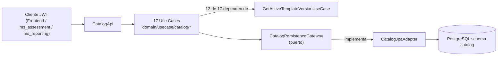

# ms_catalog — Análisis

| Campo | Valor |
|---|---|
| Repositorio | `MSPI_NVA_CO_MR_BACK/ms_catalog` |
| Fecha del documento | 2026-08-19 |
| Alcance | Requerimientos funcionales/no funcionales, reglas de negocio y actores del microservicio `ms_catalog`, derivados del código real (`domain/usecase`, `CatalogApi`, `schema.sql`, `docs/openapi.yaml`) |

---

## 1. Actores

| Actor | Tipo | Interacción |
|---|---|---|
| Frontend MSPI | Cliente HTTP autenticado (JWT) | Consume los 17 endpoints `GET /catalog/**` para poblar formularios de evaluación y administración del instrumento |
| `ms_assessment` | Microservicio cliente (JWT) | Consume plantilla activa, controles hoja, áreas, cargos, PHVA, madurez y NIST para crear/resolver evaluaciones |
| `ms_reporting` | Microservicio cliente (JWT) | Consume `scales/published` para reportes |
| Servicio interno S2S (autenticado con `X-Internal-Api-Key`) | Cliente técnico | Puede acceder a `/catalog/**` sin JWT de usuario mediante `InternalApiKeyFilter`, autenticándose como `ROLE_SERVICE` (ver §5, hallazgo de seguridad) |
| Keycloak (IdP, realm `iam`) | Proveedor de identidad | Emite y firma los JWT validados por `SecurityConfig` |

`ms_catalog` no modela actores de negocio con roles operativos propios (no hay `AdminSistema`, `Evaluador`, etc. en su código): cualquier portador de un JWT válido con `ROLE_USER` (rol siempre añadido por `SecurityConfig.jwtAuthenticationConverter`) puede leer el catálogo completo. No hay control de acceso diferenciado por rol dentro de `ms_catalog`.

## 2. Requerimientos funcionales

Derivados uno a uno de los 17 métodos de `CatalogApi` y sus casos de uso correspondientes en `domain/usecase/catalog/`:

| # | Requerimiento | Caso de uso | Endpoint |
|---|---|---|---|
| RF-01 | Listar tipos de orden territorial (Nacional, Territorial A/B/C) con su % de avance PHVA esperado | `GetEntityOrderTypesUseCase` | `GET /catalog/entity-order-types` |
| RF-02 | Obtener la versión de plantilla `PUBLISHED` más reciente | `GetActiveTemplateVersionUseCase` | `GET /catalog/template-versions/active` |
| RF-03 | Listar los 43 ítems del inventario documental de levantamiento, opcionalmente filtrados por `templateVersionId` | `GetLiftingDocumentItemsUseCase` | `GET /catalog/lifting-document-items` |
| RF-04 | Listar cargos responsables (steward roles) activos, ordenados | `GetStewardRolesUseCase` | `GET /catalog/steward-roles` |
| RF-05 | Listar los 14 dominios ISO 27001 activos, ordenados por posición de portada | `GetIsoDomainsUseCase` | `GET /catalog/iso-domains` |
| RF-06 | Listar áreas predefinidas de evaluación activas | `GetAssessmentAreaPresetsUseCase` | `GET /catalog/assessment-area-presets` |
| RF-07 | Listar controles hoja calificables (con código no vacío), filtrables por `controlType` (`ADMIN`/`TECH`) | `GetLeafControlCatalogUseCase` | `GET /catalog/control-catalog-leaves` |
| RF-08 | Listar el árbol completo de nodos de control (dominio → objetivo → control), filtrable por `controlType` | `GetControlCatalogTreeUseCase` | `GET /catalog/control-catalog-tree` |
| RF-09 | Listar reglas de validación por control hoja (evidencia/brecha/recomendación obligatorias, tipo y umbral de recomendación) | `GetControlRulesUseCase` | `GET /catalog/control-rules` |
| RF-10 | Obtener niveles y bandas de la escala de evaluación publicada, por `scaleVersionId` o por defecto la de la plantilla activa | `GetScalePublishedUseCase` | `GET /catalog/scales/published` |
| RF-11 | Listar mapeos control ISO ↔ subcategoría NIST CSF, opcionalmente filtrados por `controlNodeId` | `GetNistMappingsUseCase` | `GET /catalog/nist-mappings` |
| RF-12 | Listar ~17 requisitos del ciclo PHVA (Plan/Do/Check/Act) activos | `GetPhvaItemCatalogUseCase` | `GET /catalog/phva-items` |
| RF-13 | Obtener pesos y topes configurados por componente PHVA (JSON en `template_version`, con *fallback* 40/20/20/20) | `GetPhvaTemplateConfigUseCase` | `GET /catalog/phva-config` |
| RF-14 | Listar ~50 requisitos de madurez (Rn) activos, con sus umbrales por nivel 1–5 | `GetMaturityRequirementCatalogUseCase` | `GET /catalog/maturity-requirements` |
| RF-15 | Obtener umbrales SUFICIENTE/INTERMEDIO/CRÍTICO por nivel de madurez (JSON en `template_version`, con *fallback* embebido en código) | `GetMaturityTemplateConfigUseCase` | `GET /catalog/maturity-config` |
| RF-16 | Listar ~188 filas de la hoja Ciber (ítems NIST CSF por función/subcategoría) activas | `GetNistCiberItemCatalogUseCase` | `GET /catalog/nist-ciber-items` |
| RF-17 | Obtener metas por función NIST (ID/PR/DE/RS/RC) y valor ideal (JSON en `template_version`, con *fallback* 60% por función / 100 ideal) | `GetNistTemplateConfigUseCase` | `GET /catalog/nist-config` |

Todos los requerimientos son de **consulta (lectura)**; no existe ningún requerimiento funcional de creación, actualización o eliminación implementado como endpoint HTTP en este microservicio.

## 3. Reglas de negocio (evidenciadas en `domain/usecase`)

1. **Resolución de plantilla activa por defecto** — En 12 de los 17 casos de uso (todos excepto los 5 catálogos sin dependencia de plantilla: `entity-order-types`, `template-versions/active`, `steward-roles`, `iso-domains`, `assessment-area-presets`), si el parámetro `templateVersionId` no se envía, el caso de uso invoca internamente `GetActiveTemplateVersionUseCase.execute().getId()` para resolverlo. Ejemplo (`GetLeafControlCatalogUseCase`):
   ```java
   UUID versionId = templateVersionId != null
           ? templateVersionId
           : getActiveTemplateVersionUseCase.execute().getId();
   ```
2. **Filtrado condicional de controles hoja** — Si `controlType` es `null` o vacío, se listan todos los controles hoja calificables de la plantilla; si se especifica, se filtra por rama (`ADMIN`/`TECH`) vía un método de repositorio distinto (`findScoredLeafControlsByTemplateVersionIdAndControlType`).
3. **Solo controles "hoja" con código no vacío son calificables** — `CatalogJpaAdapter.findScoredLeafControlsByTemplateVersionId` filtra explícitamente `e.getCode() != null && !e.getCode().isBlank()` sobre nodos con `node_type = 'CONTROL'` y `is_scored = true`.
4. **Plantilla activa = última `PUBLISHED` por fecha de publicación** — `findActivePublishedTemplateVersion` usa `findFirstByStatusOrderByPublishedAtDesc('PUBLISHED')`; si no existe ninguna, el resultado es `Optional.empty()` y el endpoint `template-versions/active` responde `404` (regla documentada explícitamente en `openapi.yaml`).
5. **Configuración PHVA con valores por defecto** — Si `template_version.phva_weights`/`phva_caps` es `NULL` o vacío, se usan pesos por defecto `PLAN=40, DO=20, CHECK=20, ACT=20` (constante `DEFAULT_PHVA_COMPONENT_VALUES` en `CatalogJpaAdapter`).
6. **Umbrales de madurez con valores por defecto embebidos por nivel** — Si `maturity_crit_thresholds` es `NULL`, `CatalogJpaAdapter.defaultMaturityTemplateConfig()` aplica una tabla fija: nivel 1 → suficiente ≤3/intermedio ≤7; nivel 2 → ≤7/≤15; nivel 3 → ≤14/≤30; nivel 4 → ≤20/≤40; nivel 5 → ≤20/sin tope intermedio.
7. **Metas NIST con valor por defecto** — Si `nist_function_targets` es `NULL`, cada función (`ID`, `PR`, `DE`, `RS`, `RC`) recibe una meta por defecto de `60` y el valor `ideal` por defecto es `100`.
8. **Requisitos de madurez enriquecidos con sus umbrales** — `findMaturityRequirementsByTemplateVersionId` hace un segundo `IN` query (`findByRequirementIdInOrderByLevelAsc`) para traer los `MaturityThreshold` de todos los requisitos encontrados y los agrupa en memoria por `requirementId` antes de construir el dominio (evita el problema N+1 con un solo query adicional).
9. **Mapeos NIST enriquecidos con función y subcategoría** — `buildMappings` indexa en memoria todas las funciones y subcategorías (`indexFunctionsById`, `indexSubcategoriesById`) para resolver `functionCode`, `functionName`, `subcategoryCode` y `subcategoryDescription` sin hacer un `JOIN` SQL explícito (los repositorios Spring Data no exponen `JOIN FETCH` para estas relaciones).
10. **Parseo manual de columnas `JSONB`** — Las columnas JSON de `template_version` (`phva_weights`, `phva_caps`, `maturity_crit_thresholds`, `nist_function_targets`) se leen como `String` desde JPA y se parsean con un extractor de enteros hecho a mano (`extractJsonInt`, búsqueda de substring `"key":`) en lugar de un deserializador JSON completo (ver hallazgo en `04-Desarrollo.md`).

## 4. Requerimientos no funcionales

| # | Requerimiento | Evidencia |
|---|---|---|
| RNF-01 | Autenticación obligatoria por JWT (OAuth2 Resource Server) para todas las rutas `/catalog/**` | `SecurityConfig.securityFilterChain`: `.requestMatchers("/catalog/**").authenticated()` |
| RNF-02 | Sesión *stateless* (sin estado de sesión HTTP) | `SecurityConfig`: `sessionCreationPolicy(SessionCreationPolicy.STATELESS)` |
| RNF-03 | Cabeceras de seguridad HTTP: `X-Frame-Options: DENY`, HSTS (1 año, subdominios incluidos, *preload*) | `SecurityConfig.securityFilterChain` (`.headers(...)`) |
| RNF-04 | Trazabilidad de cada petición vía `X-Trace-Id` (propagado o generado) y logging de inicio/fin con método, ruta, estado y duración | `TraceIdFilter`, orden `HIGHEST_PRECEDENCE + 1` |
| RNF-05 | CORS configurable por variable de entorno `CORS_ALLOWED_ORIGINS` | `CorsConfig`, `application.yaml: cors.allowed-origins` |
| RNF-06 | *Health checks* públicos para orquestación de arranque (`/actuator/health`, `/actuator/info`) | `SecurityConfig.permitAll()`, `Dockerfile HEALTHCHECK` |
| RNF-07 | El microservicio no ejecuta DDL/DML de arranque; el esquema/datos son gestionados externamente | `application.yaml`: `spring.sql.init.mode: never`, `spring.jpa.hibernate.ddl-auto: none` |
| RNF-08 | Cobertura mínima de código del 80% (instrucciones) exigida por el build (`check` falla por debajo del umbral) | `main.gradle`: `jacocoTestCoverageVerification`, `minimum = 0.80` |
| RNF-09 | Trazabilidad de errores uniforme (`ErrorResponse` con `meta.traceId`) para toda excepción de dominio manejada | `GlobalExceptionHandler`, `ApiResponseMapper.error` |
| RNF-10 | El servicio corre en un contenedor no privilegiado (usuario `mspi`, no root) | `deployment/Dockerfile`: `addgroup -S mspi && adduser -S mspi -G mspi`, `USER mspi` |
| RNF-11 | Gestión de secretos externa (Infisical) para credenciales de base de datos y configuración sensible | `InfisicalConfig`, `DBCredentialConfig` (arranque falla si `DB_CREDENTIAL` no está presente) |

## 5. Hallazgo de seguridad: discrepancia README vs. código (`InternalApiKeyFilter`)

El `README.md` del microservicio declara explícitamente en su sección de Seguridad: **"Sin API interna ni API key en este MS"**. Sin embargo, el código de `applications/app-service/src/main/java/co/com/mspi/config/InternalApiKeyFilter.java` implementa un filtro (`OncePerRequestFilter`) registrado **antes** de `BearerTokenAuthenticationFilter` en la cadena de seguridad (`SecurityConfig.securityFilterChain`), que:

- Se activa solo si la cabecera `X-Internal-Api-Key` está presente (`shouldNotFilter` la deja pasar sin autenticar si está ausente o vacía).
- Si está presente y coincide con `InternalApiProperties.internalApiKey` (propiedad `internal-api.internal-api-key`, variable de entorno `INTERNAL_API_KEY`), autentica la petición como `ROLE_SERVICE` sin requerir JWT de usuario, dando acceso completo a `/catalog/**`.
- Si la clave está configurada pero no coincide, responde `401`; si no hay clave configurada en el servidor, responde `503`.

Esta capacidad de acceso S2S sin JWT de usuario **sí existe en el código desplegable**, aunque `INTERNAL_API_KEY` no está definida por defecto (`${INTERNAL_API_KEY:}` en `application.yaml`, valor vacío), por lo que en un despliegue sin esa variable configurada el filtro queda inactivo. Se documenta esta discrepancia entre README y código como hallazgo, sin asumir cuál de los dos es la intención vigente del equipo.

## 6. Casos de uso (resumen UML textual)

Todos los 17 casos de uso siguen el mismo patrón estructural: una clase con `@RequiredArgsConstructor` (Lombok), un método `execute(...)` que retorna directamente el modelo de dominio (lista o entidad), y dependencia inyectada de `CatalogPersistenceGateway` (puerto de dominio) más, en 12 de ellos, de `GetActiveTemplateVersionUseCase` para resolución de plantilla por defecto.



## 7. Ausencias explícitas de requerimientos

- No hay requerimientos de **escritura/administración del catálogo** implementados como API HTTP: la carga y actualización del instrumento se realiza exclusivamente por scripts SQL (`schema.sql`, `data.sql`, `nist_ciber_data.sql`, `maturity_data.sql`, más el script auxiliar `gen_maturity_seeds.py`), no por casos de uso de dominio.
- No hay requerimientos de **versionado múltiple simultáneo**: aunque el modelo de datos soporta múltiples `template_version` por `template`, la API solo expone la resolución de la versión `PUBLISHED` más reciente; no hay endpoint para listar todas las versiones ni su historial.
- No hay requerimientos de **paginación** en ningún endpoint (todas las listas se devuelven completas), consistente con el volumen relativamente acotado de datos paramétricos (decenas a un par de cientos de filas por tabla).
- No hay requerimientos de **caché** (ver `04-Desarrollo.md`): cada petición ejecuta consultas JPA directas.
