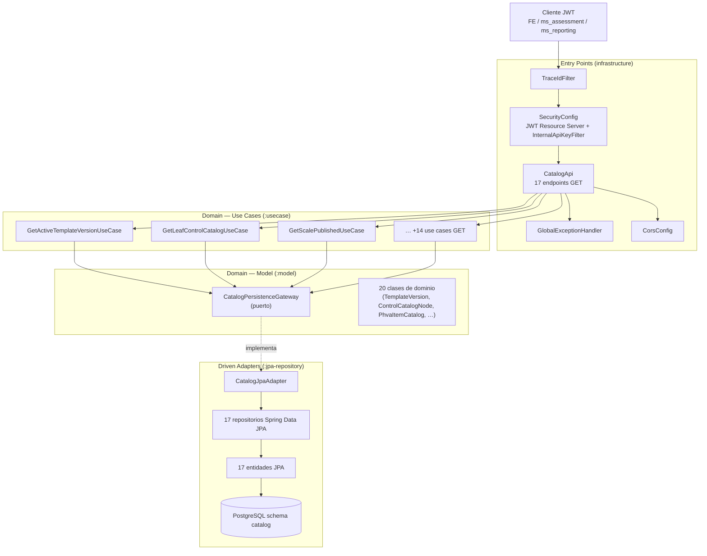
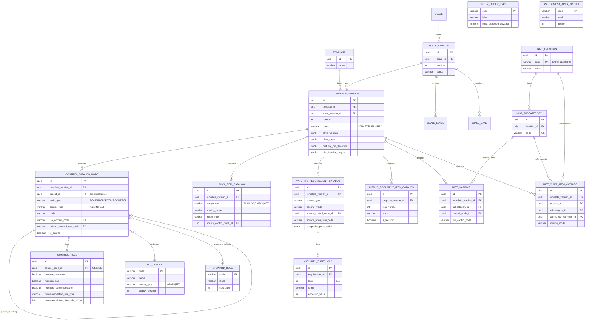
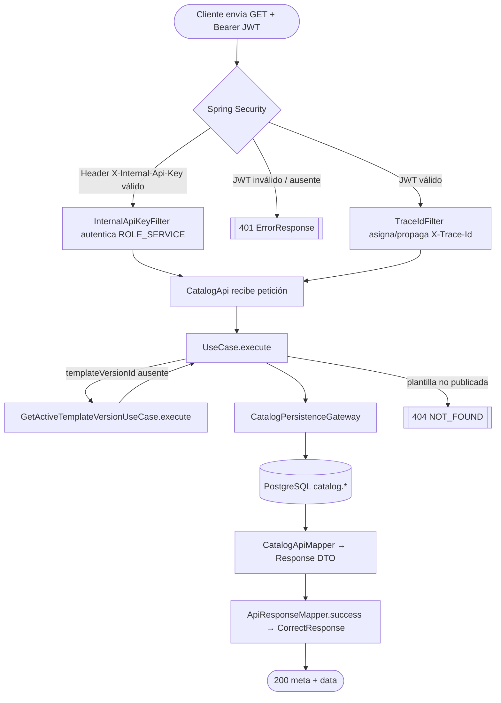

# ms_catalog — Diseño

| Campo | Valor |
|---|---|
| Repositorio | `MSPI_NVA_CO_MR_BACK/ms_catalog` |
| Fecha del documento | 2026-08-19 |
| Alcance | Arquitectura, estructura de paquetes, modelo de datos y diseño de API del microservicio `ms_catalog` |

---

## 1. Arquitectura general

`ms_catalog` implementa **arquitectura hexagonal** (Clean Architecture, aplicada por convención de carpetas, sin plugin generador) mediante 6 módulos Gradle. El dominio (`domain/model`, `domain/usecase`) no tiene dependencias de Spring, JPA ni de ningún framework: `domain/model/build.gradle` declara `dependencies {}` vacío.



## 2. Estructura real de paquetes

```
ms_catalog/
├── applications/app-service/                          → :app-service (ejecutable Spring Boot)
│   └── src/main/java/co/com/mspi/
│       ├── MainApplication.java
│       └── config/
│           ├── CorsProperties.java
│           ├── DBCredential.java              (parseo DB_CREDENTIAL JSON)
│           ├── DBCredentialConfig.java        (bean DBSecret, exige DB_CREDENTIAL)
│           ├── InfisicalConfig.java           (BeanFactoryPostProcessor, carga secretos)
│           ├── InternalApiKeyFilter.java      (autenticación S2S por API key)
│           ├── InternalApiProperties.java
│           ├── JacksonConfig.java
│           ├── JwtResourceServerProperties.java
│           ├── SecurityConfig.java            (JWT Resource Server, roles realm_access)
│           └── UseCaseConfig.java             (wiring manual de los 17 @Bean use case)
│   └── src/main/resources/
│       ├── application.yaml
│       ├── schema.sql            (297 líneas, DDL de referencia — no ejecutado en runtime)
│       ├── data.sql              (824 líneas, seeds del instrumento)
│       ├── nist_ciber_data.sql   (58 líneas, hoja Ciber)
│       ├── maturity_data.sql     (328 líneas, requisitos de madurez)
│       └── gen_maturity_seeds.py (script auxiliar de generación de seeds)
│
├── domain/model/                                       → :model (sin dependencias)
│   └── src/main/java/co/com/mspi/model/
│       ├── catalog/    (20 clases: TemplateVersion, ControlCatalogNode, ControlCatalogLeaf,
│       │                ControlRule, PhvaItemCatalog, PhvaTemplateConfig, MaturityRequirementCatalog,
│       │                MaturityThreshold, MaturityTemplateConfig, NistFunction, NistSubcategory,
│       │                NistMapping, NistCiberItemCatalog, NistTemplateConfig, ScaleLevel, ScaleBand,
│       │                EntityOrderType, IsoDomain, StewardRole, AssessmentAreaPreset, LiftingDocumentItem,
│       │                EntityOrderType, TemplateVersion)
│       └── gateway/    CatalogPersistenceGateway.java (puerto, 26 métodos de consulta)
│
├── domain/usecase/                                     → :usecase (depende de :model, :common)
│   └── src/main/java/co/com/mspi/usecase/catalog/  (17 clases Get*UseCase)
│
├── infrastructure/helpers/common/                      → :common (compartido con otros MS)
│   └── src/main/java/co/com/mspi/common/
│       ├── CommonErrorConstants.java
│       ├── dto/         (CorrectResponse, ErrorResponse, ErrorDetail, Meta)
│       ├── exception/   (DomainException, BusinessRulesOnFieldsException, ResourceNotFoundException,
│       │                 IamServiceException, UserAlreadyExistsException — estas dos últimas sin uso real en ms_catalog)
│       └── mapper/      ApiResponseMapper.java
│
├── infrastructure/driven-adapters/jpa-repository/      → :jpa-repository
│   └── src/main/java/co/com/mspi/jpa/
│       ├── adapter/CatalogJpaAdapter.java   (implementa CatalogPersistenceGateway, 26 métodos)
│       ├── config/{DBSecret, JpaConfig}.java
│       ├── entity/      (17 entidades JPA, sufijo *Entity)
│       └── repository/  (17 interfaces Spring Data JpaRepository)
│
└── infrastructure/entry-points/api-rest/               → :api-rest
    └── src/main/java/co/com/mspi/api/
        ├── catalog/CatalogApi.java          (@RestController, 17 métodos @GetMapping)
        ├── catalog/dto/                     (17 clases *Response)
        ├── catalog/mapper/CatalogApiMapper.java
        ├── config/{CorsConfig, TraceIdFilter}.java
        └── exception/GlobalExceptionHandler.java
```

## 3. Modelo de datos (PostgreSQL, schema `catalog`)

Extraído de `applications/app-service/src/main/resources/schema.sql` (DDL de referencia; el servicio no ejecuta DDL en runtime).



Notas de diseño de datos observadas directamente en `schema.sql`:

- **Configuración embebida como JSONB** en `template_version` (`phva_weights`, `phva_caps`, `maturity_crit_thresholds`, `nist_function_targets`) evita tablas de configuración adicionales, a costa de requerir parseo manual en la capa de adaptador (ver `04-Desarrollo.md`, §3).
- **`control_catalog_node` es un árbol autorreferenciado** (`parent_id → id`, `ON DELETE CASCADE`) que modela dominio → objetivo → control en una sola tabla, distinguido por `node_type`.
- **Restricciones `CHECK` de integridad de negocio** explícitas: `maturity_threshold.level BETWEEN 1 AND 5` y `chk_maturity_threshold_na_value` (si `is_na = TRUE` entonces `expected_value` debe ser `NULL`, y viceversa).
- **Migraciones aditivas in-line**: el propio `schema.sql` contiene sentencias `ALTER TABLE ... ADD COLUMN IF NOT EXISTS` y `UPDATE` de datos de reclasificación (p. ej. asignación de `control_type`/`display_position` a los 14 dominios ISO existentes), indicando que el archivo se usó también como script de migración incremental además de DDL inicial.
- Todas las tablas de catálogo raíz (`entity_order_type`, `steward_role`, `assessment_area_preset`, `iso_domain`) usan **código legible como llave primaria** (`VARCHAR`) en vez de `UUID`, mientras que las tablas dependientes de una versión de plantilla (controles, PHVA, madurez, NIST) usan `UUID`.

## 4. Diseño de API (openapi.yaml)

- **Especificación**: OpenAPI 3.1.0, `docs/openapi.yaml` (1099 líneas), título "MsCatalog - Catálogos MSPI", servidor de desarrollo `http://localhost:8085`.
- **Convención de respuesta uniforme**: todo `200` exitoso usa el esquema `CorrectResponse<T>` con `meta.traceId`, `meta.timestamp` y `data`; todo error usa `ErrorResponse` con `meta` y una lista `error[]` de `ErrorDetail{code, message}`.
- **7 tags** que agrupan los 17 endpoints por dominio funcional: `catalog-core`, `catalog-controls`, `catalog-phva`, `catalog-maturity`, `catalog-nist`, `catalog-scale`, `technical`.
- **Seguridad global**: `security: [bearerAuth: []]` a nivel de documento; cada operación documenta explícitamente el código `401` vía `$ref: '#/components/responses/Unauthorized'`.
- **Parámetros reutilizables** (`components/parameters`): `templateVersionId` (query, opcional, UUID) y `controlType` (query, opcional, `ADMIN`/`TECH`), referenciados por múltiples operaciones para evitar duplicación.
- **Ejemplos por operación**: cada respuesta exitosa referencia un ejemplo concreto en `components/examples` (p. ej. `SuccessEntityOrderTypes`, `SuccessActiveTemplateVersion`), documentado para explorarse interactivamente en Swagger UI.
- **Códigos de estado usados**: `200` (éxito), `401` (JWT ausente/inválido, todas las operaciones), `404` (solo en `template-versions/active`, cuando no hay plantilla `PUBLISHED`). No se documentan `400`/`422` de validación de parámetros (los parámetros opcionales no tienen validación explícita en la capa API más allá del tipo `UUID` de Spring MVC, que rechaza con `400` genérico si el valor no es un UUID válido).

## 5. Flujo de proceso — consulta de catálogo



## 6. Decisiones técnicas observadas

| Decisión | Evidencia | Comentario |
|---|---|---|
| Wiring manual de casos de uso vía `@Bean` (`UseCaseConfig`) en vez de `@Component`/`@Service` en el propio caso de uso | `UseCaseConfig.java`, 16 métodos `@Bean` | Mantiene `domain/usecase` sin anotaciones de Spring, preservando la independencia de framework del dominio |
| DTOs de entrada/salida separados de las entidades de dominio | `infrastructure/entry-points/api-rest/.../dto/*Response.java`, `CatalogApiMapper` | Evita fugas del modelo de persistencia hacia el contrato HTTP |
| Repositorios Spring Data JPA con *query methods* derivados del nombre (sin `@Query` JPQL explícitas observadas) | `EntityOrderTypeRepository.findByActiveTrueOrderByPositionAsc()`, etc. | Legible pero implica varias consultas separadas + ensamblado en memoria para relaciones (ver regla de negocio #9 en `02-Analisis.md`) |
| Sin caché (Redis u otro) | Confirmado en `README.md` ("Caché: no hay Redis; lectura directa JPA") y ausencia de dependencias de caché en todos los `build.gradle` | Cada petición ejecuta consultas directas a PostgreSQL; aceptable dado el volumen acotado de datos paramétricos |
| Sin mensajería (RabbitMQ/Kafka) | Confirmado en `README.md` ("No aplica") y ausencia de dependencias de mensajería | El catálogo se consume exclusivamente por HTTP síncrono |
| Filtro de API key interna (`InternalApiKeyFilter`) antepuesto al filtro Bearer JWT | `SecurityConfig.securityFilterChain`: `.addFilterBefore(internalApiKeyFilter, BearerTokenAuthenticationFilter.class)` | Provee una vía S2S alterna no documentada en `README.md` (ver hallazgo en `02-Analisis.md` §5) |
| Persistencia de configuración variable como `JSONB` string parseado manualmente | `CatalogJpaAdapter.extractJsonInt`, `parsePhvaJson`, `parseStringListJson` | Evita mapear un objeto JSON tipado con Jackson/Hibernate Types; funcional pero fràgil ante cambios de formato del JSON (ver `04-Desarrollo.md`) |

## 7. Ausencias explícitas de diseño

- No hay diagrama de despliegue formal (`*.drawio`, `*.puml`) dentro de `ms_catalog/docs/`; solo `openapi.yaml` y `MVP-MSPI-CONTRATOS-Y-MER.md` (este último centrado en el contrato `ms_iam`↔`ms_org`, no en `ms_catalog`).
- No se encontró un diagrama de secuencia o contrato formal `ms_assessment ↔ ms_catalog` más allá de lo inferible del propio `openapi.yaml` y las referencias a HU en comentarios de código.
- No hay versión de API en la ruta (`/catalog/...` sin prefijo `/v1`); el versionado de contenido se resuelve por `templateVersionId`, no por versión de API HTTP.
