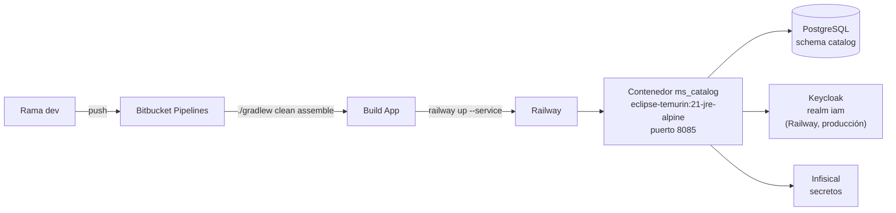

# ms_catalog — Implementación y Despliegue

| Campo | Valor |
|---|---|
| Repositorio | `MSPI_NVA_CO_MR_BACK/ms_catalog` |
| Fecha del documento | 2026-08-19 |
| Alcance | Build, contenerización, variables de entorno, CI/CD e infraestructura real del microservicio `ms_catalog` |

---

## 1. Build local

```bash
# Desde la raíz de ms_catalog
./gradlew.bat :app-service:compileJava
./gradlew.bat test
./gradlew.bat :app-service:bootRun
```

Requisitos previos documentados en `README.md`:

1. PostgreSQL con schema `catalog` (DDL de referencia en `applications/app-service/src/main/resources/schema.sql`; seeds en `data.sql`, `nist_ciber_data.sql`, `maturity_data.sql` — **no se ejecutan automáticamente**, deben aplicarse manualmente porque `spring.sql.init.mode: never`).
2. Keycloak accesible con `JWT_ISSUER_URI` configurado (o valor por defecto apuntando a la instancia de Railway de producción, ver `04-Desarrollo.md` §7).
3. Un `DB_CREDENTIAL` resoluble (directamente por variable de entorno o vía Infisical), sin el cual `DBCredentialConfig` impide el arranque.
4. Token JWT válido para invocar `/catalog/**`.

`settings.gradle` fija `rootProject.name = 'MsCatalog'` y usa **build cache local** (`buildCache { local { directory = new File(rootDir, 'build-cache') } }`), además del *toolchain resolver* `org.gradle.toolchains.foojay-resolver-convention` para resolver automáticamente el JDK 21 si no está instalado.

## 2. Contenerización (`deployment/Dockerfile`)

Build multi-stage:

```dockerfile
# Etapa 1 — build
FROM eclipse-temurin:21-jdk-alpine AS build
WORKDIR /workspace
RUN apk add --no-cache bash
COPY gradlew gradlew.bat settings.gradle main.gradle build.gradle ./
COPY gradle gradle
COPY applications applications
COPY domain domain
COPY infrastructure infrastructure
RUN sed -i 's/\r$//' gradlew && chmod +x gradlew && ./gradlew :app-service:bootJar -x test --no-daemon

# Etapa 2 — runtime
FROM eclipse-temurin:21-jre-alpine
RUN apk add --no-cache wget \
 && addgroup -S mspi && adduser -S mspi -G mspi
WORKDIR /app
COPY --from=build /workspace/applications/app-service/build/libs/*.jar /app/app.jar
RUN chown mspi:mspi /app/app.jar
USER mspi
EXPOSE 8085
ENV SERVER_PORT=8085 \
    JAVA_OPTS="-XX:+UseContainerSupport -XX:MaxRAMPercentage=75.0 -Djava.security.egd=file:/dev/./urandom"
HEALTHCHECK --interval=30s --timeout=5s --start-period=90s --retries=3 \
  CMD wget -qO- "http://127.0.0.1:${SERVER_PORT}/actuator/health" || exit 1
ENTRYPOINT ["sh", "-c", "exec java $JAVA_OPTS -jar /app/app.jar"]
```

Puntos clave verificados en el propio archivo:

- **Imagen base Alpine** (`eclipse-temurin:21-jdk-alpine` / `-jre-alpine`), minimizando tamaño de imagen.
- **El build ejecuta `bootJar -x test`**: las pruebas **no se ejecutan durante la construcción de la imagen Docker**, consistente con la ausencia de una etapa `test`/`check` también en el pipeline de CI (ver §4).
- **Usuario no root** (`mspi`) para ejecución del proceso Java, buena práctica de hardening de contenedor.
- **`bootJar.archiveFileName`** en `app-service/build.gradle` se fija a `"${project.getParent().getName()}.${archiveExtension.get()}"` (es decir, el nombre del `rootProject`, `MsCatalog.jar`), y el `jar` plano queda deshabilitado (`jar { enabled = false }`), dejando solo el *fat jar* ejecutable de Spring Boot.
- **`HEALTHCHECK`** apunta a `/actuator/health` (endpoint público, sin autenticación) con periodo de gracia de arranque de 90s.
- **Variables de JVM contenerizada**: `-XX:+UseContainerSupport -XX:MaxRAMPercentage=75.0`, respetando los límites de memoria del contenedor en vez de una heredada de la máquina host.
- Comando de referencia documentado en la primera línea del Dockerfile: `docker build -f deployment/Dockerfile -t mspi/ms-catalog:dev .`

## 3. Variables de entorno

| Variable | Obligatoria | Descripción | Evidencia |
|---|---|---|---|
| `SERVER_PORT` | No (default `8085`) | Puerto HTTP | `application.yaml`, `Dockerfile ENV` |
| `JWT_ISSUER_URI` | Recomendada en prod (tiene default de Railway) | Issuer Keycloak realm `iam` | `application.yaml` |
| `JWT_JWK_SET_URI` | No (default vacío) | Si se define, se usa en vez de resolver el JWK set desde el issuer | `SecurityConfig.jwtDecoder()` |
| `CORS_ALLOWED_ORIGINS` | Sí (sin default) | Orígenes CORS separados por coma | `application.yaml: cors.allowed-origins: ${CORS_ALLOWED_ORIGINS}` (sin valor por defecto, por lo que su ausencia produce una propiedad no resuelta) |
| `INTERNAL_API_KEY` | No (default vacío) | Clave compartida para autenticación S2S vía `X-Internal-Api-Key` (ver hallazgo de seguridad en `02-Analisis.md` §5) | `application.yaml`, `InternalApiKeyFilter` |
| `INFISICAL_SITE_URL`, `INFISICAL_PROJECT_ID`, `INFISICAL_ENVIRONMENT`, `INFISICAL_CLIENT_ID`/`INFISICAL_CLIENT_SECRET` (o `INFISICAL_ACCESS_TOKEN`), `INFISICAL_SECRET_PATH` | Sí en prod para poblar secretos (opcional si se inyectan directamente) | Cliente Infisical para secretos, incluido `DB_CREDENTIAL` | `InfisicalConfig.java` |
| `DB_CREDENTIAL` | **Sí, sin fallback** | JSON `{dbHost, dbPort, dbName, dbUsername, dbPassword, ...}` — la aplicación no arranca sin él | `DBCredentialConfig.java` |

## 4. CI/CD (`bitbucket-pipelines.yml`)

```yaml
image: amazoncorretto:21

pipelines:
  branches:
    dev:
      - step: *build_app       # ./gradlew clean assemble
      - step: *deploy_railway  # railway up --service "$RAILWAY_SERVICE" --ci
```

- **Imagen de CI**: `amazoncorretto:21` (distinta de la imagen de runtime del Dockerfile, que es `eclipse-temurin`; ambas son JDK 21 pero de distribuciones distintas — Amazon Corretto en CI vs. Eclipse Temurin en el contenedor final).
- **Único paso de build**: `./gradlew clean assemble` — **no ejecuta `test` ni `check`**, por lo que el pipeline actual **no falla ante pruebas rotas ni ante cobertura insuficiente** (coherente con el hallazgo de `05-Pruebas.md` de que el módulo `:usecase`, sin exclusiones de JaCoCo, no tiene pruebas propias: si `check` se ejecutara, probablemente fallaría).
- **Caché de Gradle** declarada (`~/.gradle/caches`) para acelerar builds sucesivos.
- **Despliegue a Railway**: instala la CLI de Railway (`curl -fsSL https://railway.app/install.sh | sh`) y ejecuta `railway up --service "$RAILWAY_SERVICE" --ci`, validando previamente la presencia de `RAILWAY_TOKEN` y `RAILWAY_SERVICE` como variables de pipeline (falla explícitamente con mensaje si faltan).
- **Único ambiente de pipeline definido**: rama `dev` → build + deploy. No hay pipeline para `main`/`master` ni para *pull requests* en el archivo actual.
- El paso de build publica artefactos (`build/libs/**`, `build/reports/**`, `applications/**/build/libs/**`), aunque sin una etapa posterior que los consuma (p. ej. publicación a SonarQube), pese a que `build.gradle` raíz sí tiene el plugin `org.sonarqube` configurado con propiedades completas (`sonar.sources`, `sonar.tests`, `sonar.coverage.jacoco.xmlReportPaths`, `sonar.pitest.reportPaths`).

## 5. Infraestructura de despliegue



- **Plataforma de despliegue**: Railway (confirmado por `bitbucket-pipelines.yml` y por el valor por defecto de `JWT_ISSUER_URI` que apunta a `https://keycloak-production-4a95.up.railway.app/realms/iam`).
- **Orquestación local** (fuera del propio repositorio de `ms_catalog`): `docker-config/docker/docker-compose.apps.yml` en la raíz del repositorio contenedor `MSPI_NVA_CO_MR_BACK`, que agrupa todos los microservicios MSPI, incluido Keycloak como *Identity Provider*.
- **Sin orquestador Kubernetes** evidenciado (no hay manifiestos `*.yaml` de Kubernetes ni Helm charts en el repositorio de `ms_catalog`).

## 6. Ausencias explícitas de implementación/despliegue

- No hay pipeline de CI para ramas distintas de `dev` (no se evidencia despliegue a un ambiente de producción separado dentro de este repositorio).
- No hay ejecución de pruebas (`test`/`check`) ni de análisis SonarQube dentro del pipeline actual, pese a que ambos están configurados a nivel de Gradle.
- No se encontró documentación de *rollback* o estrategia de *blue-green*/canary para el despliegue en Railway.
- No hay `docker-compose.yml` propio dentro de `ms_catalog/`; la orquestación local depende del `docker-config/` del repositorio raíz, fuera del alcance de este análisis específico de microservicio.
