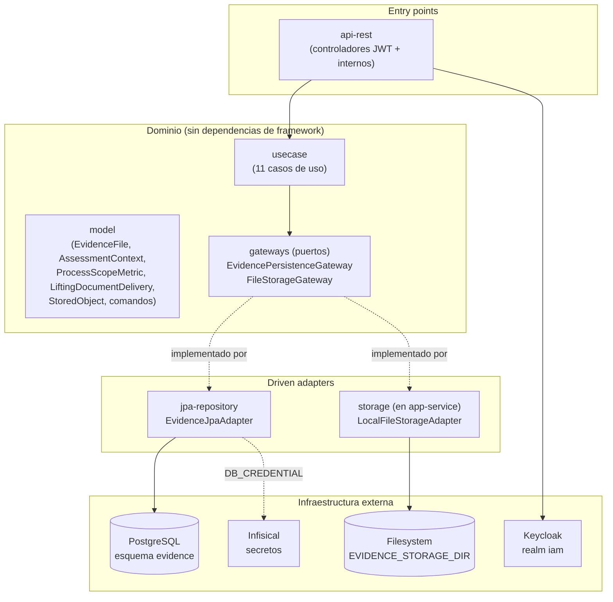
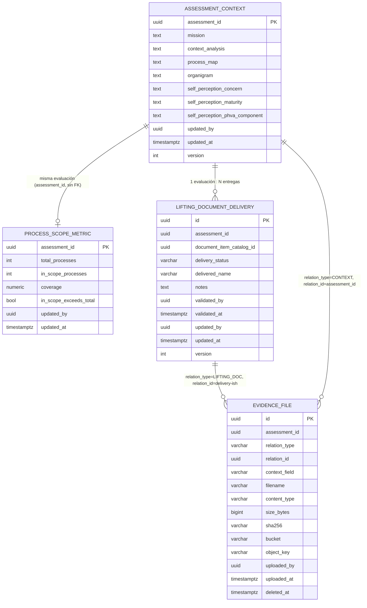
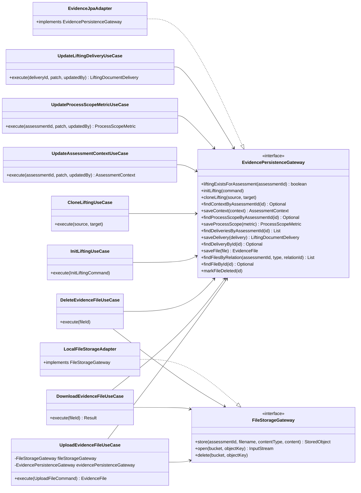
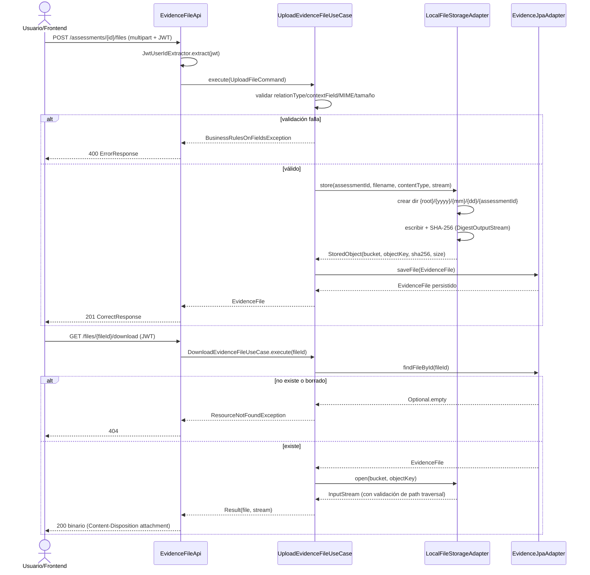

# ms_evidence — Diseño

| Campo | Valor |
|---|---|
| Repositorio | `MSPI_NVA_CO_MR_BACK/ms_evidence` |
| Fecha del documento | 2026-08-19 |
| Alcance | Arquitectura, estructura de paquetes, modelo de datos, diseño de API y decisiones técnicas reales de `ms_evidence` |

---

## 1. Arquitectura general

`ms_evidence` sigue **arquitectura hexagonal** (Clean Architecture) aplicada por convención de carpetas Gradle multi-módulo, sin plugin de generación automática:



Principio observado: `domain/model` y `domain/usecase` **no dependen de Spring ni de JPA** (`domain/usecase/build.gradle` solo declara `project(':model')` y `project(':common')`). Los casos de uso reciben sus gateways por constructor (`@RequiredArgsConstructor`) y se instancian como beans explícitos en `UseCaseConfig` (`applications/app-service`), no mediante *component scanning* de las clases de `usecase` — es Spring quien las conecta desde `app-service`, no al revés.

## 2. Estructura real de paquetes

```
ms_evidence/
├── applications/app-service/
│   └── src/main/java/co/com/mspi/
│       ├── MainApplication.java
│       ├── config/            (SecurityConfig, InternalApiKeyFilter, UseCaseConfig,
│       │                        DBCredentialConfig, InfisicalConfig, JacksonConfig,
│       │                        CorsProperties, InternalApiProperties, JwtResourceServerProperties)
│       └── storage/           (LocalFileStorageAdapter, FileStorageProperties)  ← adaptador de archivos
├── domain/
│   ├── model/src/main/java/co/com/mspi/model/
│   │   ├── evidence/  (EvidenceFile, AssessmentContext, ProcessScopeMetric,
│   │   │               LiftingDocumentDelivery, StoredObject, InitLiftingCommand,
│   │   │               UploadFileCommand)
│   │   └── gateway/   (EvidencePersistenceGateway, FileStorageGateway)
│   └── usecase/src/main/java/co/com/mspi/usecase/evidence/
│       (CloneLiftingUseCase, DeleteEvidenceFileUseCase, DownloadEvidenceFileUseCase,
│        GetAssessmentContextUseCase, GetLiftingDeliveriesUseCase, GetProcessScopeMetricUseCase,
│        InitLiftingUseCase, ListEvidenceFilesUseCase, UpdateAssessmentContextUseCase,
│        UpdateLiftingDeliveryUseCase, UpdateProcessScopeMetricUseCase, UploadEvidenceFileUseCase)
├── infrastructure/
│   ├── driven-adapters/jpa-repository/src/main/java/co/com/mspi/jpa/
│   │   ├── adapter/EvidenceJpaAdapter.java   (única implementación de EvidencePersistenceGateway)
│   │   ├── config/ (DBSecret, JpaConfig)
│   │   ├── entity/ (AssessmentContextEntity, EvidenceFileEntity,
│   │   │            LiftingDocumentDeliveryEntity, ProcessScopeMetricEntity)
│   │   └── repository/ (4 interfaces Spring Data JPA)
│   ├── entry-points/api-rest/src/main/java/co/com/mspi/api/
│   │   ├── evidence/  (AssessmentContextApi, EvidenceFileApi, LiftingDeliveryApi,
│   │   │               ProcessScopeApi, JwtUserIdExtractor, dto/, mapper/EvidenceApiMapper)
│   │   ├── internal/  (InternalAssessmentContextApi, InternalFileDownloadApi,
│   │   │               InternalLiftingApi, InternalReportOutputApi, dto/InitLiftingRequest)
│   │   ├── config/    (CorsConfig, TraceIdFilter)
│   │   └── exception/GlobalExceptionHandler
│   └── helpers/common/src/main/java/co/com/mspi/common/
│       (CommonErrorConstants, dto/{CorrectResponse,ErrorResponse,ErrorDetail,Meta},
│        exception/{DomainException,BusinessRulesOnFieldsException,ResourceNotFoundException,
│        IamServiceException,UserAlreadyExistsException}, mapper/ApiResponseMapper)
└── docs/ (openapi.yaml, MVP-MSPI-CONTRATOS-Y-MER.md)
```

Nota de diseño real: `IamServiceException` y `UserAlreadyExistsException` están presentes en `:common` (compartido entre microservicios del repositorio) pero **no se usan en el código propio de `ms_evidence`** — son residuo de la plantilla común replicada desde `ms_iam`/`ms_org`. El `GlobalExceptionHandler` los maneja igualmente (por si algún flujo futuro los lanza), lo cual se declara aquí como observación, no como funcionalidad activa.

## 3. Modelo de datos (esquema `evidence`, PostgreSQL)



Detalles reales del `schema.sql`:

- `assessment_id` **no tiene llave foránea** hacia `ms_assessment` (esquema separado, sin FK cross-schema) — es un simple `UUID` correlacionado por convención.
- `lifting_document_delivery` tiene restricción única `(assessment_id, document_item_catalog_id)`, evitando duplicar entregas para el mismo ítem de catálogo en la misma evaluación.
- Índices: `idx_lifting_delivery_assessment`, `idx_lifting_delivery_status` (compuesto `assessment_id, delivery_status`), `idx_evidence_file_assessment`, `idx_evidence_file_relation` (compuesto `assessment_id, relation_type, relation_id`), `idx_evidence_file_context` (compuesto `assessment_id, relation_type, context_field`).
- `evidence_file.deleted_at` implementa borrado lógico; todas las consultas de listado/descarga en `EvidenceJpaAdapter` filtran explícitamente `deletedAt == null` o usan métodos de repositorio con sufijo `AndDeletedAtIsNull`.
- El servicio **no ejecuta DDL** (`spring.sql.init.mode: never`, `hibernate.ddl-auto: none`): `schema.sql` es de referencia/documentación y se aplica externamente (scripts de `docker-config/docker/postgres`).

## 4. Diagrama de clases (dominio y casos de uso)



## 5. Flujo de proceso — subir y descargar evidencia



## 6. Diseño de API (`docs/openapi.yaml`, OpenAPI 3.1.0, 1107 líneas)

- **Info**: `MsEvidence - Evidencias y contexto`, versión `1.0.0`. Servidor de desarrollo `http://localhost:8086`.
- **Seguridad global**: `bearerAuth` (JWT) por defecto; las rutas `/internal/**` documentan su propio esquema de API key en la descripción de cada operación.
- **Tags**: `assessment-context`, `process-scope`, `lifting-delivery`, `evidence-files`, `internal`, `technical`.
- **Convención de respuesta**: envoltorio `CorrectResponse` (éxito) / `ErrorResponse` (error) con `Meta` (traceId, timestamp), igual al patrón usado en `ms_iam`/`ms_org` (`infrastructure/helpers/common`). Las descargas de archivo son la única excepción: devuelven el binario directamente, sin envoltorio JSON.
- **Ejemplos**: cada operación referencia `components/examples` reutilizables (p. ej. `SuccessAssessmentContext`, `SuccessProcessScope`), consumibles desde Swagger UI.
- **Rutas públicas (JWT)**: `GET/PATCH /assessments/{assessmentId}/context`, `GET/PATCH /assessments/{assessmentId}/process-scope-metric`, `GET /assessments/{assessmentId}/lifting-document-deliveries`, `PATCH /lifting-document-deliveries/{deliveryId}`, `POST/GET /assessments/{assessmentId}/files`, `GET /files/{fileId}/download`, `DELETE /files/{fileId}`.
- **Rutas internas (`X-Internal-Api-Key`)**: `POST /internal/assessments/{assessmentId}/lifting/init`, `POST /internal/assessments/{sourceAssessmentId}/lifting/clone/{targetAssessmentId}`, `GET /internal/assessments/{assessmentId}/evidence-files`, `GET /internal/assessments/{assessmentId}/context`, `GET /internal/files/{fileId}/download`, `POST /internal/assessments/{assessmentId}/report-outputs`.

## 7. Decisiones técnicas relevantes

| Decisión | Justificación observada en el código |
|---|---|
| Almacenamiento de archivos en filesystem local (no S3/object storage) | `FileStorageGateway` es el único puerto de abstracción; su única implementación real es `LocalFileStorageAdapter`, que escribe bajo un directorio raíz configurable (`EVIDENCE_STORAGE_DIR`). No hay dependencia de AWS SDK, MinIO ni cliente S3 en ningún `build.gradle` del proyecto. El nombre lógico "bucket" (`EVIDENCE_BUCKET`, por defecto `mspi-evidence`) es solo una etiqueta de metadatos — no corresponde a un bucket real de object storage. |
| Ruta física organizada por fecha + evaluación | `LocalFileStorageAdapter.store`: `{root}/{yyyy}/{mm}/{dd}/{assessmentId}/{uuid}.{ext}` — favorece distribución de archivos entre directorios y evita colisiones de nombre (nombre físico es siempre un UUID, no el nombre original del usuario). |
| Verificación de integridad con SHA-256 calculado en streaming | `DigestOutputStream` envuelve la escritura a disco, evitando una segunda pasada de lectura sobre el archivo para calcular el hash. |
| Prevención de path traversal | `LocalFileStorageAdapter.open`/`.delete` normalizan la ruta resuelta y verifican que siga siendo descendiente de `rootPath` antes de operar; de lo contrario lanzan `DomainException`. |
| Puerto de almacenamiento vive en `app-service`, no en un módulo `driven-adapters` dedicado | Observación real de estructura: a diferencia de `jpa-repository` (módulo Gradle independiente), `storage/` está bajo `applications/app-service/src/main/java/co/com/mspi/storage`. Esto acopla, en la práctica, el adaptador de archivos al módulo ejecutable en lugar de aislarlo como puerto/adaptador Gradle separado — una discrepancia frente al diagrama aspiracional del `README.md`, que menciona `infrastructure/driven-adapters/filesystem/` sin que ese directorio exista en el repositorio. |
| Autenticación dual: JWT para usuarios, API key para S2S | `SecurityConfig` combina `InternalApiKeyFilter` (antes del filtro Bearer) con `oauth2ResourceServer` estándar; las rutas `/internal/**` están en `permitAll()` a nivel de Spring Security porque la autorización real ocurre en el filtro custom, no en `authorizeHttpRequests`. |
| `assessmentId` sin FK cross-schema | Cada microservicio posee su propio esquema PostgreSQL (`evidence`); la integridad referencial hacia `ms_assessment` se confía al llamador (validación en `ms_assessment` o el frontend), no a una constraint de base de datos. |
| Secretos vía Infisical, sin fallback a `.env`/H2 | `InfisicalConfig` (BeanFactoryPostProcessor) inyecta secretos como property source antes de crear el resto de beans; `DBCredentialConfig` falla explícitamente si `DB_CREDENTIAL` no está disponible — diseño más estricto que `ms_iam` (que sí tiene fallback a H2 en desarrollo). |
| CORS configurado por filtro dedicado de máxima precedencia | `CorsConfig.corsFilter` usa `FilterRegistrationBean` con `Ordered.HIGHEST_PRECEDENCE`, permitiendo credenciales y orígenes configurables por `CORS_ALLOWED_ORIGINS` (separados por coma). |
