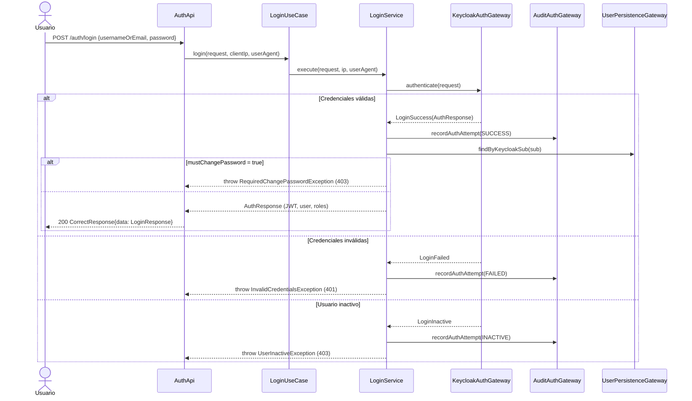
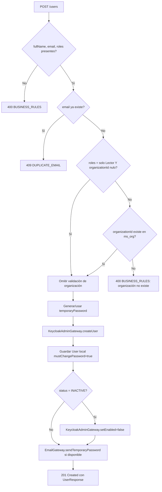

# ms_iam — Análisis

| Campo | Valor |
|---|---|
| Repositorio | `MSPI_NVA_CO_MR_BACK/ms_iam` |
| Fecha del documento | 2026-08-18 |
| Alcance | Requerimientos funcionales/no funcionales, reglas de negocio, actores y casos de uso del microservicio `ms_iam`, inferidos directamente del código fuente y `docs/openapi.yaml` |

---

## 1. Actores del sistema

| Actor | Naturaleza | Interacción con `ms_iam` |
|---|---|---|
| **Usuario autenticado (cualquier rol)** | Persona | `POST /auth/login`, `POST /auth/change-password`, `GET/POST /auth/totp/*`, `GET /roles` |
| **AdminSistema** | Rol de negocio (realm role de Keycloak) | Único rol autorizado sobre `/users/**` (`SecurityConfig.requestMatchers("/users/**").hasRole("AdminSistema")`) |
| **AdminInstrumento, Evaluador, Revisor, Lector** | Roles de negocio del catálogo (`iam.role`, seed en `schema-iam-mvp.sql`) | Consumidores de autenticación; no tienen endpoints administrativos propios en este microservicio |
| **Keycloak** | Sistema externo (Identity Provider) | Autoridad de credenciales; emite JWT; expone Admin REST API para gestión de usuarios (`KeycloakAdminGateway`) |
| **ms_org** | Microservicio par | Consultado por `ms_iam` (`GET /organizations/{id}`) al crear usuarios `Lector`; invoca `POST /users` y `POST /users/disable-by-email` sobre `ms_iam` |
| **ms_assessment (y otros MS)** | Microservicio par | Consumidor de `POST /internal/audit/events` mediante `X-Internal-Api-Key` |
| **Brevo** | Sistema externo (proveedor de correo transaccional) | Recibe solicitudes de `BrevoEmailAdapter` para notificar contraseñas temporales/reset |
| **Equipo DBA/DevOps** | Rol operativo | Aplica manualmente `schema-iam-mvp.sql` / `schema-iam-patch.sql`, ya que el microservicio no ejecuta DDL |

## 2. Requerimientos funcionales (RF)

Extraídos de los controladores REST (`infrastructure/entry-points/api-rest/src/main/java/co/com/mspi/api`) y de `docs/openapi.yaml`:

| ID | Requerimiento | Endpoint / clase | Actor |
|---|---|---|---|
| RF-01 | Autenticar usuario con `usernameOrEmail` + `password` y devolver JWT, datos de usuario y roles | `POST /auth/login` → `AuthApi.login` → `LoginUseCase` → `LoginService` → `KeycloakAuthGateway` | Usuario |
| RF-02 | Registrar auditoría de cada intento de login (éxito, fallo, inactivo) | `LoginService.execute` → `AuditAuthGateway.recordAuthAttempt` | Sistema |
| RF-03 | Forzar cambio de contraseña en primer acceso si `must_change_password = true` | `LoginService.execute` → `RequiredChangePasswordException` (403) | Sistema |
| RF-04 | Cambiar contraseña (primer acceso o recuperación) | `POST /auth/change-password` → `ChangePasswordUseCase` | Usuario |
| RF-05 | Consultar si el usuario autenticado tiene TOTP habilitado | `GET /auth/totp/status` → `TotpStatusUseCase` | Usuario autenticado (JWT) |
| RF-06 | Generar secreto TOTP y URL de aprovisionamiento QR (`otpauth://`) | `POST /auth/totp/setup` → `TotpSetupUseCase` | Usuario autenticado |
| RF-07 | Verificar código TOTP de 6 dígitos y habilitar 2FA | `POST /auth/totp/verify` → `TotpVerifyUseCase` | Usuario autenticado |
| RF-08 | Crear usuario en Keycloak + BD local con roles asignados | `POST /users` → `CreateUserUseCase` → `UserManagementService.createUser` | AdminSistema |
| RF-09 | Validar que la organización exista en `ms_org` cuando el usuario tiene roles distintos de solo `Lector` y trae `organizationId` | `UserManagementService.createUser` → `OrganizationGateway.existsById` | Sistema |
| RF-10 | Rechazar creación si el correo ya existe | `UserManagementService.createUser` → `DuplicateEmailException` (409) | Sistema |
| RF-11 | Generar contraseña temporal automáticamente si no se especifica | `TemporaryPasswordGenerator.generate()` | Sistema |
| RF-12 | Notificar por correo la contraseña temporal (si hay `EmailGateway` disponible) | `UserManagementService.createUser` → `EmailGateway.sendTemporaryPassword` (Brevo) | Sistema |
| RF-13 | Listar usuarios paginados con búsqueda (`q`) y filtros (`role`, `status`) | `GET /users` → `GetUsersUseCase` | AdminSistema |
| RF-14 | Consultar catálogo de estados de usuario (`ACTIVE`/`INACTIVE`) | `GET /users/statuses` → `UsersApi.listStatuses` (estático, no usa BD) | AdminSistema |
| RF-15 | Obtener usuario por ID | `GET /users/{userId}` → `GetUserByIdUseCase` | AdminSistema |
| RF-16 | Actualizar nombre, correo y/o roles de un usuario, sincronizando con Keycloak | `PUT /users/{userId}` → `UpdateUserUseCase` → `UserManagementService.updateUser` | AdminSistema |
| RF-17 | Activar/inactivar usuario, propagando el estado a Keycloak (`setEnabled`) | `PATCH /users/{userId}/status` → `UpdateUserStatusUseCase` | AdminSistema |
| RF-18 | Restablecer contraseña de un usuario y marcar `must_change_password=true` | `POST /users/{userId}/reset-password` → `ResetPasswordUseCase` | AdminSistema |
| RF-19 | Desactivar usuario por correo (usado por `ms_org` al cambiar el contacto de una organización) | `POST /users/disable-by-email` → `DisableUserByEmailUseCase` | AdminSistema / ms_org |
| RF-20 | Listar catálogo de roles del realm de Keycloak con etiquetas en español | `GET /roles` → `GetRolesUseCase` / `RolesApi` | Usuario autenticado |
| RF-21 | Registrar eventos de auditoría de negocio provenientes de otros microservicios | `POST /internal/audit/events` → `InternalAuditApi` → `RecordAuditEventUseCase` | Microservicios (vía API key interna) |
| RF-22 | Exponer estado de salud y metadatos del servicio | `GET /actuator/health`, `GET /actuator/info` | Infraestructura (Docker healthcheck) |

## 3. Reglas de negocio (identificadas en `domain/usecase` e infraestructura de servicio)

1. **Unicidad de correo**: no puede existir más de un usuario con el mismo `email` (`UserManagementService.createUser`, `updateUser` → `DuplicateEmailException`, HTTP 409). Reforzado a nivel de esquema con `UNIQUE` en `iam."user".email`.
2. **Campos obligatorios de alta**: `fullName`, `email` y al menos un rol son obligatorios; su ausencia lanza `BusinessRulesOnFieldsException` (HTTP 400, código `BUSINESS_RULES`).
3. **Validación de organización condicional**: si el usuario no es *solo* `Lector` y se envía `organizationId`, `ms_iam` valida contra `ms_org` que la organización exista (`OrganizationGateway.existsById`); si no existe, se rechaza la creación.
4. **Contraseña temporal**: si no se especifica `temporaryPassword` en la creación, el sistema la genera (`TemporaryPasswordGenerator`).
5. **Cambio de contraseña obligatorio en primer acceso**: todo usuario creado por un administrador queda con `mustChangePassword = true`; en el siguiente login exitoso contra Keycloak, si ese flag sigue activo, el login se corta con `RequiredChangePasswordException` (403) en lugar de emitir el token, obligando a pasar por `POST /auth/change-password`.
6. **Auditoría incondicional de login**: cada intento de `POST /auth/login` genera un registro de auditoría (éxito, fallo o inactivo) independientemente del resultado (`AuditAuthGateway.recordAuthAttempt`), antes de propagar cualquier excepción al cliente.
7. **Estados de usuario sincronizados con Keycloak**: al cambiar `status` (`ACTIVE`/`INACTIVE`) o al crear un usuario inactivo, `UserManagementService` llama a `KeycloakAdminGateway.setEnabled(...)` para reflejar el estado en el IdP, evitando que un usuario inactivo en BD siga pudiendo autenticarse en Keycloak.
8. **Reset de contraseña marca cambio obligatorio**: `resetPassword` siempre deja `mustChangePassword = true` tras el restablecimiento, forzando un nuevo cambio en el próximo login.
9. **Baja idempotente por correo**: `disableUserByEmail` no falla si el usuario no existe en la base local (`ResourceNotFoundException` capturada y absorbida silenciosamente) — pensado para la integración con `ms_org`, que puede invocar esta operación sin conocer si el usuario fue creado en `ms_iam`.
10. **Roles con prefijo `ROLE_`**: los roles del JWT (`realm_access.roles`) se traducen a `GrantedAuthority` con prefijo `ROLE_` más un `ROLE_USER` implícito para todo usuario autenticado (`SecurityConfig.jwtAuthenticationConverter`).
11. **Autorización por rol único administrativo**: solo `AdminSistema` (`hasRole("AdminSistema")`) puede acceder a cualquier ruta bajo `/users/**`; no existen roles intermedios con acceso parcial a esa API.
12. **2FA opcional y por usuario**: TOTP no es obligatorio; cada usuario decide activar `POST /auth/totp/setup` + `POST /auth/totp/verify`. El secreto vive en `iam.user_totp`, indexado por `keycloak_sub` (no por `user.id`).
13. **API interna protegida por clave compartida, no por JWT**: `/internal/**` está `permitAll` a nivel de Spring Security, pero `InternalApiKeyFilter` intercepta antes que el filtro de Bearer Token y exige el header `X-Internal-Api-Key` igual a `INTERNAL_API_KEY`; si la propiedad no está configurada en el servidor, responde 503 (falla segura, no permite pasar sin protección).
14. **El microservicio no gestiona su propio esquema**: `spring.sql.init.mode: never` y `hibernate.ddl-auto: none` — las tablas deben preexistir (aplicadas por scripts SQL versionados), lo que constituye una regla operativa más que de negocio, pero condiciona el arranque correcto del servicio.

## 4. Requerimientos no funcionales (RNF) inferidos

| ID | RNF | Evidencia |
|---|---|---|
| RNF-01 | **Seguridad por defecto (deny by default)**: cualquier ruta no listada explícitamente requiere autenticación (`anyRequest().authenticated()`) | `SecurityConfig` |
| RNF-02 | **Stateless**: sin sesión HTTP; toda autorización se resuelve por JWT en cada request | `SessionCreationPolicy.STATELESS` |
| RNF-03 | **Cabeceras de seguridad HTTP**: `X-Frame-Options: DENY`, HSTS (`max-age=31536000`, `includeSubDomains`, `preload`) | `SecurityConfig.securityFilterChain`, `SecurityHeadersFilter` |
| RNF-04 | **Trazabilidad de requests**: cada respuesta incluye `traceId` (UUID) en `meta`, generado o propagado vía `TraceIdFilter`/MDC | `GlobalExceptionHandler.getTraceId()`, `TraceIdFilter` |
| RNF-05 | **Disponibilidad observable**: *health checks* de Actuator consumidos por Docker (`HEALTHCHECK` en `Dockerfile`) y por `depends_on: condition: service_healthy` en `docker-compose.apps.yml` | `Dockerfile`, `docker-compose.apps.yml` |
| RNF-06 | **Resiliencia ante caída de Keycloak**: fallas de autenticación externas se traducen a 503 (`AuthDomainException` → `AUTH_SERVICE_UNAVAILABLE`) en lugar de 500 genérico | `GlobalExceptionHandler.handleAuthDomain` |
| RNF-07 | **Observabilidad de métricas**: exposición de métricas Prometheus vía Micrometer | `micrometer-registry-prometheus` en `api-rest/build.gradle` |
| RNF-08 | **Gestión centralizada de secretos en producción**: credenciales de BD y llaves cargadas por Infisical (`DB_CREDENTIAL`, `INFISICAL_*`), no hardcodeadas | `InfisicalConfig`, `DBCredentialConfig`, `docs/README.md` §7-8 |
| RNF-09 | **CORS configurable por entorno**: orígenes permitidos parametrizables vía `CORS_ALLOWED_ORIGINS` | `application.yaml`, `CorsConfig` |
| RNF-10 | **Contenedor de imagen mínima y no root**: build multi-stage sobre Alpine, usuario `mspi` sin privilegios | `deployment/Dockerfile` |
| RNF-11 | **Cobertura mínima de pruebas exigida en build**: `check.dependsOn jacocoTestCoverageVerification` con mínimo 80% de instrucciones cubiertas (excluyendo DTOs, mappers, entidades y configuración) | `main.gradle` |
| RNF-12 | **Auditabilidad transversal**: `ms_iam` actúa como *sink* de auditoría no solo de sus propios eventos sino de eventos de negocio de otros microservicios, con índices por actor, entidad, tipo y fecha | `schema-iam-mvp.sql` (tabla `iam.audit_log` + 4 índices) |
| RNF-13 | **Internacionalización de mensajes de error**: mensajes de negocio y catálogos (roles, estados) en español, alineado con el público objetivo del sistema | `docs/README.md`, `RolesApi`, `UsersApi.listStatuses` |

## 5. Casos de uso (formalizados desde `domain/usecase`)

`domain/usecase` contiene 12 clases de caso de uso, una por operación de negocio, todas sin dependencias de Spring (POJOs con constructor por inyección manual, en su mayoría anotados solo con `@RequiredArgsConstructor` de Lombok):

| Caso de uso | Paquete | Gateway(s) consumido(s) |
|---|---|---|
| `LoginUseCase` | `usecase.login` | `LoginServiceGateway` |
| `ChangePasswordUseCase` | `usecase.auth` | `ChangePasswordGateway` |
| `TotpSetupUseCase`, `TotpStatusUseCase`, `TotpVerifyUseCase` | `usecase.totp` | `TotpGateway` |
| `CreateUserUseCase` | `usecase.user` | `UserManagementGateway` |
| `GetUsersUseCase` | `usecase.user` | `UserQueryGateway` |
| `GetUserByIdUseCase` | `usecase.user` | `UserQueryGateway` |
| `UpdateUserUseCase` | `usecase.user` | `UserManagementGateway` |
| `UpdateUserStatusUseCase` | `usecase.user` | `UserManagementGateway` |
| `ResetPasswordUseCase` | `usecase.user` | `UserManagementGateway` |
| `DisableUserByEmailUseCase` | `usecase.user` | `UserManagementGateway` |
| `GetRolesUseCase` | `usecase.role` | (catálogo de Keycloak, vía adaptador) |
| `RecordAuditEventUseCase` | `usecase.audit` | `AuditEventGateway` |

### 5.1 Diagrama de flujo — Login con cambio de contraseña obligatorio

### 5.2 Diagrama de flujo — Creación de usuario con validación de organización

## 6. Necesidades identificadas no cubiertas explícitamente en el código

- No existe endpoint de **eliminación física** de usuarios (`UserManagementService` documenta explícitamente "Sin eliminado físico"); solo inactivación lógica.
- No hay endpoint para **deshabilitar/eliminar TOTP** una vez habilitado (solo `setup`, `verify` y `status`); si un usuario pierde su dispositivo TOTP, no hay caso de uso visible de "reset TOTP" en la API pública.
- No se encontró mecanismo de **recuperación de contraseña autoservicio** (self-service "forgot password"); `POST /auth/change-password` requiere conocer la contraseña actual (`currentPassword`), por lo que la recuperación real depende de que un `AdminSistema` ejecute `POST /users/{userId}/reset-password`.
- No hay paginación por cursor ni límites máximos documentados para `GET /users` más allá de `page`/`size` (sin validación explícita de tamaño máximo de página en el código revisado).
