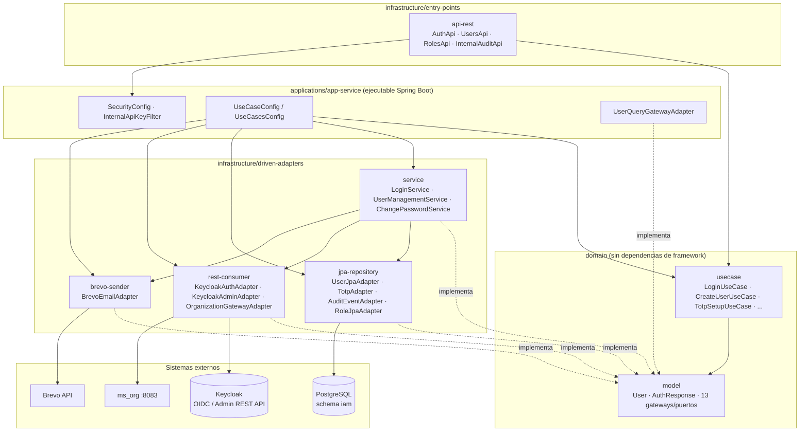
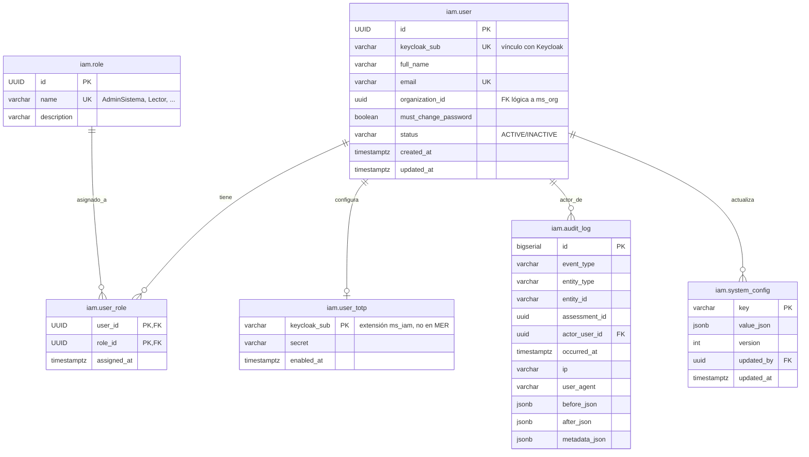

# ms_iam — Diseño

| Campo | Valor |
|---|---|
| Repositorio | `MSPI_NVA_CO_MR_BACK/ms_iam` |
| Fecha del documento | 2026-08-18 |
| Alcance | Arquitectura, estructura de paquetes, modelo de datos y diseño de API del microservicio `ms_iam`, tal como está implementado en el código |

---

## 1. Estilo arquitectónico

`ms_iam` implementa **arquitectura hexagonal (puertos y adaptadores) / Clean Architecture**, materializada como un **build multi-módulo de Gradle** (no solo como convención de paquetes dentro de un único módulo): cada capa es un subproyecto Gradle independiente con su propio `build.gradle` y sus propias dependencias declaradas, lo cual impone físicamente la regla de dependencia (el dominio no puede depender de infraestructura porque ni siquiera tiene esa dependencia en el classpath de compilación).

Aunque el `build.gradle` raíz referencia (comentado) el plugin `co.com.bancolombia.cleanArchitecture`, la estructura de módulos sigue manualmente esa misma convención (`domain/model`, `domain/usecase`, `infrastructure/driven-adapters/*`, `infrastructure/entry-points/*`, `applications/app-service`), típica de los arquetipos de Bancolombia para microservicios Java/Spring.

**Regla de dependencia observada:**

```
applications/app-service  ──depends on──>  todos los módulos
infrastructure/*          ──depends on──>  domain/model (+ domain/usecase en api-rest)
domain/usecase             ──depends on──>  domain/model
domain/model                (sin dependencias — POJOs, Lombok, java.time/util)
```

Verificado en `domain/usecase/build.gradle` (`implementation project(':model')`, única dependencia) y en `domain/model/build.gradle` (archivo vacío: sin declaraciones de dependencias propias, solo hereda plugins comunes de `main.gradle`).

## 2. Estructura real de paquetes (árbol de módulos y clases)

```
ms_iam/
├── domain/
│   ├── model/                          (:model)
│   │   └── co.com.mspi.model/
│   │       ├── audit/       AuditEvent
│   │       ├── auth/        AuditResult, AuthResponse, LoginRequest, LoginResult, UserInfo
│   │       ├── gateway/     13 interfaces de puerto (ver §3)
│   │       ├── totp/        TotpSetupResult
│   │       ├── user/        CreateUserCommand, CreateUserResult, PagedUsers, Role,
│   │       │                UpdateUserCommand, User, UserWithRole
│   │       ├── util/        TemporaryPasswordGenerator
│   │       └── vob/         Email, Name, UserId  (value objects)
│   └── usecase/                        (:usecase)
│       └── co.com.mspi.usecase/
│           ├── audit/       RecordAuditEventUseCase
│           ├── auth/        ChangePasswordUseCase
│           ├── login/       LoginUseCase
│           ├── role/        GetRolesUseCase
│           ├── totp/        TotpSetupUseCase, TotpStatusUseCase, TotpVerifyUseCase
│           └── user/        CreateUserUseCase, DisableUserByEmailUseCase, GetUserByIdUseCase,
│                             GetUsersUseCase, ResetPasswordUseCase, UpdateUserStatusUseCase,
│                             UpdateUserUseCase
├── infrastructure/
│   ├── helpers/common/                 (:common)
│   │   └── co.com.mspi.common/
│   │       ├── dto/         CorrectResponse, ErrorDetail, ErrorResponse, Meta
│   │       ├── exception/   8 excepciones de dominio (AccountNotFullySetupException,
│   │       │                 AuthDomainException, BusinessRulesOnFieldsException, DomainException,
│   │       │                 DuplicateEmailException, InvalidCredentialsException,
│   │       │                 RequiredChangePasswordException, ResourceNotFoundException,
│   │       │                 UserInactiveException)
│   │       ├── mapper/      ApiResponseMapper
│   │       └── CommonErrorConstants
│   ├── driven-adapters/
│   │   ├── jpa-repository/             (:jpa-repository — persistencia)
│   │   │   └── co.com.mspi.jpa/
│   │   │       ├── adapter/  AuditEventAdapter, AuthAuditAdapter, RoleJpaAdapter, TotpAdapter,
│   │   │       │             UserJpaAdapter
│   │   │       ├── config/   DBSecret, JpaConfig
│   │   │       ├── entity/   AuditLogEntity, RoleEntity, UserEntity, UserRoleEntity, UserRoleId,
│   │   │       │             UserTotpEntity
│   │   │       └── repository/ AuditLogRepository, RoleRepository, UserRepository,
│   │   │                        UserRoleRepository, UserTotpRepository (Spring Data JPA)
│   │   ├── rest-consumer/              (:rest-consumer — clientes HTTP salientes)
│   │   │   └── co.com.mspi.consumer/
│   │   │       ├── adapter/  KeycloakAdminAdapter, KeycloakAuthAdapter, OrganizationGatewayAdapter
│   │   │       ├── config/   RestConsumerConfig
│   │   │       ├── mapper/   UserInfoMapper
│   │   │       └── utils/    EmailValidator, NameValidator, UserIdValidator
│   │   ├── service/                    (:service — orquestación de casos de uso complejos)
│   │   │   └── co.com.mspi.service/  ChangePasswordService, LoginService, UserManagementService
│   │   └── brevo-sender/               (:brevo-sender — notificación por correo)
│   │       └── co.com.mspi.brevo/  BrevoEmailAdapter
│   └── entry-points/
│       └── api-rest/                   (:api-rest — HTTP entrante)
│           └── co.com.mspi.api/
│               ├── auth/     AuthApi (+ dto/ ChangePasswordRequest, LoginRequestBody,
│               │             LoginResponse, UserResponse)
│               ├── config/   CorsConfig, SecurityHeadersFilter, TraceIdFilter
│               ├── exception/ GlobalExceptionHandler
│               ├── internal/ InternalAuditApi (+ dto/ AuditEventRequest)
│               ├── mapper/   AuthApiMapper
│               ├── roles/    RolesApi (+ dto/ RoleCatalogItem)
│               └── users/    UsersApi (+ dto/ 6 clases, mapper/ UsersApiMapper)
└── applications/
    └── app-service/                    (:app-service — ejecutable Spring Boot)
        └── co.com.mspi/
            ├── config/   DBCredential, DBCredentialConfig, InfisicalConfig, InternalApiKeyFilter,
            │             InternalApiProperties, KeycloakRestClientConfig, RestClientConfig,
            │             SecurityConfig, UseCaseConfig, UseCasesConfig
            ├── userquery/ UserQueryGatewayAdapter
            └── MainApplication
```

## 3. Puertos (interfaces de dominio, `domain/model/.../gateway`)

| Puerto | Adaptador(es) que lo implementan | Módulo del adaptador |
|---|---|---|
| `LoginServiceGateway` | `LoginService` | `:service` |
| `ChangePasswordGateway` | `ChangePasswordService` | `:service` |
| `UserManagementGateway` | `UserManagementService` | `:service` |
| `UserQueryGateway` | `UserQueryGatewayAdapter` | `:app-service` (`co.com.mspi.userquery`) |
| `UserPersistenceGateway` | `UserJpaAdapter` | `:jpa-repository` |
| `RolePersistenceGateway` | `RoleJpaAdapter` | `:jpa-repository` |
| `AuditEventGateway` | `AuditEventAdapter` | `:jpa-repository` |
| `AuditAuthGateway` | `AuthAuditAdapter` | `:jpa-repository` |
| `TotpGateway` | `TotpAdapter` | `:jpa-repository` |
| `KeycloakAuthGateway` | `KeycloakAuthAdapter` | `:rest-consumer` |
| `KeycloakAdminGateway` | `KeycloakAdminAdapter` | `:rest-consumer` |
| `OrganizationGateway` | `OrganizationGatewayAdapter` | `:rest-consumer` |
| `EmailGateway` | `BrevoEmailAdapter` | `:brevo-sender` (inyección `@Autowired(required = false)` — opcional) |

El ensamblaje puerto↔adaptador↔caso de uso ocurre exclusivamente en el módulo ejecutable (`applications/app-service/.../config/UseCaseConfig.java` y `UseCasesConfig.java`), que instancia cada caso de uso vía `@Bean` inyectando el gateway correspondiente. El dominio (`:model`, `:usecase`) no tiene ninguna anotación de Spring: los casos de uso son clases Java planas (algunas con `@RequiredArgsConstructor` de Lombok, que es solo azúcar sintáctica de constructor, sin dependencia de framework).

## 4. Diagrama de componentes



## 5. Modelo de datos

Esquema `iam` en PostgreSQL (`applications/app-service/src/main/resources/schema-iam-mvp.sql`), alineado con el MER general del proyecto (`docs/proyecto/DB-MER.txt`). En desarrollo se usa H2 en memoria (`jdbc:h2:mem:iam`) con el mismo modelo lógico vía entidades JPA; **el microservicio no ejecuta DDL** (`spring.sql.init.mode: never`, `hibernate.ddl-auto: none`), por lo que el esquema debe aplicarse externamente.

### 5.1 Diagrama entidad-relación



### 5.2 Notas de diseño del modelo de datos

- **`iam.user` no almacena contraseñas**: las credenciales viven en Keycloak; el vínculo es `keycloak_sub` (único). Esto es coherente con el objetivo de centralizar autenticación fuera del microservicio.
- **`iam.user_totp` es una extensión propia de `ms_iam`**, no contemplada en el MER general del proyecto (comentario explícito en el SQL: "extensión ms_iam, no en MER"). Se indexa por `keycloak_sub` en lugar de `user.id`, lo que acopla la funcionalidad TOTP directamente a la identidad de Keycloak.
- **`iam.audit_log` es polimórfica**: `entity_type` + `entity_id` (string, no FK tipada) permite registrar eventos sobre cualquier tipo de entidad de cualquier microservicio, incluyendo `assessment_id` como columna dedicada por ser el caso de uso principal de auditoría externa (`ms_assessment`). Tres columnas `JSONB` (`before_json`, `after_json`, `metadata_json`) permiten capturar diffs de negocio sin necesidad de tablas específicas por tipo de evento.
- **`iam.system_config`** existe en el DDL (clave-valor JSONB versionado) pero no se identificó código de aplicación (adaptador/gateway) que la use activamente en los módulos revisados; aparenta ser una tabla reservada del MER para configuración paramétrica futura.
- **Índices**: 4 índices sobre `audit_log` optimizan las consultas típicas de auditoría (por `assessment_id`+fecha, por actor+fecha, por tipo de evento+fecha, por entidad). `user.email` y `user.keycloak_sub` tienen índices únicos adicionales explícitos aunque ya son `UNIQUE` a nivel de columna.
- **`schema-iam-patch.sql`** es un script idempotente (`CREATE TABLE IF NOT EXISTS`, bloques `DO $$ ... EXCEPTION WHEN ...`) pensado para bases de datos ya provisionadas a las que les falten tablas nuevas (p. ej. `audit_log`), evitando recrear el volumen completo en entornos Docker locales.

## 6. Diseño de la API (REST)

Contrato formal en `docs/openapi.yaml` (OpenAPI 3.1.0). Convenciones de diseño observadas:

- **Envoltorio uniforme de respuesta**: éxito → `CorrectResponse { meta: {traceId, timestamp}, data }`; error → `ErrorResponse { meta, error: [{code, message}] }`. Construido centralmente por `ApiResponseMapper` (`:common`) y usado por todos los controladores.
- **Un `RestController` por subdominio**, mapeado 1:1 a un prefijo de ruta: `AuthApi` (`/auth`), `UsersApi` (`/users`), `RolesApi` (`/roles`), `InternalAuditApi` (`/internal/audit`).
- **DTO de entrada validado con Bean Validation** (`@Valid`) en cada `@RequestBody`, y mapeo explícito DTO↔dominio en clases `*Mapper` (`AuthApiMapper`, `UsersApiMapper`) — el controlador nunca recibe ni retorna directamente objetos de `domain/model`.
- **Manejo de errores centralizado** en `GlobalExceptionHandler` (`@RestControllerAdvice`), que traduce cada excepción de dominio (`:common/exception`) a un código HTTP y un `code` de negocio estable (`VALIDATION`, `BUSINESS_RULES`, `INVALID_CREDENTIALS`, `USER_INACTIVE`, `DUPLICATE_EMAIL`, `AUTH_SERVICE_UNAVAILABLE`, `NOT_FOUND`, `INTERNAL_ERROR`, `REMOTE_SERVICE_ERROR`), evitando fugas de detalles internos salvo en el caso explícito de errores 4xx/5xx remotos (con mensaje truncado a 500 caracteres).
- **Doble esquema de seguridad**: `bearerAuth` (JWT vía Spring Security OAuth2 Resource Server) para la mayoría de rutas, e `internalApiKey` (header `X-Internal-Api-Key`) para `/internal/**`, implementado como filtro Servlet manual (`InternalApiKeyFilter`) insertado antes del filtro Bearer (`addFilterBefore(..., BearerTokenAuthenticationFilter.class)`).
- **Identificadores de usuario como UUID** (`userId` en path), coherente con `iam.user.id UUID`.
- **Paginación simple offset-based** (`page`, `size`) en `GET /users`, sin cursor.

## 7. Decisiones técnicas confirmadas en el código

| Decisión | Evidencia | Implicación |
|---|---|---|
| **Spring MVC (servlet, bloqueante)**, no WebFlux | `spring-boot-starter-webmvc` en `api-rest` y `app-service`; `HttpServletRequest`/`OncePerRequestFilter` en `AuthApi`/`InternalApiKeyFilter` | No hay programación reactiva (`Mono`/`Flux`); todo el flujo es síncrono e imperativo |
| **JPA/Hibernate sobre R2DBC** | `spring-boot-starter-data-jpa`, entidades `@Entity` con `jakarta.persistence` | Persistencia bloqueante, consistente con el modelo servlet |
| **JWT validado contra Keycloak vía JWK Set / issuer**, sin sesión | `NimbusJwtDecoder.withIssuerLocation` / `withJwkSetUri` en `SecurityConfig` | El servicio no emite sus propios tokens; solo valida los emitidos por Keycloak |
| **RestTemplate/RestClient para consumo saliente** (no WebClient) | `RestClientConfig`, `KeycloakRestClientConfig`, `RestOperations rest = new RestTemplate(...)` en `SecurityConfig.jwtDecoder()` | Coherente con el modelo bloqueante de Spring MVC |
| **Resilience4j** disponible en `:rest-consumer` | `io.github.resilience4j:resilience4j-spring-boot3:2.3.0` | Soporte para *circuit breaker*/retry en llamadas a Keycloak/ms_org (uso concreto no confirmado en las clases revisadas de este módulo) |
| **Multi-módulo Gradle como mecanismo de enforcement arquitectónico** | `settings.gradle` (8 subproyectos) | El dominio no puede depender de infraestructura por construcción del build, no solo por convención |
| **`EmailGateway` como dependencia opcional** (`@Autowired(required = false)`) | `UserManagementService.emailGateway` | El servicio de creación de usuarios funciona aunque el adaptador de correo no esté disponible/configurado |
| **TOTP con algoritmo estándar RFC 6238**, ventana de tolerancia ±1 paso de 30s | `TotpAdapter` (`TimeBasedOneTimePasswordGenerator`, `for (i = -1; i <= 1; i++)`) | Tolera desfases de reloj cliente/servidor típicos de apps autenticadoras |
| **Gestión de secretos por Infisical en producción, fallback H2 en desarrollo** | `InfisicalConfig`, `DBCredentialConfig`, `application.yaml` | Sin credenciales hardcodeadas ni en el repositorio ni en variables planas para producción |
