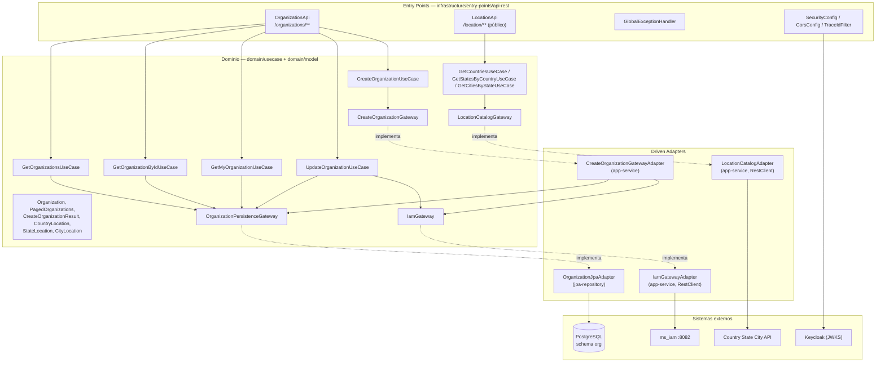
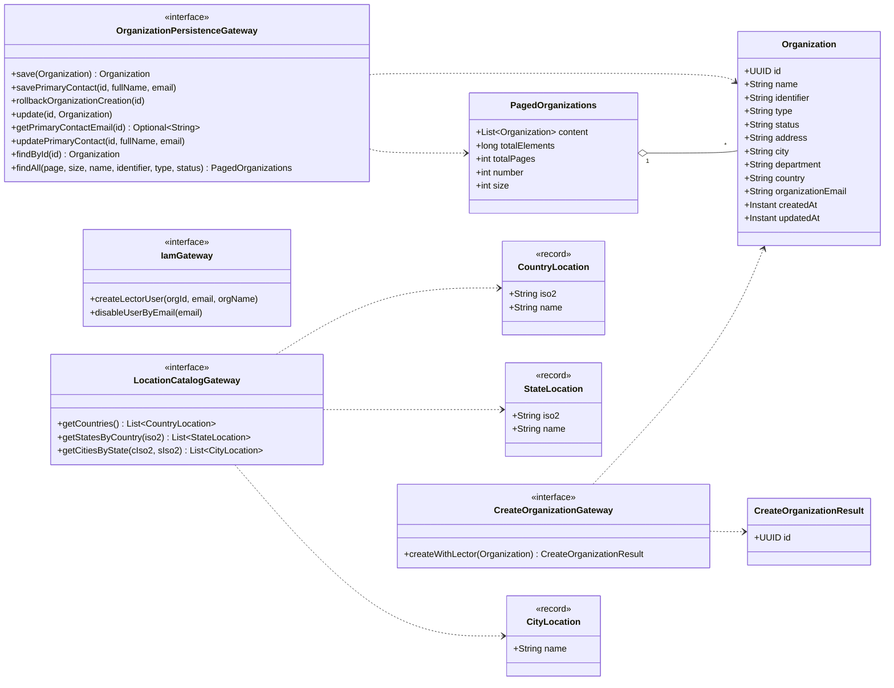
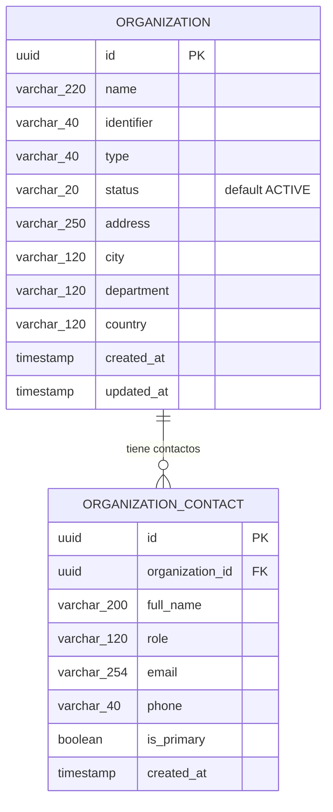
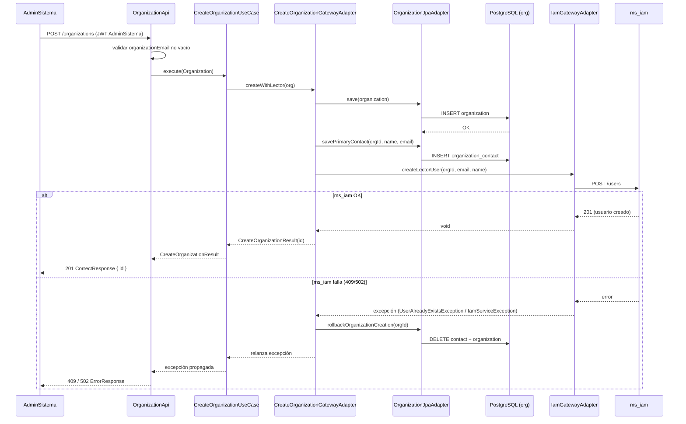
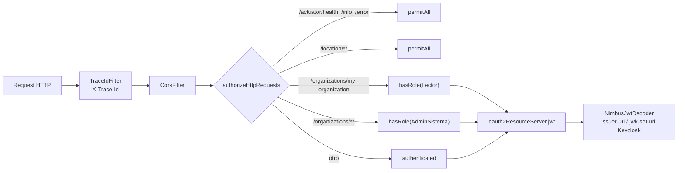

# ms_org — Diseño

| Campo | Valor |
|---|---|
| Repositorio | `MSPI_NVA_CO_MR_BACK/ms_org` |
| Fecha del documento | 2026-08-19 |
| Alcance | Arquitectura hexagonal real, estructura de paquetes, modelo de datos, diagramas y decisiones técnicas del microservicio `ms_org` |

---

## 1. Arquitectura general

`ms_org` implementa **arquitectura hexagonal (Clean Architecture)** por convención de estructura de carpetas/módulos Gradle, sin usar un plugin de generación de arquetipo (no hay evidencia de `co.com.bancolombia.cleanArchitecture` en `build.gradle`, igual que en `ms_iam`). El dominio (`domain/model`, `domain/usecase`) no importa Spring, JPA ni clases de `infrastructure/*`; toda la orquestación de beans se realiza en `applications/app-service` (`UseCaseConfig`).



**Observación de diseño**: los tres adaptadores `CreateOrganizationGatewayAdapter`, `IamGatewayAdapter` y `LocationCatalogAdapter` residen físicamente en el módulo `applications/app-service` (paquetes `co.com.mspi.organization`, `co.com.mspi.iam`, `co.com.mspi.location`) en lugar de en un módulo `infrastructure/driven-adapters/rest-consumer` dedicado, como sí ocurre en `ms_iam`. Esto no rompe la regla de dependencia (el dominio sigue sin conocer Spring), pero concentra más código de infraestructura en el módulo ejecutable de lo habitual en el patrón hexagonal estricto.

## 2. Estructura real de paquetes y módulos

```
ms_org/
├── domain/
│   ├── model/          :model     → co.com.mspi.model.{organization,location,gateway}
│   └── usecase/        :usecase   → co.com.mspi.usecase.{organization,location}
├── infrastructure/
│   ├── helpers/common/           :common        → co.com.mspi.common.{dto,exception,mapper}
│   ├── driven-adapters/
│   │   └── jpa-repository/       :jpa-repository → co.com.mspi.jpa.{adapter,entity,repository,config}
│   └── entry-points/
│       └── api-rest/             :api-rest      → co.com.mspi.api.{organization,location,exception,config}
└── applications/
    └── app-service/               :app-service   → co.com.mspi.{config,iam,location,organization}, MainApplication
```

| Módulo Gradle | Depende de | Responsabilidad |
|---|---|---|
| `:model` | (ninguna) | Modelos de dominio (`Organization`, `PagedOrganizations`, `CreateOrganizationResult`, `CountryLocation`, `StateLocation`, `CityLocation`) y las 4 interfaces de gateway (puertos) |
| `:usecase` | `:model` | 8 casos de uso, clases planas sin Spring |
| `:common` | `:model`, `spring-context` | `CorrectResponse`/`ErrorResponse`/`Meta`/`ErrorDetail`, 5 excepciones de dominio, `ApiResponseMapper`, `CommonErrorConstants` |
| `:jpa-repository` | `:model`, `:common`, `spring-boot-starter-data-jpa` | `OrganizationJpaAdapter` (implementa `OrganizationPersistenceGateway`), entidades JPA, repositorios Spring Data |
| `:api-rest` | `:usecase`, `:model`, `:common`, `spring-boot-starter-webmvc/security/validation/actuator` | Controladores REST, DTOs de entrada/salida, mapeadores, seguridad HTTP, manejo global de excepciones |
| `:app-service` | todos los anteriores + `spring-boot-starter-security`, `infisical:sdk` | Punto de entrada ejecutable (`MainApplication`), wiring de casos de uso (`UseCaseConfig`), adaptadores REST salientes (IAM, ubicación), configuración de seguridad JWT, Infisical, JPA/DataSource |

## 3. Diagrama de clases del dominio



## 4. Modelo de datos (esquema `org`, PostgreSQL)



- **Unicidad**: índice único `idx_org_name_identifier_unique` sobre `(name, identifier)`; índices simples adicionales sobre `name` e `identifier` para búsquedas por filtro.
- **Sin FK física** de `organization_contact.organization_id` hacia `organization.id` en el DDL de referencia revisado (`schema.sql`, pensado para H2/desarrollo); la integridad se asegura por lógica de aplicación (`OrganizationJpaAdapter`).
- **Sin FK cross-schema**: otros esquemas (`assessment`, `evidence`, `reporting`) referencian `organization_id` como columna simple, sin restricción física entre esquemas (documentado explícitamente en `docs/MVP-MSPI-CONTRATOS-Y-MER.md`).
- La entidad JPA `OrganizationEntity` usa `@CreationTimestamp`/`@UpdateTimestamp` de Hibernate para `created_at`/`updated_at`, mientras que `OrganizationContactEntity` solo tiene `@CreationTimestamp` (no se actualiza el contacto con marca de tiempo de modificación, salvo el `email`/`fullName` en sí).

## 5. Diseño de la API REST

Base: `http://localhost:8083` en desarrollo (`docs/openapi.yaml`, OpenAPI 3.1.0). Todas las respuestas exitosas usan el envoltorio `CorrectResponse { meta: { traceId, timestamp }, data }`; los errores usan `ErrorResponse { meta, error: [{ code, message }] }`.

| Método | Ruta | Rol requerido | Descripción |
|---|---|---|---|
| `POST` | `/organizations` | `AdminSistema` | Crear organización + usuario Lector |
| `GET` | `/organizations` | `AdminSistema` | Listado paginado con filtros (`name`, `identifier`, `type`, `status`) |
| `GET` | `/organizations/{organizationId}` | `AdminSistema` | Detalle por UUID |
| `PUT` | `/organizations/{organizationId}` | `AdminSistema` | Actualización completa |
| `GET` | `/organizations/my-organization` | `Lector` | Organización propia (resuelta por header o JWT) |
| `GET` | `/location/countries` | Público | Lista de países |
| `GET` | `/location/countries/{countryIso2}/states` | Público | Estados/departamentos de un país |
| `GET` | `/location/countries/{countryIso2}/states/{stateIso2}/cities` | Público | Ciudades de un estado |
| `GET` | `/actuator/health`, `/actuator/info` | Público | *Health checks* |

## 6. Flujo de proceso — creación de organización



## 7. Seguridad



- `SecurityConfig.extractRealmRoles` lee `realm_access.roles` del JWT y las mapea a `ROLE_<rol>`, agregando además siempre `ROLE_USER` a todo usuario autenticado.
- `jwtDecoder()` soporta configurar `issuer-uri` y `jwk-set-uri` por separado (igual que `ms_iam`), útil cuando el *issuer* visible por el navegador (`localhost`) difiere del *host* interno de Docker donde se resuelve el JWKS.
- CSRF deshabilitado (API *stateless*), sesión `STATELESS`, cabeceras `X-Frame-Options: DENY` y HSTS (`max-age` 1 año, `includeSubDomains`, `preload`) activas.

## 8. Decisiones técnicas relevantes

1. **Sin fallback a H2**: a diferencia de `ms_iam`, `DBCredentialConfig.dbSecret` lanza `IllegalStateException` si `DB_CREDENTIAL` no está presente — el servicio simplemente no arranca sin PostgreSQL real, evitando el riesgo (documentado como deuda técnica en `ms_iam`) de arrancar silenciosamente contra una base en memoria vacía.
2. **HikariCP configurado manualmente** (`JpaConfig`) en lugar de delegar en el *auto-configuration* estándar de Spring Boot Data JPA — decisión consistente con la necesidad de inyectar credenciales resueltas dinámicamente desde Infisical (`DBSecret`) antes de que exista un `DataSource` "convencional" basado en propiedades estáticas.
3. **Consulta paginada con SQL nativo** (`OrganizationRepository.findAllFiltered`, `nativeQuery = true`): los filtros opcionales se resuelven con condiciones `(:param IS NULL OR ...)` directamente en SQL PostgreSQL, en vez de usar `Specification`/Criteria API de Spring Data — más simple de leer pero acoplado a la sintaxis de PostgreSQL (`CAST(:x AS text)`), lo que reforzaría la decisión de no soportar H2 en este módulo.
4. **Compensación manual en vez de outbox/saga formal**: la reversión de organización+contacto ante fallo de IAM se implementa con tres transacciones JPA independientes (`REQUIRES_NEW`) orquestadas imperativamente en `CreateOrganizationGatewayAdapter`, no con un patrón *saga*/*outbox* formal ni con mensajería (no hay broker en este microservicio).
5. **Resolución de `organizationId` con doble fuente** (header explícito + claim JWT) en `getMyOrganization`: preparado para dos integraciones distintas de frontend/BFF, documentado explícitamente en `docs/MVP-MSPI-CONTRATOS-Y-MER.md` como "Opción A" (claim JWT) y "Opción B" (header desde BFF).
6. **Degradación silenciosa del catálogo de ubicación**: cualquier fallo de la API externa retorna lista vacía en vez de error HTTP, priorizando que un problema de un proveedor externo no autenticado nunca tumbe el flujo de registro de organización (decisión de resiliencia visible en `LocationCatalogAdapter`, sin *circuit breaker* explícito — no hay Resilience4j en este microservicio, a diferencia de `ms_iam`).
7. **Adaptadores REST salientes ubicados en `app-service`** en lugar de un módulo dedicado (ver §1) — reduce la cantidad de módulos Gradle a mantener pero acopla más responsabilidades al módulo ejecutable que en `ms_iam`.
