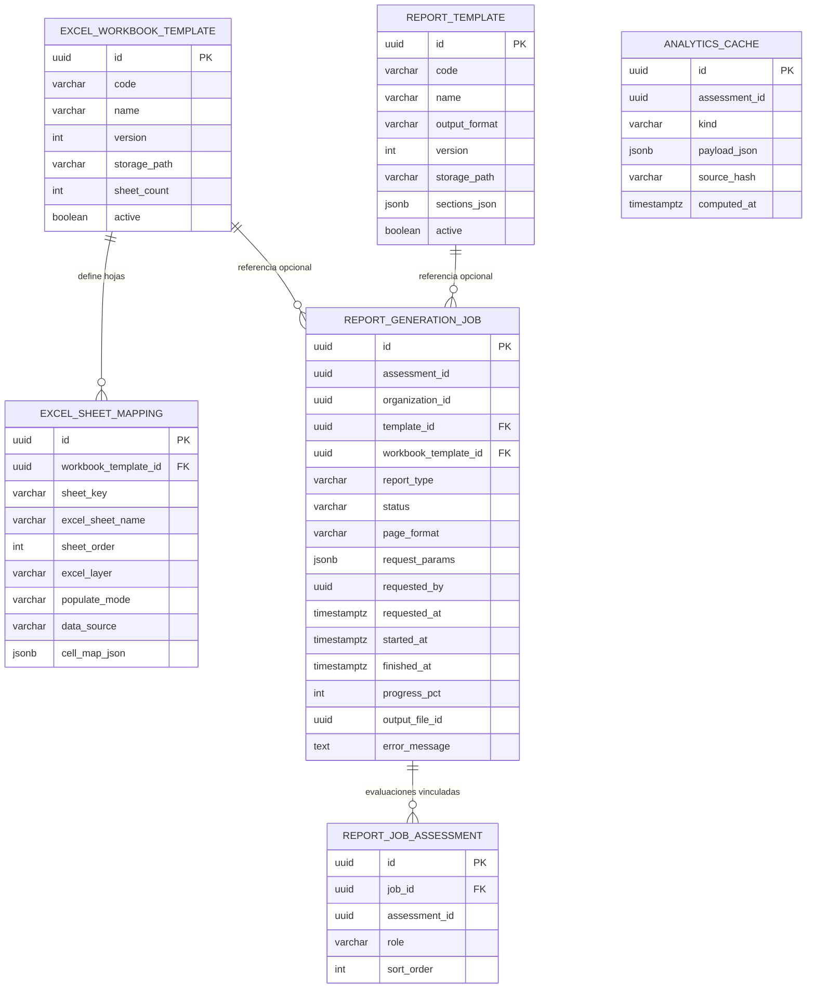
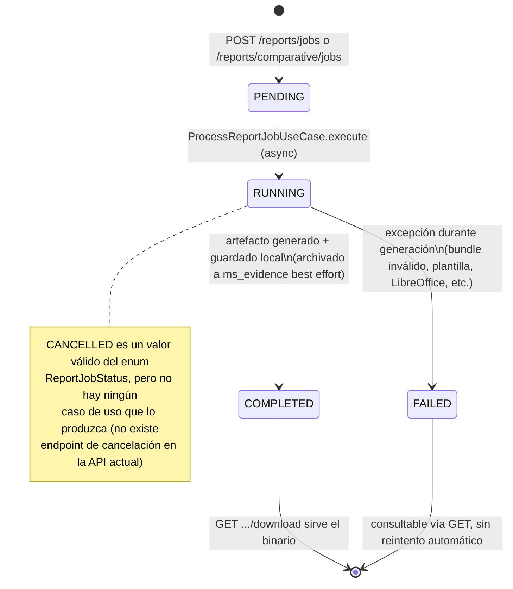
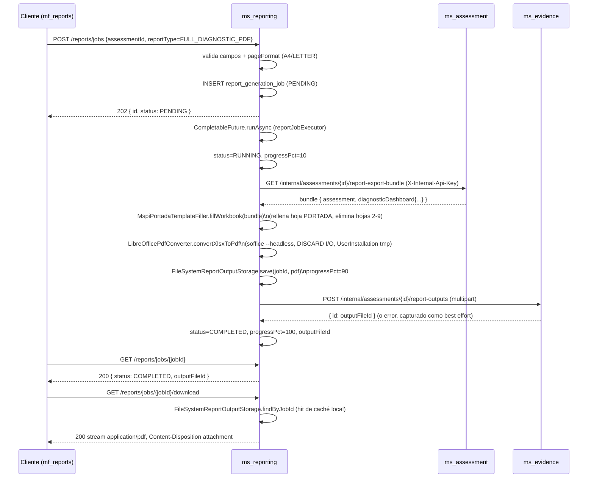

# ms_reporting — Diseño

| Campo | Valor |
|---|---|
| Repositorio | `MSPI_NVA_CO_MR_BACK/ms_reporting` |
| Fecha del documento | 2026-08-19 |
| Alcance | Arquitectura, estructura de paquetes, modelo de datos, diseño de API y decisiones técnicas del microservicio `ms_reporting` |

---

## 1. Arquitectura general

`ms_reporting` sigue **arquitectura hexagonal (Clean Architecture)** con Gradle multi-módulo, igual que el resto de microservicios MSPI:

- `domain/model` — modelo de dominio puro (POJOs con Lombok, enums, interfaces de gateway) sin dependencias de Spring.
- `domain/usecase` — casos de uso y "motor" de generación de documentos (`engine/`); depende de `model` y `common`, y de librerías de generación de documentos (OpenPDF, Apache POI) que se consideran parte del dominio de negocio de este microservicio (ver §6, decisión técnica DT-03).
- `infrastructure/entry-points/api-rest` — controladores REST, DTOs, mapeadores, manejo global de excepciones.
- `infrastructure/driven-adapters/jpa-repository` — persistencia JPA del job y sus vínculos con evaluaciones.
- `infrastructure/driven-adapters/rest-consumer` — clientes HTTP (`RestClient`) hacia `ms_assessment`, `ms_catalog`, `ms_evidence`.
- `infrastructure/helpers/common` — DTOs de respuesta estándar (`CorrectResponse`, `ErrorResponse`) y excepciones de dominio compartidas.
- `applications/app-service` — módulo ensamblador: configuración Spring Boot, seguridad, `bootJar`, y el único adaptador que no encaja en las categorías anteriores (`FileSystemReportOutputStorage`, la caché local de artefactos).

### 1.1 Diagrama de capas

```mermaid
flowchart TB
  subgraph EP["Entry Points — api-rest"]
    ReportApi["ReportJobApi"]
    CompApi["ComparativeReportJobApi"]
  end

  subgraph UC["Use Cases — domain/usecase"]
    CreateUC["CreateReportJobUseCase"]
    ProcessUC["ProcessReportJobUseCase"]
    GetUC["GetReportJobUseCase"]
    DownloadUC["DownloadReportJobUseCase"]
    CompUC["CreateComparativeReportJobUseCase"]
    Archiver["ReportOutputEvidenceArchiver"]
  end

  subgraph Engine["Engine — domain/usecase/engine"]
    Doc["ReportDocumentService"]
    Filler["MspiPortadaTemplateFiller"]
    Conv["LibreOfficePdfConverter"]
  end

  subgraph Model["domain/model"]
    Job["ReportGenerationJob"]
    Ports["Gateways: ReportingPersistenceGateway,\nAssessmentGateway, EvidenceGateway,\nCatalogGateway, ReportOutputStorageGateway"]
  end

  subgraph Driven["Driven Adapters"]
    JpaAd["ReportingJpaAdapter (jpa-repository)"]
    AsmAd["AssessmentGatewayAdapter (rest-consumer)"]
    EvAd["EvidenceGatewayAdapter (rest-consumer)"]
    CatAd["CatalogGatewayAdapter (rest-consumer)"]
    FsAd["FileSystemReportOutputStorage (app-service)"]
  end

  ReportApi --> CreateUC & GetUC & DownloadUC
  CompApi --> CompUC
  CreateUC --> Ports
  CompUC --> Ports
  ProcessUC --> Ports
  ProcessUC --> Doc
  Doc --> Filler
  Doc --> Conv
  DownloadUC --> Ports
  ProcessUC --> Archiver
  Archiver --> Ports

  JpaAd -.implements.-> Ports
  AsmAd -.implements.-> Ports
  EvAd -.implements.-> Ports
  CatAd -.implements.-> Ports
  FsAd -.implements.-> Ports

  JpaAd --> DB[(PostgreSQL\nschema reporting)]
  AsmAd -->|X-Internal-Api-Key| MSA[ms_assessment :8084]
  EvAd -->|X-Internal-Api-Key| MSE[ms_evidence :8086]
  CatAd -->|X-Internal-Api-Key| MSC[ms_catalog :8085]
  FsAd --> FS[("Volumen local\n/data/report-outputs")]
```



**Nota de diseño**: a diferencia de un hexagonal "estricto" donde `domain/usecase` no debería depender de librerías de infraestructura, aquí `ReportDocumentService`/`MspiPortadaTemplateFiller`/`LibreOfficePdfConverter` viven en `domain/usecase/engine` y usan directamente Apache POI, OpenPDF y `ProcessBuilder` del sistema operativo. Esta es una decisión pragmática del equipo (ver DT-03 en §6): se prioriza mantener toda la lógica de composición de documentos junto a las reglas de negocio de generación, en lugar de crear un puerto adicional (`DocumentRenderer`) con un adaptador de infraestructura separado, a costa de acoplar el módulo `usecase` a bibliotecas concretas.

## 2. Estructura real de paquetes

```
ms_reporting/
├── applications/app-service/
│   └── src/main/java/co/com/mspi/
│       ├── MainApplication.java
│       ├── config/            (AdapterProperties, AsyncConfig, CorsProperties, DBCredential*,
│       │                        InfisicalConfig, JacksonConfig, JwtResourceServerProperties,
│       │                        ReportJobAsyncConfig, ReportOutputStorageConfig/Properties,
│       │                        RestClientConfig, SecurityConfig, UseCaseConfig)
│       └── storage/           FileSystemReportOutputStorage.java
├── domain/
│   ├── model/src/main/java/co/com/mspi/model/
│   │   ├── gateway/            (5 interfaces de puerto)
│   │   └── reporting/          (ReportGenerationJob, ReportJobAssessmentLink, ReportType,
│   │                             ReportJobStatus, CreateReportJobCommand,
│   │                             CreateComparativeReportJobCommand)
│   └── usecase/src/main/java/co/com/mspi/usecase/reporting/
│       ├── CreateReportJobUseCase.java
│       ├── CreateComparativeReportJobUseCase.java
│       ├── ProcessReportJobUseCase.java
│       ├── GetReportJobUseCase.java
│       ├── DownloadReportJobUseCase.java
│       ├── ReportArtifactDescriptor.java   (package-private, nombres/MIME)
│       ├── ReportOutputEvidenceArchiver.java
│       └── engine/
│           ├── ReportDocumentService.java
│           ├── MspiPortadaTemplateFiller.java
│           └── LibreOfficePdfConverter.java
├── infrastructure/
│   ├── entry-points/api-rest/src/main/java/co/com/mspi/api/
│   │   ├── config/             (CorsConfig, TraceIdFilter)
│   │   ├── exception/           GlobalExceptionHandler.java
│   │   └── reporting/           (ReportJobApi, ComparativeReportJobApi, JwtSupport,
│   │                             dto/, mapper/ReportJobApiMapper)
│   ├── driven-adapters/jpa-repository/src/main/java/co/com/mspi/jpa/
│   │   ├── adapter/             ReportingJpaAdapter.java
│   │   ├── config/               (DBSecret, JpaConfig)
│   │   ├── entity/               (ReportGenerationJobEntity, ReportJobAssessmentEntity)
│   │   └── repository/           (ReportGenerationJobRepository, ReportJobAssessmentRepository)
│   ├── driven-adapters/rest-consumer/src/main/java/co/com/mspi/consumer/
│   │   ├── adapter/              (AssessmentGatewayAdapter, CatalogGatewayAdapter, EvidenceGatewayAdapter)
│   │   ├── config/                RestConsumerConfig.java
│   │   └── support/               ApiDataExtractor.java
│   └── helpers/common/src/main/java/co/com/mspi/common/
│       ├── dto/                  (CorrectResponse, ErrorResponse, ErrorDetail, Meta)
│       ├── exception/            (DomainException, BusinessRulesOnFieldsException,
│       │                          ResourceNotFoundException, IamServiceException,
│       │                          UserAlreadyExistsException — heredadas del esqueleto común MSPI)
│       └── mapper/                ApiResponseMapper.java
└── docs/
    ├── openapi.yaml
    └── samples/ (ejemplos históricos; runtime usa classpath `plantilla-portada-2022.xlsx`)
```

Nota: `common` incluye excepciones (`IamServiceException`, `UserAlreadyExistsException`) heredadas de la plantilla base compartida entre microservicios MSPI; no tienen uso funcional dentro de `ms_reporting` (no hay `throw` de esas clases en el código de este microservicio), lo cual es coherente con que `common` es un módulo *helper* replicado desde un esqueleto común.

## 3. Modelo de datos

Esquema PostgreSQL `reporting` (DDL real en `applications/app-service/src/main/resources/schema.sql`, replicado en `docker-config/docker/postgres/init/`):



Observaciones de diseño del modelo de datos:

- `report_generation_job.assessment_id`/`organization_id` **no** tienen `FOREIGN KEY` hacia `ms_assessment`/`ms_org` (arquitectura de microservicios: cada esquema es autónomo; la integridad referencial entre esquemas de distintos MS se resuelve a nivel de aplicación, no de base de datos).
- `template_id` y `workbook_template_id` sí son `REFERENCES` locales hacia `report_template`/`excel_workbook_template`, pero en la práctica `ReportingJpaAdapter.createJob` los persiste solo si vienen informados en el `CreateReportJobCommand` (típicamente `null`, ya que la API pública no los expone como obligatorios) y el motor de generación no los consulta para resolver la plantilla (usa una ruta fija de classpath). Son columnas de metadatos "listas para" un futuro modelo de plantillas configurables por base de datos, no una dependencia funcional actual.
- `analytics_cache` (caché de agregados por evaluación, con `source_hash` para invalidación) está definida en el esquema pero **no tiene entidad JPA ni repositorio** en el código Java (`infrastructure/driven-adapters/jpa-repository` solo mapea `report_generation_job` y `report_job_assessment`). Es una tabla presente en el DDL sin consumidor actual — infraestructura preparada para una futura optimización de rendimiento (evitar recalcular el bundle en jobs repetidos) que no se implementó.
- Cuatro índices sobre `report_generation_job` (`assessment_id+requested_at`, `organization_id+requested_at`, `status`, `report_type+status`) anticipan consultas de listado/filtrado por evaluación, organización y estado que **no están expuestas** por la API REST actual (solo existe `findJobById`; no hay endpoint de listado de jobs).

## 4. Diseño de API

Contrato formal: `docs/openapi.yaml` (OpenAPI 3.1.0, 482 líneas), sin `springdoc-openapi` en las dependencias — es decir, el archivo se mantiene manualmente y **no se sirve una Swagger UI en runtime**; es documentación estática de referencia para consumidores (incluyendo el microfrontend `mf_reports`).

| Método | Ruta | Seguridad | Descripción | Respuesta éxito |
|---|---|---|---|---|
| `POST` | `/reports/jobs` | JWT Bearer | Crear job de reporte estándar | `202 Accepted` + `CorrectResponse<ReportJobResponse>` |
| `GET` | `/reports/jobs/{jobId}` | JWT Bearer | Consultar estado del job | `200 OK` + `CorrectResponse<ReportJobResponse>` |
| `GET` | `/reports/jobs/{jobId}/download` | JWT Bearer | Descargar artefacto (solo `COMPLETED`) | `200 OK`, binario streaming, `Content-Disposition: attachment` |
| `POST` | `/reports/comparative/jobs` | JWT Bearer | Crear job comparativo multi-evaluación | `202 Accepted` + `CorrectResponse<ReportJobResponse>` |
| `GET` | `/actuator/health`, `/actuator/info` | Público | Salud/información del proceso | `200 OK` |

Todas las respuestas de negocio se envuelven en el DTO común MSPI `CorrectResponse` (`{ data, meta: { requestId, timestamp } }` — vía `ApiResponseMapper.success`) y los errores en `ErrorResponse` (`{ code, message, traceId, errors[] }` — vía `ApiResponseMapper.error`), consistente con el resto de microservicios del sistema.

### 4.1 Ejemplo de payload `CreateReportJobRequest`

```json
{
  "assessmentId": "f47ac10b-58cc-4372-a567-0e02b2c3d479",
  "organizationId": "9c858901-8a57-4791-81fe-4c455b099bc9",
  "reportType": "FULL_DIAGNOSTIC_PDF",
  "pageFormat": "A4"
}
```

`requestParamsJson`, `templateId`, `workbookTemplateId` son opcionales y no se usan actualmente por el motor de generación (ver §3).

## 5. Diagrama de clases (dominio y casos de uso)

```mermaid
classDiagram
  direction TB

  class ReportGenerationJob {
    +UUID id
    +UUID assessmentId
    +UUID organizationId
    +ReportType reportType
    +ReportJobStatus status
    +String pageFormat
    +Integer progressPct
    +UUID outputFileId
    +String errorMessage
  }

  class ReportType {
    <<enumeration>>
    FULL_DIAGNOSTIC_PDF
    EXCEL_INSTRUMENT_EXPORT
    GAP_LIST_PDF
    GAP_LIST_XLSX
    COMPARATIVE_DIAGNOSTIC_PDF
    COMPARATIVE_DIAGNOSTIC_XLSX
    DIAGNOSTIC_WIDGET_PNG
    DIAGNOSTIC_WIDGET_PDF
  }

  class ReportJobStatus {
    <<enumeration>>
    PENDING
    RUNNING
    COMPLETED
    FAILED
    CANCELLED
  }

  class CreateReportJobUseCase {
    -ReportingPersistenceGateway persistence
    +execute(CreateReportJobCommand) ReportGenerationJob
  }

  class ProcessReportJobUseCase {
    -ReportingPersistenceGateway persistence
    -AssessmentGateway assessment
    -ReportOutputStorageGateway storage
    -ReportOutputEvidenceArchiver archiver
    -ReportDocumentService documentService
    +execute(UUID jobId)
  }

  class CreateComparativeReportJobUseCase {
    -ReportingPersistenceGateway persistence
    -AssessmentGateway assessment
    +execute(CreateComparativeReportJobCommand) ReportGenerationJob
  }

  class DownloadReportJobUseCase {
    -ReportingPersistenceGateway persistence
    -ReportOutputStorageGateway storage
    -EvidenceGateway evidence
    +execute(UUID jobId) Result
  }

  class ReportDocumentService {
    -MspiPortadaTemplateFiller portadaTemplateFiller
    -LibreOfficePdfConverter pdfConverter
    +buildFullDiagnosticPdf(bundle, pageFormat) byte[]
    +buildPortadaWorkbook(bundle) byte[]
    +buildGapListPdf(gaps) byte[]
    +buildGapListXlsx(gaps) byte[]
    +buildComparativePdf(bundles) byte[]
  }

  class ReportingPersistenceGateway {
    <<interface>>
    +saveJob(job)
    +findJobById(jobId)
    +createJob(command)
    +linkAssessment(link)
    +findAssessmentIdsByJobId(jobId)
  }

  class AssessmentGateway {
    <<interface>>
    +fetchReportExportBundle(assessmentId)
    +fetchGaps(assessmentId, threshold, isoDomainCode, stewardRoleCode)
  }

  class EvidenceGateway {
    <<interface>>
    +uploadReportOutput(...)
    +downloadFile(fileId)
  }

  class ReportOutputStorageGateway {
    <<interface>>
    +save(jobId, filename, contentType, content)
    +findByJobId(jobId)
  }

  ReportGenerationJob --> ReportType
  ReportGenerationJob --> ReportJobStatus
  CreateReportJobUseCase --> ReportingPersistenceGateway
  ProcessReportJobUseCase --> ReportingPersistenceGateway
  ProcessReportJobUseCase --> AssessmentGateway
  ProcessReportJobUseCase --> ReportOutputStorageGateway
  ProcessReportJobUseCase --> ReportDocumentService
  CreateComparativeReportJobUseCase --> ReportingPersistenceGateway
  CreateComparativeReportJobUseCase --> AssessmentGateway
  DownloadReportJobUseCase --> ReportingPersistenceGateway
  DownloadReportJobUseCase --> ReportOutputStorageGateway
  DownloadReportJobUseCase --> EvidenceGateway
```



## 6. Máquina de estados del job



## 7. Secuencia — generación y descarga del diagnóstico completo



## 8. Decisiones técnicas (DT)

| # | Decisión | Justificación / evidencia |
|---|---|---|
| DT-01 | Procesamiento asíncrono con `CompletableFuture.runAsync` + `ThreadPoolTaskExecutor` propio, en lugar de una cola de mensajería externa (Kafka/RabbitMQ) | README explícito: "No aplica (procesamiento en memoria con `CompletableFuture`, sin cola externa)". Reduce infraestructura operativa a costa de perder durabilidad de la tarea si el proceso JVM se reinicia mientras un job está `RUNNING` (quedaría "atascado" en ese estado hasta una intervención manual, ya que no hay reconciliación al arranque) |
| DT-02 | Generar el PDF de diagnóstico **convirtiendo el Excel ya diligenciado** con LibreOffice, en vez de dibujar el PDF directamente con OpenPDF | Preserva gráficos nativos de Excel (radar ISO, barras PHVA, radar NIST), colores y logos; `soffice` en imagen Jammy; `ProcessBuilder` con `Redirect.DISCARD` y perfil `UserInstallation` aislado por job (evita deadlock de pipes y contención de perfil) |
| DT-03 | Ubicar las clases de generación de documentos (`engine/`, con dependencias directas a Apache POI/OpenPDF/`ProcessBuilder`) dentro de `domain/usecase` en lugar de un módulo de infraestructura aparte | Mantiene junta la lógica de "qué se genera" (reglas de mapeo bundle→celda, reglas de qué hoja se conserva) sin fragmentarla en un puerto adicional; compromiso consciente de pureza hexagonal a cambio de cohesión del dominio de reportes |
| DT-04 | Retener solo la hoja PORTADA del libro de plantilla (`retainOnlyPortadaSheet`) en vez de generar un libro nuevo desde cero | Conserva el 100% del formato, merges de celdas y estilos originales del archivo `.xlsx` de referencia; eliminar hojas es más confiable que recrear el diseño con POI |
| DT-05 | Caché local en disco (`FileSystemReportOutputStorage`, volumen Docker `mspi_report_outputs`) como primera fuente de descarga, con `ms_evidence` como respaldo | Evita una llamada de red adicional en el camino feliz de descarga inmediata tras generación; degrada con gracia si el archivado remoto falló (RN-12) |
| DT-06 | Archivado a `ms_evidence` desacoplado del resultado del job (best effort, captura `RuntimeException`) | El artefacto ya es útil para el usuario aunque `ms_evidence` esté caído; se prioriza la experiencia del usuario final sobre la completitud de la trazabilidad de evidencias |
| DT-07 | Autenticación dual: JWT de usuario para la API pública, `X-Internal-Api-Key` para las llamadas server-to-server hacia `ms_assessment`/`ms_evidence`/`ms_catalog` | Evita propagar el JWT del usuario final a servicios internos (que podría expirar durante un procesamiento largo) y separa el plano de confianza "usuario↔gateway" del plano "servicio↔servicio" |
| DT-08 | Sin `springdoc-openapi`; el contrato OpenAPI se mantiene como archivo estático versionado | Reduce huella de dependencias en runtime; a cambio, el archivo puede desincronizarse del código si no se actualiza manualmente en cada cambio de API (riesgo de documentación desactualizada) |
