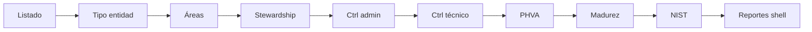
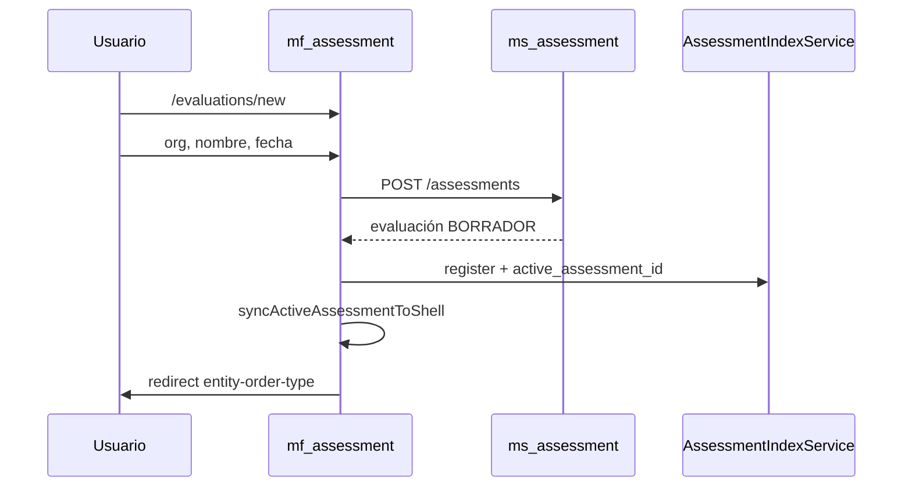

# mf_assessment — Análisis

**Repositorio:** `MSPI_NVA_CO_MR_FRONT/mf_assessment`
**Fecha del documento:** 2026-08-18
**Alcance:** Fase de análisis de requerimientos del microfrontend de evaluaciones de madurez (`mf_assessment`), derivada del código real (`src/app/**`) y de la documentación técnica preexistente en `docs/`.

---

## 1. Actores

| Actor | Origen | Descripción |
|---|---|---|
| **Evaluador** | `docs/DESCRIPCION.md` | Crea y diligencia evaluaciones: configura la entidad, califica controles, ítems PHVA, requisitos de madurez y NIST. |
| **EvaluadorRevisor** | `docs/DESCRIPCION.md` | Revisa y completa evaluaciones (mismo flujo funcional que Evaluador desde la perspectiva del frontend; la diferenciación de permisos ocurre en backend/shell). |
| **AdminSistema / AdminInstrumento** | `docs/DESCRIPCION.md` | Acceso completo vía menú del shell. |
| **mf_shell (host)** | `INTEGRACION-SHELL.md` | Actor de sistema: aloja `mf_assessment` en iframe, provee la sesión JWT y recibe la evaluación activa para habilitar los menús de Evidencias y Reportes. |
| **ms_assessment / ms_catalog / ms_org** | `API-INTEGRACION.md` | Actores de sistema (backend): fuente de verdad de los datos de evaluación, catálogo y organizaciones. |

No se encontró en el código un modelo de roles propio de `mf_assessment` (no hay archivo tipo `authority.ts`); el control de acceso por rol se delega al shell y al backend — el frontend no oculta ni restringe rutas por rol.

## 2. Requerimientos funcionales

Derivados de rutas (`app.routes.ts`), casos de uso (`application/**`) y pantallas (`presentation/pages/**`).

| ID | Requerimiento | Evidencia |
|---|---|---|
| RF-01 | Listar evaluaciones creadas localmente, con botón para crear una nueva o continuar una existente | `EvaluationListPageComponent`, `AssessmentIndexService.listIds()` |
| RF-02 | Crear una evaluación indicando organización, nombre, fecha, periodo y contacto | `EvaluationCreatePageComponent`, `CreateAssessmentUseCase`, `CreateAssessmentRequest` |
| RF-03 | Asignar el tipo de entidad territorial (nacional/territorial) a la evaluación | `EntityOrderTypePageComponent`, `AssignEntityOrderTypeUseCase` |
| RF-04 | Definir áreas y temas (topics) de la organización, con responsable, cargo y contacto por tema | `AreasPageComponent`, `ListAreasUseCase`, `ReplaceAreaTopicsUseCase` |
| RF-05 | Asignar responsables (stewardship) por control, heredado del área o personalizado (`CUSTOM`) | `StewardshipPageComponent`, `PatchControlStewardUseCase`, `PatchControlStewardRequest` |
| RF-06 | Calificar controles administrativos y técnicos mediante árbol jerárquico (dominio → objetivo → control) | `ControlsPageComponent`, `ControlTreeComponent`, `GetRollupUseCase` |
| RF-07 | Ver y editar el detalle de un control: score, hallazgos, evidencia textual, brecha, recomendación, estado | `ControlDetailPanelComponent`, `GetControlDetailUseCase`, `PatchControlScoreUseCase` |
| RF-08 | Calificar ítems del ciclo PHVA (Plan, Do, Check, Act) y visualizar el avance por componente | `PhvaPageComponent`, `score-modules.use-cases.ts`, `PhvaSummary` |
| RF-09 | Calificar requisitos de madurez y visualizar el nivel alcanzado y la matriz de niveles | `MaturityPageComponent`, `MaturitySummary`, `MaturityMatrixRow` |
| RF-10 | Calificar ítems mapeados a funciones del NIST CSF (GV, ID, PR, DE, RS, RC) y visualizar el avance global y por función | `NistPageComponent`, `NistSummary`, `NistFunctionSummary` |
| RF-11 | Navegar entre los 8 pasos del wizard con controles Volver / Listado / Siguiente | `EvaluationWizardNavComponent`, `evaluation-wizard-links.ts` |
| RF-12 | Publicar una evaluación (transición de estado) | `AssessmentRepository.publishAssessment` (definido en el puerto de dominio; sin página de UI dedicada localizada) |
| RF-13 | Navegar desde `mf_assessment` hacia los módulos de Evidencias y Reportes del shell, propagando la evaluación activa | `openShellRoute()` en `shell-bridge.ts`, botón "Reportes" en `NistPageComponent` |
| RF-14 | Recuperar la sesión de autenticación del shell al cargar el microfrontend en iframe | `installAuthParentBridge()`, `AuthSessionService` |
| RF-15 | Registrar cada evaluación creada en un índice local y notificar al shell cuál es la evaluación activa | `AssessmentIndexService.register()`, `syncActiveAssessmentToShell()` |

## 3. Requerimientos no funcionales

| ID | Requerimiento | Evidencia |
|---|---|---|
| RNF-01 | Ejecución independiente en el puerto 4203, desacoplada en tiempo de build del shell | `angular.json` (`"port": 4203`), ausencia de Module Federation |
| RNF-02 | Doble modo de operación: mock (sin backend) y API real, seleccionable por configuración de build | `environment.ts` (`useMocks: true`), `environment.api.ts` (`useMocks: false`), configuración `api` en `angular.json` |
| RNF-03 | Tipado estricto de extremo a extremo (TypeScript `strict`, `strictTemplates`) | `tsconfig.json`, `angularCompilerOptions` |
| RNF-04 | Consistencia de datos ante ediciones concurrentes mediante control de versión optimista (`rowVersion`) | `assessment-conflict.handler.ts`, HTTP 409 → `AssessmentConflictError` |
| RNF-05 | Comunicación segura y acotada entre iframe y shell, restringida a orígenes conocidos | `ALLOWED_PARENTS`/`SHELL_ORIGINS` en `auth-parent-bridge.ts` y `shell-bridge.ts`; cabecera `Content-Security-Policy: frame-ancestors` en `nginx.conf` |
| RNF-06 | Caching del catálogo de referencia en el cliente para evitar recargas repetidas | `CatalogCacheService` (signal en memoria + `sessionStorage`) |
| RNF-07 | Carga perezosa (lazy loading) de cada página del wizard | `loadComponent: () => import(...)` en `app.routes.ts` (todas las rutas) |
| RNF-08 | Servido en producción vía Nginx con compresión y cacheo de estáticos | `nginx.conf` (`gzip on`, `expires 7d` para JS/CSS/imágenes) |
| RNF-09 | Disponibilidad verificable del contenedor en despliegue | `HEALTHCHECK` en `Dockerfile` (`curl -f http://127.0.0.1/`) |

## 4. Reglas de negocio

Extraídas del dominio (`assessment.types.ts`) y de los mappers/handlers de aplicación e infraestructura.

1. **Estados de evaluación**: `BORRADOR` → `EN_DILIGENCIAMIENTO` → `PUBLICADO` (tipo `AssessmentStatus`). El frontend solo muestra el estado como badge; la transición de estado la gestiona el backend.
2. **Escala de calificación fija**: los valores permitidos para calificar un control, ítem PHVA, requisito de madurez o ítem NIST son `0, 20, 40, 60, 80, 100` o `N/A` (constante `RATING_SCALE_VALUES`), reflejada en `RatingSelectorComponent`.
3. **Estado de calificación por ítem**: cada elemento calificable tiene `scoreStatus` en `{PENDING, SCORED, NA}` (`ScoreStatus`).
4. **Tipos de control**: `ADMIN` (administrativo) y `TECH` (técnico) son mutuamente excluyentes por ruta (`/controls/admin` vs `/controls/tech`), aunque ambas usan el mismo componente `ControlsPageComponent` parametrizado por `controlType`.
5. **Stewardship heredado vs. personalizado**: el responsable de un control puede provenir del área (`FROM_AREA`) o ser un valor personalizado (`CUSTOM`) con nombre, rol y contacto propios (`PatchControlStewardRequest`).
6. **Editable vs. heredado en PHVA/Madurez/NIST**: cada ítem tiene una bandera `editable`; cuando no es editable, se muestra el `effectiveScore` (heredado de otra calificación), no un campo de edición directa — regla de negocio replicada en el mock (`mock-assessment.repository.ts`) y en el mapeo API (`mapPhvaItemFromApi`, `mapNistItemFromApi`, `mapMaturityRequirementFromApi`).
7. **Control de concurrencia optimista**: toda operación de escritura sobre la evaluación (asignar tipo de entidad, calificar) puede fallar con HTTP 409 si `rowVersion` está desactualizado; en ese caso se recarga la evaluación desde el backend y se lanza `AssessmentConflictError` con el objeto actualizado, en vez de sobrescribir silenciosamente.
8. **Nivel de madurez alcanzado**: se deriva del campo `nivelAlcanzado` devuelto por el backend (p. ej. `"Nivel 1"`), del cual el frontend extrae el número (`parseInt` sobre dígitos) para uso interno (`currentLevel`); el frontend no calcula el nivel, solo lo interpreta para presentación.
9. **Bloqueo de nivel de madurez**: el backend puede indicar requisitos bloqueantes para alcanzar el siguiente nivel (`MaturityBlockingInfo.blockingRequirements`), que el frontend lista para orientar al evaluador.
10. **Avance PHVA capado por componente**: el resumen PHVA expresa el avance de cada componente (`PLAN`, `DO`, `CHECK`, `ACT`) como un valor "capado" (`cappedL`) y compara contra un peso esperado (`expectedWeight`) con posible `breach` (desviación) — cálculo realizado en backend, consumido tal cual por el frontend.
11. **Agrupación PHVA cláusula → sub-numeral (v2)**: `PhvaPageComponent` agrupa ítems con `nodeType === 'CLAUSE'` y anida bajo cada una los `ITEM` cuyo `parentCode` coincide; el mapeo API propaga `parentCode`/`nodeType` desde el snapshot.
12. **Sincronización de evaluación activa obligatoria para navegación cruzada**: para que los menús de Evidencias y Reportes del shell operen sobre la evaluación correcta, toda creación/selección de evaluación debe propagar su ID al shell (`syncActiveAssessmentToShell`); si el MF se ejecuta fuera de iframe (`window.parent === window`), la sincronización se limita a `localStorage` local.

## 5. Casos de uso

Basado en `application/**` (nombres de clase reales) y en las páginas que los invocan.

| Caso de uso | Clase | Página que lo invoca |
|---|---|---|
| Listar evaluaciones | `ListAssessmentsUseCase` | `EvaluationListPageComponent` |
| Crear evaluación | `CreateAssessmentUseCase` | `EvaluationCreatePageComponent` |
| Obtener evaluación | `GetAssessmentUseCase` | varias páginas del wizard (carga inicial) |
| Asignar tipo de entidad | `AssignEntityOrderTypeUseCase` | `EntityOrderTypePageComponent` |
| Listar áreas | `ListAreasUseCase` | `AreasPageComponent` |
| Reemplazar temas de un área | `ReplaceAreaTopicsUseCase` | `AreasPageComponent` |
| Listar stewardship | `ListStewardshipUseCase` | `StewardshipPageComponent` |
| Asignar responsable de control | `PatchControlStewardUseCase` | `StewardshipPageComponent` |
| Obtener rollup de controles | `GetRollupUseCase` | `ControlsPageComponent`, `ControlTreeComponent` |
| Obtener detalle de control | `GetControlDetailUseCase` | `ControlDetailPanelComponent` |
| Calificar control | `PatchControlScoreUseCase` | `ControlDetailPanelComponent` |
| Listar controles (plano) | `ListControlsUseCase` | soporte de `ControlsPageComponent` |
| Casos de uso PHVA / Madurez / NIST | `score-modules.use-cases.ts` (`GetPhvaSummaryUseCase`, `GetMaturitySummaryUseCase`, entre otros) | `PhvaPageComponent`, `MaturityPageComponent`, `NistPageComponent` |
| Listar organizaciones | `ListOrganizationsUseCase` | `EvaluationCreatePageComponent` |

## 6. Flujos principales (síntesis de `docs/FLUJOS.md`)

### 6.1 Wizard de diligenciamiento (8 pasos)



Cada pantalla incluye una barra de navegación sticky (`EvaluationWizardNavComponent`) con acciones **Volver**, **Listado** y **Siguiente**, definida a partir de `WIZARD_STEPS` en `evaluation-wizard-links.ts`.

### 6.2 Crear evaluación



### 6.3 Calificar un control

1. El usuario abre un nodo hoja en el árbol (`ControlTreeComponent`, evento `nodeSelect` solo en hojas — `isRollupLeaf`).
2. Se abre el panel lateral (`ControlDetailPanelComponent`) con score, hallazgos, textos y evidencia.
3. Al guardar, se ejecuta `PATCH /assessments/{id}/controls/{nodeId}` con `PatchControlScoreRequest`.
4. Si el backend detecta conflicto de versión, se captura `AssessmentConflictError` y se informa al usuario que "otro usuario modificó esta evaluación" y que los datos se recargaron.

### 6.4 Stewardship personalizado

El body enviado al backend (`PATCH .../controls/{nodeId}/steward`) sigue el contrato OpenAPI documentado:

```json
{
  "stewardSource": "CUSTOM",
  "stewardCustomName": "...",
  "stewardCustomStaffRole": "..."
}
```

### 6.5 Ir a Evidencias o Reportes

Desde la pantalla NIST (botón **Reportes**) o desde el panel de control, se invoca `openShellRoute('/reports' | '/evidence', assessmentId)`, que envía un mensaje `MSPI_SHELL_NAV` al padre; el shell navega internamente sin abrir una pestaña nueva.

### 6.6 Listado → Continuar

Desde `/evaluations`, el botón **Continuar** lleva al último paso configurado; por defecto, si no hay información adicional, redirige a `entity-order-type`.

## 7. Interfaces externas consumidas

| Sistema | Puerto | Consumo desde `mf_assessment` |
|---|---|---|
| `ms_assessment` | 8084 | CRUD de evaluaciones, áreas, stewardship, controles, PHVA, madurez, NIST, publicación (ver detalle de rutas en `06-Implementacion-Despliegue.md` y `docs/API-INTEGRACION.md`) |
| `ms_catalog` | 8085 | Catálogo cacheado en cliente: tipos de entidad, plantilla de evaluación, escalas (`CatalogCacheService`) |
| `ms_org` | 8083 | Listado de organizaciones para el selector al crear una evaluación (`ListOrganizationsUseCase`) |
| `mf_shell` | 4200 | Sesión de autenticación (`postMessage`), evaluación activa, navegación a Evidencias/Reportes |

## 8. Fuera de alcance / limitaciones detectadas en el análisis

- No se encontró en el código una pantalla dedicada a **publicar** la evaluación (`publishAssessment` está definido en el puerto `AssessmentRepository` pero no se localizó un botón o página que lo invoque en `presentation/pages/**`); se documenta como posible funcionalidad incompleta o delegada a otro punto de entrada no cubierto por este análisis.
- No existe un mecanismo de **búsqueda o filtro** en el listado de evaluaciones más allá de lo que ofrezca `EvaluationListPageComponent` sobre el índice local.
- El **cálculo de agregados** (rollup, avance PHVA, nivel de madurez, avance NIST) es responsabilidad exclusiva del backend; el frontend no reimplementa fórmulas de puntuación, lo cual reduce el riesgo de inconsistencia entre cliente y servidor pero también implica que estos documentos no pueden describir el algoritmo de cálculo (no está en este repositorio).
