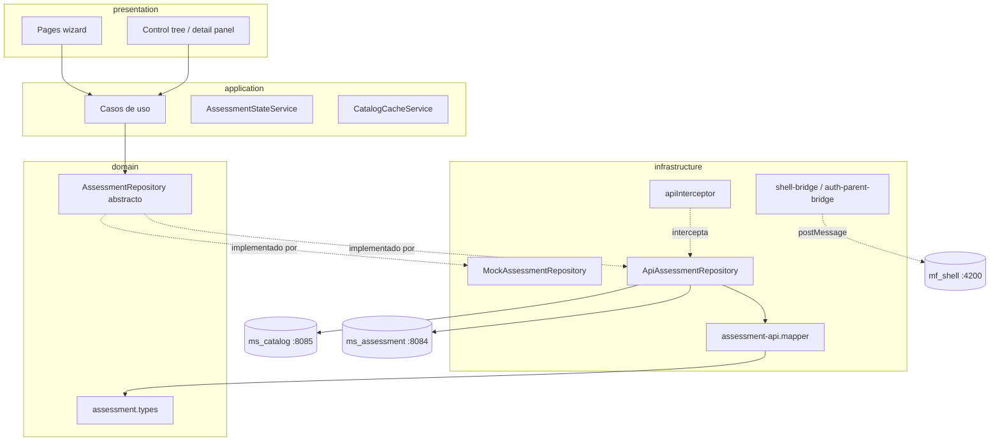
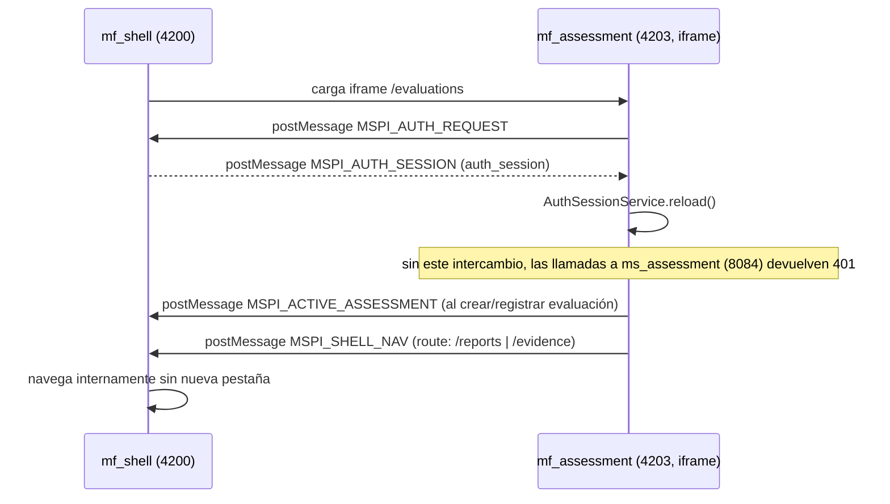
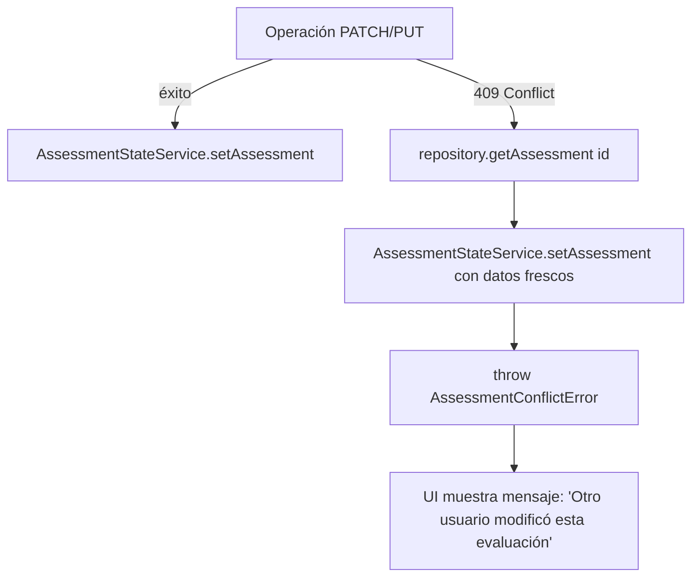

# mf_assessment — Diseño

**Repositorio:** `MSPI_NVA_CO_MR_FRONT/mf_assessment`
**Fecha del documento:** 2026-08-18
**Alcance:** Fase de diseño arquitectónico del microfrontend de evaluaciones de madurez (`mf_assessment`), basada en la estructura real de `src/app/**` y en `docs/ARQUITECTURA.md` / `docs/DIAGRAMAS.md`.

---

## 1. Estilo arquitectónico

`mf_assessment` implementa una **arquitectura por capas (hexagonal / puertos y adaptadores) simplificada**, con separación explícita en cuatro carpetas dentro de `src/app/`:

```
src/app/
├── domain/              # assessment.types, repositorios abstractos (puertos)
├── application/         # casos de uso, assessment-state, catalog-cache
├── infrastructure/      # implementaciones API/mock, mappers, interceptores, shell-bridge
└── presentation/        # páginas del wizard, componentes compartidos
```

Esta organización es idéntica en intención a la de `mf_auth` (mismo patrón replicado en el ecosistema MSPI), pero con un dominio funcional propio: el instrumento de evaluación de madurez.



## 2. Inyección de dependencias: mock vs. API

La elección de implementación concreta para cada puerto de dominio se resuelve en `app.config.ts` según el flag `environment.useMocks`:

```typescript
{
  provide: AssessmentRepository,
  useClass: environment.useMocks ? MockAssessmentRepository : ApiAssessmentRepository,
},
{
  provide: CatalogRepository,
  useClass: environment.useMocks ? MockCatalogRepository : ApiCatalogRepository,
},
{
  provide: OrganizationListRepository,
  useClass: environment.useMocks ? MockOrganizationListRepository : ApiOrganizationListRepository,
},
```

Esto permite que **toda la capa de presentación y aplicación sea agnóstica** al origen real de los datos: los componentes y casos de uso dependen únicamente de las clases abstractas `AssessmentRepository`, `CatalogRepository` y `OrganizationListRepository` (definidas en `domain/`), nunca de sus implementaciones.

## 3. Repositorios (puertos) y sus operaciones

`AssessmentRepository` (`domain/assessment.repository.ts`) concentra **todo** el contrato de datos de la evaluación en una única clase abstracta con 24 métodos, agrupables así:

| Grupo | Métodos |
|---|---|
| Ciclo de vida de evaluación | `listAssessments`, `createAssessment`, `getAssessment`, `patchAssessment`, `assignEntityOrderType`, `publishAssessment`, `cloneAssessment` |
| Áreas | `listAreas`, `replaceAreaTopics` |
| Controles | `listControls`, `getControlDetail`, `patchControlScore`, `getRollup`, `listStewardship`, `patchControlSteward` |
| PHVA | `listPhvaItems`, `patchPhvaItemScore`, `getPhvaSummary` |
| Madurez | `listMaturityRequirements`, `patchMaturityRequirementScore`, `getMaturitySummary` |
| NIST | `listNistItems`, `patchNistItemScore`, `getNistSummary` |
| Diagnóstico | `getDomainEffectiveness`, `getDiagnosticDashboard`, `listGaps` |

Cada grupo tiene dos implementaciones en `infrastructure/assessment/`: `ApiAssessmentRepository` (HTTP real contra `ms_assessment`) y `MockAssessmentRepository` (676 líneas, datos en memoria más árboles de rollup sintéticos, usada en desarrollo sin backend).

De forma análoga existen `CatalogRepository` (`domain/catalog/catalog.repository.ts`) con `ApiCatalogRepository`/`MockCatalogRepository`, y `OrganizationListRepository` con `ApiOrganizationListRepository`/`MockOrganizationListRepository`.

## 4. Casos de uso (capa `application/`)

Los casos de uso son clases Angular `@Injectable({ providedIn: 'root' })` de responsabilidad única, cada una envolviendo una llamada al repositorio (patrón *Command*/*Query* explícito, sin lógica de negocio adicional salvo en los casos que gestionan el estado):

- `assessment.use-cases.ts`: `ListAssessmentsUseCase`, `CreateAssessmentUseCase`, `GetAssessmentUseCase`, `AssignEntityOrderTypeUseCase`, `ListAreasUseCase`, `ReplaceAreaTopicsUseCase`, `ListStewardshipUseCase`, `PatchControlStewardUseCase`.
- `control.use-cases.ts`: `GetRollupUseCase`, `GetControlDetailUseCase`, `PatchControlScoreUseCase`, `ListControlsUseCase`.
- `score-modules.use-cases.ts`: casos de uso de PHVA, Madurez y NIST (listar ítems, calificar, obtener resumen).

`AssignEntityOrderTypeUseCase` es un ejemplo de caso de uso con lógica adicional: delega en `runWithRowVersionConflict()` (`assessment-conflict.handler.ts`), que envuelve la llamada al repositorio para capturar conflictos HTTP 409 y actualizar el estado en memoria (`AssessmentStateService`) con la versión fresca del servidor.

## 5. Estado en cliente

| Servicio | Función | Persistencia |
|---|---|---|
| `AssessmentStateService` | Evaluación actual en memoria, expuesta como `signal`/`computed` de Angular (`assessment`, `rowVersion`) | Ninguna directa; al fijar una evaluación escribe `active_assessment_id` en `localStorage` y notifica al shell |
| `AssessmentIndexService` | Índice de IDs de evaluaciones creadas + registro por evaluación | `localStorage` (`mspi_assessment_index`, `mspi_assessment_{id}`, máx. 100 IDs) |
| `CatalogCacheService` | Catálogo de referencia (tipos de entidad, plantilla, escalas) cacheado tras la primera carga | `sessionStorage` (`catalog_bundle`) + `signal` en memoria |

`AssessmentStateService` usa **Angular Signals** (`signal`, `computed`) en lugar de `BehaviorSubject`/RxJS para el estado reactivo de la evaluación activa, mientras que `CatalogCacheService` combina `signal` para el estado con un `Observable` (`ensureLoaded()`) para la carga asíncrona inicial — patrón mixto Signals/RxJS característico de Angular 19.

## 6. Mapeo API ↔ dominio

`infrastructure/assessment/assessment-api.mapper.ts` (366 líneas) concentra toda la traducción entre los DTO devueltos por `ms_assessment` y los tipos de dominio (`assessment.types.ts`). Ejemplos de normalización real detectados en el código:

- `mapAreaFromApi`: traduce `areaName` (API) → `name` (dominio).
- `mapAreaTopicFromApi`: traduce `topic`/`name` (API) → `topic` (dominio, con `.trim()`).
- `mapStewardshipFromApi`: traduce `effectiveStewardName`/`effectiveStewardStaffRole` (API) → `stewardName`/`stewardRole` (dominio), y deriva la etiqueta de UI `source: 'AREA' | 'OVERRIDE'` a partir de `stewardSource: 'FROM_AREA' | 'CUSTOM'`.
- `mapControlFromApi`: reconcilia alias duplicados entre API y dominio (`evidenceText`/`findingText`, `recommendationText`/`improvementText`, `code`/`controlCode`, `title`/`controlName`) mediante operadores `??` en cascada.
- `mapRollupNodeFromApi`: función **recursiva** que reconstruye el árbol de controles (`children`) asignando el nivel de profundidad (`level`) de forma incremental.
- `mapMaturitySummaryFromApi`: extrae el número de nivel desde un texto libre (`nivelAlcanzado`, p. ej. `"Nivel 2"`) con `parseInt(...replace(/\D/g, ''))`.

Esta capa de mapeo es la responsable de absorber la heterogeneidad de nombres del contrato OpenAPI de `ms_assessment`, evitando que la inconsistencia de nombres del backend se propague a la capa de presentación.

## 7. Componentes de presentación

### 7.1 Páginas (una por paso del wizard + soporte)

| Componente | Ruta | Responsabilidad |
|---|---|---|
| `EvaluationListPageComponent` | `/evaluations` | Listado desde `AssessmentIndexService` |
| `EvaluationCreatePageComponent` | `/evaluations/new` | Formulario de alta (organización, nombre, fecha, periodo, contacto) |
| `EntityOrderTypePageComponent` | `/evaluations/:id/entity-order-type` | Selección de tipo de entidad |
| `AreasPageComponent` | `/evaluations/:id/areas` | Áreas y temas |
| `StewardshipPageComponent` | `/evaluations/:id/stewardship` | Responsables por control |
| `ControlsPageComponent` | `/evaluations/:id/controls/admin` y `/controls/tech` | Árbol + calificación, parametrizado por `controlType` |
| `PhvaPageComponent` | `/evaluations/:id/phva` | Ítems y resumen PHVA; en v2 agrupa sub-numerales bajo su cláusula (`parentCode`/`nodeType`) |
| `MaturityPageComponent` | `/evaluations/:id/maturity` | Requisitos y matriz de madurez |
| `NistPageComponent` | `/evaluations/:id/nist` | Ítems NIST, resumen por función, botón Reportes |
| `EvaluationsHomePageComponent` | (soporte) | Página adicional presente en `presentation/pages/` no listada explícitamente en `app.routes.ts` como ruta propia — se documenta su existencia en el código |

Todas las rutas están declaradas con **lazy loading por componente** (`loadComponent: () => import(...)`), sin `NgModule`, consistente con Angular standalone components.

### 7.2 Componentes compartidos

| Componente | Uso |
|---|---|
| `EvaluationWizardNavComponent` | Barra de navegación sticky (Volver / Listado / Siguiente), configurable con `placement`, `backLink`, `backLabel`, `showListLink` |
| `ControlTreeComponent` | Árbol jerárquico de nodos de rollup, **recursivo** (`forwardRef(() => ControlTreeComponent)` para autorreferencia en standalone components), solo emite selección en nodos hoja (`isRollupLeaf`) |
| `ControlDetailPanelComponent` | Panel de detalle/edición de un control (score, hallazgos, evidencia, PATCH) |
| `RatingSelectorComponent` | Selector de escala fija `[0,20,40,60,80,100,N/A]` (constante `RATING_SCALE_VALUES`), con `@Input`/`@Output` clásicos (no signals) |

## 8. Integración con el shell (`mf_shell`)



Decisiones de diseño verificadas en código:

- **Sin Module Federation**: la integración es 100% por `<iframe>` + `postMessage` + `localStorage`, sin `@angular-architects/module-federation` ni `webpack.config.js`/`federation.config.js` en el repositorio.
- **Lista blanca de orígenes**: tanto `auth-parent-bridge.ts` (`ALLOWED_PARENTS`) como `shell-bridge.ts` (`SHELL_ORIGINS`) restringen la comunicación a `http://localhost:4200` y `http://127.0.0.1:4200`, verificando `event.origin` antes de procesar cualquier mensaje entrante.
- **Expiración de sesión defensiva**: `installAuthParentBridge` descarta la sesión recibida si `parsed.expiresAt` ya pasó (`Date.now() >= parsed.expiresAt`), antes de persistirla en `localStorage`.
- **Fallback fuera de iframe**: `syncActiveAssessmentToShell` y `openShellRoute` detectan `window.parent === window` (ejecución standalone, no embebida) y en ese caso solo escriben en `localStorage` local o navegan con `window.location.href`, sin enviar `postMessage`.

## 9. Manejo de errores y concurrencia

`ApiError` (`infrastructure/api/api-response.model.ts`) normaliza los errores HTTP capturados por `apiInterceptor`. El caso particular de **conflicto de versión (HTTP 409)** tiene un flujo de diseño explícito:



Este patrón (`runWithRowVersionConflict`) se reutiliza en los casos de uso que modifican el estado principal de la evaluación (p. ej. `AssignEntityOrderTypeUseCase`), evitando duplicar la lógica de reconciliación en cada componente.

## 10. Configuración de build (`angular.json`)

| Configuración | `fileReplacements` | Uso |
|---|---|---|
| `development` (por defecto en `serve`) | ninguno | `ng serve` — mocks, sin optimización, con sourcemaps |
| `api` | `environment.ts` → `environment.api.ts` | `ng serve --configuration=api` — contra backends reales en 8083/8084/8085 |
| `production` (por defecto en `build`) | ninguno (usa `environment.ts`, `useMocks: true`) | `ng build` — build de producción con hashing de salida |

**Hallazgo de diseño relevante**: el build de **producción por defecto usa `environment.ts` con `useMocks: true`**. El Dockerfile (`deployment/Dockerfile`) corrige esto explícitamente ejecutando `npm run build -- --configuration=api`, de modo que la imagen Docker sí queda apuntando a los backends reales; un build de producción ejecutado sin ese flag (`ng build` a secas) generaría un artefacto en modo mock. Este comportamiento se detalla en `06-Implementacion-Despliegue.md`.

## 11. Decisiones técnicas destacadas

1. **Signals de Angular para estado local**, en vez de servicios basados exclusivamente en RxJS — reduce boilerplate de suscripción/desuscripción en componentes standalone.
2. **Un único puerto de dominio (`AssessmentRepository`) de gran superficie**, en lugar de puertos separados por submódulo (controles, PHVA, madurez, NIST) — favorece cohesión de la evaluación como agregado, a costa de una interfaz extensa de 24 métodos.
3. **Persistencia dual en `localStorage`/`sessionStorage`** para suplir carencias del backend (listado de evaluaciones) y para performance (caché de catálogo), documentada explícitamente como solución temporal ("limitación actual") en `docs/DESCRIPCION.md`.
4. **Componente de árbol recursivo con `forwardRef`**, patrón necesario en Angular standalone components para que un componente se autorreferencia en su propio array `imports`.
5. **Reconciliación de nombres API↔dominio centralizada en un único archivo de mappers** (`assessment-api.mapper.ts`), en lugar de mapeos dispersos en cada repositorio o componente.
