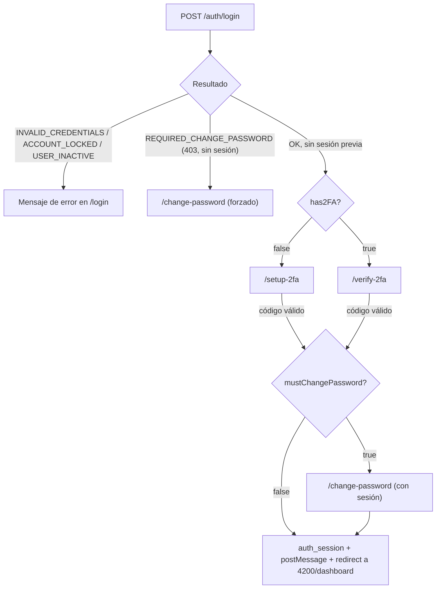
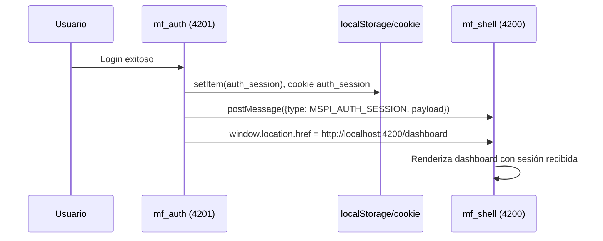
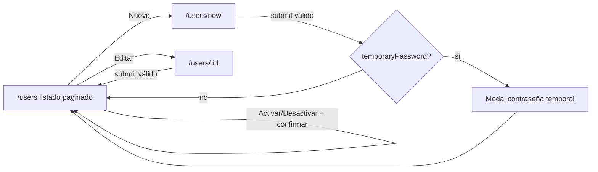

# mf_auth — Análisis

**Repositorio:** `MSPI_NVA_CO_MR_FRONT/mf_auth`
**Fecha del documento:** 2026-08-18
**Alcance:** Requerimientos funcionales y no funcionales, reglas de negocio, actores, casos de uso y flujos de usuario del microfrontend de autenticación, derivados de `docs/RUTAS-Y-PANTALLAS.md`, `docs/FLUJOS.md` y del código fuente real en `src/app`.

---

## 1. Actores

Identificados a partir de los roles definidos en `src/app/domain/auth/auth.repository.ts` (tipo `AuthRole`) y del mapa de autoridades en `src/app/domain/auth/authority.ts`:

| Rol (`AuthRole`) | Autoridades asignadas (`ROLE_AUTHORITIES`) | Rol funcional en el sistema |
|---|---|---|
| `AdminSistema` | `USER_MANAGE`, `ORG_MANAGE`, `TEMPLATE_MANAGE`, `ASSESSMENT_EDIT`, `ASSESSMENT_REVIEW`, `ASSESSMENT_VIEW`, `REPORT_EXPORT`, `AUDIT_VIEW` | Administrador con acceso total, único rol con gestión de usuarios |
| `AdminInstrumento` | `TEMPLATE_MANAGE`, `ASSESSMENT_VIEW`, `REPORT_EXPORT` | Gestiona plantillas/instrumentos de evaluación |
| `Evaluador` | `ASSESSMENT_EDIT`, `ASSESSMENT_VIEW`, `REPORT_EXPORT` | Ejecuta evaluaciones |
| `Revisor` | `ASSESSMENT_REVIEW`, `ASSESSMENT_VIEW`, `REPORT_EXPORT` | Revisa evaluaciones |
| `EvaluadorRevisor` | `ASSESSMENT_EDIT`, `ASSESSMENT_REVIEW`, `ASSESSMENT_VIEW`, `REPORT_EXPORT` | Rol combinado evaluador + revisor |
| `Lector` | `ASSESSMENT_VIEW`, `REPORT_EXPORT` | Acceso de solo lectura; **requiere organización asociada** (`organizationId`) al crearse, según `user-form-page.component.ts` (`requiresOrganization`) |

Un usuario puede tener **múltiples roles simultáneamente** (`roles: UserRole[]` en `user.types.ts`), y sus autoridades efectivas son la unión de las autoridades de todos sus roles (`getUserAuthorities`).

Actor adicional implícito: **`mf_shell`** (no es un usuario humano, sino el sistema anfitrión) actúa como receptor de la sesión vía `postMessage` y como contenedor `iframe` de la pantalla `/users`.

## 2. Requerimientos funcionales

Basados en `docs/RUTAS-Y-PANTALLAS.md`, `docs/FLUJOS.md` y verificación directa en el código:

| ID | Requerimiento | Evidencia en código |
|---|---|---|
| RF-01 | El sistema debe permitir iniciar sesión con usuario/correo y contraseña | `login-page.component.ts`, `AuthRepository.login()` |
| RF-02 | El sistema debe distinguir y comunicar al usuario los errores: credenciales inválidas, cuenta bloqueada, usuario inactivo, contraseña por cambiar | función `errorMessage(code)` en `login-page.component.ts` |
| RF-03 | Tras login exitoso sin 2FA configurado, el sistema debe redirigir siempre a `/setup-2fa` | Comentario y lógica en `onSubmit()` de `login-page.component.ts` |
| RF-04 | El sistema debe generar un secreto TOTP y un código QR para configurar 2FA | `Setup2FAPageComponent.generateTOTPSecret()`, `authRepository.totpSetup()`, librería `qrcode` |
| RF-05 | El sistema debe permitir copiar la clave secreta TOTP al portapapeles como alternativa al escaneo de QR | `onCopySecret()` en `setup-2fa-page.component.ts` |
| RF-06 | El sistema debe verificar un código TOTP de 6 dígitos antes de habilitar 2FA o de completar el login | `totpVerify()`, `Verify2FAPageComponent`, `Setup2FAPageComponent.onSubmit()` |
| RF-07 | El sistema debe forzar el cambio de contraseña cuando el backend indique `mustChangePassword` o el código `REQUIRED_CHANGE_PASSWORD` | `change-password-page.component.ts`, flujo `forcedUsername` |
| RF-08 | El sistema debe validar la nueva contraseña contra reglas de complejidad (≥8 caracteres, mayúscula, minúscula, número, carácter especial) y coincidencia con la confirmación | `passwordValidation` / `passwordsMatch` getters en `change-password-page.component.ts` |
| RF-09 | El sistema debe persistir la sesión autenticada y notificarla al shell | `AuthSessionService.setSession()` |
| RF-10 | El sistema debe advertir al usuario ~60 segundos antes de que expire su sesión y ofrecer reautenticación | `SessionExpiryService.scheduleWarning()` |
| RF-11 | El sistema debe listar usuarios de forma paginada, con búsqueda por texto y filtros por rol y estado | `UserListPageComponent`, `GetUsersPageUseCase`, `UserRepository.getPage()` |
| RF-12 | El sistema debe permitir activar/desactivar un usuario (cambio de estado) con confirmación previa | `openConfirm`/`confirmToggle` en `user-list-page.component.ts`, `UpdateUserStatusUseCase` |
| RF-13 | El sistema debe permitir crear un usuario nuevo, generando una contraseña temporal que se muestra una única vez | `CreateUserUseCase`, `temporaryPassword`/`showPasswordDialog` en `user-form-page.component.ts` |
| RF-14 | El sistema debe permitir editar nombre, correo y roles de un usuario existente | `UpdateUserUseCase`, formulario de edición (`isEdit`) |
| RF-15 | El sistema debe exigir organización asociada cuando el rol asignado incluye `Lector` | `requiresOrganization` (computed) en `user-form-page.component.ts` |
| RF-16 | El sistema debe restringir el acceso a la gestión de usuarios a los usuarios con autoridad `USER_MANAGE` | `canManage` (computed con `hasAuthority`) en `user-list-page.component.ts` y `user-form-page.component.ts` |
| RF-17 | El sistema debe soportar un modo sin backend (mock) que replique reglas de seguridad reales para desarrollo | `MockAuthRepository`, `MockUserRepository`, conmutado por `environment.useMocks` |

## 3. Requerimientos no funcionales

| ID | Requerimiento | Evidencia / mecanismo |
|---|---|---|
| RNF-01 | El microfrontend debe poder compilarse y ejecutarse de forma aislada del resto del ecosistema | Proyecto Angular independiente, `ng serve` en puerto 4201 propio |
| RNF-02 | Las peticiones HTTP deben adjuntar automáticamente el token JWT sin intervención manual en cada componente | `apiInterceptor` (interceptor funcional de Angular) |
| RNF-03 | Las respuestas de error de la API deben normalizarse a un formato único consumible por la UI | `ApiError`, desestructuración `{data, meta}` / `{error, meta}` en `api.interceptor.ts` |
| RNF-04 | La sesión debe sobrevivir a recargas de página | Persistencia en `localStorage` (`AuthSessionService.readFromStorage()`) |
| RNF-05 | Ante error 401 de cualquier llamada, la sesión local debe invalidarse | `catchError` en `api.interceptor.ts`: `authSession.clearSession()` |
| RNF-06 | La aplicación debe poder ser embebida como `iframe` desde el shell sin ser bloqueada por políticas de seguridad del navegador | `Content-Security-Policy: frame-ancestors` en `deployment/nginx.conf` |
| RNF-07 | Los activos estáticos deben servirse con cacheo agresivo en producción | Bloque `location ~* \.(js\|css\|png...)$ { expires 7d; ... }` en `nginx.conf` |
| RNF-08 | El build de producción debe generar hashing de archivos para invalidación de caché | `"outputHashing": "all"` en configuración `production` de `angular.json` |
| RNF-09 | El código debe compilarse en modo estricto de TypeScript | `"strict": true` y flags adicionales en `tsconfig.json` |
| RNF-10 | El contenedor debe exponer verificación de salud para orquestadores | `HEALTHCHECK` en `deployment/Dockerfile` (`curl` cada 30s) |

**Limitación declarada:** no se encontró ningún requerimiento no funcional relativo a rendimiento cuantificado (tiempos de respuesta, presupuestos de bundle), accesibilidad (WCAG) ni internacionalización — no hay librerías `@angular/localize` en uso ni atributos ARIA sistemáticos verificados en el código analizado.

## 4. Reglas de negocio

Extraídas directamente del código (no inventadas):

1. **Bloqueo de cuenta por intentos fallidos** (mock, replicando `ms_iam`): máximo `3` intentos fallidos (`SECURITY_CONFIG.maxLoginAttempts`), bloqueo de `15` minutos (`SECURITY_CONFIG.lockMinutes`) — `mock-auth.repository.ts`.
2. **Usuario inactivo no puede iniciar sesión**: se retorna el error `USER_INACTIVE` antes de evaluar la contraseña.
3. **Contraseña de la cuenta mock**: fija en `password123` para todos los usuarios de prueba (`mock-auth.repository.ts`); no aplica a modo API real.
4. **Expiración de sesión**: el JWT expira por defecto a los `300` segundos según comentario en `SessionExpiryService` (`ms_iam`); en modo mock la sesión expira a los `3600` segundos (`expiresIn: 60 * 60`).
5. **Aviso de expiración**: se dispara 60 segundos antes del vencimiento (`warnAt = expiresAt - 60_000`).
6. **Regla de complejidad de contraseña nueva**: longitud mínima 8, al menos una mayúscula, una minúscula, un dígito y un carácter especial (`change-password-page.component.ts`).
7. **Ruta obligatoria tras login sin 2FA**: independientemente de si se debe o no cambiar contraseña, si el usuario **no** tiene 2FA configurado (`has2FA === false`), siempre se redirige primero a `/setup-2fa` (ver comentario "Flujo de autenticación (Proyectociber2026 / MSPI)" en `login-page.component.ts`).
8. **Orden de flujo con 2FA + cambio de contraseña pendiente**: si el usuario tiene 2FA, se navega a `/verify-2fa`; solo tras verificar el código se evalúa si además debe cambiar la contraseña, redirigiendo entonces a `/change-password`.
9. **Rol `Lector` requiere organización**: al marcar el checkbox de rol `Lector` en el formulario de usuario, el campo `organizationId` se vuelve obligatorio; al desmarcarlo, se limpia (`toggleRole()`).
10. **Autorización para gestión de usuarios**: solo usuarios cuyo conjunto de roles resuelva la autoridad `USER_MANAGE` (actualmente solo `AdminSistema`) pueden acceder a `/users/new` y `/users/:id`; si no la tienen, son redirigidos de vuelta a `/users` (`ngOnInit` de `user-form-page.component.ts`).
11. **Contraseña temporal de alta**: al crear un usuario, si el backend/mock retorna `temporaryPassword`, se muestra en un diálogo modal de una sola vez antes de continuar (`showPasswordDialog`).
12. **Sin guards de ruta**: `docs/RUTAS-Y-PANTALLAS.md` señala explícitamente "Sin guards en rutas"; el control de acceso a `/users/*` se hace **dentro del componente** (`canManage`), no mediante `CanActivate` de Angular Router — confirmado por ausencia de `guards` en `app.routes.ts`.

## 5. Casos de uso

### CU-01 — Iniciar sesión
- **Actor:** cualquier usuario registrado en `ms_iam`.
- **Precondición:** el usuario cuenta con credenciales activas.
- **Flujo principal:** el usuario ingresa usuario/correo y contraseña en `/login`; el sistema invoca `LoginUseCase.execute()`; si la respuesta es exitosa, se persiste la sesión y se determina la siguiente pantalla según `mustChangePassword`/`has2FA`.
- **Flujos alternativos:** credenciales inválidas, cuenta bloqueada, usuario inactivo, contraseña por cambiar (`REQUIRED_CHANGE_PASSWORD`).

### CU-02 — Configurar 2FA (TOTP)
- **Actor:** usuario autenticado sin 2FA habilitado.
- **Precondición:** sesión activa (`AuthSessionService.session()` no nulo); si no la hay, se redirige a `/login`.
- **Flujo principal:** el sistema solicita `totpSetup()`, genera QR con `qrcode`, el usuario escanea o copia el secreto en su app de autenticación, ingresa el código de 6 dígitos, el sistema llama `totpVerify()` y, si es exitoso, marca `has2FA: true` en la sesión.

### CU-03 — Verificar 2FA en login
- **Actor:** usuario autenticado con 2FA ya habilitado.
- **Flujo principal:** en `/verify-2fa`, el usuario ingresa el código generado por su app; el sistema lo valida contra `totpVerify()`; de ser correcto, continúa a `/change-password` (si aplica) o al dashboard del shell.
- **Flujo alternativo — cancelar:** `onCancel()` limpia la sesión y regresa a `/login`.

### CU-04 — Cambiar contraseña
- **Actor:** usuario autenticado (cambio voluntario) o usuario recién autenticado con `REQUIRED_CHANGE_PASSWORD` (cambio forzado, sin sesión aún, identificado por `sessionStorage['change_password_username']`).
- **Flujo principal:** el usuario ingresa contraseña actual, nueva y confirmación; el sistema valida complejidad y coincidencia; invoca `changePassword()`; si el cambio fue forzado, cierra la sesión y regresa a `/login`; si fue voluntario dentro de una sesión activa, actualiza `mustChangePassword: false` en la sesión.

### CU-05 — Listar y filtrar usuarios
- **Actor:** cualquier usuario autenticado (el listado en sí no exige `USER_MANAGE`, pero las acciones de creación/edición sí).
- **Flujo principal:** `UserListPageComponent` carga una página de usuarios (`GetUsersPageUseCase`) aplicando `search`, `roleFilter`, `statusFilter`; soporta paginación (`prevPage`/`nextPage`).

### CU-06 — Activar/Desactivar usuario
- **Actor:** usuario con autoridad `USER_MANAGE`.
- **Flujo principal:** desde el listado, se abre un diálogo de confirmación (`openConfirm`) y, al confirmar, se invoca `UpdateUserStatusUseCase` alternando `ACTIVE`/`INACTIVE`.

### CU-07 — Crear usuario
- **Actor:** usuario con autoridad `USER_MANAGE`.
- **Flujo principal:** el formulario carga catálogo de roles (`RolesRepository.getRoles()`) y de organizaciones (`ListOrganizationsUseCase`); valida nombre, correo (regex), al menos un rol, y organización si el rol `Lector` está seleccionado; invoca `CreateUserUseCase`; si hay contraseña temporal, la muestra antes de volver al listado.

### CU-08 — Editar usuario
- **Actor:** usuario con autoridad `USER_MANAGE`.
- **Flujo principal:** similar a CU-07 pero precargando datos vía `GetUserByIdUseCase` e invocando `UpdateUserUseCase` (solo nombre, correo y roles — el estado se cambia únicamente desde el listado, CU-06).

## 6. Flujos de usuario (diagramas)

### 6.1 Flujo de login (basado en `docs/FLUJOS.md`, verificado en código)

### 6.2 Flujo de sesión hacia el shell

### 6.3 Flujo de gestión de usuarios

## 7. Trazabilidad con la documentación preexistente

Este análisis amplía y estructura formalmente lo señalado de manera resumida en `docs/RUTAS-Y-PANTALLAS.md` ("Sin guards en rutas; `USER_MANAGE` controla UI de usuarios") y en `docs/FLUJOS.md` (diagrama de login y gestión de usuarios), verificando cada afirmación directamente contra el código fuente de `src/app`.
