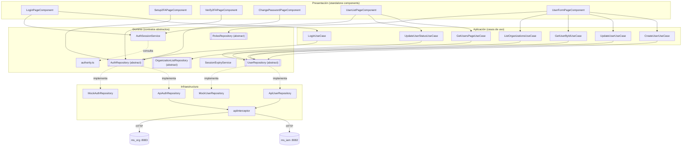
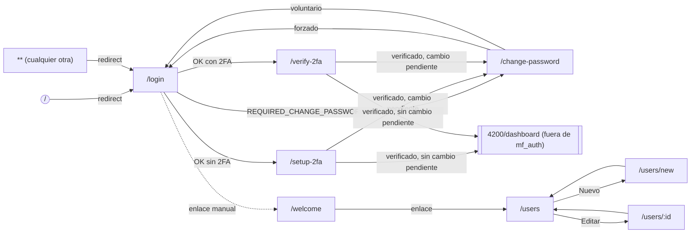
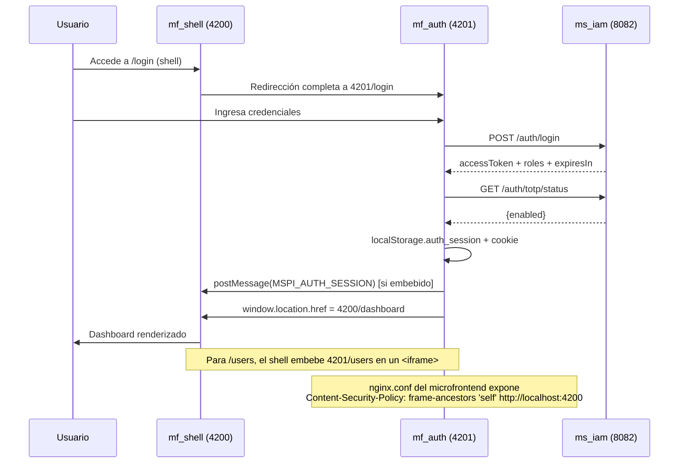

# mf_auth — Diseño

**Repositorio:** `MSPI_NVA_CO_MR_FRONT/mf_auth`
**Fecha del documento:** 2026-08-18
**Alcance:** Arquitectura de software, estructura real de carpetas, componentes principales, integración con `mf_shell` y decisiones técnicas del microfrontend `mf_auth`, contrastando la documentación preexistente (`docs/ARQUITECTURA.md`, `docs/ARQUITECTURA-CLEAN-ARCHITECTURE.md`, `docs/INTEGRACION-SHELL.md`) con la evidencia directa del código fuente.

---

## 1. Hallazgo previo — dos árboles de código conviviendo en el repositorio

Antes de describir la arquitectura, es necesario declarar un hallazgo determinante para el resto del documento: el repositorio `mf_auth` contiene **dos conjuntos de código completamente distintos**:

1. **`src/app/**`** — la aplicación **Angular 19 real**, standalone, la única compilada y servida. Confirmado porque `tsconfig.app.json` declara:
   ```json
   "include": ["src/main.ts", "src/app/**/*.ts"]
   ```
   y `angular.json` fija `"browser": "src/main.ts"` como único punto de entrada del build.

2. **`src/features/**`, `src/common/presentation/**/*.tsx`, `src/federated/AppWithProviders.tsx`, `src/config/env.ts`, `components.json`, `pnpm-workspace.yaml`, y el `README.md` raíz del proyecto** — restos de una plantilla **React + Vite** ("Clear Architecture Todo App", tutorial de YouTube según el propio `README.md` original) sobre la que aparentemente se inició el proyecto y que después fue **reemplazada por la implementación Angular real**, sin eliminar los archivos originales.

Evidencia adicional de que el segundo grupo es código muerto:
- Usa extensión `.tsx` (JSX de React), incompatible con un build Angular puro.
- Usa React Context (`AuthContext.tsx`), React Query (`useLoginMutation.ts`, `useUsersPageQuery.ts`) y React Router — ninguna de estas librerías figura en `package.json`.
- `src/config/env.ts` lee `import.meta.env.VITE_USE_MOCKS`, sintaxis de **Vite**; el proyecto no usa Vite (usa `@angular-devkit/build-angular`), por lo que `import.meta.env` sería `undefined` en tiempo de ejecución — este archivo no se importa desde ningún módulo bajo `src/app`.
- `.env.example` documenta `VITE_USE_MOCKS=true`, variable que **no tiene efecto real** sobre el build Angular (el modo mock/API real se controla en Angular mediante `fileReplacements` de `angular.json`, no variables de entorno de Vite).
- `README.md` de la raíz del proyecto es literalmente el README del tutorial original de React ("Clear Architecture Todo App Example with React + Typescript"), sin relación con MSPI.

**Consecuencia para este documento:** la arquitectura descrita a partir de aquí corresponde exclusivamente a `src/app/**` (la aplicación Angular real). Se referencia el árbol `src/features/**` solo quado el documento preexistente `docs/ARQUITECTURA-CLEAN-ARCHITECTURE.md` lo describe, dejando explícito que ese documento describe el árbol **no compilado**.

## 2. Arquitectura por capas (Clean Architecture) — implementación real en `src/app`

`docs/ARQUITECTURA.md` resume correctamente las capas a alto nivel; a continuación se detalla con base en el código real de `src/app`:

```
src/app/
├── domain/            # Capa 1 — Dominio: contratos, tipos, entidades
│   ├── auth/
│   │   ├── auth.repository.ts        (abstract class AuthRepository, tipos)
│   │   ├── auth-session.service.ts   (estado de sesión con signals)
│   │   ├── authority.ts              (mapa rol→autoridades)
│   │   └── session-expiry.service.ts (aviso de expiración)
│   ├── users/
│   │   ├── user.repository.ts        (abstract class UserRepository)
│   │   └── user.types.ts             (User, PageRequest, PageResponse, ...)
│   ├── roles/
│   │   ├── roles.repository.ts       (abstract class RolesRepository)
│   │   └── role.types.ts             (RoleOption)
│   └── organizations/
│       ├── organization-list.repository.ts (abstract class OrganizationListRepository)
│       └── organization-option.ts
│
├── application/       # Capa 2 — Casos de uso
│   ├── auth/login.use-case.ts
│   ├── users/{create-user, get-user-by-id, get-users-page, update-user, update-user-status}.use-case.ts
│   └── organizations/list-organizations.use-case.ts
│
├── infrastructure/    # Capa 3 — Implementaciones concretas
│   ├── api/api-response.model.ts     (ApiError, ApiMeta, sobres de respuesta)
│   ├── interceptors/api.interceptor.ts (interceptor HTTP funcional)
│   ├── auth/{api-auth.repository.ts, mock-auth.repository.ts}
│   ├── users/{api-user.repository.ts, mock-user.repository.ts}
│   ├── roles/{api-roles.repository.ts, mock-roles.repository.ts}
│   └── organizations/{api-organization-list.repository.ts, mock-organization-list.repository.ts}
│
└── presentation/      # Capa 4 — UI (componentes standalone Angular)
    └── pages/
        ├── login-page.component.{ts,html,scss}
        ├── welcome-page.component.ts (inline template)
        ├── setup-2fa-page.component.{ts,html,scss}
        ├── verify-2fa-page.component.{ts,html,scss}
        ├── change-password-page.component.{ts,html,scss}
        ├── user-list-page.component.{ts,html,scss}
        └── user-form-page.component.{ts,html,scss}
```

Particularidad de esta implementación Angular respecto al patrón "Clean Architecture" clásico documentado en `docs/ARQUITECTURA-CLEAN-ARCHITECTURE.md` (que describe el árbol `src/features`): en `src/app`, **el dominio define los repositorios como `abstract class`** (no `interface`), lo que permite usarlos directamente como **token de inyección de dependencias de Angular** (`providedIn` / arreglo `providers` de `app.config.ts`), evitando la necesidad de `InjectionToken` explícitos. Es una adaptación idiomática de Angular al patrón de puertos y adaptadores.

### 2.1 Regla de dependencia

| Capa | Depende de | Ejemplo verificado |
|---|---|---|
| `domain` | Nada (solo Angular core para `@Injectable`/`signal`) | `auth.repository.ts` no importa infraestructura |
| `application` | `domain` | `LoginUseCase` inyecta `AuthRepository` (abstracto) |
| `infrastructure` | `domain` (implementa), `environments` | `ApiAuthRepository extends AuthRepository` |
| `presentation` | `application`, `domain` | `LoginPageComponent` inyecta `LoginUseCase`, `AuthSessionService` |

La selección de la implementación concreta (mock vs API) ocurre en un único punto de composición: `app.config.ts`, mediante el flag `environment.useMocks`:

```ts
{ provide: AuthRepository, useClass: environment.useMocks ? MockAuthRepository : ApiAuthRepository },
{ provide: UserRepository, useClass: environment.useMocks ? MockUserRepository : ApiUserRepository },
{ provide: RolesRepository, useClass: environment.useMocks ? MockRolesRepository : ApiRolesRepository },
{ provide: OrganizationListRepository, useClass: environment.useMocks ? MockOrganizationListRepository : ApiOrganizationListRepository },
```

Esto sustituye al "Composition Root"/Provider de React descrito en `docs/ARQUITECTURA-CLEAN-ARCHITECTURE.md` por el propio sistema de inyección de dependencias nativo de Angular.

## 3. Diagrama de arquitectura



## 4. Diagrama de navegación (rutas)

Rutas reales, definidas en `src/app/app.routes.ts` (carga perezosa con `loadComponent`, sin `NgModule`):



Nota: `/welcome` no forma parte del flujo automático de login/2FA (el login redirige directamente a `/setup-2fa`, `/verify-2fa`, `/change-password` o al dashboard del shell); es una pantalla de aterrizaje alcanzable manualmente, con enlaces a `/users` y al shell.

## 5. Integración con `mf_shell`

### 5.1 Corrección respecto al mecanismo asumido inicialmente

El enunciado de este trabajo describe la orquestación como **Module Federation**. Tras revisar `package.json`, `angular.json` y la totalidad del árbol `src/`, **no se encontró configuración de Module Federation** (ni el paquete `@angular-architects/module-federation`, ni `webpack.config.js`, ni sección `exposes`/`remotes` en ningún archivo). La integración real, documentada en `docs/INTEGRACION-SHELL.md` y verificada en `AuthSessionService`, es de tipo **"microfrontends por composición en el navegador"**, con tres mecanismos:

1. **Navegación de página completa**: el shell redirige a `http://localhost:4201/login` para autenticar; `mf_auth`, tras el login, redirige con `window.location.href = 'http://localhost:4200/dashboard'`.
2. **`postMessage`**: `AuthSessionService.setSession()` envía `{ type: 'MSPI_AUTH_SESSION', payload: json }` a `window.parent`, dirigido explícitamente a los orígenes `http://localhost:4200` y `http://127.0.0.1:4200` — solo tiene efecto si `mf_auth` está embebido en un `iframe` del shell (`window.parent !== window`).
3. **Estado compartido por almacenamiento del navegador**: `localStorage['auth_session']` (mismo origen) y cookie `auth_session` (`path=/`, `SameSite=Lax`) como mecanismo de respaldo para cuando el shell embebe `/users` en un `iframe`.

### 5.2 Diagrama de integración



### 5.3 Limitación explícita documentada

`docs/INTEGRACION-SHELL.md` declara textualmente: *"para JWT en todos los MFs, completar login y usar shell como entrada"* y advierte que la cookie *"ayuda parcialmente"* cuando los microfrontends corren en puertos distintos en local (los puertos distintos son, técnicamente, orígenes distintos para efectos de `localStorage` y de la mayoría de políticas de cookies estrictas). Esta es una limitación de diseño reconocida en la propia documentación del repositorio, no una interpretación de este análisis.

## 6. Componentes principales

| Componente/Servicio | Tipo | Responsabilidad |
|---|---|---|
| `AppComponent` | Componente raíz | Solo `<router-outlet>`, sin lógica |
| `LoginPageComponent` | Página | Formulario de login, orquesta redirección post-login |
| `Setup2FAPageComponent` | Página | Generación de QR/secreto TOTP, verificación inicial |
| `Verify2FAPageComponent` | Página | Verificación de código TOTP en logins subsecuentes |
| `ChangePasswordPageComponent` | Página | Cambio de contraseña forzado o voluntario, validación de complejidad |
| `UserListPageComponent` | Página | Listado paginado, búsqueda, filtros, activar/desactivar |
| `UserFormPageComponent` | Página | Alta/edición de usuario, catálogo de roles y organizaciones |
| `WelcomePageComponent` | Página | Landing simple con enlaces |
| `AuthSessionService` | Servicio (`providedIn: 'root'`) | Estado de sesión reactivo (Angular `signal`), persistencia, notificación al shell |
| `SessionExpiryService` | Servicio (`providedIn: 'root'`) | Temporizador de aviso de expiración de sesión |
| `apiInterceptor` | Interceptor funcional (`HttpInterceptorFn`) | Adjunta `Authorization: Bearer`, desenvuelve `{data, meta}`, traduce errores a `ApiError`, limpia sesión en 401 |

## 7. Decisiones técnicas observadas

1. **Componentes standalone, sin `NgModule`**: todo el árbol de presentación usa `standalone: true` y `imports` explícitos por componente (p. ej. `LoginPageComponent` solo importa `FormsModule`). Coherente con Angular 19 y con el enfoque moderno recomendado por el propio framework.
2. **Estado reactivo con Angular Signals** en vez de `BehaviorSubject`/RxJS para el estado de sesión (`AuthSessionService` usa `signal`/`computed`), mientras que RxJS (`firstValueFrom`) se reserva para las llamadas HTTP puntuales.
3. **Repositorios abstractos como `abstract class`** en vez de `interface` + `InjectionToken`, aprovechando que Angular DI puede resolver clases abstractas directamente como tokens.
4. **Interceptor funcional** (`HttpInterceptorFn`, API introducida en Angular 15+) en vez de la clase `HttpInterceptor` clásica, alineado con `provideHttpClient(withInterceptors([...]))`.
5. **Conmutación mock/API por configuración de build** (`ng build --configuration=api`, con `fileReplacements` en `angular.json`) en vez de variables de entorno en tiempo de ejecución — decisión consistente con el uso de `environment.ts`/`environment.api.ts` de Angular CLI, pero que **contradice** la variable `VITE_USE_MOCKS` documentada en `.env.example` (que no tiene efecto real, ver sección 1).
6. **Propagación de sesión sin backend de sesión compartido**: en vez de SSO/backend-for-frontend, se usa el navegador como bus de comunicación (`postMessage` + almacenamiento compartido), decisión pragmática para un ecosistema de microfrontends desplegados como builds Angular independientes.
7. **Sin *route guards***: el control de acceso a `/users/new` y `/users/:id` se resuelve de forma imperativa dentro de `ngOnInit()` de cada componente (`if (!this.canManage()) { router.navigate(['/users']) }`) en vez de usar `CanActivateFn` de Angular Router — es una decisión (o deuda) de diseño explícitamente señalada en `docs/RUTAS-Y-PANTALLAS.md`.
8. **`PlanPolicy.ts`** en la raíz del repositorio está **vacío (0 bytes)**: sugiere una intención de centralizar la política de contraseñas (actualmente hardcodeada como getters en `change-password-page.component.ts`) que no llegó a implementarse.

## 8. Estructura de carpetas completa (real, `src/app`)

```
src/
├── app/
│   ├── app.component.ts
│   ├── app.config.ts
│   ├── app.routes.ts
│   ├── application/
│   │   ├── auth/login.use-case.ts
│   │   ├── organizations/list-organizations.use-case.ts
│   │   └── users/{create-user,get-user-by-id,get-users-page,update-user,update-user-status}.use-case.ts
│   ├── domain/
│   │   ├── auth/{auth.repository.ts, auth-session.service.ts, authority.ts, session-expiry.service.ts}
│   │   ├── organizations/{organization-list.repository.ts, organization-option.ts}
│   │   ├── roles/{role.types.ts, roles.repository.ts}
│   │   └── users/{user.repository.ts, user.types.ts}
│   ├── infrastructure/
│   │   ├── api/api-response.model.ts
│   │   ├── auth/{api-auth.repository.ts, mock-auth.repository.ts}
│   │   ├── interceptors/api.interceptor.ts
│   │   ├── organizations/{api-organization-list.repository.ts, mock-organization-list.repository.ts}
│   │   ├── roles/{api-roles.repository.ts, mock-roles.repository.ts}
│   │   └── users/{api-user.repository.ts, mock-user.repository.ts}
│   └── presentation/pages/ (7 páginas, ver sección 6)
├── environments/{environment.ts, environment.api.ts}
├── config/env.ts                 # NO USADO por el build (ver sección 1)
├── common/, features/, federated/  # NO USADOS por el build (ver sección 1)
├── index.html / main.ts / styles.scss
public/
├── auditcyber-logo.png, vite.svg, README-logo.md
deployment/
├── Dockerfile, nginx.conf
docs/
├── (documentación preexistente, 8 archivos .md)
```

## 9. Conclusión de diseño

La aplicación real de `mf_auth` implementa consistentemente una Clean Architecture ligera adaptada a Angular 19 standalone, con inyección de dependencias como mecanismo de composición y sin acoplamiento directo a HTTP en las capas de dominio y aplicación. La integración con el shell **no** es Module Federation sino una composición basada en navegador (navegación + `postMessage` + almacenamiento compartido), con limitaciones reconocidas por el propio equipo en `docs/INTEGRACION-SHELL.md`. El repositorio conserva además un árbol de código muerto (plantilla React/Vite) que debe considerarse deuda técnica de limpieza, documentada aquí para evitar confusiones en trabajos futuros sobre el proyecto.
