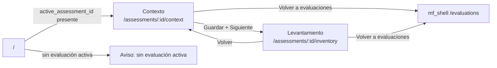
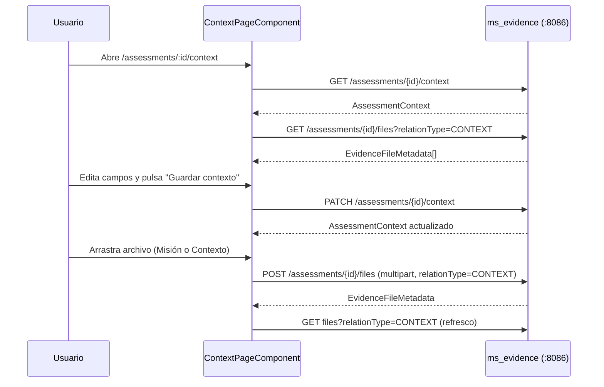
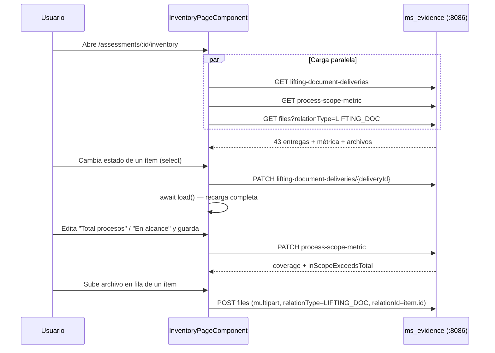
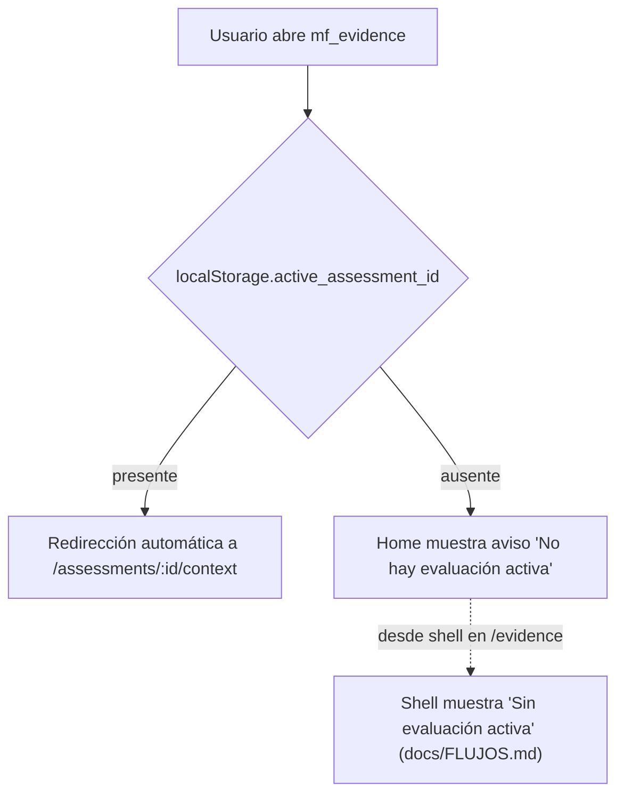

# mf_evidence — Análisis

**Repositorio:** `MSPI_NVA_CO_MR_FRONT/mf_evidence`
**Fecha del documento:** 2026-08-18
**Alcance:** Requerimientos funcionales y no funcionales, reglas de negocio, actores, casos de uso y flujos de usuario del microfrontend de evidencias documentales, derivados de `docs/RUTAS-Y-PANTALLAS.md`, `docs/FLUJOS.md`, `docs/API-INTEGRACION.md` y del código fuente real en `src/app`.

---

## 1. Actores

`mf_evidence` no define roles ni autoridades propias en su código (no existe un equivalente a `authority.ts` de `mf_auth`): no hay ninguna verificación de rol o autoridad en las páginas (`ContextPageComponent`, `InventoryPageComponent`). Los actores se infieren del contexto funcional documentado (`docs/DESCRIPCION.md`) y de la integración con el resto del ecosistema:

| Actor | Naturaleza | Rol funcional frente a `mf_evidence` |
|---|---|---|
| Usuario evaluador/gestor de evidencias | Humano, autenticado vía `mf_auth` | Diligencia el contexto de la evaluación y el levantamiento documental; sube y descarga archivos de soporte |
| `mf_shell` | Sistema anfitrión (no humano) | Enruta hacia `mf_evidence` (`/evidence` → iframe `4204/assessments/{id}/context`), propaga el JWT y recibe navegación de vuelta (`openShellRoute`) |
| `mf_assessment` | Sistema par (no humano) | Origina la evaluación activa; sincroniza `active_assessment_id` en `localStorage` del shell, consumido por `mf_evidence` |
| `ms_evidence` (backend, puerto 8086) | Sistema backend | Persiste contexto, métricas de alcance, entregas de levantamiento y archivos; expone la API consumida por `ApiEvidenceRepository` |

**Limitación declarada:** no se encontró en el código de `mf_evidence` ningún control de acceso basado en rol o autoridad (a diferencia de `mf_auth`, que sí restringe `/users/*` a `USER_MANAGE`). Cualquier usuario con sesión válida y una evaluación activa puede leer y modificar el contexto y el levantamiento documental; la autorización más fina, si existe, se delega íntegramente al backend `ms_evidence` (fuera del alcance de este repositorio).

## 2. Requerimientos funcionales

Basados en `docs/RUTAS-Y-PANTALLAS.md`, `docs/FLUJOS.md`, `docs/API-INTEGRACION.md` y verificación directa en el código:

| ID | Requerimiento | Evidencia en código |
|---|---|---|
| RF-01 | El sistema debe redirigir automáticamente a la pantalla de contexto de la evaluación activa cuando existe `active_assessment_id` en `localStorage` | `EvidenceHomePageComponent.ngOnInit()` → `goContext()` |
| RF-02 | El sistema debe informar explícitamente cuando no hay evaluación activa, sin bloquear la carga de la aplicación | Bloque `@else` en `EvidenceHomePageComponent` ("No hay evaluación activa…") |
| RF-03 | El sistema debe permitir consultar el contexto de una evaluación (misión, análisis de contexto, mapa de procesos, organigrama, autopercepción) | `GetContextUseCase`, `ApiEvidenceRepository.getContext()` (`GET /assessments/{id}/context`) |
| RF-04 | El sistema debe permitir editar y guardar de forma incremental los campos de contexto | `PatchContextUseCase`, `ContextPageComponent.save()` (`PATCH /assessments/{id}/context`) |
| RF-05 | El sistema debe permitir adjuntar archivos de contexto diferenciados por campo (`MISSION` o `CONTEXT`) | `uploadMission()`/`uploadContextField()` en `ContextPageComponent`, `UploadEvidenceFileUseCase` con `relationType: 'CONTEXT'` |
| RF-06 | El sistema debe listar los archivos adjuntos de contexto ya cargados, con indicación del campo al que pertenecen | `ListEvidenceFilesUseCase.execute(assessmentId, 'CONTEXT')`, plantilla `contextFiles()` en `ContextPageComponent` |
| RF-07 | El sistema debe permitir descargar cualquier archivo adjunto | `FileDownloadService.download()`, botón "Descargar" en ambas páginas |
| RF-08 | El sistema debe presentar el inventario de 43 ítems de levantamiento documental, cada uno con código, nombre de documento y estado | `GetLiftingDeliveriesUseCase`, tabla en `InventoryPageComponent` |
| RF-09 | El sistema debe permitir cambiar el estado de entrega de cada ítem (`DELIVERED`/`PARTIAL`/`NOT_DELIVERED`) | `updateStatus()` en `InventoryPageComponent`, `PatchLiftingDeliveryUseCase` |
| RF-10 | El sistema debe permitir registrar el nombre del documento efectivamente entregado por ítem | `updateDeliveredName()` en `InventoryPageComponent` (evento `blur` del input) |
| RF-11 | El sistema debe permitir adjuntar un archivo por ítem de levantamiento, asociado a ese ítem específico | `uploadLiftingDoc()`, `UploadEvidenceFileUseCase` con `relationType: 'LIFTING_DOC'` y `relationId: item.id` |
| RF-12 | El sistema debe listar y permitir descargar los archivos ya adjuntos a cada ítem de levantamiento | `filesFor(relationId)` en `InventoryPageComponent` |
| RF-13 | El sistema debe presentar y permitir editar la métrica de alcance de procesos (ítem 43): total de procesos y procesos en alcance | `GetProcessScopeMetricUseCase`, `PatchProcessScopeMetricUseCase`, tarjeta "Ítem 43 — Alcance de procesos" |
| RF-14 | El sistema debe calcular y mostrar el porcentaje de cobertura de procesos en alcance | Campo `coverage` calculado en el backend/mock: `Math.round((inScopeProcesses / totalProcesses) * 100)` (`mock-evidence.repository.ts`) |
| RF-15 | El sistema debe advertir cuando los procesos en alcance superan el total de procesos declarado | Bandera `inScopeExceedsTotal`, mensaje "En alcance supera el total de procesos" en `InventoryPageComponent` |
| RF-16 | El sistema debe proveer navegación de flujo entre contexto y levantamiento, con indicador de paso | `EvidenceFlowNavComponent`, `EVIDENCE_STEPS` en `evidence-flow-links.ts` |
| RF-17 | El sistema debe permitir volver al listado de evaluaciones del shell desde cualquier paso del flujo | `showEvaluationsBack` + `openShellRoute('/evaluations', assessmentId)` |
| RF-18 | El sistema debe soportar un modo sin backend (mock) funcionalmente equivalente, incluyendo la generación de las 43 entregas simuladas | `MockEvidenceRepository`, función `buildMockDeliveries()`, conmutado por `environment.useMocks` |
| RF-19 | El sistema debe permitir cargar archivos por arrastrar-y-soltar o por selector de archivo tradicional | `FileUploaderComponent` (`onDrop`, `onFileSelected`) |

## 3. Requerimientos no funcionales

| ID | Requerimiento | Evidencia / mecanismo |
|---|---|---|
| RNF-01 | El microfrontend debe poder compilarse y ejecutarse de forma aislada del resto del ecosistema | Proyecto Angular independiente, `ng serve` en puerto 4204 propio |
| RNF-02 | Las peticiones HTTP deben adjuntar automáticamente el token JWT sin intervención manual en cada componente | `apiInterceptor` (interceptor funcional de Angular), reutiliza `AuthSessionService` |
| RNF-03 | Las respuestas de error de la API deben normalizarse a un formato único consumible por la UI | `ApiError`, función `toApiError()` en `api-evidence.repository.ts` |
| RNF-04 | Las respuestas exitosas envueltas en `{data, meta}` deben desenvolverse automáticamente antes de llegar al repositorio | `map()` en `apiInterceptor`, verifica `body.data !== undefined && body.meta` |
| RNF-05 | Ante error 401 de cualquier llamada, debe recargarse el estado de sesión local | `apiInterceptor`: `inject(AuthSessionService).reload()` en `catchError` cuando `err.status === 401` |
| RNF-06 | La aplicación debe poder ser embebida como `iframe` desde el shell sin ser bloqueada por políticas de seguridad del navegador | `Content-Security-Policy: frame-ancestors 'self' http://localhost:4200 http://127.0.0.1:4200` en `deployment/nginx.conf` |
| RNF-07 | Los activos estáticos deben servirse con cacheo agresivo en producción | Bloque `location ~* \.(js\|css\|png...)$ { expires 7d; ... }` en `nginx.conf` |
| RNF-08 | El build de producción debe generar hashing de archivos para invalidación de caché | `"outputHashing": "all"` en configuración `production` de `angular.json` |
| RNF-09 | El código debe compilarse en modo estricto de TypeScript | `"strict": true`, `noImplicitOverride`, `noPropertyAccessFromIndexSignature`, `strictTemplates` en `tsconfig.json`/`angularCompilerOptions` |
| RNF-10 | El contenedor debe exponer verificación de salud para orquestadores | `HEALTHCHECK` en `deployment/Dockerfile` (`curl` cada 30s) |
| RNF-11 | La descarga de archivos debe liberar los recursos de memoria del navegador tras su uso | `URL.revokeObjectURL(url)` en `FileDownloadService.download()` |

**Limitación declarada:** al igual que en `mf_auth`, no se encontró ningún requerimiento no funcional relativo a rendimiento cuantificado (tiempos de respuesta, presupuestos de bundle, tamaño máximo de archivo subido), accesibilidad (WCAG) ni internacionalización — no hay librerías `@angular/localize` en uso ni validación de tamaño/tipo de archivo en el cliente (`FileUploaderComponent` acepta cualquier archivo sin restricción visible).

## 4. Reglas de negocio

Extraídas directamente del código (no inventadas):

1. **Evaluación activa obligatoria para operar**: sin `active_assessment_id` en `localStorage`, la pantalla de inicio no navega a ningún flujo y muestra el aviso "No hay evaluación activa" (`EvidenceHomePageComponent`).
2. **Redirección automática si hay evaluación activa**: al entrar a `/`, si existe `active_assessment_id`, el sistema navega inmediatamente a `/assessments/{id}/context` sin interacción del usuario (`ngOnInit()` llama `goContext()` directamente).
3. **Dos campos de contexto documental diferenciados**: los adjuntos de contexto se clasifican con `contextField: 'MISSION' | 'CONTEXT'`, cada uno con su propia zona de carga (`ContextPageComponent`).
4. **43 ítems fijos de levantamiento**: el catálogo de entregables documentales es de exactamente 43 posiciones (`buildMockDeliveries` genera `Array.from({length: 43}, ...)`); el ítem 43 tiene un significado especial como métrica de alcance de procesos, según `docs/DESCRIPCION.md` ("métrica ítem 43 — alcance de procesos").
5. **Tres estados de entrega posibles**: `DELIVERED` (entregado), `PARTIAL` (parcial), `NOT_DELIVERED` (no entregado) — tipo `DeliveryStatus`, sin estados intermedios adicionales.
6. **Actualización de estado y nombre entregado son operaciones independientes pero usan el mismo endpoint**: tanto `updateStatus()` como `updateDeliveredName()` invocan `PatchLiftingDeliveryUseCase`, reenviando el estado y nombre completos vigentes del ítem (patrón "actualización completa del subrecurso" más que PATCH parcial real a nivel de UI).
7. **Actualización de nombre entregado solo si cambió**: `updateDeliveredName()` compara el nuevo valor contra el actual (`if (name === (item.deliveredName ?? '')) return;`) antes de invocar el caso de uso, evitando llamadas innecesarias en cada `blur` sin cambios.
8. **Cálculo de cobertura de procesos**: `coverage = round((inScopeProcesses / totalProcesses) * 100)`, calculado en el repositorio (mock) o en el backend (`ms_evidence`, no auditado en este repositorio) y devuelto ya calculado a la UI.
9. **Alerta de inconsistencia de alcance**: si `inScopeProcesses > totalProcesses`, se marca `inScopeExceedsTotal: true` y la UI muestra una advertencia visual, pero **no bloquea el guardado** (es una advertencia, no una validación bloqueante).
10. **Versión incremental en cada actualización (mock)**: `MockEvidenceRepository` incrementa `version` y actualiza `updatedAt` en cada `patchContext`/`patchLiftingDelivery`, replicando un patrón de control de versión optimista que, sin embargo, **no se lee ni se envía de vuelta desde la UI** (ver limitación en `01-Planificacion.md`).
11. **Los archivos de levantamiento se asocian por `relationId` al ítem específico**: `filesFor(relationId)` filtra en el cliente los archivos cuyo `relationId` coincide con el `id` del ítem de la fila, permitiendo múltiples archivos por ítem.
12. **Sin evaluación activa, la ruta `/evidence` del shell debe mostrar "Sin evaluación activa"** — regla documentada en `docs/FLUJOS.md`, consistente con el comportamiento de `EvidenceHomePageComponent`.

## 5. Casos de uso

### CU-01 — Acceder al módulo de evidencias desde el shell
- **Actor:** usuario autenticado con evaluación activa.
- **Precondición:** `active_assessment_id` presente en `localStorage` (sincronizado por `mf_assessment`/shell).
- **Flujo principal:** el shell embebe `4204/assessments/{activeId}/context` en un iframe, o el usuario navega a `mf_evidence` directamente en `/`, que redirige a la misma ruta de contexto.
- **Flujo alternativo:** sin evaluación activa, se muestra el aviso correspondiente y no se navega.

### CU-02 — Diligenciar el contexto de la evaluación
- **Actor:** usuario con evaluación activa.
- **Flujo principal:** el sistema carga el contexto existente (`GetContextUseCase`); el usuario edita misión, análisis de contexto, mapa de procesos, organigrama y los tres campos de autopercepción; al enviar el formulario, se invoca `PatchContextUseCase`, se refresca el formulario con la respuesta y se muestra un mensaje de confirmación.
- **Flujo alternativo — error de guardado:** se captura la excepción y se muestra el mensaje de error en la misma zona de mensajes.

### CU-03 — Adjuntar archivo de contexto
- **Actor:** usuario con evaluación activa, en la pantalla de contexto.
- **Flujo principal:** el usuario arrastra o selecciona un archivo en la zona correspondiente (Misión o Contexto); el sistema invoca `UploadEvidenceFileUseCase` con `relationType: 'CONTEXT'` y el `contextField` correspondiente; al finalizar, refresca el listado de adjuntos de contexto.

### CU-04 — Descargar archivo adjunto
- **Actor:** usuario con evaluación activa.
- **Flujo principal:** el usuario hace clic en "Descargar" junto a un archivo listado (contexto o levantamiento); `FileDownloadService.download()` obtiene el blob (`EvidenceRepository.downloadFile()`), crea una URL de objeto temporal, dispara la descarga mediante un elemento `<a>` invisible y libera la URL.

### CU-05 — Diligenciar el levantamiento documental
- **Actor:** usuario con evaluación activa.
- **Flujo principal:** el sistema carga en paralelo (`Promise.all`) las 43 entregas, la métrica de alcance y los archivos de tipo `LIFTING_DOC`; el usuario cambia el estado y/o el nombre entregado de cualquier ítem mediante controles inline en la tabla; cada cambio dispara un `PATCH` inmediato seguido de una recarga completa de la lista (`await this.load()`).

### CU-06 — Adjuntar archivo a un ítem de levantamiento
- **Actor:** usuario con evaluación activa, en la pantalla de levantamiento.
- **Flujo principal:** el usuario arrastra o selecciona un archivo en la zona de carga de la fila correspondiente; el sistema invoca `UploadEvidenceFileUseCase` con `relationType: 'LIFTING_DOC'` y `relationId: item.id`; refresca los archivos de levantamiento y muestra confirmación indicando el código del ítem.

### CU-07 — Actualizar la métrica de alcance de procesos
- **Actor:** usuario con evaluación activa, en la pantalla de levantamiento.
- **Flujo principal:** el usuario edita "Total procesos" y "Procesos en alcance" en la tarjeta de métrica; al pulsar "Guardar métrica", se invoca `PatchProcessScopeMetricUseCase`; el sistema recalcula y muestra la cobertura y, si aplica, la advertencia de inconsistencia.

### CU-08 — Navegar el flujo de dos pasos
- **Actor:** usuario con evaluación activa.
- **Flujo principal:** desde contexto, el usuario pulsa "Levantamiento documental" (`nextRouterLink`) para avanzar; desde levantamiento, pulsa "Contexto de evaluación" (`backRouterLink`) para retroceder; en cualquiera de los dos pasos, puede pulsar "Volver a evaluaciones" para salir hacia el shell (`openShellRoute('/evaluations', assessmentId)`).

## 6. Flujos de usuario (diagramas)

### 6.1 Flujo principal — dos pasos (basado en `docs/FLUJOS.md`, verificado en código)

### 6.2 Flujo de contexto

### 6.3 Flujo de levantamiento documental

### 6.4 Sin evaluación activa

## 7. Trazabilidad con la documentación preexistente

Este análisis amplía y estructura formalmente lo señalado de manera muy resumida en `docs/FLUJOS.md` ("Flujo principal (2 pasos)", contexto, levantamiento, sin evaluación activa) y en `docs/RUTAS-Y-PANTALLAS.md` (rutas y componente `evidence-flow-nav`), verificando cada afirmación directamente contra el código fuente de `src/app`. A diferencia de `mf_auth`, no se identificaron reglas de autorización por rol dentro de este microfrontend; esta ausencia se declara explícitamente en la sección 1 en vez de inferirse o inventarse.
