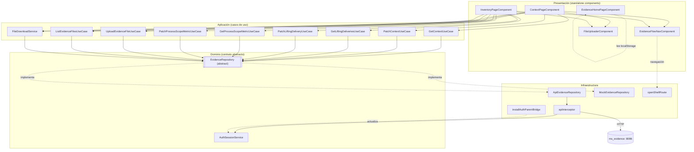
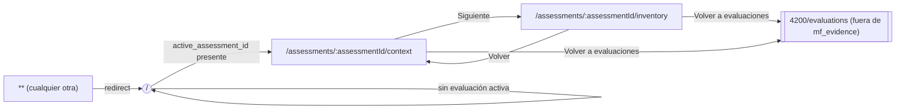
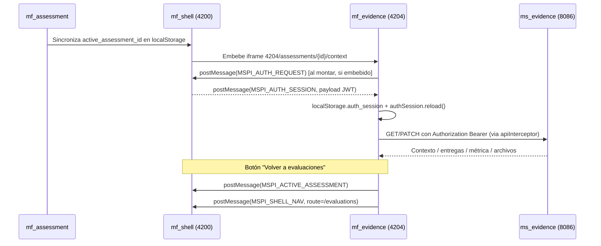

# mf_evidence — Diseño

**Repositorio:** `MSPI_NVA_CO_MR_FRONT/mf_evidence`
**Fecha del documento:** 2026-08-18
**Alcance:** Arquitectura de software, estructura real de carpetas, componentes principales, integración con `mf_shell` y decisiones técnicas del microfrontend `mf_evidence`, contrastando la documentación preexistente (`docs/ARQUITECTURA.md`, `docs/DIAGRAMAS.md`, `docs/INTEGRACION-SHELL.md`) con la evidencia directa del código fuente.

---

## 1. Arquitectura por capas (Clean Architecture ligera) — implementación real en `src/app`

`docs/ARQUITECTURA.md` resume en cuatro líneas las capas del proyecto; a continuación se detalla con base en el código real de `src/app` (21 archivos TypeScript):

```
src/app/
├── domain/                     # Capa 1 — Dominio: contratos y tipos
│   ├── auth/
│   │   └── auth-session.service.ts   (estado de sesión con signals, compartido conceptualmente con mf_auth)
│   └── evidence/
│       ├── evidence.repository.ts    (abstract class EvidenceRepository)
│       └── evidence.types.ts         (AssessmentContext, LiftingDelivery, ProcessScopeMetric, EvidenceFileMetadata, ...)
│
├── application/                # Capa 2 — Casos de uso
│   └── evidence/
│       ├── evidence.use-cases.ts     (8 clases @Injectable, una por operación)
│       └── file-download.service.ts  (FileDownloadService)
│
├── infrastructure/             # Capa 3 — Implementaciones concretas
│   ├── api/api-response.model.ts     (ApiError, ErrorDetail)
│   ├── auth/auth-parent-bridge.ts    (installAuthParentBridge — recepción de sesión desde el shell)
│   ├── evidence/
│   │   ├── api-evidence.repository.ts   (ApiEvidenceRepository, HTTP contra ms_evidence)
│   │   └── mock-evidence.repository.ts  (MockEvidenceRepository, datos en memoria)
│   ├── interceptors/api.interceptor.ts  (interceptor HTTP funcional)
│   └── shell/shell-bridge.ts             (openShellRoute — navegación hacia el shell)
│
└── presentation/                # Capa 4 — UI (componentes standalone Angular)
    ├── components/
    │   ├── evidence-flow-nav.component.ts   (navegación de flujo, paso 1/2)
    │   └── file-uploader.component.ts       (dropzone + selector de archivo)
    ├── evidence-flow-links.ts               (EVIDENCE_STEPS, helpers de rutas del flujo)
    └── pages/
        ├── evidence-home-page.component.ts  (redirección / aviso sin evaluación)
        ├── context-page.component.ts        (formulario de contexto)
        └── inventory-page.component.ts       (levantamiento + métrica)
```

Al igual que en `mf_auth`, **el dominio define `EvidenceRepository` como `abstract class`** (no `interface`), lo que permite usarlo directamente como token de inyección de dependencias de Angular (`provide: EvidenceRepository` en `app.config.ts`), evitando la necesidad de `InjectionToken` explícitos.

Particularidad respecto a `mf_auth`: `mf_evidence` tiene **un único agregado de dominio** (`EvidenceRepository`, con 10 métodos abstractos que cubren contexto, métrica, levantamiento y archivos), en vez de repositorios separados por entidad. Es una decisión de granularidad más gruesa, consistente con que las cuatro sub-áreas (contexto, métrica, levantamiento, archivos) pertenecen al mismo módulo funcional y comparten el mismo backend (`ms_evidence`) y el mismo ciclo de vida (todas cuelgan de `assessmentId`).

### 1.1 Regla de dependencia

| Capa | Depende de | Ejemplo verificado |
|---|---|---|
| `domain` | Nada (solo Angular core para `@Injectable`/`signal`) | `evidence.repository.ts` no importa infraestructura |
| `application` | `domain` | Cada clase de `evidence.use-cases.ts` inyecta `EvidenceRepository` (abstracto) |
| `infrastructure` | `domain` (implementa), `environments` | `ApiEvidenceRepository extends EvidenceRepository` |
| `presentation` | `application`, `domain`, `infrastructure/shell` (solo para navegación, no para datos) | `ContextPageComponent` inyecta 4 casos de uso + `FileDownloadService` |

La selección de la implementación concreta (mock vs. API) ocurre en un único punto de composición, `app.config.ts`, mediante el flag `environment.useMocks`:

```ts
{
  provide: EvidenceRepository,
  useClass: environment.useMocks ? MockEvidenceRepository : ApiEvidenceRepository,
}
```

Este es el **único** proveedor de dominio registrado explícitamente en `app.config.ts` (a diferencia de `mf_auth`, que registra 4 repositorios), consistente con la existencia de un solo agregado de dominio.

## 2. Diagrama de arquitectura



## 3. Diagrama de navegación (rutas)

Rutas reales, definidas en `src/app/app.routes.ts` (carga perezosa con `loadComponent`, sin `NgModule`):



Nota: a diferencia de `mf_auth` (7 rutas), `mf_evidence` define únicamente **3 rutas** (`app.routes.ts`), todas con `loadComponent`, sin guards y sin parámetros de query — el único parámetro de ruta es `:assessmentId`, tomado por cada página vía `ActivatedRoute.snapshot.paramMap`.

## 4. Integración con `mf_shell`

### 4.1 Mecanismo real (composición por navegador, no Module Federation)

Al igual que en `mf_auth`, **no se encontró configuración de Module Federation** (ni `@angular-architects/module-federation` en `package.json`, ni `webpack.config.js`, ni sección `exposes`/`remotes`). La integración, documentada en `docs/INTEGRACION-SHELL.md` y verificada en el código, usa tres mecanismos:

1. **Embebido en iframe**: el shell, en su ruta `/evidence`, embebe `4204/assessments/{activeId}/context` dentro de un `<iframe>` (según `docs/INTEGRACION-SHELL.md`), condicionado a que exista una evaluación activa.
2. **Bridge de sesión entrante (`installAuthParentBridge`)**: `mf_evidence` **recibe** la sesión JWT del shell, no la origina. `AppComponent.ngOnInit()` instala un listener de `message` que acepta únicamente eventos cuyo `origin` esté en `ALLOWED_PARENTS` (`environment.shellOrigin`, `http://localhost:4200`, `http://127.0.0.1:4200`) y cuyo `type` sea `MSPI_AUTH_SESSION`; al recibirlo, persiste el payload en `localStorage['auth_session']` y llama `authSession.reload()`. Si está embebido en iframe (`window.parent !== window`), además **solicita activamente** la sesión al padre emitiendo `MSPI_AUTH_REQUEST` a cada origen permitido.
3. **Bridge de navegación saliente (`openShellRoute`)**: distinto y complementario al anterior, permite a `mf_evidence` **enviar** al shell la evaluación activa (`postMessage({type: 'MSPI_ACTIVE_ASSESSMENT', assessmentId})`) y solicitar una navegación (`postMessage({type: 'MSPI_SHELL_NAV', route, assessmentId})`) cuando el usuario pulsa "Volver a evaluaciones". Si `mf_evidence` **no** está embebido (`window.parent === window`, es decir, se accede directamente por URL), usa navegación de página completa: `window.location.href = 'http://localhost:4200' + route`.

### 4.2 Diagrama de integración



### 4.3 Diferencia clave frente a `mf_auth`

`mf_auth` **origina** la sesión (login) y la empuja al shell; `mf_evidence` **consume** una sesión ya existente y la solicita activamente si no la tiene aún al montar. Ambos microfrontends comparten la misma clave de almacenamiento (`auth_session`) y el mismo tipo de mensaje (`MSPI_AUTH_SESSION`), lo que sugiere un contrato de integración de sesión consistente en todo el ecosistema MSPI, aunque no está formalizado en una librería compartida — cada microfrontend reimplementa su propia copia de `AuthSessionService`/`auth-parent-bridge.ts` con lógica equivalente (duplicación de código entre repositorios, ver `07-Mantenimiento.md`).

## 5. Componentes principales

| Componente/Servicio | Tipo | Responsabilidad |
|---|---|---|
| `AppComponent` | Componente raíz | Solo `<router-outlet>`; instala el bridge de sesión entrante en `ngOnInit()` |
| `EvidenceHomePageComponent` | Página | Punto de entrada `/`; redirige a contexto si hay evaluación activa, o muestra aviso |
| `ContextPageComponent` | Página | Formulario de contexto de evaluación, gestión de adjuntos `CONTEXT` |
| `InventoryPageComponent` | Página | Tabla de 43 entregas de levantamiento, métrica de alcance, adjuntos `LIFTING_DOC` |
| `EvidenceFlowNavComponent` | Componente reutilizable | Barra de navegación de flujo (paso actual, volver, siguiente, salida al shell) |
| `FileUploaderComponent` | Componente reutilizable | Zona de arrastrar-y-soltar / selector de archivo, emite `File` seleccionado |
| `AuthSessionService` | Servicio (`providedIn: 'root'`) | Estado de sesión reactivo (Angular `signal`), lectura desde `localStorage`/cookie |
| `FileDownloadService` | Servicio (`providedIn: 'root'`) | Descarga de blobs vía enlace temporal `<a download>` |
| `apiInterceptor` | Interceptor funcional (`HttpInterceptorFn`) | Adjunta `Authorization: Bearer`, desenvuelve `{data, meta}`, traduce errores a `ApiError`, recarga sesión en 401 |
| `installAuthParentBridge` | Función de infraestructura | Escucha y solicita la sesión JWT al shell vía `postMessage` |
| `openShellRoute` | Función de infraestructura | Navega o notifica al shell la ruta y evaluación activa |

## 6. Decisiones técnicas observadas

1. **Componentes standalone, sin `NgModule`**: todo el árbol de presentación usa `standalone: true` con `imports` explícitos por componente. Coherente con Angular 19.
2. **Templates y estilos inline en el mismo archivo `.ts`** para las tres páginas y los dos componentes reutilizables — a diferencia de `mf_auth`, que separa `.html`/`.scss` para la mayoría de sus páginas. Es una decisión consistente dado el tamaño reducido de cada componente (todas las páginas caben en un único archivo de menos de 260 líneas).
3. **Estado reactivo con Angular Signals** (`signal()`) para banderas de UI (`loading`, `saving`, `message`, `deliveries`, `metric`) en todas las páginas y componentes, sin uso de `BehaviorSubject`/RxJS para estado local — RxJS (`firstValueFrom`) se reserva exclusivamente para las llamadas HTTP puntuales en `ApiEvidenceRepository` y en `apiInterceptor`.
4. **`EvidenceRepository` como agregado único** en vez de repositorios separados por sub-entidad (contexto, levantamiento, archivos) — decisión de granularidad gruesa justificada por pertenecer al mismo backend y ciclo de vida (ver sección 1).
5. **Interceptor funcional** (`HttpInterceptorFn`) en vez de la clase `HttpInterceptor` clásica, igual que en `mf_auth`, alineado con `provideHttpClient(withInterceptors([...]))`.
6. **Conmutación mock/API por configuración de build** (`ng build --configuration=api`, con `fileReplacements` en `angular.json`), idéntico mecanismo al de `mf_auth`.
7. **Recarga completa tras cada mutación de levantamiento** (`await this.load()` en `updateStatus()`/`updateDeliveredName()` de `InventoryPageComponent`) en vez de actualización optimista local del array `deliveries()` — decisión simple pero con costo de una petición HTTP adicional por cada cambio de campo.
8. **Sin *route guards***: no existe verificación de evaluación activa a nivel de `CanActivateFn` para `/assessments/:assessmentId/context` o `/inventory`; si un usuario navega directamente a esas rutas con un `assessmentId` arbitrario (válido o no), las páginas simplemente intentan cargar datos para ese id sin validación previa. La única protección de "sin evaluación activa" ocurre en la ruta raíz (`EvidenceHomePageComponent`).
9. **Componente `FileUploaderComponent` sin lógica de subida propia**: solo captura el archivo y emite el evento `fileSelected`; la responsabilidad de invocar el caso de uso de subida y de manejar el estado de "subiendo"/error queda en el componente padre (`ContextPageComponent`/`InventoryPageComponent`), que de hecho **no** usa las señales internas `uploading`/`error` del propio `FileUploaderComponent` (quedan declaradas pero sin conexión visible con el flujo real de subida, que se maneja íntegramente en la página contenedora vía el `message` signal compartido).

## 7. Estructura de carpetas completa (real, `src/app`)

```
src/
├── app/
│   ├── app.component.ts
│   ├── app.config.ts
│   ├── app.routes.ts
│   ├── application/
│   │   └── evidence/{evidence.use-cases.ts, file-download.service.ts}
│   ├── domain/
│   │   ├── auth/auth-session.service.ts
│   │   └── evidence/{evidence.repository.ts, evidence.types.ts}
│   ├── infrastructure/
│   │   ├── api/api-response.model.ts
│   │   ├── auth/auth-parent-bridge.ts
│   │   ├── evidence/{api-evidence.repository.ts, mock-evidence.repository.ts}
│   │   ├── interceptors/api.interceptor.ts
│   │   └── shell/shell-bridge.ts
│   └── presentation/
│       ├── components/{evidence-flow-nav.component.ts, file-uploader.component.ts}
│       ├── evidence-flow-links.ts
│       └── pages/{evidence-home-page.component.ts, context-page.component.ts, inventory-page.component.ts}
├── environments/{environment.ts, environment.api.ts}
├── index.html / main.ts / styles.scss
public/
├── .gitkeep (sin activos propios)
deployment/
├── Dockerfile, nginx.conf
docs/
├── (documentación preexistente, 8 archivos .md)
```

## 8. Conclusión de diseño

`mf_evidence` implementa una Clean Architecture ligera equivalente a la de `mf_auth`, adaptada a Angular 19 standalone, con un único agregado de dominio (`EvidenceRepository`) que concentra contexto, métrica de alcance, levantamiento documental y archivos. La integración con el shell reutiliza el mismo patrón de composición por navegador que `mf_auth` (iframe + `postMessage` + `localStorage` compartido), pero con roles invertidos: `mf_evidence` **consume** la sesión en vez de originarla, y añade un bridge propio de navegación saliente (`shell-bridge.ts`) para comunicar al shell la evaluación activa. A diferencia de `mf_auth`, el repositorio **no contiene código muerto de una plantilla previa**, todo el árbol `src/` corresponde a la aplicación real. La principal deuda de diseño identificada es la ausencia de *route guards* que validen la evaluación activa en las rutas de contexto/levantamiento, y la duplicación de la lógica de sesión (`AuthSessionService`, bridge) respecto a `mf_auth`, sin una librería compartida entre microfrontends.
