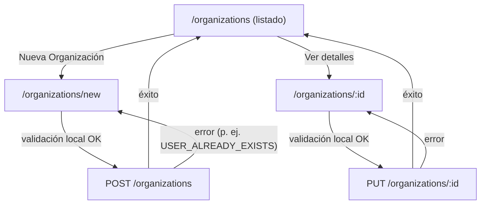
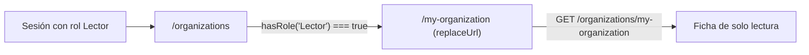
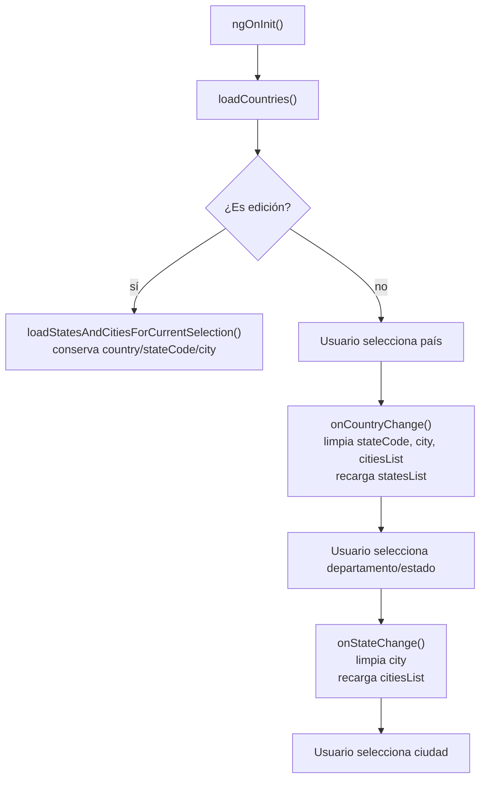

# mf_org — Análisis

**Repositorio:** `MSPI_NVA_CO_MR_FRONT/mf_org`
**Fecha del documento:** 2026-08-18
**Alcance:** Requerimientos funcionales y no funcionales, reglas de negocio, actores, casos de uso y flujos de usuario del microfrontend de gestión organizacional, derivados de `docs/RUTAS-Y-PANTALLAS.md`, `docs/FLUJOS.md` y del código fuente real en `src/app`.

---

## 1. Actores

`mf_org` no define su propio catálogo de roles: **lee** la sesión y el arreglo `roles` producidos por `mf_auth` a través de `AuthSessionService` (`src/app/domain/auth/auth-session.service.ts`), y solo distingue explícitamente un rol en su lógica: `Lector`.

| Actor | Evidencia en código | Rol funcional en `mf_org` |
|---|---|---|
| Usuario con rol `Lector` | `this.authSession.hasRole('Lector')` en `organization-list-page.component.ts` | Acceso exclusivo de solo lectura a `/my-organization`; es redirigido automáticamente si intenta acceder a `/organizations` |
| Usuario administrativo (cualquier rol distinto de `Lector`, p. ej. `AdminSistema`) | Ausencia de verificación de rol adicional en `organization-list-page.component.ts` y `organization-form-page.component.ts` | Acceso completo al listado, alta y edición de organizaciones — **no hay control de autoridad tipo `ORG_MANAGE` verificado en el código de `mf_org`** (a diferencia de lo que documenta `docs/INTEGRACION-SHELL.md`, ver sección 7) |
| `mf_shell` | No es un usuario humano, sino el sistema anfitrión que embebe `/organizations` y `/my-organization` en `iframe` | Contenedor de navegación; según `docs/INTEGRACION-SHELL.md`, exige la autoridad `ORG_MANAGE` **en el propio shell** antes de enrutar hacia `mf_org` |
| `ms_org` (backend) | Actor de sistema, no de UI | Fuente de verdad de organizaciones y catálogo geográfico |

**Hallazgo relevante:** el control de acceso por autoridad (`ORG_MANAGE`) que `docs/INTEGRACION-SHELL.md` describe ("`/organizations` → iframe 4202/organizations (requiere `ORG_MANAGE` en shell)") se aplica **en el shell**, no dentro del código de `mf_org`. Dentro de `mf_org`, el único control observado es la redirección del rol `Lector` fuera del listado administrativo; no existe una verificación equivalente a `canManage`/`hasAuthority('ORG_MANAGE')` como la que sí existe en `mf_auth` para `USER_MANAGE`. Esto se documenta como hallazgo, no como funcionalidad inventada.

## 2. Requerimientos funcionales

Basados en `docs/RUTAS-Y-PANTALLAS.md`, `docs/FLUJOS.md` y verificación directa en el código:

| ID | Requerimiento | Evidencia en código |
|---|---|---|
| RF-01 | El sistema debe listar organizaciones de forma paginada | `OrganizationListPageComponent`, `GetOrganizationsPageUseCase`, `OrganizationRepository.getPage()` |
| RF-02 | El sistema debe permitir buscar organizaciones por nombre | `search` (signal) y parámetro `q`/`name` en `getPage()` / query string `?name=` de `ApiOrganizationRepository.getPage()` |
| RF-03 | El sistema debe permitir filtrar organizaciones por tipo (`Pública`/`Privada`/`Todos`) | `typeFilter` (signal), `ORG_TYPES` en `organization-list-page.component.ts` |
| RF-04 | El sistema debe redirigir automáticamente al rol `Lector` desde el listado hacia la vista de solo lectura | `ngOnInit()` de `OrganizationListPageComponent`: `if (this.authSession.hasRole('Lector')) { this.router.navigate(['/my-organization'], { replaceUrl: true }); }` |
| RF-05 | El sistema debe permitir crear una organización nueva con nombre, tipo, identificador, correo, ubicación (país/departamento/ciudad) y dirección | `OrganizationFormPageComponent.submit()`, `CreateOrganizationUseCase` |
| RF-06 | El sistema debe permitir editar una organización existente, precargando sus datos | `ngOnInit()` de `OrganizationFormPageComponent` con `GetOrganizationByIdUseCase`, `UpdateOrganizationUseCase` |
| RF-07 | El sistema debe validar los campos obligatorios del formulario antes de enviar (nombre, identificador, correo, país, departamento, ciudad, dirección) | Bloque de validaciones secuenciales en `submit()` de `organization-form-page.component.ts` |
| RF-08 | El sistema debe validar el formato del correo electrónico con una expresión regular | `emailRegex = /^[^\s@]+@[^\s@]+\.[^\s@]+$/` en `organization-form-page.component.ts` |
| RF-09 | El sistema debe ofrecer selección geográfica en cascada (país → departamento/estado → ciudad), limpiando los niveles inferiores al cambiar un nivel superior | `onCountryChange()`, `onStateChange()` en `organization-form-page.component.ts` |
| RF-10 | El sistema debe mostrar la vista "Mi organización" de solo lectura para el rol `Lector`, consultando la organización asociada a la sesión | `MyOrganizationPageComponent`, `GetMyOrganizationUseCase`, `OrganizationRepository.getMyOrganization()` |
| RF-11 | El sistema debe distinguir visualmente el tipo de organización en el listado (insignia de color) | `typeBadgeClass(type)`: `'badge-blue'` para `PRIVADA`, `'badge-green'` para `PUBLICA` |
| RF-12 | El sistema debe soportar un modo sin backend (mock) que replique el comportamiento de `ms_org`, incluyendo el catálogo geográfico | `MockOrganizationRepository`, `MockLocationRepository` (con datos de `src/data/locations.ts`), conmutado por `environment.useMocks` |
| RF-13 | El sistema debe traducir el tipo de organización entre el vocabulario de UI (`PUBLICA`/`PRIVADA`, español) y el contrato real de `ms_org` (`PUBLIC`/`PRIVATE`, inglés) | `mapOrganizationTypeToApi()` / `mapOrganizationTypeFromApi()` en `organization-api.mapper.ts` |

## 3. Requerimientos no funcionales

| ID | Requerimiento | Evidencia / mecanismo |
|---|---|---|
| RNF-01 | El microfrontend debe poder compilarse y ejecutarse de forma aislada del resto del ecosistema | Proyecto Angular independiente, `ng serve` en puerto 4202 propio |
| RNF-02 | Las peticiones HTTP deben adjuntar automáticamente el token JWT sin intervención manual en cada componente | `apiInterceptor` (interceptor funcional de Angular), lee `authSession.session()?.token` |
| RNF-03 | Las respuestas de error de la API deben normalizarse a un formato único consumible por la UI | `ApiError`, desestructuración `{data, meta}` en `api.interceptor.ts`; `getErrorMessage()` en `api-organization.repository.ts` |
| RNF-04 | La sesión (token/roles) debe leerse de múltiples fuentes de almacenamiento para tolerar distintos escenarios de arranque | `AuthSessionService.readFromStorage()`: intenta `localStorage`, luego `sessionStorage`, luego cookie `auth_session` |
| RNF-05 | Ante error 401 de cualquier llamada, la sesión local debe invalidarse | `catchError` en `api.interceptor.ts`: `authSession.clearSession()` |
| RNF-06 | La aplicación debe poder ser embebida como `iframe` desde el shell sin ser bloqueada por políticas de seguridad del navegador | `Content-Security-Policy: frame-ancestors 'self' http://localhost:4200 http://127.0.0.1:4200` en `deployment/nginx.conf` |
| RNF-07 | Los activos estáticos deben servirse con cacheo agresivo en producción | Bloque `location ~* \.(js\|css\|png...)$ { expires 7d; ... }` en `nginx.conf` |
| RNF-08 | El build de producción debe generar hashing de archivos para invalidación de caché | `"outputHashing": "all"` en configuración `production` de `angular.json` |
| RNF-09 | El código debe compilarse en modo estricto de TypeScript | `"strict": true` y flags adicionales (`noImplicitOverride`, `strictTemplates`, etc.) en `tsconfig.json` |
| RNF-10 | El contenedor debe exponer verificación de salud para orquestadores | `HEALTHCHECK` en `deployment/Dockerfile` (`curl` cada 30s) |
| RNF-11 | El sistema debe degradar de forma silenciosa (lista vacía) si el catálogo geográfico falla, sin romper el formulario | Bloques `try/catch { return [] }` en los tres métodos de `ApiLocationRepository` |

**Limitación declarada:** no se encontró ningún requerimiento no funcional relativo a rendimiento cuantificado (tiempos de respuesta, presupuestos de bundle), accesibilidad (WCAG) ni internacionalización — no hay librerías `@angular/localize` en uso ni atributos ARIA sistemáticos verificados en el código analizado (la plantilla HTML del formulario usa `aria-label` solo en el botón de volver).

## 4. Reglas de negocio

Extraídas directamente del código (no inventadas):

1. **Redirección obligatoria del rol `Lector`**: al cargar `/organizations`, si `AuthSessionService.hasRole('Lector')` es verdadero, el usuario es redirigido de inmediato a `/my-organization` con `replaceUrl: true` (no queda en el historial de navegación) y **no se ejecuta** `loadPage()` — `organization-list-page.component.ts`.
2. **Tamaño de página fijo**: el listado usa un tamaño de página constante `PAGE_SIZE = 10`, no configurable desde la UI.
3. **Campos obligatorios del formulario, validados en orden secuencial**: nombre, identificador, correo, país, departamento/estado, ciudad y dirección; el primer campo faltante detiene el envío y muestra su mensaje específico (`submit()` de `organization-form-page.component.ts`). La descripción es el único campo opcional.
4. **Formato de correo**: debe cumplir `^[^\s@]+@[^\s@]+\.[^\s@]+$` antes de permitir el envío.
5. **Cascada geográfica con limpieza de niveles inferiores**: al cambiar el país, se limpian `stateCode`, `city` y `citiesList`, y se recargan los estados/departamentos; al cambiar el departamento/estado, se limpia `city` y se recargan las ciudades (`onCountryChange()`, `onStateChange()`).
6. **Recuperación de selección en edición**: al editar una organización existente, `loadStatesAndCitiesForCurrentSelection()` recarga los catálogos de estados/ciudades **sin borrar** los valores ya guardados de `country`/`stateCode`/`city`, buscando la coincidencia por código o por nombre (`s.code === this.stateCode || s.name === this.stateCode`) — tolera que el backend antiguo pueda haber persistido el nombre en vez del código ISO2.
7. **Mapeo de tipo de organización**: en la capa API, `PRIVADA` se traduce a `PRIVATE` y cualquier otro valor a `PUBLIC` (`mapOrganizationTypeToApi`); en sentido inverso, solo `PRIVATE`/`PRIVADA` (normalizado a mayúsculas) se traduce a `PRIVADA`, cualquier otro valor cae en `PUBLICA` por defecto (`mapOrganizationTypeFromApi`).
8. **Error de negocio específico en creación**: si la API responde con el código `USER_ALREADY_EXISTS` al crear una organización, `ApiOrganizationRepository.create()` traduce el error a "El correo de la organización ya está registrado como usuario." — evidencia de que el backend `ms_org` valida el correo de contacto contra el sistema de usuarios de `ms_iam`.
9. **404 en detalle no es un error de UI**: `ApiOrganizationRepository.getById()` traduce un `HttpErrorResponse` con `status === 404` a `null` (no lanza excepción); `OrganizationFormPageComponent` interpreta `null` como organización inexistente y navega de vuelta a `/organizations`.
10. **Sin operación de borrado**: el dominio (`OrganizationRepository`) no expone ningún método `delete`; no hay acción de "eliminar organización" en ninguna pantalla.
11. **Sin guards de ruta**: `docs/RUTAS-Y-PANTALLAS.md` no menciona guards, y no existe carpeta `guards` ni `CanActivateFn` en `app.routes.ts`; el único control de flujo por rol es la redirección imperativa del `Lector` dentro de `ngOnInit()` del listado.

## 5. Casos de uso

### CU-01 — Listar y filtrar organizaciones
- **Actor:** usuario autenticado sin rol `Lector`.
- **Precondición:** sesión leída desde `localStorage`/cookie (`AuthSessionService.loadFromStorage()` se invoca explícitamente en `ngOnInit()`).
- **Flujo principal:** `OrganizationListPageComponent` carga una página de organizaciones (`GetOrganizationsPageUseCase`) aplicando `search` y `typeFilter`; soporta paginación (`prevPage()`/`nextPage()`), deshabilitando los botones en los extremos.
- **Flujo alternativo:** si el usuario tiene rol `Lector`, se omite la carga y se redirige a CU-03.

### CU-02 — Crear organización
- **Actor:** usuario autenticado sin rol `Lector` (administrativo).
- **Flujo principal:** el usuario accede a `/organizations/new`; el formulario carga el catálogo de países (`loadCountries()`); el usuario completa nombre, tipo, identificador, correo, ubicación en cascada y dirección; al enviar, se validan los campos obligatorios y el formato de correo; se invoca `CreateOrganizationUseCase.execute()`; en éxito, navega a `/organizations`.
- **Flujo alternativo:** error de validación local (mensaje inline, sin llamada HTTP) o error de backend (p. ej. `USER_ALREADY_EXISTS`), mostrado en `error()`.

### CU-03 — Editar organización
- **Actor:** usuario autenticado sin rol `Lector`.
- **Flujo principal:** el usuario accede a `/organizations/:id`; `GetOrganizationByIdUseCase` precarga los datos; se recalculan los catálogos de estados/ciudades para la selección actual sin perderla; el usuario modifica campos y envía; se invoca `UpdateOrganizationUseCase.execute()`; en éxito, navega a `/organizations`.
- **Flujo alternativo:** si el `id` no existe (`getById` retorna `null`), se navega automáticamente a `/organizations` sin mostrar el formulario.

### CU-04 — Consultar "Mi organización" (rol Lector)
- **Actor:** usuario autenticado con rol `Lector`.
- **Flujo principal:** el usuario llega a `/my-organization` (directamente o por redirección automática desde `/organizations`); `MyOrganizationPageComponent` invoca `GetMyOrganizationUseCase.execute()`, que llama a `GET /organizations/my-organization`; se muestran nombre, tipo, identificador, correo, país, departamento, ciudad y dirección en una ficha de solo lectura (`<dl>`).
- **Flujo alternativo:** error de carga (mensaje en `error()`); mientras carga, se muestra "Cargando…".

## 6. Flujos de usuario (diagramas)

### 6.1 Flujo administrador — crear/editar organización

### 6.2 Flujo rol Lector

### 6.3 Cascada geográfica del formulario

## 7. Trazabilidad con la documentación preexistente

Este análisis amplía y estructura formalmente lo señalado de manera resumida en `docs/RUTAS-Y-PANTALLAS.md` ("Si el usuario es `Lector`, el listado redirige a `/my-organization`") y en `docs/FLUJOS.md` (diagramas de alta/edición y de lector), verificando cada afirmación directamente contra el código fuente de `src/app`. Se señala como hallazgo divergente que `docs/INTEGRACION-SHELL.md` atribuye el control de acceso administrativo a la autoridad `ORG_MANAGE` **en el shell**, mientras que dentro de `mf_org` no se encontró verificación equivalente de autoridad — solo la exclusión del rol `Lector` (ver sección 1).
