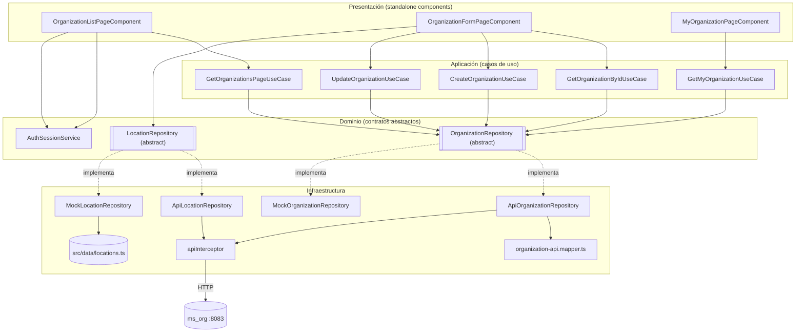
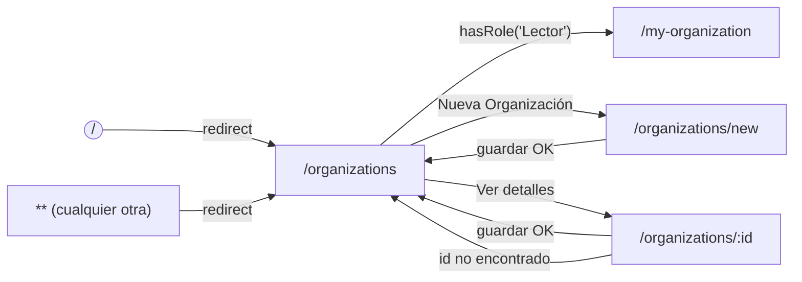
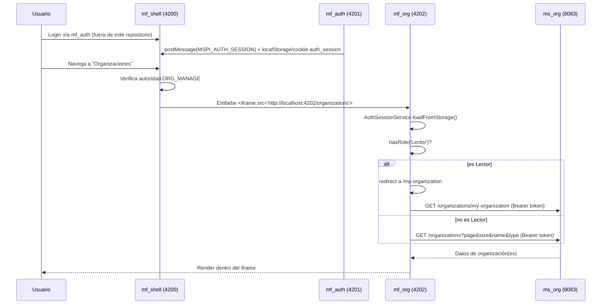

# mf_org — Diseño

**Repositorio:** `MSPI_NVA_CO_MR_FRONT/mf_org`
**Fecha del documento:** 2026-08-18
**Alcance:** Arquitectura de software, estructura real de carpetas, componentes principales, integración con `mf_shell` y decisiones técnicas del microfrontend `mf_org`, contrastando la documentación preexistente (`docs/ARQUITECTURA.md`, `docs/INTEGRACION-SHELL.md`) con la evidencia directa del código fuente.

---

## 1. Hallazgo previo — dos árboles de código conviviendo en el repositorio

Antes de describir la arquitectura, es necesario declarar un hallazgo determinante, análogo al observado en `mf_auth`: el repositorio `mf_org` contiene **dos conjuntos de código distintos**:

1. **`src/app/**`** — la aplicación **Angular 19 real**, standalone, la única compilada y servida. Confirmado porque `tsconfig.app.json` declara:
   ```json
   "include": ["src/main.ts", "src/app/**/*.ts"]
   ```
   y `angular.json` fija `"browser": "src/main.ts"` como único punto de entrada del build, con `"outputPath": "dist/mf-org"`.

2. **`src/features/**`, `src/components/ui/*.tsx`, `src/federated/OrganizationsApp.tsx`, `src/common/domain/errors/Result.ts`, `src/config/env.ts`, y el `README.md`/`index.html` de la raíz del proyecto** — restos de una plantilla **React + Vite**, con Module Federation planeado (`OrganizationsApp.tsx` se autodenomina *"Entry point federado para Module Federation"* y usa `@tanstack/react-query`, `sonner`, JSX/TSX), reemplazada después por la implementación Angular real sin eliminar los archivos originales.

Evidencia adicional de que el segundo grupo es código muerto para el build Angular:
- Usa extensión `.tsx` (JSX de React) y importa `@tanstack/react-query`, `sonner` — ninguna de estas librerías figura en `package.json` de `mf_org` (solo dependencias Angular, ver `01-Planificacion.md`).
- `index.html` de la **raíz** del repositorio apunta a `<script type="module" src="/src/main.tsx"></script>` — un `main.tsx` que no existe en el árbol Angular; el `index.html` **real** que usa Angular CLI es `src/index.html` (referenciado por `angular.json` → `"index": "src/index.html"`), con `<app-root>` y sin ningún `<script>` de entrada manual.
- `src/config/env.ts` lee `import.meta.env.VITE_USE_MOCKS`, sintaxis de **Vite**; el proyecto usa `@angular-devkit/build-angular`, no Vite, por lo que `import.meta.env` sería `undefined` en tiempo de ejecución real; este archivo no se importa desde ningún módulo bajo `src/app` (verificado por búsqueda de referencias).
- `README.md` de la raíz del proyecto es la plantilla genérica de Bitbucket ("Edit a file, create a new file, and clone from Bitbucket in under 2 minutes"), sin relación con MSPI ni con organizaciones.

**Excepción parcial — `src/data/locations.ts` sí es código vivo:** a diferencia de `mf_auth`, en `mf_org` el archivo `src/data/locations.ts` (catálogo estático de países/departamentos/ciudades de la plantilla original) **es importado directamente desde el árbol Angular real**: `src/app/infrastructure/mock-location.repository.ts` contiene `import { countries, states, cities } from '../../data/locations';`. Aunque `tsconfig.app.json` no lista `src/data` en su `include`, TypeScript resuelve igualmente los imports transitivos desde los archivos raíz incluidos (`src/app/**/*.ts`), de modo que `src/data/locations.ts` **sí se compila y empaqueta** en el build de producción. Este archivo debe tratarse como dependencia real, no como resto desechable, en cualquier tarea de limpieza futura del árbol heredado.

**Consecuencia para este documento:** la arquitectura descrita a partir de aquí corresponde a `src/app/**` más la única dependencia externa real que consume (`src/data/locations.ts`). El resto del árbol heredado (`src/features`, `src/components/ui`, `src/federated`, `src/common/domain/errors/Result.ts`, `src/config/env.ts`) se referencia solo para dejar constancia de que no forma parte del build compilado.

## 2. Arquitectura por capas (Clean Architecture) — implementación real en `src/app`

`docs/ARQUITECTURA.md` resume correctamente las capas a alto nivel; a continuación se detalla con base en el código real:

```
src/app/
├── domain/                          # Capa 1 — Dominio: contratos, tipos
│   ├── organization.repository.ts   (abstract class OrganizationRepository)
│   ├── organization.types.ts        (Organization, PageRequest, PageResponse, payloads)
│   ├── location.repository.ts       (abstract class LocationRepository)
│   ├── location.types.ts            (LocationCountry, LocationState, LocationCity)
│   └── auth/
│       └── auth-session.service.ts  (estado de sesión con signals, lectura de rol)
│
├── application/                     # Capa 2 — Casos de uso
│   ├── get-organizations-page.use-case.ts
│   ├── get-organization-by-id.use-case.ts
│   ├── create-organization.use-case.ts
│   ├── update-organization.use-case.ts
│   └── get-my-organization.use-case.ts
│
├── infrastructure/                  # Capa 3 — Implementaciones concretas
│   ├── api/api-response.model.ts        (ApiError, ApiMeta)
│   ├── interceptors/api.interceptor.ts  (interceptor HTTP funcional)
│   ├── api-organization.repository.ts   (ApiOrganizationRepository)
│   ├── mock-organization.repository.ts  (MockOrganizationRepository)
│   ├── api-location.repository.ts       (ApiLocationRepository)
│   ├── mock-location.repository.ts      (MockLocationRepository, usa src/data/locations.ts)
│   └── organization-api.mapper.ts       (mapOrganizationTypeToApi/FromApi)
│
└── presentation/                    # Capa 4 — UI (componentes standalone Angular)
    └── pages/
        ├── organization-list-page.component.{ts,html,scss}
        ├── organization-form-page.component.{ts,html,scss}
        └── my-organization-page.component.ts (template y estilos inline)
```

Particularidad respecto al patrón "Clean Architecture" clásico: igual que en `mf_auth`, **el dominio define los repositorios como `abstract class`** (`OrganizationRepository`, `LocationRepository`), no `interface`, lo que permite usarlos directamente como **token de inyección de dependencias de Angular** en `app.config.ts`, sin necesidad de `InjectionToken` explícitos.

`mf_org` tiene una capa `domain` más liviana que `mf_auth`: no existe un `auth.repository.ts` propio, sino que **reutiliza únicamente `AuthSessionService`** para leer la sesión que `mf_auth` ya persistió — `mf_org` no emite ni gestiona sesión, solo la consume.

### 2.1 Regla de dependencia

| Capa | Depende de | Ejemplo verificado |
|---|---|---|
| `domain` | Nada (solo Angular core para `@Injectable`) | `organization.repository.ts` no importa infraestructura |
| `application` | `domain` | `GetOrganizationsPageUseCase` inyecta `OrganizationRepository` (abstracto) |
| `infrastructure` | `domain` (implementa), `environments`, `src/data/locations.ts` (solo el mock de ubicación) | `ApiOrganizationRepository extends OrganizationRepository` |
| `presentation` | `application`, `domain` | `OrganizationListPageComponent` inyecta `GetOrganizationsPageUseCase`, `AuthSessionService` |

La selección de la implementación concreta (mock vs API) ocurre en un único punto de composición: `app.config.ts`, mediante el flag `environment.useMocks`:

```ts
{
  provide: OrganizationRepository,
  useClass: environment.useMocks ? MockOrganizationRepository : ApiOrganizationRepository,
},
{
  provide: LocationRepository,
  useClass: environment.useMocks ? MockLocationRepository : ApiLocationRepository,
},
```

## 3. Diagrama de arquitectura



## 4. Diagrama de navegación (rutas)

Rutas reales, definidas en `src/app/app.routes.ts` (carga perezosa con `loadComponent`, sin `NgModule`, sin guards):



## 5. Integración con `mf_shell`

### 5.1 Mecanismo real de integración

Al igual que en `mf_auth`, no se encontró configuración de **Module Federation** en `mf_org` (sin `@angular-architects/module-federation`, sin `webpack.config.js`, sin `exposes`/`remotes`). La integración documentada en `docs/INTEGRACION-SHELL.md` y verificada en el código es de tipo **"microfrontends por composición en el navegador"**, mediante `iframe`:

1. **Embebido por `iframe`**: el shell enruta `/organizations` hacia un `<iframe>` apuntando a `http://localhost:4202/organizations`, y `/my-organization` hacia `http://localhost:4202/my-organization`. La condición previa (`ORG_MANAGE`) se evalúa **en el shell**, antes de renderizar el iframe — no dentro de `mf_org`.
2. **Sesión leída, no emitida**: `mf_org` no genera sesión; `AuthSessionService.readFromStorage()` intenta leer, en orden, `localStorage['auth_session']`, `sessionStorage['auth_session']` y finalmente la cookie `auth_session` (`path=/`, `SameSite=Lax`) — la misma clave y el mismo formato que persiste `mf_auth`.
3. **`loadFromStorage()` invocado explícitamente**: a diferencia de `AuthSessionService` de `mf_auth` (que se inicializa una sola vez en el constructor del signal), `mf_org` vuelve a leer el almacenamiento en `ngOnInit()` de `OrganizationListPageComponent` (`this.authSession.loadFromStorage();`), lo que sugiere una compensación para el caso en que `mf_org` se cargue en un `iframe` **después** de que la sesión ya fue escrita por `mf_auth` en una pestaña/instancia distinta.

### 5.2 Diagrama de integración



### 5.3 Limitación explícita heredada del ecosistema

`docs/INTEGRACION-SHELL.md` reutiliza la misma advertencia documentada para otros microfrontends: *"entrar por 4200 recomendado"*, reconociendo que la sesión compartida por `localStorage`/cookie entre orígenes de puertos distintos (4200 vs 4202 en local) es parcial. Esta es una limitación de diseño reconocida en la propia documentación del repositorio, no una interpretación de este análisis (ver también `03-Diseno.md` de `mf_auth`, que documenta el mismo mecanismo desde el lado emisor).

## 6. Componentes principales

| Componente/Servicio | Tipo | Responsabilidad |
|---|---|---|
| `AppComponent` | Componente raíz | Solo `<router-outlet>`, sin lógica |
| `OrganizationListPageComponent` | Página | Listado paginado, búsqueda, filtro por tipo, redirección de rol `Lector` |
| `OrganizationFormPageComponent` | Página | Alta/edición de organización, cascada geográfica, validación de formulario |
| `MyOrganizationPageComponent` | Página | Vista de solo lectura de la organización asociada a la sesión |
| `AuthSessionService` | Servicio (`providedIn: 'root'`) | Lectura de sesión (token/roles) persistida por `mf_auth`; no emite sesión propia |
| `apiInterceptor` | Interceptor funcional (`HttpInterceptorFn`) | Adjunta `Authorization: Bearer`, desenvuelve `{data, meta}`, traduce errores a `ApiError`, limpia sesión en 401 |
| `organization-api.mapper.ts` | Funciones puras | Traduce el tipo de organización entre el vocabulario de UI y el contrato de `ms_org` |

## 7. Decisiones técnicas observadas

1. **Componentes standalone, sin `NgModule`**: todo el árbol de presentación usa `standalone: true` con `imports` explícitos por componente (`RouterLink`, `FormsModule`).
2. **Estado reactivo con Angular Signals**: cada página usa `signal()` para estado local (`organizations`, `loading`, `search`, `error`, etc.) y `computed()` para valores derivados (`isEdit` en el formulario), consistente con el patrón observado en `mf_auth`.
3. **Repositorios abstractos como `abstract class`** en vez de `interface` + `InjectionToken`, igual que en `mf_auth`.
4. **Interceptor funcional** (`HttpInterceptorFn`) en vez de la clase `HttpInterceptor` clásica, compartiendo prácticamente el mismo código que el interceptor de `mf_auth` (desenvolvimiento de `{data, meta}`, `ApiError`, limpieza de sesión en 401).
5. **Formularios *template-driven*** (`FormsModule` + `[(ngModel)]`), no `ReactiveFormsModule` — mismo patrón que `mf_auth`.
6. **Adaptador de formato de API con mapeo léxico dedicado**: a diferencia de `mf_auth` (que solo traduce forma de DTO), `mf_org` introduce un mapeador específico (`organization-api.mapper.ts`) para resolver una discrepancia de **vocabulario** entre la UI en español (`PUBLICA`/`PRIVADA`) y el contrato en inglés de `ms_org` (`PUBLIC`/`PRIVATE`) — una decisión de diseño explícita para no filtrar el idioma del backend hacia el dominio de la UI.
7. **Reutilización condicionada de un artefacto de la plantilla heredada**: `MockLocationRepository` importa `src/data/locations.ts` en vez de definir sus propios datos de prueba embebidos, aprovechando (posiblemente sin plena intención) un catálogo geográfico ya existente en el repositorio.
8. **Ausencia de *route guards***: igual que en `mf_auth`, no existen `CanActivateFn`; el único control de acceso por rol es la redirección imperativa de `Lector` dentro de `ngOnInit()`.
9. **Sin operación de borrado en el dominio**: decisión (o limitación de alcance del backend) de no incluir `delete` en `OrganizationRepository`, a diferencia de otros dominios del ecosistema que sí soportan activar/desactivar (p. ej. usuarios en `mf_auth`).

## 8. Estructura de carpetas completa (real, con distinción de código vivo/muerto)

```
src/
├── app/                              # CÓDIGO ANGULAR REAL (compilado)
│   ├── app.component.ts
│   ├── app.config.ts
│   ├── app.routes.ts
│   ├── application/{create,update,get-by-id,get-page,get-my}-organization*.use-case.ts
│   ├── domain/
│   │   ├── organization.repository.ts / organization.types.ts
│   │   ├── location.repository.ts / location.types.ts
│   │   └── auth/auth-session.service.ts
│   ├── infrastructure/
│   │   ├── api/api-response.model.ts
│   │   ├── interceptors/api.interceptor.ts
│   │   ├── api-organization.repository.ts / mock-organization.repository.ts
│   │   ├── api-location.repository.ts / mock-location.repository.ts  (usa src/data/locations.ts)
│   │   └── organization-api.mapper.ts
│   └── presentation/pages/ (3 páginas, ver sección 6)
├── environments/{environment.ts, environment.api.ts}
├── data/locations.ts                 # CÓDIGO VIVO (usado por MockLocationRepository)
├── config/env.ts                     # NO USADO por el build (sintaxis Vite)
├── common/, features/, federated/, components/ui/  # NO USADOS por el build (plantilla React/Vite)
├── index.html / main.ts / styles.scss / index.css
public/                                # (sin activos propios verificados más allá del glob de assets)
deployment/
├── Dockerfile, nginx.conf
docs/
├── (documentación preexistente, 7 archivos .md)
```

## 9. Conclusión de diseño

La aplicación real de `mf_org` implementa una Clean Architecture ligera adaptada a Angular 19 standalone, siguiendo el mismo patrón arquitectónico que `mf_auth`: repositorios abstractos como token de DI, casos de uso de responsabilidad única, e interceptor funcional para el manejo transversal de HTTP. Su particularidad frente a `mf_auth` es doble: (1) no gestiona sesión propia, solo la **consume** para decidir la redirección del rol `Lector`; y (2) introduce un mapeador de vocabulario dedicado para reconciliar el idioma de la UI con el contrato en inglés del backend `ms_org`. La integración con el shell tampoco es Module Federation, sino composición por `iframe` con sesión compartida vía `localStorage`/cookie, con la misma limitación reconocida de puertos distintos en entorno local. El repositorio conserva un árbol de código muerto de una plantilla React/Vite con intención original de Module Federation, del cual **un solo archivo** (`src/data/locations.ts`) resultó ser una dependencia real del build Angular — un matiz que distingue a `mf_org` de la limpieza más simple que aplicaría a `mf_auth`.
