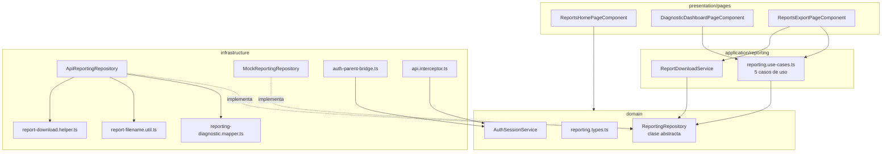
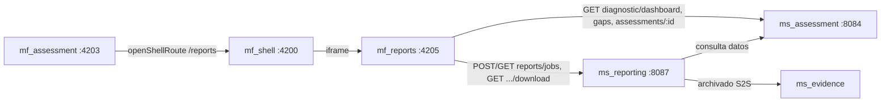
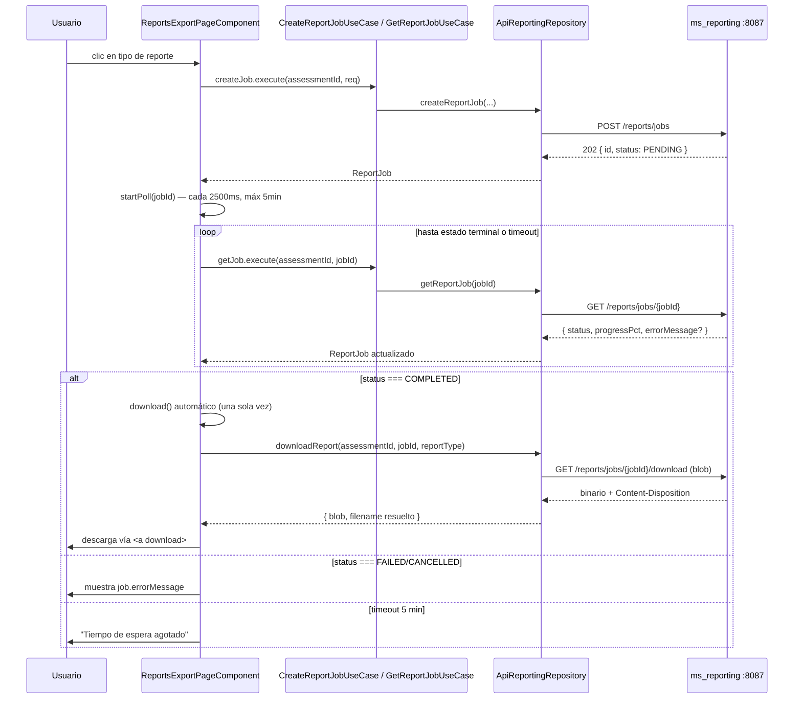
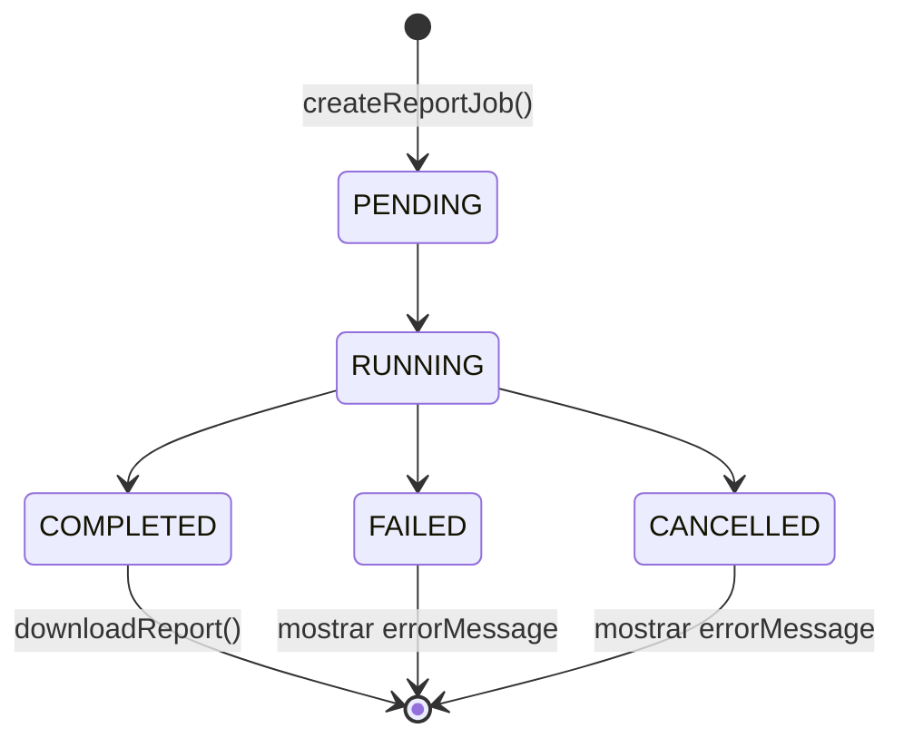

# mf_reports — Diseño

**Repositorio:** `MSPI_NVA_CO_MR_FRONT/mf_reports`
**Fecha del documento:** 2026-08-18
**Alcance:** Arquitectura real del microfrontend, estructura de carpetas, componentes principales, diagramas y decisiones técnicas, verificadas directamente en el código fuente de `src/app`.

---

## 1. Estilo arquitectónico

`mf_reports` implementa una variante de **arquitectura hexagonal / por capas** (dominio, aplicación, infraestructura, presentación), la misma convención usada en los demás microfrontends del ecosistema MSPI (p. ej. `mf_auth`). El objetivo es que la lógica de negocio (qué es un reporte, qué es un dominio ISO, cómo se calcula una banda de madurez) no dependa de Angular ni de HTTP, y que el origen de datos (mock o API real) sea intercambiable por configuración.



## 2. Estructura real de carpetas (`src/app`)

```
src/app/
├── app.component.ts               # Root standalone, instala el puente de sesión con el shell
├── app.config.ts                  # Providers: router, HttpClient+interceptor, selección mock/API
├── app.routes.ts                  # 3 rutas con lazy loading por componente
│
├── domain/
│   ├── auth/
│   │   └── auth-session.service.ts     # Estado reactivo de sesión (signals), lectura de localStorage/cookie
│   └── reporting/
│       ├── reporting.repository.ts     # Contrato abstracto (6 métodos)
│       └── reporting.types.ts          # Tipos puros: ReportType, ReportJob, DiagnosticDashboard, etc.
│
├── application/
│   └── reporting/
│       ├── reporting.use-cases.ts      # 5 casos de uso (Injectable, delegan al repositorio)
│       └── report-download.service.ts  # Descarga el blob y dispara "Guardar como" del navegador
│
├── infrastructure/
│   ├── api/
│   │   └── api-response.model.ts       # ApiError, ErrorDetail
│   ├── auth/
│   │   └── auth-parent-bridge.ts       # postMessage con el shell (request/response de sesión)
│   ├── interceptors/
│   │   └── api.interceptor.ts          # Bearer token + desempaquetado CorrectResponse + mapeo de errores
│   └── reporting/
│       ├── api-reporting.repository.ts       # Implementación HTTP real (ms_reporting + ms_assessment)
│       ├── mock-reporting.repository.ts      # Implementación en memoria, con progreso simulado de job
│       ├── report-download.helper.ts         # Interpreta la respuesta HTTP de descarga (blob vs. error JSON)
│       ├── report-filename.util.ts           # Reglas de nombre/extensión de archivo
│       └── reporting-diagnostic.mapper.ts    # Normaliza distintas formas de respuesta del backend
│
└── presentation/
    └── pages/
        ├── reports-home-page.component.ts        # /reports
        ├── diagnostic-dashboard-page.component.ts # /assessments/:id/dashboard
        └── reports-export-page.component.ts       # /assessments/:id/export
```

Un total de **17 archivos TypeScript** conforman el código fuente de la aplicación (excluyendo `main.ts` y `environments/`), todos dentro de `tsconfig.app.json` (`include: ["src/main.ts", "src/app/**/*.ts", "src/environments/**/*.ts"]`). A diferencia de otros microfrontends del ecosistema, **no se encontró código residual de otra plantilla o framework** dentro de `mf_reports`: la estructura es limpia y coherente con Angular 19 standalone.

## 3. Componentes principales

### 3.1 Capa de dominio

- **`ReportingRepository`** (clase abstracta, `reporting.repository.ts`): contrato con 6 métodos — `getDiagnosticDashboard`, `getGaps`, `createReportJob`, `createComparativeReportJob`, `getReportJob`, `downloadReport`. Es el único punto de acoplamiento entre la capa de aplicación y la infraestructura; se inyecta por token de clase (`ReportingRepository`), no por interfaz + `InjectionToken`, aprovechando que Angular permite inyectar clases abstractas directamente.
- **`AuthSessionService`** (`domain/auth/auth-session.service.ts`): expone `token` e `isAuthenticated` como `computed()` sobre un `signal<StoredSession | null>`. Lee la sesión de `localStorage`, luego `sessionStorage`, y como último recurso de una cookie `auth_session`. Expira la sesión localmente si `expiresAt` ya pasó.
- **`reporting.types.ts`**: 15 tipos/interfaces puros (sin decoradores Angular), incluyendo la unión literal `ReportType` (6 variantes) y `ReportJobStatus` (5 variantes).

### 3.2 Capa de aplicación

- **Casos de uso** (`reporting.use-cases.ts`): `GetDiagnosticDashboardUseCase`, `GetGapsUseCase`, `CreateReportJobUseCase`, `GetReportJobUseCase`, `DownloadReportUseCase`. Cada uno es una clase `@Injectable({ providedIn: 'root' })` de una sola responsabilidad, que solo delega en `ReportingRepository`. No agregan lógica propia — su valor de diseño es desacoplar los componentes de presentación del contrato de repositorio directo, y servir de punto único de extensión si en el futuro se requiere lógica adicional (por ejemplo, caché o *retry*).
- **`ReportDownloadService`**: separado de los casos de uso porque su responsabilidad es de efecto secundario en el DOM (crear un `<a>` temporal, invocar `.click()`, revocar el `ObjectURL`), no de orquestación de datos.

### 3.3 Capa de infraestructura

- **`ApiReportingRepository`**: única implementación que habla HTTP. Nótese que `getDiagnosticDashboard` combina **tres llamadas en paralelo** (`Promise.all`) a dos backends distintos (`ms_assessment` para diagnóstico y brechas, y metadatos de la evaluación), tolerando el fallo de la tercera (metadatos) con un valor de reserva.
- **`MockReportingRepository`**: mantiene un `Map<string, ReportJob>` en memoria y usa `setTimeout` (500 ms y 2000 ms) para simular la transición `PENDING → RUNNING → COMPLETED`, permitiendo probar visualmente el *polling* y la barra de progreso sin backend.
- **`reporting-diagnostic.mapper.ts`**: la pieza de mayor complejidad de mapeo del microfrontend. Normaliza variantes de forma de respuesta del backend: por ejemplo, `domainEffectiveness` puede llegar como arreglo plano o como objeto `{ domains, overallAverage, overallBandLabel }`; el puntaje de un dominio puede venir en cualquiera de 4 campos posibles (`currentScore`, `combinedScore`, `adminScore`, `techScore`); PHVA puede llegar como `components[]` o como 4 campos sueltos (`planAdvance`, `doAdvance`, `checkAdvance`, `actAdvance`). Esta tolerancia a variantes sugiere que el contrato del backend `ms_assessment` no está completamente estabilizado, y el mapeador actúa como capa anticorrupción.
- **`report-filename.util.ts`** y **`report-download.helper.ts`**: resuelven, respectivamente, qué nombre/extensión debe llevar el archivo descargado, y cómo distinguir una respuesta binaria válida de un error JSON que llegó por el mismo *endpoint* de descarga (patrón necesario porque Angular `HttpClient` con `responseType: 'blob'` no puede negociar el tipo de contenido dinámicamente).
- **`api.interceptor.ts`**: interceptor funcional (`HttpInterceptorFn`, patrón Angular 15+) con tres responsabilidades: inyectar `Authorization: Bearer`, desempaquetar el sobre `{ data, meta }` de las respuestas JSON exitosas (dejando pasar los `Blob` sin tocar), y traducir errores HTTP a `ApiError` tipado (excepto cuando el error es un `Blob`, que se delega al manejador de descargas).

### 3.4 Capa de presentación

Los tres componentes de página son **standalone**, con plantilla y estilos definidos **inline** en el decorador `@Component` (no hay archivos `.html`/`.scss` separados por componente). Usan la sintaxis de control de flujo nativa de Angular 17+ (`@if`, `@for`) en lugar de directivas estructurales (`*ngIf`, `*ngFor`).

| Componente | Ruta | Responsabilidad |
|---|---|---|
| `ReportsHomePageComponent` | `/reports` | Punto de entrada; decide entre evaluación activa o modo demo |
| `DiagnosticDashboardPageComponent` | `/assessments/:id/dashboard` | Carga y renderiza el tablero consolidado |
| `ReportsExportPageComponent` | `/assessments/:id/export` | Orquesta creación de *job*, *polling* y descarga |

## 4. Diagrama de integración con el ecosistema



## 5. Diagrama de secuencia — flujo de exportación (detallado)



## 6. Diagrama de estados del job de reporte



## 7. Decisiones técnicas relevantes

| Decisión | Justificación observada | Evidencia |
|---|---|---|
| Repositorio inyectado por clase abstracta, seleccionado en `app.config.ts` según `environment.useMocks` | Permite desarrollo y demo sin backend, y cambia de implementación sin tocar consumidores | `app.config.ts` |
| Interceptor único para auth + desempaquetado de sobre + mapeo de errores | Centraliza cross-cutting concerns en un solo punto en vez de duplicarlos por repositorio | `api.interceptor.ts` |
| Blob detectado y excluido explícitamente del desempaquetado `{ data, meta }` | Las descargas binarias no siguen el contrato `CorrectResponse` de las respuestas JSON del backend | `api.interceptor.ts`, comentario `// Descargas binarias (GET .../download): no desempaquetar CorrectResponse` |
| Extensión de archivo siempre forzada por tipo de reporte, nunca confiada al header | Evita archivos con extensión incorrecta si el backend envía un nombre incompleto o con extensión errónea | `report-filename.util.ts::resolveReportFilename` |
| Mapeador de diagnóstico tolerante a múltiples formas de respuesta | El contrato de `ms_assessment` presenta variantes de campo (ver sección 3.3); el mapeador evita que la UI se acople a una forma específica | `reporting-diagnostic.mapper.ts` |
| Sin Module Federation; integración por iframe + postMessage + localStorage | Consistente con el resto del ecosistema MSPI (mismo patrón verificado en `mf_auth`); evita acoplamiento de build entre microfrontends | Ausencia de `@angular-architects/module-federation` en `package.json`; `auth-parent-bridge.ts` |
| Componentes standalone con plantilla/estilos inline, sin `NgModule` | Convención Angular 17+ recomendada; reduce archivos por componente en un microfrontend de alcance reducido (3 pantallas) | Los 3 componentes de `presentation/pages` |
| Lazy loading por componente en el router (`loadComponent`) | Reduce el bundle inicial; cada pantalla se descarga solo cuando se navega a su ruta | `app.routes.ts` |

## 8. Hallazgos de diseño (declarados explícitamente)

- **No existe verificación de autoridad `REPORT_EXPORT` en el código.** La pantalla de exportación menciona el requisito solo como texto informativo (`reports-export-page.component.ts`, `<p class="hint">`); no hay guard de ruta ni verificación condicional que oculte o bloquee los botones de generación si el usuario carece de esa autoridad. Se declara como brecha de seguridad de UI (defensa en profundidad — el backend `ms_reporting` presumiblemente sí valida la autoridad, pero el frontend no refuerza esa restricción).
- **Sin `CanActivate` guards en `app.routes.ts`.** Las tres rutas son de acceso libre a nivel de router; la protección de acceso, si existe, depende enteramente de que las llamadas HTTP fallen con 401/403 en el backend.
- **Doble llamada a metadatos de evaluación en el flujo de creación de job sin `organizationId`.** Si `ReportsExportPageComponent` no recibe `organizationId` por query param, `ApiReportingRepository.createReportJob` hace una llamada adicional a `GET /assessments/{id}` — llamada que también se hizo previamente al cargar el tablero. No hay caché entre pantallas.
