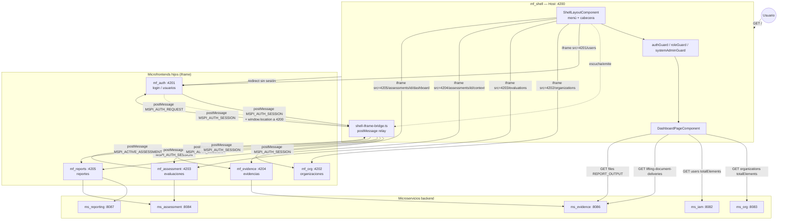

# mf_shell — Diseño

**Repositorio:** `MSPI_NVA_CO_MR_FRONT/mf_shell`
**Fecha del documento:** 2026-08-18
**Fuente:** código fuente (`src/app/**`), `angular.json`, `package.json`, `docs/ARQUITECTURA.md`, `docs/DIAGRAMAS.md`, `docs/INTEGRACION-SHELL.md`.

---

## 1. Mecanismo real de orquestación (confirmado con evidencia)

Este es el punto de diseño más importante del microfrontend host y el que presenta mayor divergencia entre la documentación del repositorio. Se resume la evidencia que permite confirmarlo sin ambigüedad:

| Evidencia | Resultado |
|---|---|
| `package.json` | Solo dependencias `@angular/*`, `rxjs`, `zone.js`, `tslib`. **No** hay `@angular-architects/module-federation`, `@originjs/vite-plugin-federation`, `vite`, `react` ni `react-dom`. |
| `angular.json` | Un único proyecto `shell` tipo `application`, builder `@angular-devkit/build-angular:application` (esbuild/Vite interno de Angular CLI, no relacionado con *Module Federation*). No existe sección de `remotes` ni `federation.config.js`. |
| `tsconfig.app.json` (incluye solo `src/main.ts`, `src/app/**/*.ts`) | El árbol de compilación real es exclusivamente Angular; no incluye ningún `.tsx` ni `src/features/`. |
| Búsqueda en `src/` | No existe ningún `vite.config.ts`, `AppWithProviders.tsx`, `RemoteAppId.ts` ni `ModuleFederationRemoteLoader.ts` — las rutas que sí describe `docs/ARQUITECTURA-CLEAN-ARCHITECTURE.md` no están presentes en el repositorio real. |
| `src/app/presentation/pages/*-redirect.component.ts` (users, organizations, evaluations, evidence, reports, my-organization) | Cada uno renderiza un `<iframe [src]="...">` apuntando directamente a `http://localhost:420X/<ruta>`. Comentario explícito en `users-redirect.component.ts`: *"Mientras no tengamos Module Federation, usamos un iframe para mantener el menú del dashboard."* |
| `src/app/infrastructure/shell-iframe-bridge.ts` | Implementa un protocolo propio de `window.postMessage` (`MSPI_AUTH_SESSION`, `MSPI_AUTH_REQUEST`, `MSPI_ACTIVE_ASSESSMENT`, `MSPI_SHELL_NAV`) para sincronizar sesión y navegación entre el shell y los iframes hijos — mecanismo típico de integración por iframe, no de federación de módulos JS. |
| `docs/INTEGRACION-SHELL.md` (documento consistente con el código) | Declara explícitamente: *"Modelo actual: iframe (no Module Federation activo)"* y, en su cierre, *"Module Federation (futuro): El código y comentarios preparan carga de remotos sin iframe; hoy los redirects usan iframe explícito."* |

**Conclusión de diseño:** `mf_shell` orquesta a sus cinco microfrontends hijos mediante **`<iframe>` HTML** apuntando a los puertos fijos 4201–4205, **no** mediante Module Federation (Webpack ni Vite) ni Native Federation. La sincronización de estado entre el shell y los iframes (sesión JWT, evaluación activa, navegación cruzada) se resuelve con un **protocolo de mensajería `postMessage` diseñado a medida**, validado por lista blanca de orígenes, más `localStorage` como almacén compartido de mismo origen (los iframes, al servirse desde otro puerto, no comparten `localStorage` de forma nativa con el shell — de ahí la necesidad del relevo por `postMessage`).

Esto es coherente con el hallazgo del piloto de `mf_auth`, que tampoco usa Module Federation real y se integra con el shell mediante navegación de página completa y el mismo protocolo `postMessage`/almacenamiento compartido.

### 1.1 Documentación descartada como fuente de diseño

`mf_shell/README.md` y `docs/ARQUITECTURA-CLEAN-ARCHITECTURE.md` describen una arquitectura **Vite + React + `@originjs/vite-plugin-federation`**, con capas `domain/application/infrastructure/presentation` bajo `src/features/shell/` en TypeScript/TSX, un `LoadRemotePort`, un `ModuleFederationRemoteLoader` y un hook `useRemoteApp`. Ninguno de esos archivos existe en el repositorio. Se interpreta como documentación heredada de una fase de diseño anterior o de una plantilla compartida con un prototipo React del shell, **nunca migrada a Angular** cuando el proyecto adoptó ese framework. `docs/INTEGRAR-NUEVOS-MF.md` hereda el mismo error y por tanto **no debe seguirse tal cual** para integrar un nuevo microfrontend Angular en este shell; la guía correcta, basada en el patrón real (iframe), se reconstruye en `07-Mantenimiento.md` de este documento.

## 2. Arquitectura en capas (Clean Architecture aplicada)

```
src/app/
├── domain/           # Entidades, puertos, cálculo de autoridades
│   ├── auth/auth-session.service.ts
│   └── dashboard/
│       ├── authority.ts
│       ├── dashboard-role.ts
│       ├── dashboard-user.ts
│       └── get-dashboard-user.port.ts
├── application/       # Casos de uso
│   └── dashboard/get-dashboard-user.use-case.ts
├── infrastructure/     # Adaptadores (localStorage, HTTP, iframe bridge)
│   ├── api/api-response.model.ts
│   ├── dashboard/
│   │   ├── dashboard-stats.service.ts
│   │   └── local-storage-dashboard-user.adapter.ts
│   ├── interceptors/api.interceptor.ts
│   └── shell-iframe-bridge.ts
└── presentation/       # Componentes, guards, layout
    ├── components/shell-loading.component.ts
    ├── guards/auth.guard.ts, role.guard.ts
    ├── layout/shell-layout.component.{ts,html,scss}
    └── pages/
        ├── dashboard-page.component.{ts,html,scss}
        ├── *-redirect.component.ts (users, organizations, my-organization, evaluations, evidence, reports)
        ├── feature-placeholder-page.component.ts
        ├── login-placeholder.component.ts
        └── remote-placeholder.component.ts
```

Esta estructura sí coincide plenamente con el código real (a diferencia de la descrita en `ARQUITECTURA-CLEAN-ARCHITECTURE.md`) y está confirmada por `docs/ARQUITECTURA.md`.

| Capa | Responsabilidad observada |
|---|---|
| **Domain** | `DashboardUser` (modelo de usuario para UI), `GetDashboardUserPort` (puerto de lectura de sesión), `authority.ts` (`hasAuthority`, `isSystemAdmin`, `getUserAuthorities`, mapeo rol → autoridades), `AuthSessionService` (lectura reactiva de `auth_session` con `signal`/`computed`). |
| **Application** | `GetDashboardUserUseCase`: único caso de uso explícito, obtiene el usuario para el layout y el menú a través del puerto de dominio. |
| **Infrastructure** | `LocalStorageDashboardUserAdapter` (implementa `GetDashboardUserPort` leyendo `auth_session`), `DashboardStatsService` (contadores reales vía HTTP a `ms_org`/`ms_iam`/`ms_evidence`), `api.interceptor.ts` (Bearer + unwrap `data`), `shell-iframe-bridge.ts` (relevo de sesión y navegación hacia/desde iframes). |
| **Presentation** | `ShellLayoutComponent` (menú + `router-outlet`), `DashboardPageComponent` (tarjetas por rol), componentes `*-redirect` (iframes a los puertos 4201–4205), `auth.guard.ts`, `role.guard.ts`. |

## 3. Inyección de dependencias

Configurada en `app.config.ts` mediante los *providers* estándar de Angular (sin librería de contenedor IoC de terceros):

```ts
export const appConfig: ApplicationConfig = {
  providers: [
    provideZoneChangeDetection({ eventCoalescing: true }),
    provideRouter(appRoutes),
    provideHttpClient(withInterceptors([apiInterceptor])),
    { provide: GetDashboardUserPort, useClass: LocalStorageDashboardUserAdapter },
  ],
};
```

El único puerto de dominio inyectado es `GetDashboardUserPort`, resuelto por `LocalStorageDashboardUserAdapter`. Esto permite, en teoría, sustituir la fuente del usuario (por ejemplo, por una llamada API real al perfil) sin tocar `ShellLayoutComponent`, `DashboardPageComponent` ni los guards, que dependen únicamente de `GetDashboardUserUseCase`.

## 4. Diagrama de integración con los 5 microfrontends hijos



Este diagrama consolida y verifica con el código el diagrama presentado en `docs/DIAGRAMAS.md`, con el añadido explícito del rol del `shell-iframe-bridge.ts` y de los mensajes `postMessage` reales, no representados en el original.

## 5. Diseño de navegación

- **Enrutador único**: `provideRouter(appRoutes)` define todas las rutas del shell; no hay sub-enrutadores por microfrontend (cada hijo maneja su propio enrutamiento *dentro* de su iframe, de forma independiente al `Router` de Angular del shell).
- **Layout persistente**: todas las rutas protegidas son hijas de `ShellLayoutComponent` (patrón *layout route* de Angular Router), de modo que el menú y la cabecera no se destruyen al cambiar entre módulos — solo cambia el contenido de `<router-outlet>`.
- **Carga perezosa por ruta**: cada componente de redirección se carga con `loadComponent: () => import(...)`, evitando incluir en el bundle inicial componentes de rutas no visitadas.
- **Rutas de "acceso denegado" implícitas**: no existe una página de error 403; toda denegación de autorización redirige a `/dashboard?accessDenied=1`, reutilizando la misma pantalla con un indicador de query param.
- **Ruta comodín**: `{ path: '**', redirectTo: '/dashboard' }` evita páginas 404 visibles al usuario final.
- **Navegación cruzada iniciada por un hijo**: un microfrontend embebido puede pedir al shell que navegue a otra ruta del propio shell (por ejemplo, de Evaluaciones a Evidencias) mediante `MSPI_SHELL_NAV`, que el `ShellLayoutComponent` traduce en `router.navigateByUrl(route)` — es la única vía de comunicación "hijo → navegación del padre".

## 6. Modelo de seguridad de la mensajería entre orígenes

| Mecanismo | Detalle | Archivo |
|---|---|---|
| Lista blanca por regex | `isShellChildOrigin(origin)` acepta solo `http://(localhost\|127.0.0.1):420[1-5]` | `shell-iframe-bridge.ts` |
| Lista blanca explícita (solo auth) | `ShellLayoutComponent.onAuthMessage` solo acepta `http://localhost:4201` / `http://127.0.0.1:4201` para `MSPI_AUTH_SESSION` entrante desde el login | `shell-layout.component.ts` |
| `targetOrigin` en `postMessage` saliente | El shell envía la sesión a cada iframe indicando explícitamente `childOrigin` (no `"*"`), reduciendo el riesgo de fuga a orígenes no confiables | `postAuthSessionToIframe` |
| Sanitización de URL de iframe | Las URLs con datos dinámicos (id de evaluación) se sanitizan con `DomSanitizer.bypassSecurityTrustResourceUrl` antes de asignarse al `src` del iframe | `evidence-redirect.component.ts`, `reports-redirect.component.ts` |

**Observación de diseño:** el modelo de seguridad está atado a orígenes de desarrollo local (`localhost`/`127.0.0.1`, puertos fijos). No se encontró en el código ninguna variable de entorno o configuración que parametrice estos orígenes para un despliegue en dominios de producción distintos; se documenta como limitación en `07-Mantenimiento.md`.

## 7. Decisiones técnicas observadas

| Decisión | Justificación inferida | Evidencia |
|---|---|---|
| Iframe en vez de Module Federation | Evita acoplar el build del shell a los builds de los 5 microfrontends hijos; cada uno se despliega y versiona de forma completamente independiente, a costa de mayor complejidad en sincronización de estado. | Comentarios en código, `INTEGRACION-SHELL.md` |
| `postMessage` con protocolo de tipos propio (`MSPI_*`) en vez de una librería de bus de eventos | Mantiene el acoplamiento mínimo: solo se comparte un contrato de mensajes de texto plano, sin dependencia binaria compartida entre microfrontends. | `shell-iframe-bridge.ts` |
| `localStorage` como almacén de sesión primario, reforzado por `postMessage` | El `localStorage` no se comparte automáticamente entre orígenes (puertos) distintos en el navegador; el `postMessage` es el mecanismo que salva esa limitación replicando el valor en cada origen. | `shell-iframe-bridge.ts`, `auth-session.service.ts` |
| Tabla estática de autoridades por rol en el frontend (`ROLE_AUTHORITIES`) en vez de consumir permisos del backend | Simplifica el cálculo de UI (menú, guards) sin una llamada adicional de "permisos efectivos"; acopla el frontend a la taxonomía de roles del backend `ms_iam`. | `authority.ts` |
| Interceptor único de HTTP para todas las llamadas propias del shell (no de los iframes) | Centraliza la inyección del Bearer token y el desenvolvimiento de la respuesta paginada `{ data, meta }` para las llamadas de `DashboardStatsService`. | `api.interceptor.ts` |
| Placeholders explícitos para módulos no implementados, en vez de ocultarlos del menú | Comunica al usuario y a los evaluadores del proyecto qué está planificado pero pendiente (Escalas, Banco de preguntas, Auditoría, Salud, Configuración). | `feature-placeholder-page.component.ts`, `app.routes.ts` (bloque `data`) |

## 8. Limitaciones de diseño detectadas

- No existe *feature flag* ni configuración para alternar entre el modelo iframe actual y una futura integración por Module Federation; el cambio implicaría reescribir `infrastructure/shell-iframe-bridge.ts` y los seis componentes `*-redirect`.
- El cálculo de autoridades (`ROLE_AUTHORITIES`) está duplicado por diseño en cada microfrontend que lo necesita (mismo patrón que en `mf_auth`), sin una fuente única de verdad compartida en tiempo de ejecución; un cambio de política de roles exige actualizar el archivo en varios repositorios.
- El `environment.ts` del shell no distingue configuración de desarrollo/producción (no hay `environment.prod.ts`); las URLs de microservicios están fijas a `localhost` en el único archivo de entorno versionado.
