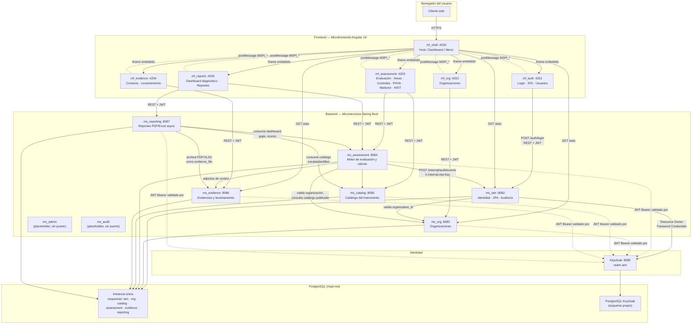
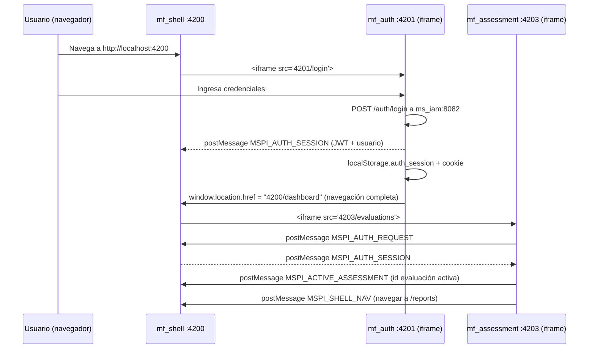
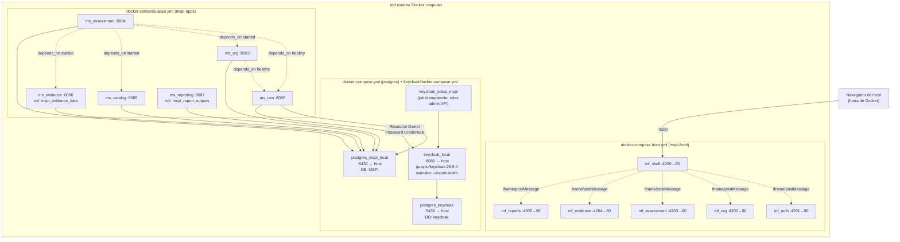
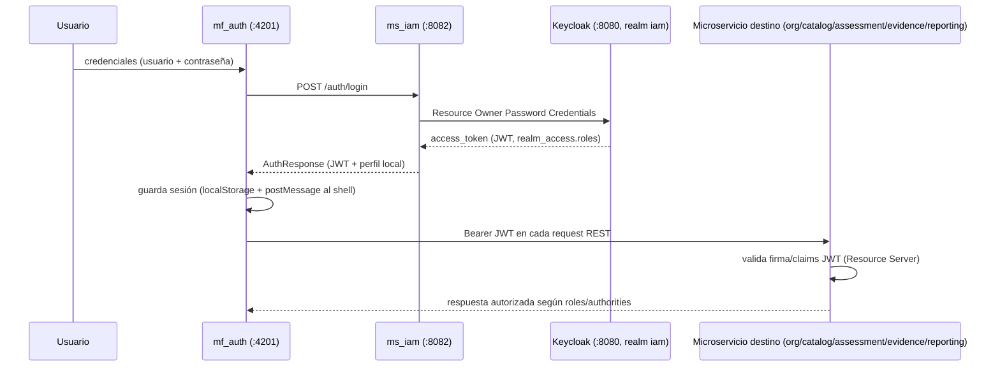
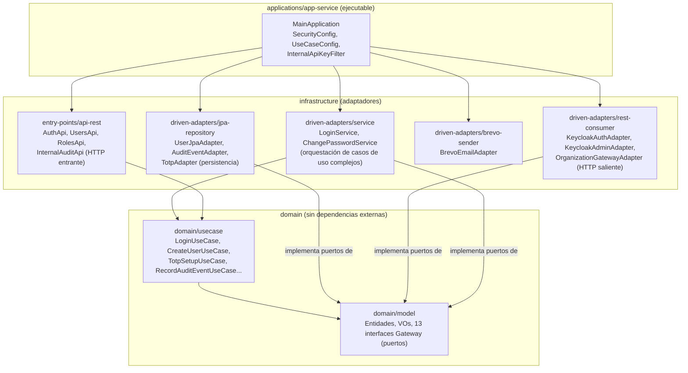

# Arquitectura General del Sistema — Proyecto MSPI

**Documento de nivel de proyecto completo** (no por microservicio individual)

| Campo | Valor |
|---|---|
| Proyecto de grado | MSPI — Modelo de Seguridad y Privacidad de la Información |
| Estudiantes | Bairon Alexander Suarez Camacho, Juan Diego Tovar Rodriguez |
| Programa académico | Ingeniería de Sistemas |
| Dirigido a | Profesor/asesor de trabajo de grado |
| Fecha de elaboración | 2026-08-27 |
| Fuentes primarias | `Documentacion-investigacion/Documento-Investigacion.md`; los 8 `03-Diseno.md` de `Documentacion-Backend/`; los 6 `03-Diseno.md` de `Documentacion-Frontend/`; `MSPI_NVA_CO_MR_BACK/docs/proyecto/DB-MER.txt` y `DBvsExcel.md`; `docker-compose.apps.yml` / `docker-compose.front.yml` / `docker-compose.yml` (postgres, keycloak) |

> **Nota de trazabilidad.** Cada afirmación técnica de este documento cita, entre paréntesis, el archivo del repositorio en el que se verificó. Cuando un dato no pudo confirmarse en ningún documento fuente, se declara explícitamente como no verificado en lugar de asumirse.

---

## 1. Resumen ejecutivo

MSPI es una plataforma web que automatiza el **Instrumento de Identificación de la Línea Base de Seguridad MSPI** de MinTIC Colombia (hoja de cálculo Excel de nueve pestañas), reemplazando el diligenciamiento manual por una aplicación con motor de cálculo centralizado, trazabilidad de evidencias y control de acceso basado en roles (`Documento-Investigacion.md`, secc. 2 y 4).

El sistema se construyó bajo dos estilos arquitectónicos combinados:

- **Backend de microservicios** (Java 21 / Spring Boot, arquitectura hexagonal): 8 carpetas de microservicio, de las cuales **6 están activas** con lógica de negocio real y **2 son placeholders documentales** (`ms_admin`, `ms_audit`) — verificado directamente en `Documentacion-Backend/ms_admin/03-Diseno.md` y `Documentacion-Backend/ms_audit/03-Diseno.md`.
- **Frontend de microfrontends** (Angular 19): 6 aplicaciones independientes compuestas por un *shell* host. La composición real **no usa Module Federation de Webpack** (mecanismo estándar de la industria para microfrontends), sino **iframes embebidos + `window.postMessage` + almacenamiento compartido (`localStorage`/cookie)** — hallazgo verificado explícitamente en el propio código y documentado en `Documentacion-Frontend/mf_shell/03-Diseno.md` y `Documentacion-Frontend/mf_auth/03-Diseno.md` (ver secc. 4 y 9 de este documento).

La base de datos es una única instancia PostgreSQL particionada en **seis esquemas** (`iam`, `org`, `catalog`, `assessment`, `evidence`, `reporting`), cada uno propiedad de un microservicio, con claves foráneas físicas entre esquemas (`DB-MER.txt`, líneas 13-22, 194-209). La identidad se delega a **Keycloak** como IdP externo (realm `iam`), y el sistema aplica sobre sí mismo controles de seguridad equivalentes a los que audita (2FA/TOTP, auditoría centralizada) — coherencia señalada en `Documento-Investigacion.md`, secc. 4.

---

## 2. Arquitectura de alto nivel (diagrama de contenedores, estilo C4)



**Fuentes del diagrama:** puertos y dependencias `depends_on` de `docker-compose.apps.yml` y `docker-compose.front.yml`; flujo de auditoría interna verificado en `Documentacion-Backend/ms_audit/03-Diseno.md` (`POST /internal/audit/events`, cabecera `X-Internal-Api-Key`); mecanismo iframe/postMessage verificado en `Documentacion-Frontend/mf_shell/03-Diseno.md`; relación IdP/Resource Server en `Documento-Investigacion.md` secc. 7 y `docker-config/docs/docker/keycloak/README.md`.

---

## 3. Microservicios backend

| Microservicio | Puerto | Estado | Responsabilidad | Esquema BD propio |
|---|---|---|---|---|
| `ms_iam` | 8082 | **Activo** | Autenticación (delegada a Keycloak), perfil local de usuario, 2FA/TOTP, gestión de usuarios y roles, auditoría centralizada (sumidero de eventos propios y de otros MS) | `iam` |
| `ms_org` | 8083 | **Activo** | CRUD de organizaciones/entidades evaluadas, contactos, geografía, áreas base reutilizables | `org` |
| `ms_catalog` | 8085 | **Activo** | Catálogo versionado y de solo lectura del instrumento: escalas, plantillas, árbol de controles ISO, ítems PHVA/madurez/NIST, presets de áreas, catálogo de levantamiento | `catalog` |
| `ms_assessment` | 8084 | **Activo** | Agregado raíz de la evaluación: ciclo de vida, snapshot del instrumento, calificación de controles, rollup jerárquico, PHVA, madurez, NIST, tablero de diagnóstico consolidado | `assessment` |
| `ms_evidence` | 8086 | **Activo** | Contexto/misión de la entidad, levantamiento de 43 ítems documentales, carga/descarga de archivos multipart | `evidence` |
| `ms_reporting` | 8087 | **Activo** | Generación asíncrona de reportes (PDF Jasper, Excel con plantilla oficial de 9 hojas), jobs con *polling*, comparativos temporales | `reporting` |
| `ms_admin` | — (sin asignar) | **Placeholder** — solo `README.md` + `docs/openapi.yaml` (`paths: {}`, `version: 0.0.0`); sin `build.gradle` ni módulos | Consola administrativa transversal objetivo (no implementada) | — |
| `ms_audit` | — (sin asignar) | **Placeholder** — solo `README.md` + `docs/MIGRATION-NOTES.md` + `docs/openapi.yaml` deprecado que reenvía a `ms_iam`; sin código propio | Auditoría transversal dedicada objetivo (funcionalidad real hoy vive dentro de `ms_iam.iam.audit_log`) | — |

Fuente: `Documentacion-Backend/ms_admin/03-Diseno.md` §1-2 y `Documentacion-Backend/ms_audit/03-Diseno.md` §1; puertos de `docker-compose.apps.yml`; propiedad de esquema confirmada en `DB-MER.txt` (comentario "Microservicios y dueño de schema", líneas 16-22) y `Documento-Investigacion.md` secc. 10.1.

### 3.1 Dependencias de arranque entre microservicios (Docker Compose)

`docker-compose.apps.yml` declara explícitamente `depends_on`:

- `ms_org` → espera `ms_iam` (`service_healthy`).
- `ms_assessment` → espera `ms_iam` (`service_healthy`), `ms_org`, `ms_catalog`, `ms_evidence` (`service_started`).
- `ms_catalog`, `ms_evidence`, `ms_reporting` no declaran dependencias de arranque explícitas en el compose, aunque a nivel funcional `ms_reporting` consume `ms_assessment`/`ms_catalog`/`ms_evidence` en tiempo de ejecución (`DBvsExcel.md`, secc. "Por qué existe reporting.* si ya está todo en assessment"; `DB-MER.txt` comentario Módulo 9: *"Sin duplicar scores: ms_reporting consume ms_assessment / ms_catalog / ms_evidence vía REST interno"*).

---

## 4. Microfrontends

| Microfrontend | Puerto (dev) | Responsabilidad | Integración con el shell |
|---|---|---|---|
| `mf_shell` | 4200 | Host/orquestador: layout, menú, guards de ruta y autoridad, tarjetas de dashboard por rol, componentes `*-redirect` que embeben cada MF hijo en un `<iframe>` | Es el host — implementa `shell-iframe-bridge.ts`, el protocolo de mensajería `postMessage` y la lista blanca de orígenes |
| `mf_auth` | 4201 | Login, 2FA (setup/verify TOTP), cambio de contraseña, gestión de usuarios | **NO Module Federation.** Iframe hijo del shell; además usa navegación de página completa (`window.location.href` a `:4200/dashboard`) tras login exitoso |
| `mf_org` | 4202 | CRUD de organizaciones; vista de solo lectura `/my-organization` | **NO Module Federation.** Iframe hijo; no origina sesión, solo la consume (lee `localStorage`/`sessionStorage`/cookie) |
| `mf_assessment` | 4203 | Wizard completo de evaluación: creación, tipo de entidad, áreas, controles administrativos/técnicos, PHVA, madurez, NIST | **NO Module Federation.** Iframe hijo; envía `MSPI_ACTIVE_ASSESSMENT` y `MSPI_SHELL_NAV` al shell |
| `mf_evidence` | 4204 | Contexto/misión de la entidad y levantamiento de 43 ítems documentales | **NO Module Federation.** Iframe hijo; recibe sesión activamente vía `MSPI_AUTH_REQUEST` → `MSPI_AUTH_SESSION` |
| `mf_reports` | 4205 | Tablero de diagnóstico consolidado y generación/descarga de reportes | **NO Module Federation.** Iframe hijo; sin guards de autoridad `REPORT_EXPORT` verificados en código |

**Hallazgo arquitectónico central (verificado en código, no solo en un microfrontend piloto):** ninguno de los 6 microfrontends usa Module Federation de Webpack. La integración real es:

1. **Composición visual por `<iframe>`**: el shell renderiza cada MF hijo en un `<iframe [src]="http://localhost:420X/<ruta>">` (`Documentacion-Frontend/mf_shell/03-Diseno.md`, línea 19: *"Mientras no tengamos Module Federation, usamos un iframe para mantener el menú del dashboard"* — comentario textual en `users-redirect.component.ts`).
2. **Sincronización de sesión y navegación por `window.postMessage`**: protocolo propio con cuatro tipos de mensaje (`MSPI_AUTH_SESSION`, `MSPI_AUTH_REQUEST`, `MSPI_ACTIVE_ASSESSMENT`, `MSPI_SHELL_NAV`), implementado en `shell-iframe-bridge.ts` (shell) y en bridges equivalentes de cada MF hijo (`auth-parent-bridge.ts`, `shell-bridge.ts`). Lista blanca de orígenes por regex `http://(localhost|127.0.0.1):420[1-5]`.
3. **Respaldo por almacenamiento compartido**: `localStorage['auth_session']` (y, en `mf_auth`, cookie `auth_session` con `SameSite=Lax`) — necesario porque `localStorage` no se comparte automáticamente entre orígenes (puertos) distintos en el navegador; el `postMessage` es el mecanismo que compensa esa limitación replicando la sesión en cada origen.

El propio documento de integración del shell lo declara sin ambigüedad: `docs/INTEGRACION-SHELL.md` — *"Modelo actual: iframe (no Module Federation activo)"* y *"Module Federation (futuro): El código y comentarios preparan carga de remotos sin iframe; hoy los redirects usan iframe explícito."* Esto contrasta con documentación heredada dentro del propio repositorio (`README.md` raíz y `docs/ARQUITECTURA-CLEAN-ARCHITECTURE.md` de `mf_shell`, y árboles de código residual `src/federated/*` en `mf_auth`/`mf_org`) que describen una arquitectura Vite + React + `@originjs/vite-plugin-federation` **nunca migrada a Angular 19 real** — código muerto de una plantilla previa, no confundir con el sistema en producción.



Fuente: `Documentacion-Frontend/mf_shell/03-Diseno.md`, `Documentacion-Frontend/mf_auth/03-Diseno.md`, `Documentacion-Frontend/mf_assessment/03-Diseno.md`, `Documentacion-Frontend/mf_evidence/03-Diseno.md`, `Documentacion-Frontend/mf_reports/03-Diseno.md`, `Documentacion-Frontend/mf_org/03-Diseno.md`.

---

## 5. Diagrama de despliegue (Docker Compose real)



**Notas de despliegue verificadas:**
- Backend: imagen build multi-stage `eclipse-temurin:21-jdk-alpine` → `-jre-alpine` (`Documento-Investigacion.md`, tabla marco tecnológico).
- Frontend: `Node 22-alpine` (build) + `Nginx 1.27-alpine` (runtime) — cada MF corre en su propio contenedor Nginx en el puerto interno 80, mapeado a 420X en el host.
- Todos los contenedores comparten la red externa `mspi-net`, creada manualmente antes de levantar los *compose stacks* (`docker network create mspi-net`).
- Persistencia por volúmenes nombrados: `mspi_evidence_data` (archivos de evidencia), `mspi_report_outputs` (PDF/Excel generados), `mspi_pgdata` y `mspi_pgdata_keycloak`.
- El frontend construye desde un repositorio hermano configurable por variable de entorno `MSPI_FRONT_ROOT` (por defecto `../../../MSPI_NVA_CO_MR_FRONT`), evidenciando que backend y frontend son repositorios físicamente separados.

Fuente: `docker-compose.apps.yml`, `docker-compose.front.yml`, `docker-config/docker/postgres/docker-compose.yml`, `docker-config/docker/keycloak/docker-compose.yml`.

---

## 6. Arquitectura de seguridad

### 6.1 Keycloak como IdP y flujo de autenticación

- Keycloak (`quay.io/keycloak/keycloak:26.5.4`) corre como contenedor independiente con su propia base de datos PostgreSQL (`postgres_keycloak`, puerto host 5433), realm principal **`iam`**, importado desde `docker-config/docker/keycloak/imports/iam-realm.json` al arrancar (`docker-config/docs/docker/keycloak/README.md`).
- `ms_iam` actúa como intermediario: el login del usuario (`mf_auth` → `POST /auth/login` en `ms_iam:8082`) usa el flujo **Resource Owner Password Credentials** contra Keycloak (`Documento-Investigacion.md`, tabla marco tecnológico, fila "Identidad / IdP"), y `ms_iam` traduce la respuesta de Keycloak a un `LoginResult`/`AuthResponse` de dominio (`KeycloakAuthAdapter`, `Documentacion-Backend/ms_iam/03-Diseno.md` §3).
- El resto de microservicios (`ms_org`, `ms_catalog`, `ms_assessment`, `ms_evidence`, `ms_reporting`) actúan como **Resource Server OAuth2**: validan el JWT emitido por Keycloak directamente (Spring Security + `spring-security-oauth2-resource-server-jose`), sin volver a autenticar contra `ms_iam`.
- Los roles de negocio viajan en el claim `realm_access.roles` del JWT (`Documento-Investigacion.md`, secc. 4), y el `organization_id` del usuario (obligatorio para el rol `Lector`) viaja como claim adicional, validado contra `ms_org` al crearse (`iam.user.organization_id`, `DB-MER.txt` línea 226).



### 6.2 RBAC — 5 roles de negocio

El sistema define **5 roles de negocio** con autoridades diferenciadas (`Documento-Investigacion.md` secc. 4; confirmado en `Documentacion-Backend/ms_iam/03-Diseno.md`, tabla `iam.role` de `DB-MER.txt` línea 245-250 con nota *"AdminSistema|AdminInstrumento|Evaluador|Revisor|Lector"*):

| Rol | Autoridades principales | Alcance |
|---|---|---|
| `AdminSistema` | Todas (`USER_MANAGE`, `ORG_MANAGE`, `TEMPLATE_MANAGE`, `ASSESSMENT_EDIT`, `ASSESSMENT_REVIEW`, `REPORT_EXPORT`, `AUDIT_VIEW`) | Acceso total, sin restricción de membresía en evaluaciones |
| `AdminInstrumento` | `TEMPLATE_MANAGE`, `REPORT_EXPORT` | Gestión de catálogo/plantillas; no gestiona usuarios ni edita evaluaciones directamente |
| `Evaluador` | `ASSESSMENT_EDIT`, `REPORT_EXPORT` | Solo evaluaciones donde es miembro (`assessment.assessment_member.member_role = EVALUATOR`) |
| `Revisor` | `ASSESSMENT_REVIEW`, `REPORT_EXPORT` | Solo evaluaciones donde es miembro `REVIEWER`; revisa y comenta, no edita |
| `Lector` | `REPORT_EXPORT` | Solo lectura de evaluaciones donde es miembro `READER`; vinculado obligatoriamente a una `organization_id` |

> **Nota de trazabilidad:** la tabla de autoridades y el detalle de restricciones por rol provienen de `MSPI_NVA_CO_MR_FRONT/Mspijdbs/RBAC-GUIDE.md`, que forma parte del **prototipo Figma Make** (documentación de exploración UI/UX, no del código Angular de producción — ver `Documento-Investigacion.md` secc. 10.4). El modelo de datos real de roles (`iam.role`, `iam.user_role`) y el mecanismo de membresía por evaluación (`assessment.assessment_member`) sí están confirmados en `DB-MER.txt` (líneas 245-260, 1069-1081) y en `Documentacion-Backend/ms_iam/03-Diseno.md`; la tabla exacta de autoridades por rol debe considerarse consistente con el diseño pero no 100% verificada en código Spring de `ms_iam` en el material revisado para este documento.

### 6.3 Segundo factor de autenticación (2FA/TOTP)

- `ms_iam` implementa TOTP con `java-otp 0.4.0` + `commons-codec` (`Documento-Investigacion.md`, tabla tecnológica), persistiendo el secreto en `iam.user_totp` (clave primaria `keycloak_sub`, columna `secret` Base32, `enabled_at` nulo hasta la primera verificación — `DB-MER.txt` líneas 262-267).
- Casos de uso dedicados: `TotpSetupUseCase`, `TotpStatusUseCase`, `TotpVerifyUseCase` (`Documentacion-Backend/ms_iam/03-Diseno.md` §2).
- Justificación documentada del propio proyecto: alineación con "los lineamientos de la línea base de seguridad ISO 27001 del proyecto" — el sistema aplica sobre sí mismo el mismo tipo de control de acceso que audita (`Documento-Investigacion.md` secc. 4).

### 6.4 Auditoría centralizada

- `ms_iam` mantiene `iam.audit_log` (bigserial, `event_type`, `entity_type`, `entity_id`, `assessment_id`, `actor_user_id`, `before_json`/`after_json`, `metadata_json` — `DB-MER.txt` líneas 282-314) como sumidero de:
  - eventos de autenticación propios (`AUTH_LOGIN_SUCCESS`, `AUTH_LOGIN_FAILED`, `AUTH_LOGIN_INACTIVE`);
  - eventos de negocio de otros microservicios (`ASSESSMENT_CREATED`, `ASSESSMENT_PUBLISHED`, `ASSESSMENT_CLONED`, `ENTITY_ORDER_TYPE_CHANGED`, `STEWARD_PROPAGATED`, `INVENTORY_DELIVERY_UPDATED`), recibidos vía un canal interno protegido `POST /internal/audit/events` con cabecera `X-Internal-Api-Key` (`Documentacion-Backend/ms_audit/03-Diseno.md` §2.1, diagrama de componentes).
- `ms_assessment` es el productor identificado de estos eventos (`IamAuditGatewayAdapter` en su módulo `rest-consumer`), lo que confirma un patrón de **auditoría push desde el productor hacia un sumidero centralizado**, no un bus de eventos ni un *event sourcing* completo.

---

## 7. Patrones arquitectónicos aplicados

### 7.1 Arquitectura hexagonal / Clean Architecture (backend)

Verificada en código real de `ms_iam` como **build multi-módulo de Gradle** (no solo convención de carpetas): cada capa es un subproyecto Gradle independiente con dependencias declaradas físicamente, lo que impone la regla de dependencia en tiempo de compilación (`Documentacion-Backend/ms_iam/03-Diseno.md` §1).



**Regla de dependencia observada (confirmada en `build.gradle` de cada módulo):**
```
applications/app-service  → depende de todos los módulos
infrastructure/*          → depende de domain/model (+ domain/usecase en api-rest)
domain/usecase             → depende de domain/model
domain/model                sin dependencias (POJOs + Lombok + java.time/util)
```

El plugin oficial de Clean Architecture de Bancolombia (`co.com.bancolombia.cleanArchitecture`) aparece **referenciado pero comentado** en el `build.gradle` raíz; la estructura de 8 módulos sigue esa convención manualmente, sin el plugin activo (`Documentacion-Backend/ms_iam/03-Diseno.md` §1). Los demás microservicios activos (`ms_org`, `ms_catalog`, `ms_evidence`, `ms_assessment`) siguen la misma convención estructural, según confirma `Documentacion-Backend/ms_audit/03-Diseno.md` §1 al contrastarlos con `ms_audit` (que no la reproduce).

### 7.2 Separación catálogo vs. ejecución (patrón de snapshot)

Ver sección 3 del documento `02-Modelo-de-Dominio.md` para el detalle completo. En resumen: `catalog.*` es la "plantilla vacía" versionable del instrumento; `assessment.*` + `evidence.*` son la "instancia congelada" de una evaluación concreta, copiada al crear la evaluación para que actualizaciones futuras del instrumento no alteren evaluaciones históricas ya publicadas (`DBvsExcel.md` secc. 3; `DB-MER.txt`, nota de `catalog.control_catalog_node`).

### 7.3 Bloqueo optimista (optimistic locking)

Implementado mediante el campo `row_version` en `assessment.assessment` (incrementado en cada `PATCH`, `DB-MER.txt` línea 1006) y campos `version` equivalentes en `control_response`, `phva_item_response`, `assessment_maturity_requirement_response`, `nist_ciber_item_response`, `lifting_answer`, `lifting_document_delivery`, `evidence.assessment_context`. El sistema responde `HTTP 409` ante conflicto de versión, resolviendo directamente el caso borde documentado: *"Dos evaluadores no pueden editar simultáneamente la misma evaluación"* (`Documento-Investigacion.md` secc. 2, punto 2). Complementariamente existe un mecanismo de **bloqueo pesimista opcional** (`assessment.assessment_edit_lock`, con `lock_token` y `expires_at`, `DB-MER.txt` líneas 1052-1067), documentado como estrategia complementaria, no sustitutiva, del bloqueo optimista.

---

## 8. Stack tecnológico — cómo encajan las piezas

| Capa | Tecnología | Cómo se integra en la arquitectura |
|---|---|---|
| Lenguaje / runtime backend | Java 21 sobre `eclipse-temurin:21-jdk-alpine` (build) → `-jre-alpine` (runtime) | Cada uno de los 6 microservicios activos compila a un JAR ejecutable independiente, empaquetado en su propia imagen Docker |
| Framework backend | Spring Boot 4.0.2 (Spring MVC, servlet) | Expone los `entry-points/api-rest` de cada microservicio; `SecurityConfig` en `applications/app-service` configura el filtro OAuth2 Resource Server |
| Build multi-módulo | Gradle 9.3.0 | Materializa físicamente las capas hexagonales como subproyectos con dependencias unidireccionales verificables en tiempo de compilación |
| Seguridad backend | Spring Security + OAuth2 Resource Server (JWT) | Cada microservicio (excepto `ms_iam`, que además hace de cliente OAuth hacia Keycloak) valida el JWT emitido por Keycloak sin estado compartido entre servicios |
| Identidad / IdP | Keycloak 26.5.4 (realm `iam`) | Único emisor de tokens del ecosistema; contenedor independiente con su propia base de datos PostgreSQL |
| Persistencia | Spring Data JPA + Hibernate; H2 en memoria (dev), PostgreSQL 16-alpine (producción/docker) | Cada microservicio mapea entidades JPA solo sobre su propio esquema (`iam`, `org`, `catalog`, `assessment`, `evidence`, `reporting`), aunque la instancia física de PostgreSQL es compartida |
| Base de datos | PostgreSQL, esquema `MSPI` particionado por microservicio | Permite claves foráneas físicas entre esquemas (integridad referencial cruzada) mientras conserva la propiedad lógica de cada tabla por microservicio; documentado como decisión reversible hacia *database-per-service* si se requiere en el futuro (`DB-MER.txt` línea 198: *"can be relaxed if DB-per-service later"*) |
| 2FA/TOTP | java-otp 0.4.0 + commons-codec | Módulo `jpa-repository` de `ms_iam`; secretos Base32 en `iam.user_totp`, desacoplados de Keycloak (Keycloak no almacena este secreto) |
| Gestión de secretos | Infisical SDK 3.0.2 (alterno: AWS Secrets Manager Sync) | `InfisicalConfig` en `applications/app-service` de `ms_iam`; evita credenciales de BD en texto plano en el repositorio |
| Resiliencia | Resilience4j Spring Boot 3 (2.3.0) | Aplicado en el módulo `rest-consumer` de `ms_iam` para llamadas salientes a Keycloak y a `ms_org` |
| Observabilidad backend | Micrometer + Prometheus registry | Expuesto en `api-rest` de cada microservicio activo |
| Contenerización backend | Docker Compose (`mspi-apps`), red externa `mspi-net` | Orquesta los 6 microservicios activos con `depends_on`/`healthcheck` declarados |
| Framework frontend | Angular ^19.0.0 (standalone components), TypeScript ~5.6.0 modo `strict` | Cada uno de los 6 microfrontends es un proyecto Angular independiente con su propio `angular.json`, sin *workspace* multi-proyecto compartido |
| Composición de microfrontends | Iframe + `postMessage` + `localStorage`/cookie (no Module Federation, ver secc. 4) | El *shell* es el único punto de composición visual; cada MF hijo es una SPA autónoma servida por su propio Nginx |
| UI / diseño | Angular Material + CDK, Tailwind CSS, `@ng-icons/lucide`, `ng2-charts`/Chart.js | Usados dentro de cada MF de forma independiente (sin *design system* compartido a nivel de librería publicada) |
| Gestión de estado frontend | Angular Signals (`signal`, `computed`) | `AuthSessionService` (sesión), `AssessmentStateService` (evaluación activa en `localStorage`), `CatalogCacheService` (`sessionStorage`) — patrón repetido de forma independiente en cada MF, sin librería de estado compartida entre ellos |
| Contenerización frontend | Node 22-alpine (build) → Nginx 1.27-alpine (runtime) | Cada MF se sirve como sitio estático independiente en su propio contenedor, puerto interno 80 mapeado a 420X |
| Reportería | Jobs asíncronos en `ms_reporting` (Jasper para PDF, plantilla Excel maestra de 9 hojas con fórmulas intactas) | `reporting.report_generation_job` con estados `PENDING→RUNNING→COMPLETED/FAILED`; el archivo final se persiste como `evidence.evidence_file` (`relation_type=REPORT_OUTPUT`), desacoplando el almacenamiento físico del microservicio que lo genera |
| Notificaciones | Brevo (Sendinblue) | Módulo `brevo-sender` de `ms_iam`, para correo transaccional (p. ej. contraseña temporal) |
| Calidad / pruebas backend | JUnit 5, Mockito, MockWebServer 5.3.2, ArchUnit 1.4.1, JaCoCo 0.8.14, Pitest, SonarQube | Confirmado en `ms_iam`; ArchUnit valida en tiempo de test que la regla de dependencia hexagonal no se rompa |
| CI/CD backend | Bitbucket Pipelines → Railway | `bitbucket-pipelines.yml` en `ms_iam` |
| Pruebas frontend | **No verificadas en ninguno de los 6 microfrontends** | Ninguno de los 6 documentos `03-Diseno.md` de frontend menciona Jasmine/Karma/Jest/Cypress/Playwright — dato ausente en las fuentes revisadas, no simplemente "no implementado" |

---

## 9. Decisiones arquitectónicas clave y su justificación

| Decisión | Justificación documentada | Fuente |
|---|---|---|
| Microservicios (no monolito) | Partición por *bounded context* de negocio (identidad, organización, catálogo, evaluación, evidencia, reportes) que cambian a ritmos distintos: el catálogo cambia cuando MinTIC actualiza el instrumento; la identidad casi nunca | `Documento-Investigacion.md` secc. 9.2 |
| Cálculo centralizado en backend, no en el frontend (Plan v1 descartado) | Evita mantener dos implementaciones del mismo algoritmo (riesgo de inconsistencia), permite actualizar el catálogo sin *redeploy* del frontend, centraliza el manejo de ítems heredados (`editable:false`) y bloqueo optimista | `Documento-Investigacion.md` secc. 9.1, citando `PLAN_TRABAJO_MSPI_v2.md` |
| Arquitectura hexagonal en backend | Aísla el motor de cálculo del instrumento (dominio) de Spring/JPA/Keycloak, habilitando pruebas unitarias del algoritmo sin infraestructura | `Documento-Investigacion.md` secc. 7 (justificación técnica) |
| Keycloak como IdP externo (no gestión propia de contraseñas) | Reduce superficie de ataque, delega hashing/políticas de bloqueo/MFA de bajo nivel, alineado con el dominio A.9 (Control de acceso) de ISO/IEC 27001 que el propio sistema audita | `Documento-Investigacion.md` secc. 7 y 9.2 |
| PostgreSQL con esquema único particionado (no *database-per-service* desde el inicio) | Permite integridad referencial física entre esquemas mientras se mantiene la trazabilidad histórica exigida por auditoría (control A.18); reversible a *DB-per-service* si se requiere aislamiento más estricto | `DB-MER.txt` línea 198; `Documento-Investigacion.md` secc. 7 |
| Snapshot de catálogo por evaluación | Garantiza que evaluaciones históricas no cambien si se actualiza la plantilla del instrumento; requisito no negociable para auditabilidad de un SGSI | `DBvsExcel.md` secc. 3 |
| Reportes server-side asíncronos (no generación en cliente, Plan v1 descartado) | El cliente no puede reproducir con exactitud la plantilla oficial de Excel de MinTIC (formato, fórmulas, estilos); un job asíncrono desacopla la generación pesada de la latencia de la petición HTTP | `Documento-Investigacion.md` secc. 9.2 |
| Microfrontends (6 aplicaciones Angular independientes) | Permite que los 6 dominios funcionales (auth, org, evaluación, evidencia, reportes, shell) se desarrollen y desplieguen de forma desacoplada, cada uno con su propio ciclo de vida de contenedor Nginx | `Documento-Investigacion.md` secc. 6.2 y 7 |
| Iframe + postMessage en lugar de Module Federation (decisión real, no la planificada) | Evita acoplar el build del shell a los builds de los 5 microfrontends hijos — cada uno se despliega y versiona de forma completamente independiente —, a costa de mayor complejidad en la sincronización de estado entre orígenes distintos | `Documentacion-Frontend/mf_shell/03-Diseno.md`, tabla de decisiones de diseño |

---

## 10. Limitaciones y deuda arquitectónica conocida

Esta sección documenta con honestidad las brechas encontradas al consolidar los 14 documentos de diseño por componente, citando explícitamente dónde se evidenció cada hallazgo.

1. **`ms_admin` y `ms_audit` son placeholders sin código ejecutable.** `ms_admin` solo contiene `README.md` + `docs/openapi.yaml` (`paths: {}`, `version: 0.0.0`), sin `build.gradle` ni estructura de módulos (`Documentacion-Backend/ms_admin/03-Diseno.md` §1-2). `ms_audit` tiene la misma naturaleza documental; su `openapi.yaml` está 100% marcado `deprecated` y reenvía por `externalDocs` al contrato real de `ms_iam` (`Documentacion-Backend/ms_audit/03-Diseno.md` §1). La funcionalidad de auditoría transversal que `ms_audit` debería proveer **ya existe hoy, pero vive dentro de `ms_iam`** (`iam.audit_log` + endpoint interno `POST /internal/audit/events`), lo cual es una solución funcional pero no la separación de responsabilidades que el diseño original contemplaba.

2. **Discrepancia entre Module Federation planificado y la integración real por iframe.** El plan de trabajo del backend (`PLAN_TRABAJO_MSPI_v2.md`, sección 10, citado en `Documento-Investigacion.md` secc. 6.2) especifica una configuración `webpack.config.js` con `remotes` de Module Federation para los 6 microfrontends. La verificación directa del código de los 6 `03-Diseno.md` de frontend confirma que **ninguno** implementa Module Federation: todos usan iframe + `postMessage` + almacenamiento compartido. Implicaciones documentadas: URLs `hardcodeadas` a `localhost:420X` sin `environment.prod.ts` que las parametrice (`Documentacion-Frontend/mf_shell/03-Diseno.md`, "Observación de diseño"), y propagación de sesión "parcial" entre orígenes distintos del navegador.

3. **Cobertura de pruebas automatizadas heterogénea entre backend y frontend.** `ms_iam` documenta uso disciplinado de JUnit 5, Mockito, ArchUnit, JaCoCo y Pitest (`Documentacion-Backend/ms_iam/03-Diseno.md` §5, referenciado también en `Documento-Investigacion.md` secc. 11.3). En contraste, **ninguno de los 6** `03-Diseno.md` de microfrontends menciona una sola herramienta de pruebas (Jasmine/Karma/Jest/Cypress/Playwright) — ausencia confirmada de forma consistente en los 6 documentos, no solo en el piloto `mf_auth` mencionado en el Documento de Investigación.

4. **Código residual de plantillas previas en 3 de los 6 microfrontends.** `mf_shell`, `mf_auth` y `mf_org` contienen árboles de código muertos de una plantilla previa React + Vite (`src/federated/*`, `components.json`, `pnpm-workspace.yaml`, uso de `import.meta.env` estilo Vite sin efecto en el build Angular real) que conviven con el árbol Angular 19 real y compilado. `mf_evidence` y `mf_reports` declaran explícitamente en sus propios documentos de diseño estar libres de este residuo (`Documentacion-Frontend/mf_evidence/03-Diseno.md`, `Documentacion-Frontend/mf_reports/03-Diseno.md`).

5. **Ausencia de *route guards* de autoridad en varios microfrontends.** `mf_reports` no verifica en código la autoridad `REPORT_EXPORT` (solo texto informativo, sin bloqueo real de UI); ni `mf_org` ni `mf_evidence` implementan `CanActivate` guards que validen sesión/rol antes de renderizar sus rutas (`Documentacion-Frontend/mf_reports/03-Diseno.md`, `Documentacion-Frontend/mf_org/03-Diseno.md`).

6. **Build de producción de `mf_assessment` puede quedar en modo mock si no se usa el flag correcto.** El `ng build` por defecto usa `environment.ts` con `useMocks: true`; el `Dockerfile` lo corrige forzando `--configuration=api`, pero un build manual sin ese flag generaría un artefacto que no llama a los backends reales (`Documentacion-Frontend/mf_assessment/03-Diseno.md`).

7. **Modelo de seguridad de mensajería atado a orígenes de desarrollo local.** La lista blanca de orígenes del bridge `postMessage` (`http://(localhost|127.0.0.1):420[1-5]`) no tiene ninguna variable de entorno o configuración que la parametrice para un despliegue en dominios de producción distintos — documentado como limitación explícita en el propio `07-Mantenimiento.md` de `mf_shell` y referenciado en su `03-Diseno.md`.

8. **Tabla de autoridades RBAC verificada solo en el prototipo Figma Make, no en código Spring de `ms_iam`.** El detalle fino de autoridades por rol (`RBAC-GUIDE.md`) proviene de `MSPI_NVA_CO_MR_FRONT/Mspijdbs`, un prototipo de exploración UI/UX generado con Figma Make (`Documento-Investigacion.md` secc. 10.4), no del código de producción; el modelo de datos de roles sí está confirmado en `DB-MER.txt`, pero la correspondencia exacta rol→autoridad debe tratarse como consistente con el diseño, no como verificación de código.

---

*Fin del documento de arquitectura general. Para el modelo de dominio detallado (bounded contexts, entidades y glosario), ver `02-Modelo-de-Dominio.md` en esta misma carpeta.*
