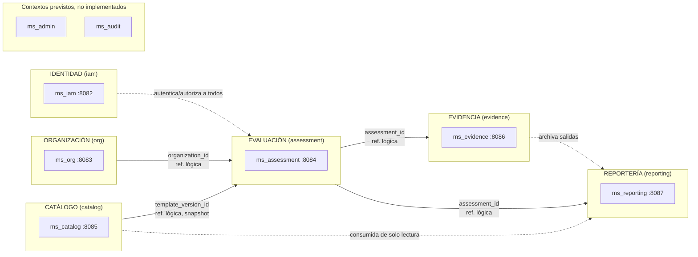
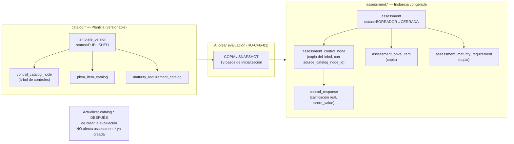

# Modelo de Dominio — Proyecto MSPI

**Documento de nivel de proyecto completo** (no por microservicio individual)

| Campo | Valor |
|---|---|
| Proyecto de grado | MSPI — Modelo de Seguridad y Privacidad de la Información |
| Estudiantes | Bairon Alexander Suarez Camacho, Juan Diego Tovar Rodriguez |
| Programa académico | Ingeniería de Sistemas |
| Dirigido a | Profesor/asesor de trabajo de grado |
| Fecha de elaboración | 2026-08-27 |
| Fuentes primarias | [MER-MSPI (dbdocs)](https://dbdocs.io/jdtovar-2021a/MER-MSPI); [`MER-MSPI.sql`](MER-MSPI.sql); `MSPI_NVA_CO_MR_BACK/docs/proyecto/DB-MER.txt` (DBML v2.9); `DBvsExcel.md`; los 8 `03-Diseno.md` de `Documentacion-Backend/`; `Historias_Usuario_MSPI_v2.md`; `Documentacion-investigacion/Documento-Investigacion.md` |

> **Nota de trazabilidad y alcance.** El MER interactivo está publicado en [dbdocs.io/jdtovar-2021a/MER-MSPI](https://dbdocs.io/jdtovar-2021a/MER-MSPI). La fuente SQL local es [`MER-MSPI.sql`](MER-MSPI.sql) (exportación del mismo modelo) y el diagrama está también en [`MER-MSPI.pdf`](MER-MSPI.pdf). Las entidades, atributos y relaciones citadas en este documento coinciden con ese MER y con `DB-MER.txt` / los `03-Diseno.md` de cada microservicio. Donde una relación cruza dos esquemas sin clave foránea física (lo habitual entre `assessment`/`evidence`/`reporting` hacia `org`/`catalog`), se indica explícitamente como "referencia lógica, sin FK física" — dato confirmado en los reportes de diseño de `ms_org`, `ms_assessment` y `ms_reporting`. Ninguna entidad de este documento fue inventada; donde la evidencia era insuficiente se declara así.

---

## 1. Visión general: siete contextos delimitados (bounded contexts)

El sistema MSPI se organiza en **siete bounded contexts** con propietario claro de esquema de base de datos, más dos contextos previstos que hoy son placeholders:

| Contexto | Propósito de negocio | Microservicio(s) | Estado |
|---|---|---|---|
| **Identidad (IAM)** | Autenticación federada, perfil local de usuario, 2FA, roles, auditoría centralizada | `ms_iam` | Activo |
| **Organización** | Maestro de entidades públicas evaluadas y sus contactos | `ms_org` | Activo |
| **Catálogo** | Definición versionable del instrumento MSPI (la "plantilla vacía") | `ms_catalog` | Activo |
| **Evaluación (Assessment)** | Ciclo de vida de una evaluación concreta, snapshot congelado del instrumento, calificación y cálculo | `ms_assessment` | Activo |
| **Evidencia** | Contexto/misión de la entidad, levantamiento documental, archivos adjuntos | `ms_evidence` | Activo |
| **Reportería** | Generación asíncrona de reportes PDF/Excel, comparativos temporales | `ms_reporting` | Activo |
| **Administración** | Consola administrativa transversal (previsto: resumen del sistema, configuración global) | `ms_admin` (previsto) | **Placeholder** |
| **Auditoría** | Auditoría transversal dedicada, separada de `ms_iam` | `ms_audit` (previsto) | **Placeholder** — funcionalidad real hoy vive en `ms_iam.iam.audit_log` |

---

## 2. Contexto: Identidad (esquema `iam`)

**Propósito de negocio:** autenticar usuarios (delegando a Keycloak), mantener un perfil local vinculado al `sub` del JWT, gestionar roles de negocio y segundo factor (2FA/TOTP), y centralizar la auditoría de eventos de todo el ecosistema.

**Microservicio:** `ms_iam` (puerto 8082).

### Entidades principales

| Entidad | Atributos clave reales | Notas |
|---|---|---|
| `iam.user` | `id (uuid, PK)`, `keycloak_sub (varchar, UK)` — vínculo estable al usuario en Keycloak, `full_name`, `email (UK)`, `organization_id (uuid, ref. lógica a org.organization)` — obligatorio para rol `Lector`, `must_change_password (bool)`, `status (ACTIVE\|INACTIVE)` | Columnas legacy `password_hash`, `failed_attempts`, `locked_until` explícitamente marcadas "NO usar con Keycloak" en el propio DDL — vestigio de un diseño previo sin IdP externo |
| `iam.role` | `id (uuid, PK)`, `name (varchar, UK)` — `AdminSistema\|AdminInstrumento\|Evaluador\|Revisor\|Lector`, `description` | Nota del DDL: "Opcional si los roles vienen SOLO de Keycloak" |
| `iam.user_role` | `user_id (FK)`, `role_id (FK)`, `assigned_at` — PK compuesta única `(user_id, role_id)` | Relación N:M usuario↔rol |
| `iam.user_totp` | `keycloak_sub (varchar, PK, FK a user.keycloak_sub)`, `secret (varchar, Base32)`, `enabled_at (nullable hasta primera verificación)` | 2FA/TOTP; Keycloak no almacena este secreto |
| `iam.system_config` | `key (varchar, PK)`, `value_json (jsonb)`, `version (int)`, `updated_by`, `updated_at` | Parámetros globales (ej. `evidence.allowedMimeTypes`, `assessment.autosaveIntervalSeconds`); existe en el DDL pero, según el agente de extracción backend, sin código que la use activamente todavía |
| `iam.audit_log` | `id (bigserial, PK)`, `event_type (varchar)`, `entity_type`, `entity_id`, `assessment_id (ref. lógica)`, `actor_user_id (FK a user.id)`, `occurred_at`, `ip`, `user_agent`, `before_json/after_json/metadata_json (jsonb)` | Tabla polimórfica; sumidero de eventos de autenticación propios y eventos de negocio de otros microservicios (ver Documento 1, secc. 6.4) |

### Relaciones cruzando esquemas

- `iam.user.organization_id` → referencia lógica a `org.organization.id` (validada por `ms_org` al crear, sin constraint física entre esquemas independientes en despliegue — `03-Diseno.md` de `ms_org`).
- `iam.audit_log.assessment_id` → referencia lógica a `assessment.assessment.id`.

### Endpoints principales (`Documentacion-Backend/ms_iam/03-Diseno.md`)

`AuthApi` (`/auth/login`, `/auth/totp/*`, `/auth/change-password`), `UsersApi` (`/users` CRUD + paginado), `RolesApi` (`/roles`), `InternalAuditApi` (`POST /internal/audit/events`, canal interno con `X-Internal-Api-Key`).

---

## 3. Contexto: Organización (esquema `org`)

**Propósito de negocio:** mantener el maestro de entidades públicas colombianas que son evaluadas, con sus contactos y datos geográficos, y servir como catálogo reutilizable de áreas base para el Módulo 2 (Áreas y responsables).

**Microservicio:** `ms_org` (puerto 8083).

### Entidades principales

| Entidad | Atributos clave reales | Notas |
|---|---|---|
| `org.organization` | `id (uuid, PK)`, `name (varchar 220)`, `identifier (varchar 40)` — NIT u otro, `type (varchar 40)` — sector legal `PUBLIC\|PRIVATE\|EDU\|OTHER` (**no confundir** con el orden territorial MSPI, que vive en `catalog.entity_order_type`), `status`, `address`, `city`, `department`, `country` | Índice único `(name, identifier)` |
| `org.organization_contact` | `id (uuid, PK)`, `organization_id (FK)`, `full_name`, `role`, `email`, `phone`, `is_primary (bool)` | Contacto maestro de la organización; distinto del `contact` de una evaluación específica (`assessment.assessment.contact`) |
| `org.organization_area_base` | `id (uuid, PK)`, `organization_id (FK)`, `area_name (varchar 160, unique por org)`, `description` | Plantilla de áreas reutilizable por organización, para no recapturar en cada evaluación |
| `org.organization_area_base_topic` | `id (uuid, PK)`, `area_base_id (FK)`, `topic`, `process_description`, `default_steward_role_code (ref. lógica a catalog.steward_role)`, `staff_name`, `staff_role`, `staff_contact` | Plantilla de responsables por tema, precursora de `assessment.assessment_area_topic` |

### Relaciones cruzando esquemas

- `org.organization_area_base_topic.default_steward_role_code` → referencia lógica a `catalog.steward_role.code`.
- Es **el contexto más referenciado** del sistema: `assessment.assessment.organization_id` y `reporting.report_generation_job.organization_id` apuntan a `org.organization.id`, ambos como **referencia lógica sin FK física entre esquemas** (confirmado en el reporte de diseño de `ms_org`: *"Otros esquemas (assessment, evidence, reporting) referencian organization_id como columna simple, sin FK física cross-schema"*).

### Endpoints principales

`POST /organizations` (crea organización + usuario `Lector` automático en `ms_iam`), `GET /organizations` (paginado), `GET/PUT /organizations/{id}`, `GET /organizations/my-organization` (para rol `Lector`), `GET /location/countries[/{iso2}/states[/{sIso2}/cities]]` (catálogo geográfico, consumido de una API externa con degradación a lista vacía si falla).

---

## 4. Contexto: Catálogo (esquema `catalog`)

**Propósito de negocio:** almacenar la definición **versionable** del instrumento MSPI — la "plantilla vacía" en la analogía de `DBvsExcel.md` — de forma que MinTIC (o el equipo del proyecto) pueda publicar nuevas versiones del instrumento sin afectar evaluaciones ya realizadas.

**Microservicio:** `ms_catalog` (puerto 8085). Es un contexto de **solo lectura** para el resto del sistema: no tiene dependencias salientes hacia otros microservicios (confirmado en el reporte de diseño de `ms_catalog`).

### Entidades principales (agrupadas por módulo funcional)

| Grupo | Entidad | Atributos clave reales |
|---|---|---|
| Plantilla | `catalog.template` | `id`, `name (UK)` |
| Plantilla | `catalog.template_version` | `id`, `template_id (FK)`, `scale_version_id (FK)`, `version`, `status (DRAFT\|PUBLISHED)`, `phva_weights (jsonb)`, `phva_caps (jsonb)`, `maturity_crit_thresholds (jsonb)`, `nist_function_targets (jsonb)`. **v1** (id `d000…001`): PHVA plano 40/20/20/20 y NIST CSF 1.1 (5 funciones). **v2** (id `d000…002`, `PUBLISHED`, activa por `published_at` más reciente): PHVA jerárquico 56/16/14/14 (7 cláusulas + 23 sub-numerales), Anexo A 2022 (93 controles / temas A.5–A.8), NIST CSF 2.0 (6 funciones incl. GV) |
| Escala | `catalog.scale`, `catalog.scale_version`, `catalog.scale_level`, `catalog.scale_band` | Escala 0/20/40/60/80/100 + N/A; bandas de etiqueta (INEXISTENTE…OPTIMIZADO) |
| Controles Anexo A | `catalog.iso_domain` | `code (PK)` — catálogo de referencia A.5..A.18 (metadatos de portada); la efectividad por dominio se deriva de los `DOMAIN` presentes en el **snapshot** de la evaluación (v1 → hasta 14; v2 → A.5–A.8), `control_type (ADMIN\|TECH)`, `display_position` |
| Controles Anexo A | `catalog.control_catalog_node` | `id`, `template_version_id (FK)`, `parent_id (FK, árbol)`, `node_type (DOMAIN\|OBJECTIVE\|SUB_OBJECTIVE\|CONTROL)`, `control_type`, `code (AD.x / T.x)`, `iso_code` (v1: estilo 2013 `A.x.y.z`; v2: numeración ISO 27001:2022 tipo `5.1` / `A.5.1`), `is_scored (bool)`, `default_steward_role_code (ref.)`. **v2**: ~93 controles hoja del Anexo A 2022 |
| Controles Anexo A | `catalog.control_rule` | `control_node_id (FK, UK)`, `requires_evidence`, `requires_gap`, `requires_recommendation`, `recommendation_rule_type` |
| Responsables | `catalog.steward_role` | `code (PK)`, `label`, `sort_order` — cargos responsables del instrumento |
| Responsables | `catalog.assessment_area_preset` | `code (PK)` — 8 áreas fijas de la hoja "Áreas involucradas" |
| PHVA | `catalog.phva_item_catalog` | `id`, `template_version_id (FK)`, `code`, `parent_code`, `node_type (CLAUSE\|ITEM)`, `component (PLAN\|DO\|CHECK\|ACT)`, `scoring_mode (MANUAL\|INHERITED\|ROLLUP)`, `inherit_rule`, `source_control_node_id (FK)`. **v1**: ~17 ítems planos `P.1`…`M.2` (`node_type=ITEM`). **v2**: jerarquía 2 niveles — 7 `CLAUSE` (`C.4`…`C.10`, score = promedio de hijos) + 23 `ITEM` sub-numerales (`parent_code` → cláusula; MANUAL/heredado) |
| Madurez | `catalog.maturity_requirement_catalog` | `id`, `code (R1..R55)`, `source_type (ADMIN\|TECH\|PHVA\|MATURITY)`, `scoring_mode`, `inherit_rule`, `composite_phva_codes (jsonb)` |
| Madurez | `catalog.maturity_threshold` | `id`, `requirement_id (FK)`, `level (1..5)`, `is_na (bool)`, `expected_value` |
| NIST CSF | `catalog.nist_function` | `id`, `code (UK: GV\|ID\|PR\|DE\|RS\|RC)`, `name` (p. ej. Gobernar), `position` 1..6 |
| NIST CSF | `catalog.nist_subcategory` | `id`, `function_id (FK)`, `code (UK)` — CSF 1.1 (`ID.AM-1…`) coexisten con CSF 2.0 (22 categorías: `GV.OC`, `ID.AM`, `PR.AA`, …) |
| NIST CSF | `catalog.nist_mapping` | `id`, `subcategory_id (FK)`, `control_node_id (FK)`, `iso_control_code` — trazabilidad inversa control→subcategoría (sobre todo v1) |
| NIST CSF | `catalog.nist_ciber_item_catalog` | `id`, `function_id (FK)`, `subcategory_id (FK)`, `source_control_node_id (FK)`, `scoring_mode` — v1: filas heredadas + MANUAL; v2: 22 ítems MANUAL CSF 2.0 (uno por categoría) |
| Levantamiento | `catalog.lifting_question_catalog` | `id`, `code`, `section`, `field_type` — complementario |
| Levantamiento | `catalog.lifting_document_item_catalog` | `id`, `item_number (1..43)`, `block (BASICA\|IMPLEMENTACION\|EVALUACION\|MEJORA_CONTINUA)`, `is_process_metric` — 43 ítems documentales fijos |
| Orden territorial | `catalog.entity_order_type` | `code (PK: NACIONAL\|TERRITORIAL_A\|TERRITORIAL_B\|TERRITORIAL_C)`, `phva_expected_advance (numeric)` |

### Endpoints principales

`CatalogApi` — 17 endpoints GET agrupados en `catalog-core`, `catalog-controls`, `catalog-phva`, `catalog-maturity`, `catalog-nist`, `catalog-scale`. Sin escritura pública (la publicación de nuevas versiones no está expuesta en el listado de endpoints revisado).

---

## 5. Contexto: Evaluación / Assessment (esquema `assessment`)

**Propósito de negocio:** es el **agregado raíz** del dominio — representa una evaluación concreta de una entidad (el "Excel diligenciado" de la analogía de `DBvsExcel.md`), con snapshot congelado del instrumento aplicado, todas las calificaciones y el motor de cálculo del sistema.

**Microservicio:** `ms_assessment` (puerto 8084) — el más rico en lógica de dominio del ecosistema (28 casos de uso + 3 resolvers de dominio puro, según el reporte de diseño de `ms_assessment`).

### Entidades principales

| Entidad | Atributos clave reales | Notas |
|---|---|---|
| `assessment.assessment` | `id (PK)`, `organization_id (ref. lógica)`, `template_version_id (ref. lógica, snapshot aplicado)`, `name`, `organization_name_snapshot`, `evaluation_date`, `period_label`, `entity_order_type_code`, `phva_expected_advance_snapshot`, `status (BORRADOR\|EN_DILIGENCIAMIENTO\|EN_REVISION\|CERRADA)`, `cloned_from_assessment_id`, `row_version (int, bloqueo optimista)` | Agregado raíz; 13 pasos de inicialización obligatoria al crear (ver `DB-MER.txt` líneas 1022-1048) |
| `assessment.assessment_edit_lock` | `assessment_id (PK)`, `locked_by_user_id`, `lock_token`, `expires_at` | Bloqueo pesimista opcional, complementario al optimista |
| `assessment.assessment_member` | `assessment_id + user_id (PK compuesta)`, `member_role (EVALUATOR\|REVIEWER\|READER)`, `is_leader (bool)` | Equipo de trabajo de la evaluación — base del control de acceso por membresía |
| `assessment.assessment_control_node` | `id (PK)`, `assessment_id (FK)`, `source_catalog_node_id (ref. lógica al catálogo)`, `parent_id (FK, árbol, auto-referencia)`, `node_type`, `control_type (ADMIN\|TECH)`, `code`, `iso_code`, `is_scored`, `default_steward_role_code` | **Snapshot congelado** del árbol de controles al momento de crear la evaluación |
| `assessment.control_response` | `id (PK)`, `control_node_id (FK, UK)`, `score_status (SCORED\|NA)`, `score_value (0\|20\|40\|60\|80\|100, CHECK)`, `evidence_text`, `gap_text`, `recommendation_text`, `control_status`, `steward_source (FROM_AREA\|CUSTOM)`, `version (int)` | La respuesta diligenciada por el evaluador para cada control hoja |
| `assessment.assessment_phva_item` / `assessment.phva_item_response` | Snapshot + respuesta manual; incluye `parent_code` y `node_type` (CLAUSE\|ITEM) | v1 ≈17 ítems planos; v2 = 7 cláusulas + 23 sub-numerales |
| `assessment.assessment_maturity_requirement` / `..._threshold` / `..._response` | `source_type (ADMIN\|TECH\|PHVA\|MATURITY)`, `scoring_mode`, `inherit_rule`, `composite_phva_codes` | ~50 requisitos de madurez (R1..R55) + matriz de 5 umbrales cada uno |
| `assessment.assessment_nist_ciber_item` / `nist_ciber_item_response` | `function_code`, `subcategory_code`, `scoring_mode`, `iso_control_code` | ~188 filas Ciber por evaluación |
| `assessment.control_review` / `control_comment_thread` / `control_comment` | `review_status (VALIDATED\|NEEDS_CHANGES)`, `severity`, hilos de comentarios por control | Flujo de revisión (rol `Revisor`) |
| `assessment.assessment_area` / `assessment_area_topic` | `area_preset_code (ref.)`, `default_steward_role_code (ref.)`, `staff_name/role/contact` | Instancia por evaluación de las 8 áreas y sus responsables (Módulo 2) |
| `assessment.gap_register` / `gap_action` | `gap_text`, `priority`, `owner`, `due_date`, `status` | Extensión opcional de plan de acción; **no sustituye** el listado de brechas calculado on-read (`score < 60`) |

### Relaciones cruzando esquemas (todas como referencia lógica, sin FK física entre esquemas de microservicios distintos)

- `organization_id` → `org.organization.id`
- `template_version_id`, `source_catalog_node_id`, `source_catalog_item_id`, `source_catalog_requirement_id` → tablas de `catalog.*`
- `created_by`, `status_changed_by`, `published_by`, `updated_by`, `reviewed_by` → `iam.user.id`
- Consumido por `evidence.evidence_file.assessment_id` y por `reporting.report_generation_job.assessment_id`

### Endpoints principales

`AssessmentApi`, `AssessmentAreasApi`, `AssessmentControlApi` (incluye rollup jerárquico), `ControlStewardApi`, `AssessmentPhvaApi`, `AssessmentMaturityApi`, `AssessmentNistApi`, `AssessmentDiagnosticApi` (`/diagnostic/dashboard`), `AssessmentGapsApi`, `InternalAssessmentReportingApi` (interno, consumido por `ms_reporting`).

---

## 6. Contexto: Evidencia (esquema `evidence`)

**Propósito de negocio:** capturar el contexto/misión de la entidad evaluada, el levantamiento de los 43 ítems documentales exigidos por el instrumento, y gestionar los archivos adjuntos que sustentan cualquier control, ítem de levantamiento o reporte generado.

**Microservicio:** `ms_evidence` (puerto 8086).

### Entidades principales

| Entidad | Atributos clave reales | Notas |
|---|---|---|
| `evidence.assessment_context` | `assessment_id (PK, 1:1 con assessment)`, `mission`, `context_analysis`, `process_map`, `organigram`, `self_perception_concern`, `self_perception_maturity`, `self_perception_phva_component`, `version` | Solo texto libre; no participa en cálculos numéricos. La auto-percepción se compara en el tablero de diagnóstico contra los resultados objetivos calculados |
| `evidence.evidence_file` | `id (PK)`, `assessment_id (ref. lógica)`, `relation_type (CONTROL_RESPONSE\|LIFTING_DOC\|CONTEXT\|GLOBAL\|GAP_ACTION\|REPORT_OUTPUT)`, `relation_id`, `filename`, `content_type`, `size_bytes`, `sha256`, `bucket`, `object_key`, `uploaded_by`, `deleted_at` (borrado lógico) | Modelo polimórfico de adjunto; un mismo archivo físico puede sustentar un control, un ítem de levantamiento, el contexto, o ser la salida de un reporte generado |
| `evidence.lifting_answer` | `id (PK)`, `assessment_id (ref.)`, `question_catalog_id (ref. lógica al catálogo)`, `answer_json (jsonb)` | Respuestas a preguntas de levantamiento parametrizadas (complementario a `assessment_context`) |
| `evidence.lifting_document_delivery` | `id (PK)`, `assessment_id (ref.)`, `document_item_catalog_id (ref. lógica)`, `delivery_status (DELIVERED\|NOT_DELIVERED\|PARTIAL)`, `delivered_name`, `validated_by/at` | Una fila por cada uno de los 43 ítems documentales por evaluación |
| `evidence.process_scope_metric` | `assessment_id (PK, 1:1)`, `total_processes`, `in_scope_processes`, `coverage (numeric)`, `in_scope_exceeds_total (bool)` | Ítem 43 del levantamiento: % de cobertura MSPI por procesos |

### Relaciones cruzando esquemas

Todas las FK hacia `assessment_id` son **referencias lógicas sin constraint física** (confirmado en el reporte de diseño de `ms_evidence`: *"assessment_id no tiene FK física hacia ms_assessment (esquema separado)"*). El almacenamiento físico de archivos es local (`EVIDENCE_STORAGE_DIR`), sin backend de objetos tipo S3/MinIO verificado en el código actual, aunque `DBvsExcel.md` menciona MinIO/S3 como diseño de referencia — discrepancia entre documentación conceptual y la implementación real.

### Endpoints principales

Públicos (JWT): `GET/PATCH /assessments/{id}/context`, `GET/PATCH .../process-scope-metric`, `GET .../lifting-document-deliveries`, `PATCH /lifting-document-deliveries/{id}`, `POST/GET .../files`, `GET /files/{id}/download`, `DELETE /files/{id}`. Internos (`X-Internal-Api-Key`, consumidos por `ms_assessment`/`ms_reporting`): `POST /internal/assessments/{id}/lifting/init`, `POST /internal/assessments/{sourceId}/lifting/clone/{targetId}`, `GET /internal/assessments/{id}/evidence-files`, `POST /internal/assessments/{id}/report-outputs`.

---

## 7. Contexto: Reportería (esquema `reporting`)

**Propósito de negocio:** generar de forma asíncrona los artefactos de salida del sistema (PDF de diagnóstico completo vía Jasper, Excel réplica exacta del instrumento de 9 hojas, listado de brechas, comparativos temporales entre evaluaciones), sin duplicar los cálculos que ya viven en `ms_assessment`.

**Microservicio:** `ms_reporting` (puerto 8087).

### Entidades principales

| Entidad | Atributos clave reales | Notas |
|---|---|---|
| `reporting.report_template` | `id (PK)`, `code (ej. FULL_DIAGNOSTIC_V1)`, `output_format (PDF\|XLSX)`, `storage_path (ruta JRXML)`, `sections_json (jsonb)` | Plantillas Jasper para PDF |
| `reporting.excel_workbook_template` | `id (PK)`, `code (MSPI_INSTRUMENT_XLSX_V1)`, `storage_path`, `sheet_count (9)` | Plantilla maestra Excel con fórmulas intactas |
| `reporting.excel_sheet_mapping` | `id (PK)`, `workbook_template_id (FK)`, `sheet_key (PORTADA\|LEVANTAMIENTO\|AREAS\|ADMINISTRATIVAS\|TECNICAS\|PHVA\|MADUREZ\|CIBER\|ESCALA)`, `populate_mode (VALUES_ONLY\|FORMULA_PRESERVE)`, `data_source` | Mapeo hoja Excel ↔ capa de datos, paridad 1:1 |
| `reporting.report_generation_job` | `id (PK)`, `assessment_id (ref. lógica)`, `organization_id (ref. lógica)`, `report_type (FULL_DIAGNOSTIC_PDF\|EXCEL_INSTRUMENT_EXPORT\|GAP_LIST_*\|COMPARATIVE_DIAGNOSTIC_*)`, `status (PENDING\|RUNNING\|COMPLETED\|FAILED\|CANCELLED)`, `progress_pct`, `output_file_id (ref. lógica a evidence.evidence_file)` | Job asíncrono con *polling* |
| `reporting.report_job_assessment` | `id (PK)`, `job_id (FK)`, `assessment_id (ref.)`, `role (PRIMARY\|COMPARISON\|BASELINE)` | Habilita comparativos multi-evaluación (mínimo 2 filas para un job comparativo) |
| `reporting.analytics_cache` | `id (PK)`, `assessment_id (ref.)`, `kind (ROLLUP\|DOMAIN_EFFECTIVENESS\|PHVA\|MATURITY\|NIST\|GAPS\|COMPARATIVE\|SCALE_PUBLISHED)`, `payload_json (jsonb)` | Caché opcional de agregados; según el reporte de diseño de `ms_reporting`, **definida en el DDL pero sin entidad JPA/repositorio real en el código actual** — brecha entre diseño documentado e implementación |

### Relaciones cruzando esquemas

`assessment_id` y `organization_id` en `report_generation_job` **no tienen FK física** hacia `ms_assessment`/`ms_org` (resuelto a nivel de aplicación, confirmado en el reporte de diseño). `ms_reporting` es consumidor puro vía REST interno de `ms_assessment` (bundle de diagnóstico + gaps, `X-Internal-Api-Key`), `ms_catalog` (plantillas/escala) y `ms_evidence` (archivado del artefacto generado como `evidence_file` con `relation_type=REPORT_OUTPUT`).

### Endpoints principales

`POST /reports/jobs` (crea job, `202 Accepted`), `GET /reports/jobs/{jobId}` (estado/*polling*), `GET /reports/jobs/{jobId}/download`, `POST /reports/comparative/jobs` (job comparativo).

**Nota de diseño relevante:** el módulo `domain/usecase/engine` de `ms_reporting` (Apache POI, OpenPDF, `ProcessBuilder` hacia LibreOffice `soffice --headless` para conversión XLSX→PDF) usa librerías de infraestructura directamente desde una capa nominalmente de dominio — una desviación pragmática y documentada de la pureza hexagonal estricta, señalada como decisión técnica (DT-03) en el reporte de diseño de `ms_reporting`.

---

## 8. Contextos previstos no implementados: Administración y Auditoría

| Contexto | Esquema previsto | Estado real |
|---|---|---|
| **Administración** (`ms_admin`) | Ninguno (no hay modelo de datos) | Placeholder puro: `README.md` + `docs/ROADMAP.md` + `docs/openapi.yaml` con `paths: {}`. Arquitectura objetivo descrita (`AdminDashboardApi`, `SystemConfigApi`, gateways agregadores `IamAdminGateway`/`OrgAdminGateway`/`AssessmentReadGateway`) pero **sin una sola clase de código** |
| **Auditoría** (`ms_audit`) | Previsto: `audit` (tabla `audit.audit_log`) | Placeholder documental: `README.md` + `docs/MIGRATION-NOTES.md` + `docs/openapi.yaml` 100% `deprecated` que reenvía al contrato real de `ms_iam`. La funcionalidad de auditoría **ya existe y opera hoy dentro de `iam.audit_log`** (ver secc. 2) |

---

## 9. Diagrama entidad-relación consolidado (entre esquemas)

> Diagrama simplificado: se muestran las entidades raíz y de mayor cardinalidad de cada esquema, y las relaciones (físicas dentro de un esquema, lógicas entre esquemas) más relevantes para entender el flujo del dominio. El árbol completo de 60+ tablas está en `DB-MER.txt`.

```mermaid
erDiagram
    ORGANIZATION ||--o{ ORGANIZATION_CONTACT : tiene
    ORGANIZATION ||--o{ ASSESSMENT : "es evaluada en (lógica)"
    ORGANIZATION ||--o{ ORGANIZATION_AREA_BASE : "define plantilla de"

    USER ||--o{ USER_ROLE : tiene
    ROLE ||--o{ USER_ROLE : asignado
    USER ||--o| USER_TOTP : "configura (opcional)"
    USER ||--o{ AUDIT_LOG : "genera (actor, lógica)"
    USER }o--o{ ASSESSMENT_MEMBER : "es miembro de (lógica)"

    TEMPLATE ||--o{ TEMPLATE_VERSION : versiona
    TEMPLATE_VERSION ||--o{ CONTROL_CATALOG_NODE : define
    TEMPLATE_VERSION ||--o{ PHVA_ITEM_CATALOG : define
    TEMPLATE_VERSION ||--o{ MATURITY_REQUIREMENT_CATALOG : define
    TEMPLATE_VERSION ||--o{ NIST_CIBER_ITEM_CATALOG : define
    CONTROL_CATALOG_NODE ||--o| CONTROL_RULE : "tiene regla"
    CONTROL_CATALOG_NODE ||--o{ CONTROL_CATALOG_NODE : "padre de (árbol)"

    ASSESSMENT ||--|| ASSESSMENT_EDIT_LOCK : "puede tener"
    ASSESSMENT ||--o{ ASSESSMENT_MEMBER : tiene
    ASSESSMENT ||--o{ ASSESSMENT_CONTROL_NODE : "snapshot de (lógica → catalog)"
    ASSESSMENT_CONTROL_NODE ||--|| CONTROL_RESPONSE : "recibe"
    ASSESSMENT ||--o{ ASSESSMENT_PHVA_ITEM : "snapshot de (lógica → catalog)"
    ASSESSMENT ||--o{ ASSESSMENT_MATURITY_REQUIREMENT : "snapshot de (lógica → catalog)"
    ASSESSMENT ||--o{ ASSESSMENT_NIST_CIBER_ITEM : "snapshot de (lógica → catalog)"
    ASSESSMENT ||--o{ ASSESSMENT_AREA : tiene
    ASSESSMENT ||--o{ GAP_REGISTER : registra
    CONTROL_RESPONSE ||--o| CONTROL_REVIEW : "puede tener"

    ASSESSMENT ||--|| ASSESSMENT_CONTEXT : "tiene (lógica → evidence)"
    ASSESSMENT ||--|| PROCESS_SCOPE_METRIC : "tiene (lógica → evidence)"
    ASSESSMENT ||--o{ LIFTING_DOCUMENT_DELIVERY : "tiene (lógica → evidence)"
    ASSESSMENT ||--o{ EVIDENCE_FILE : "adjunta (lógica → evidence)"

    ASSESSMENT ||--o{ REPORT_GENERATION_JOB : "genera reporte de (lógica → reporting)"
    REPORT_GENERATION_JOB ||--o{ REPORT_JOB_ASSESSMENT : incluye
    REPORT_GENERATION_JOB ||--o| EVIDENCE_FILE : "produce (lógica → evidence, REPORT_OUTPUT)"
```

Fuente: `DB-MER.txt` (todas las tablas), consolidado por esquema `iam`/`org`/`catalog`/`assessment`/`evidence`/`reporting`.

---

## 10. Patrón catálogo vs. ejecución (plantilla vs. instancia congelada)

El diseño de datos separa deliberadamente dos "mundos" que en el Excel original convivían en el mismo archivo (`DBvsExcel.md`, secc. 1-3):

1. **Catálogo (`catalog.*`)** — la "plantilla vacía": define la estructura del instrumento (controles, escalas, ítems PHVA/madurez/NIST, ítems de levantamiento), versionada y publicable (`status: DRAFT|PUBLISHED`).
2. **Ejecución (`assessment.*` + `evidence.*`)** — el "Excel ya diligenciado": al crear una evaluación, `ms_assessment` **copia** (snapshot) la estructura vigente del catálogo publicado hacia tablas propias (`assessment_control_node`, `assessment_phva_item`, `assessment_maturity_requirement`, `assessment_nist_ciber_item`), en 13 pasos de inicialización obligatoria documentados en `DB-MER.txt` (líneas 1022-1048).

Esta separación garantiza que si MinTIC actualiza el instrumento (nueva versión de plantilla), las evaluaciones ya cerradas **no cambian retroactivamente** — requisito no negociable de auditabilidad para un SGSI.

---

## 11. Mapa: 8 módulos funcionales de negocio → dominios / microservicios

Fuente: encabezados `## Módulo N` de `Historias_Usuario_MSPI_v2.md`.

| Módulo funcional (Historias de Usuario) | Hoja(s) Excel que reemplaza | Dominio(s) / bounded context | Microservicio(s) que lo implementan |
|---|---|---|---|
| Módulo 1 — Configuración y Levantamiento de Información (HU-CFG-01..05) | Portada, Levantamiento de Información | Evaluación (ciclo de vida) + Evidencia (contexto, 43 ítems) + Catálogo (tipo de entidad) | `ms_assessment`, `ms_evidence`, `ms_catalog` |
| Módulo 2 — Áreas y Responsables (HU-AR-01) | Áreas Involucradas | Evaluación (áreas por evaluación) + Organización (plantilla reutilizable) + Catálogo (presets, cargos) | `ms_assessment`, `ms_org`, `ms_catalog` |
| Módulo 3 — Evaluación de Controles Administrativos (HU-ADM-01..04) | Controles Administrativos | Evaluación (calificación, rollup) + Catálogo (árbol de controles ADMIN) | `ms_assessment`, `ms_catalog` |
| Módulo 4 — Evaluación de Controles Técnicos (HU-TEC-01..02) | Controles Técnicos | Evaluación (mismo modelo físico que Módulo 3, `control_type=TECH`) | `ms_assessment`, `ms_catalog` |
| Módulo 5 — Evaluación del Ciclo PHVA (HU-PHVA-01..05) | PHVA | Evaluación (ítems PHVA, herencia desde controles) + Catálogo (pesos/topes) | `ms_assessment`, `ms_catalog` |
| Módulo 6 — Cálculo del Nivel de Madurez (HU-MAD-01..05) | Madurez | Evaluación (cálculo on-read, sin captura manual salvo R5/R9/R10) + Catálogo (matriz 50×5 de umbrales) | `ms_assessment`, `ms_catalog` |
| Módulo 7 — Evaluación frente a Ciberseguridad / NIST CSF (HU-CIB-01..03) | Ciber | Evaluación (~188 filas por evaluación) + Catálogo (mapeo ISO↔NIST) | `ms_assessment`, `ms_catalog` |
| Módulo 8 — Tablero de Diagnóstico (HU-DIAG-01..04) | Portada (resultados) | Evaluación (agregación de M3-M7 + comparación autopercepción) + Evidencia (autopercepción) | `ms_assessment`, `ms_evidence` |
| Módulo 9 — Reportes y Exportación (HU-REP-01..04) | Todas (export final) | Reportería (jobs async, plantillas Jasper/Excel) | `ms_reporting`, consumiendo `ms_assessment`/`ms_catalog`/`ms_evidence` |
| *(transversal)* Identidad y control de acceso | — (no existe hoja equivalente en el Excel original) | Identidad | `ms_iam` |

---

## 12. Glosario de términos de dominio

Dirigido a un lector académico que puede no conocer en profundidad el dominio de seguridad de la información.

| Término | Significado en el contexto de este proyecto |
|---|---|
| **MSPI** | Modelo de Seguridad y Privacidad de la Información — marco de política pública de MinTIC Colombia que exige a las entidades del Estado evaluar periódicamente su gestión de seguridad de la información |
| **SGSI** | Sistema de Gestión de Seguridad de la Información — conjunto de políticas, procesos y controles con los que una organización gestiona el riesgo sobre confidencialidad, integridad y disponibilidad de su información, según ISO/IEC 27001 |
| **ISO/IEC 27001:2013** | Edición 2013 de la norma SGSI; su Anexo A cataloga 114 controles en 14 dominios (A.5–A.18). La plantilla **v1** del instrumento MSPI conserva esta estructura |
| **ISO/IEC 27001:2022** | Edición vigente; el Anexo A reorganiza controles en **4 temas** (A.5 Organizacional, A.6 Personas, A.7 Físico, A.8 Tecnológico) con **93 controles**. La plantilla activa **v2** alinea el árbol de controles y el PHVA a esta edición |
| **Anexo A** | Catálogo normativo de controles de seguridad de ISO/IEC 27001. **v1**: 14 dominios 2013 (ADMIN A.5/A.6/A.7/A.8/A.15/A.17/A.18 + TECH A.9–A.14/A.16). **v2**: 4 temas 2022 (A.5–A.8) y ~93 controles hoja |
| **Control administrativo** | Control del Anexo A de naturaleza organizativa/procedimental (políticas, roles, gestión de proveedores, etc.), calificado en el Módulo 3 |
| **Control técnico** | Control del Anexo A de naturaleza tecnológica (control de acceso, criptografía, seguridad de operaciones, etc.), calificado en el Módulo 4 |
| **Dominio** | Nodo `DOMAIN` del árbol de controles (y metadato en `catalog.iso_domain`). La efectividad de portada lista solo los dominios presentes en el snapshot de la evaluación (no fuerza siempre los 14 del catálogo de referencia) |
| **Objetivo de control / subdominio** | Subdivisión dentro de un dominio (ej. A.9.1 "Requisitos de negocio para control de acceso") |
| **PHVA** | Planificar–Hacer–Verificar–Actuar (PDCA). **v2**: pesos 56/16/14/14; jerarquía **CLAUSE → ITEM** (7 cláusulas `C.4`–`C.10` + 23 sub-numerales); score de fase = promedio equiponderado de cláusulas; cada cláusula = promedio de sus hijos. **v1**: pesos 40/20/20/20 e ítems planos `P.1`…`M.2` |
| **Nivel de madurez** | Resultado global calculado del SGSI de la entidad, en 5 niveles acumulativos (Inicial, Gestionado, Definido, Gestionado Cuantitativamente, Optimizado), determinado por una matriz de ~50 requisitos (`Rn`) contra 5 umbrales cada uno |
| **NIST CSF** | Marco de Ciberseguridad del NIST (National Institute of Standards and Technology, EE. UU.); la plantilla **v2** usa **CSF 2.0** con **6 funciones** (Gobernar, Identificar, Proteger, Detectar, Responder, Recuperar) y 22 categorías. La v1 permanece en el enfoque CSF 1.1 de 5 funciones |
| **Ítem de evidencia / evidencia documental** | Cualquiera de los 43 documentos que el instrumento exige levantar de la entidad (agrupados en bloques Básica, Implementación, Evaluación, Mejora Continua), rastreados en `evidence.lifting_document_delivery` |
| **Snapshot** | Copia congelada de una parte del catálogo (controles, ítems PHVA, requisitos de madurez, ítems NIST) hecha al crear una evaluación, para que cambios futuros en el catálogo no alteren evaluaciones ya existentes |
| **rowVersion / version** | Contador entero que se incrementa en cada modificación de un registro; usado para implementar bloqueo optimista: si dos usuarios intentan modificar el mismo registro con versiones distintas, el segundo `PATCH` recibe `HTTP 409 Conflict` |
| **Rollup** | Cálculo recursivo on-read que agrega las calificaciones de los nodos hoja de un árbol de controles hacia sus nodos padre (objetivo → dominio → total Anexo A), aplicando promedio con exclusión de valores N/A y redondeo *half-up* |
| **Brecha (gap)** | Diferencia entre la calificación obtenida de un control y la calificación objetivo (100); el sistema calcula on-read la lista de brechas priorizadas (`score < 60`) |
| **Bounded context (contexto delimitado)** | Concepto de Domain-Driven Design: una frontera explícita dentro de la cual un modelo de dominio es válido y consistente; en este proyecto, cada esquema de base de datos (`iam`, `org`, `catalog`, `assessment`, `evidence`, `reporting`) corresponde a un bounded context con un microservicio propietario |
| **N/A (No Aplica)** | Valor especial de calificación que excluye un control de cualquier promedio; distinto de 0 (que sí participa y penaliza el promedio) |

---

*Fin del documento de modelo de dominio. Para la arquitectura de contenedores, despliegue y decisiones arquitectónicas, ver `01-Arquitectura-General-del-Sistema.md` en esta misma carpeta.*
