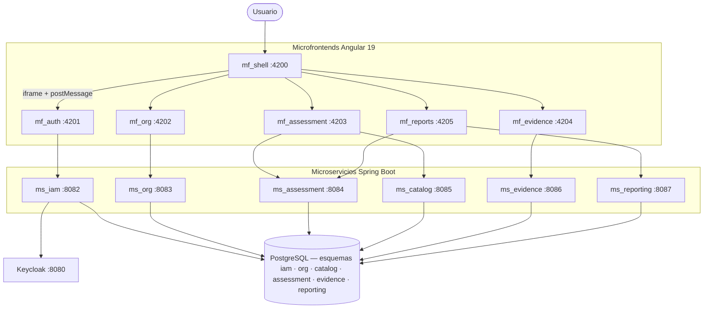

# MSPI — Documentación del Proyecto de Grado

Repositorio de documentación del **Sistema de Gestión de Seguridad y Privacidad de la Información (MSPI)**, plataforma que automatiza el Instrumento de Identificación de la Línea Base de Seguridad de MinTIC Colombia.

Este repositorio **no contiene código fuente**. Agrupa la propuesta de grado, el componente investigativo y la documentación técnica del ciclo de vida de cada microservicio y microfrontend.

**6** microservicios activos · **2** placeholders · **6** microfrontends · **98** documentos SDLC

`Java 21` · `Spring Boot` · `Arquitectura hexagonal` · `Angular 19` · `Keycloak` · `PostgreSQL` · `Docker`

| Campo | Valor |
|---|---|
| **Proyecto** | MSPI: Sistema de Gestión de Seguridad y Privacidad de la Información basado en ISO/IEC 27001 |
| **Autores** | Bairon Alexander Suarez Camacho, Juan Diego Tovar Rodriguez |
| **Programa** | Ingeniería de Sistemas |
| **Institución** | CORHUILA |

---

## Qué es MSPI

MSPI reemplaza el diligenciamiento manual de una hoja de cálculo Excel de nueve pestañas por una aplicación web con motor de cálculo centralizado, trazabilidad de evidencias y control de acceso basado en roles.

La plataforma reproduce las reglas del instrumento de MinTIC para:

- efectividad de controles **ISO/IEC 27001** (Anexo A)
- avance del ciclo **PHVA**
- nivel de madurez del **SGSI**
- desempeño frente a **NIST CSF**

---

## Arquitectura de alto nivel

Versión resumida para orientación. El C4 completo, el despliegue Docker y las decisiones están en [`01-Arquitectura-General-del-Sistema.md`](Documentacion-General/01-Arquitectura-General-del-Sistema.md).



---

## Hallazgos verificados en código

La documentación se elaboró leyendo los repositorios reales, no a partir de plantillas. Cuando algo no está implementado, se declara. Detalle y trazabilidad en la [sección de deuda técnica](Documentacion-General/01-Arquitectura-General-del-Sistema.md).

- **`ms_admin` y `ms_audit`** son carpetas placeholder; la auditoría operativa vive en `ms_iam`.
- Los microfrontends se componen con **iframe + `postMessage`**, no con Module Federation (aunque el plan de trabajo lo especificaba).
- El backend define umbral JaCoCo 80 %, pero el pipeline de CI ejecuta `assemble`, no `test`/`check`. Ningún microfrontend tiene pruebas automatizadas verificadas.
- El instrumento fuente usa **ISO/IEC 27001:2013**; la versión vigente de la norma es **2022**.

---

## Repositorios relacionados

| Recurso | Descripción |
|---|---|
| [MSPI Front](https://github.com/jdtovar07/MSPI_NVA_CO_MR_FRONT.git) | Código de microfrontends, UI y lógica de presentación |
| [MSPI Back](https://github.com/jdtovar07/MSPI_NVA_CO_MR_BACK.git) | Código de microservicios, APIs y lógica de negocio |
| [Figma](https://www.figma.com/design/tJchFUjVOMD20Homvf5TTC/MSPI---Definitivo?node-id=0-1&t=l4YlEHnhBgfLsxDP-1) | Diseño visual, prototipos y guía de estilo |
| [MER-MSPI (dbdocs)](https://dbdocs.io/jdtovar-2021a/MER-MSPI) | Modelo entidad-relación interactivo (esquemas `iam`, `org`, `catalog`, `assessment`, `evidence`, `reporting`) |

Índice de enlaces: [`MSPI-Enlaces.md`](MSPI-Enlaces.md).

---

## Estructura del repositorio

```
MSPI_NVA_CO_DOCS/
├── Documentacion-General/          # Arquitectura, dominio y objetivos
├── Documentacion-Backend/          # 8 microservicios × 7 fases SDLC
├── Documentacion-Frontend/         # 6 microfrontends × 7 fases SDLC
├── Documentacion-investigacion/    # Componente investigativo extendido
├── Propuesta-grado/                # Documento formal (plantilla CORHUILA)
├── CartasVoBo/                     # Cartas de solicitud de aval
├── MSPI-Enlaces.md                 # Enlaces a código y diseño
└── README.md
```

### Documentación general

Punto de entrada recomendado para el asesor. En menos de 30 minutos da una visión completa del sistema.

| Documento | Contenido |
|---|---|
| [`00-Indice-General.md`](Documentacion-General/00-Indice-General.md) | Índice único de toda la documentación |
| [`01-Arquitectura-General-del-Sistema.md`](Documentacion-General/01-Arquitectura-General-del-Sistema.md) | C4, despliegue, seguridad, decisiones y deuda técnica |
| [`02-Modelo-de-Dominio.md`](Documentacion-General/02-Modelo-de-Dominio.md) | Bounded contexts, entidades, ER y glosario |
| [`03-Objetivos-del-Proyecto.md`](Documentacion-General/03-Objetivos-del-Proyecto.md) | Objetivo general y específicos, con trazabilidad a módulos |
| [MER-MSPI (dbdocs)](https://dbdocs.io/jdtovar-2021a/MER-MSPI) | MER interactivo; fuente SQL: [`MER-MSPI.sql`](Documentacion-General/MER-MSPI.sql) · PDF: [`MER-MSPI.pdf`](Documentacion-General/MER-MSPI.pdf) |

### Backend

Ocho microservicios, cada uno con los 7 documentos del ciclo de vida. El enlace abre la carpeta del componente.

| Microservicio | Rol | Puerto | Estado |
|---|---|---|---|
| [`ms_iam`](Documentacion-Backend/ms_iam/) | Identidad, autenticación, 2FA, auditoría | 8082 | Activo |
| [`ms_org`](Documentacion-Backend/ms_org/) | Organizaciones y geografía | 8083 | Activo |
| [`ms_catalog`](Documentacion-Backend/ms_catalog/) | Catálogo versionado de controles, escalas, PHVA, madurez, NIST | 8085 | Activo |
| [`ms_assessment`](Documentacion-Backend/ms_assessment/) | Ciclo de vida de evaluaciones y motor de cálculo | 8084 | Activo |
| [`ms_evidence`](Documentacion-Backend/ms_evidence/) | Contexto organizacional y evidencias documentales | 8086 | Activo |
| [`ms_reporting`](Documentacion-Backend/ms_reporting/) | Generación asíncrona de reportes PDF/Excel | 8087 | Activo (con limitaciones) |
| [`ms_admin`](Documentacion-Backend/ms_admin/) | Administración general | — | Placeholder, sin código |
| [`ms_audit`](Documentacion-Backend/ms_audit/) | Auditoría transversal | — | Placeholder, sin código |

### Frontend

Seis microfrontends, misma estructura de 7 documentos por componente.

| Microfrontend | Rol | Puerto |
|---|---|---|
| [`mf_shell`](Documentacion-Frontend/mf_shell/) | Host / orquestador | 4200 |
| [`mf_auth`](Documentacion-Frontend/mf_auth/) | Autenticación, 2FA, usuarios | 4201 |
| [`mf_org`](Documentacion-Frontend/mf_org/) | Organizaciones | 4202 |
| [`mf_assessment`](Documentacion-Frontend/mf_assessment/) | Evaluación (áreas, controles, PHVA, madurez, NIST) | 4203 |
| [`mf_evidence`](Documentacion-Frontend/mf_evidence/) | Contexto y levantamiento de evidencias | 4204 |
| [`mf_reports`](Documentacion-Frontend/mf_reports/) | Reportes y brechas | 4205 |

### Documentos formales

| Recurso | Uso |
|---|---|
| [`Propuesta-grado/Propuesta_de_Grado_MSPI.docx`](Propuesta-grado/Propuesta_de_Grado_MSPI.docx) | Documento formal a radicar (plantilla institucional) |
| [`Documentacion-investigacion/Documento-Investigacion.md`](Documentacion-investigacion/Documento-Investigacion.md) | Fundamento académico ampliado, con trazabilidad al código |
| [`CartasVoBo/`](CartasVoBo/) | Cartas de solicitud de aval de proyecto de grado |

---

## Documentos por componente (ciclo de vida)

Cada microservicio y microfrontend sigue la misma estructura:

```
01-Planificacion.md
02-Analisis.md
03-Diseno.md
04-Desarrollo.md
05-Pruebas.md
06-Implementacion-Despliegue.md
07-Mantenimiento.md
```

Cuando un dato no pudo confirmarse en el código, se declara como ausente o `[PENDIENTE]`, en lugar de inferirse.

---

## Orden de lectura recomendado

1. [`Propuesta-grado/Propuesta_de_Grado_MSPI.docx`](Propuesta-grado/Propuesta_de_Grado_MSPI.docx) — documento formal.
2. [`03-Objetivos-del-Proyecto.md`](Documentacion-General/03-Objetivos-del-Proyecto.md) — qué se propuso lograr.
3. [`01-Arquitectura-General-del-Sistema.md`](Documentacion-General/01-Arquitectura-General-del-Sistema.md) — cómo está construido.
4. [`02-Modelo-de-Dominio.md`](Documentacion-General/02-Modelo-de-Dominio.md) — qué dominios cubre.
5. [MER-MSPI (dbdocs)](https://dbdocs.io/jdtovar-2021a/MER-MSPI) — modelo físico de la base de datos.
6. Un componente backend y uno frontend en detalle (por ejemplo [`ms_iam`](Documentacion-Backend/ms_iam/) y [`mf_auth`](Documentacion-Frontend/mf_auth/)).
7. [`Documento-Investigacion.md`](Documentacion-investigacion/Documento-Investigacion.md) — referencia académica ampliada.

El índice completo está en [`Documentacion-General/00-Indice-General.md`](Documentacion-General/00-Indice-General.md).
